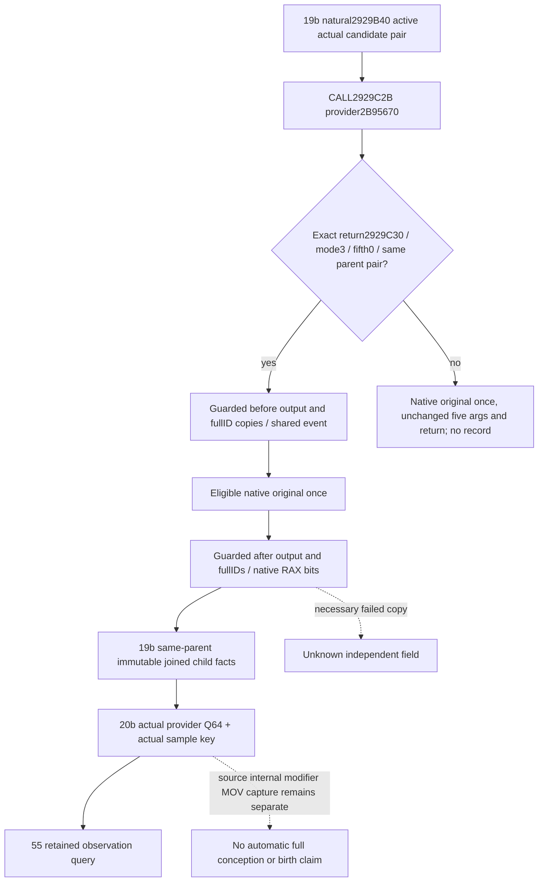

# Actual natural pair-provider output producer

Source frozen before code, 2026-10-10. Exact build1.20.0.4, retained image
SHA256 `98702F88A547CDE2EAF29A85F93B85F68EE4CF8148336A4F7AFAEB75319DD518`.
This work adds a passive natural-call observer. It does not execute the
native provider from a query, replay its3877B body, or rerun the qualified
45 conditional/predicate fixtures. Candidate source and build outputs
belong to the external continuation-45b directory; Root owns integration
and all game operations.

The held continuation17 `root-literal-source/pair-value-provider-2B95670.json`
contains complete actual `[2B95670,2B96595)` source, span3877B. Its entry
copies R9D into EBX (`2B9568F`), R8 into R13 (second), RDX into R14 (first),
RCX into RDI (caller-owned output). The fifth argument at entry RSP+28
is read through `[RBP+250]` into R15 (`2B956AC`). All ordinary returns
copy RDI into RAX at `2B9647E` then RET `2B9649B`. The typed ABI is therefore
five arguments: `(void* output, void* first, void* second, uint32 mode,
void* fifth) -> void*`, preserving all five arguments and native return bits.

The held manager-owner `ACTUAL-SCALAR-CONSUMER-DETAIL.{json,txt}` under
`m7-natural-pregnancy-consumer-20261010` proves this exact natural site:
R9D=3 at2929C11; stack fifth0 at2929C17; R8=RSI(second) at2929C20;
RCX=&caller stack50 at2929C23; RDX=RDI(first) at2929C28;
CALL2B95670 at2929C2B; return2929C30 immediately reads QWORD[stack50].
The caller overwrites RAX with that output, so provider return-pointer
equality is recorded independently and is not an extra numerical gate.

The exact first16B at2B95670 are
`48 89 5C 24 08 55 56 57 41 54 41 55 41 56 41 57`: complete MOV and
PUSH instructions with no RIP-relative/control operand. The owned
installer validates this literal prefix, requires Root's already proven
primary-thread suspension, builds a copied-prefix/absolute-return
trampoline, and patches only this16B range. It does not rediscover an image
or infer a different provider. Installer override callbacks support one
new typed local compound fixture without executing a CK3 code body.

Capture filters exact caller return2929C30, mode3/fifthnull and the
active19b parent scope with the actual first/second pointer order. The
scope is18b's common `ConceptionSampleParentScope12004`;19b alone owns
the natural2929B40 parent TLS extent. Shared parent scope/clock/thread,
actual arguments, guarded before/after output firstQ64, guarded full IDs,
native returned RAX bits and process ID are retained. A successful
post-return output copy is the actual caller input; failed copies remain
optional unknown. Before-output failure does not manufacture zero or
erase a successful after-output copy. Full-ID reads and return-pointer
comparison remain independent facts.

The trampoline is invoked exactly once for every natural hook entry,
including filtered-out calls. Only eligible natural children allocate a
record and call19b's owned record-attachment callback after native return.
The journal query copies retained records and never invokes native code.
20b converts the joined same-parent key and observed output to its actual
provider input, separately from any conditional math or current-query
software projection.55 owns current query ingress/serialization of those
immutable parent records;60 owns complete CMake integration hunks.

