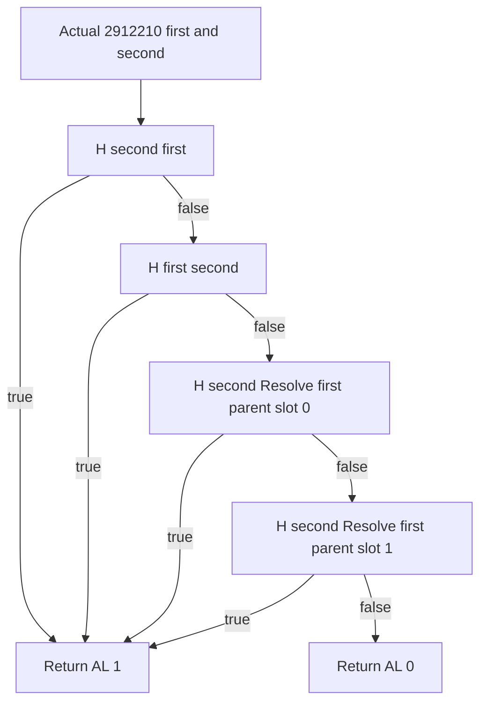

# Native71 conception related-pair predicate (1.20.0.4)

Recorded 2026-10-10 / 2026-W41. Exact source pin is CK3 1.20.0.4,
Steam build 25734779, retained EXE SHA-256
`98702F88A547CDE2EAF29A85F93B85F68EE4CF8148336A4F7AFAEB75319DD518`.
The original Z source tree is read-only. This package owns only this topic,
an independent `conception_related_pair_12004` leaf and one focused fixture
in its external continuation-52 directory. Shared production integration,
Git, native full builds and Game belong to Root.

## Actual call and return

The actual parent is continuation-17's complete 3877-byte
`root-literal-source/pair-value-provider-2B95670.json`. It preserves the
first Character in R14 and second Character in R13. After existing
`2912080(first,second)` returns false, `2B9631F` moves second to RDX,
`2B96322` moves first to RCX and `2B96325` calls actual `2912210`.
`2B9632A` tests AL: false goes directly to the unchanged result write,
while true loads the signed qword at actual `5C69E00` and follows the
provider's scale-100000 multiply path. The earlier close-family true
branch instead loads `5C69DF0`. This leaf does not recompute that later
arithmetic or call/requalify the existing close-family predicates.

Actual `2912210..2912265` is a complete 85-byte runtime function. Its
entry uses the Windows x64 two-Character pointer ABI, RCX first and RDX
second, preserves RBX/RDI, and returns a Boolean in AL. It performs:

1. `28B3C10(second,first)`; nonzero AL returns AL=1.
2. Otherwise `28B3C10(first,second)`; nonzero AL returns AL=1.
3. Otherwise `28B3E50(first,second)`; nonzero AL returns AL=1.
4. Otherwise it retains the third helper's AL=0 and returns.

All actual external calls, local branches and both terminal returns are
closed. No heap allocation, event submit, random draw or game-state write
occurs in this predicate or the necessary helpers below. These facts
justify a software read-only observer; a source-qualified call shape is
not a new live qualification.

## Exact relationship fields and generation resolution

The two real helper bodies are complete actual runtime-owned intervals
`28B3C10..28B3E4E` (574 bytes) and `28B3E50..28B3F28` (216 bytes).
They read Character `+1A8` as an eight-byte relationship-block pointer,
then its `+0` and `+4` as two four-byte full Character IDs. A null block
supplies literal `FFFFFFFF` for either native parent position. The field
names in this leaf remain `parent_slot0_full_id` and
`parent_slot1_full_id`: the actual operands, not a family UI label, define
the comparison.

Both inlined resolver paths use actual Character storage slot `5C67568`:
storage `+2C` is unsigned DWORD capacity, `+20` is an eight-byte slot-array
pointer, `full_id & 00FFFFFF` selects a 16-byte slot, and slot `+8` holds
the Character pointer. A candidate is accepted only when nonnull and its
DWORD `+18` equals the complete supplied ID, including generation bits.
Missing store, out-of-range index, null object or generation mismatch uses
the actual fallback pointer at `5C67570`.

The necessary literal helper `896E90` has no own retained pdata row. Its
actual 57-byte frameless body `896E90..896EC9` was closed using a bounded
96-byte prefix; the remaining 39 acquired bytes are padding/adjacent code
and are excluded from the source contract. It takes RCX pointing to a
DWORD full ID and returns the exact storage candidate/fallback in RAX.
Its two global operands independently resolve to the same storage and
fallback slots. No old caller, ordinal translation or version delta was
used to assign this body.

For every comparison the helpers require Character magic DWORD `+1C`
equal to `43686172` and DWORD full ID `+18` different from `FFFFFFFF`.
An actually readable invalid native fallback is a known nonmatching
object; unreadable memory remains unknown. A valid native fallback is
not silently replaced by a synthetic null or treated as absent.

## Closed predicate tree

Let `Resolve(id)` be the exact full-ID/fallback operation above, and let
`ParentId(c,i)` read relationship-block DWORD position `i`, supplying
`FFFFFFFF` only for an observed null block. Define the actual
`H(c,s) = 28B3C10(c,s)`:

For c's parent position 0 and then position 1, resolve P. If P is a valid
Character, P is not the same physical pointer as s, and s is valid, first
resolve s's position-0 ID to Q. If Q is valid and P has a relationship
block whose position-0 ID equals Q's complete observed ID, return true.
Otherwise repeat with s's position 1 and P's position 1. An invalid P,
P==s, invalid s or exhausted nonmatching comparisons falls through to
the next c parent; exhaustion returns false. The comparisons do not
cross position 0 with position 1.

The actual `E(first,second) = 28B3E50(first,second)` resolves first's
position 0 to P and calls `H(second,P)`. On false it resolves first's
position 1 and calls `H(second,P)` again, returning that AL. Therefore:

This source supports the exact parent-position comparisons. It does not
claim that house, dynasty, general relatedness, a genealogy UI category
or an arbitrary family distance is interchangeable with this predicate.

## Independent observer and integration contract

The implementation binds only the exact4 version/SHA and an existing
read-memory callback plus module base. The current-household entry takes
the already resolved first/second Character pointers and both expected
full IDs, validates their identity, copies only required raw relation
fields and storage/fallback observations, and evaluates the closed tree
without executing a CK3 function. Output keeps each actually traversed
Character's raw parent positions, relation-block presence, resolved
full IDs and component results; short-circuited branches stay absent.
Read failure is unavailable, not false. A null relation block is observed
native input, not a failed read. Full generation mismatches use fallback
as the actual helpers do.

Root may consume this result on the existing current-household frame.
The wider provider must still select it only after existing close-family
false and after the separate resolved faith branch has selected the
normal path. This leaf supplies neither that faith gate nor the loaded
`5C69E00` numerical value. It does not decide whether conception occurs.

## Source and qualification evidence

Initial tree and unknown field edges were frozen in `SOURCE-PLAN.json`
and generated `SOURCE-GRAPH.md` before acquisition. Actual nested CALL
edges were frozen in `DEPENDENCY-SOURCE-PLAN.json` before the 790-byte
helper capture, and the frameless resolver edge in
`RESOLVER-SOURCE-PLAN.json` before its 96-byte capture. Plan checks prove
record structure and file integrity only; semantic closure above is
the explicit source review.

Exact receipts are `RELATION-PREDICATE-SOURCE.json`,
`RELATION-DEPENDENCY-028B3C10.json`,
`RELATION-DEPENDENCY-028B3E50.json` and
`CHARACTER-RESOLVER-SOURCE.json`, with decoded assembly companions.
New acquisition totals 971 bytes in four claimed cache reads: 85+574+216+96.
The only interpreted bodies total 932 bytes: 85+574+216+57. All cache
writes use the approved D shared cache and existing mapper O_EXCL claims.
No old executable acquisition, whole executable hash/read, section scan,
Game operation or prior FIRST requalification occurred.

The source closure above preceded implementation. The API and the one new
whole observer fixture are now independently qualified below.
Native full-build adoption, owning-thread integration and production-live
query credit remain Root's separate work. There is no new pregnancy,
birth, succession, M7 or G2 completion credit in this packet.

## Delivered API and one new focused result

The source header is
`ck3_autonomous_player/native_bridge/include/xar_bridge/conception_related_pair_12004.hpp`;
its implementation and owned-memory scene are the corresponding files in
`native_bridge/src/`.

`BindConceptionRelatedPair12004(version, sha, module_base, read_memory, context)`
admits only this exact build. `read_memory` has the existing guarded-copy
signature `bool(void*, const void*, void*, size_t) noexcept`.
`ReadConceptionRelatedPairForHousehold12004(bindings, first_pointer,
expected_first_full_id_u32, second_pointer, expected_second_full_id_u32)`
validates both supplied current-household identities before observing the
exact fields. Output has independent available/unavailable status, an
optional `related_pair_predicate`, the three ordered native helper
component results and `raw_characters` for actually traversed relation
inputs. Root retains actor/full-ID/frame/revision joining and serialization;
internal pointers are not a new public identity API.

First/second are the actual provider roles R14/R13. The outer pair caller
has independently validated its first nonzero/second zero sex-byte order;
the household integrator must preserve that actual order rather than assume
the heir or queried actor is always first. Numerical consumption also needs
the separate normal-faith-branch and existing CloseFamily-false conditions.
This observer itself records the relationship input and supplies no sex,
faith, close-family or multiplier substitute.

One strict MSVC `/std:c++20 /W4 /WX /O2` compile and one new complete
current-household owned-memory scene both returned exit0 on 2026-10-10 at
09:34:56 UTC. The actual receipt is
[focus01/RESULT.json](D:/codex-ck3-background-spill/native71-continuation-20261010/continuation-52/focus01/RESULT.json).
It validates the third-helper true route after two false components;
low24-equal/full-generation-mismatched parent resolution; different parent
positions staying nonmatching; first reverse and second forward true
short circuits with skipped component values absent; unread required field
remaining unavailable; observed null relation blocks yielding native
sentinels and known false; unread actual fallback remaining unavailable;
wrong exact hash performing zero copies; expected household full-ID mismatch
remaining unavailable; field widths4/8; and unchanged source memory.
This is an offline fixture over synthetic current-memory inputs, not an
actual paused Character observation or execution of the native predicate.

Precise permanent EXE exclusion registration was attempted using the
existing project helper. Its actual receipt returned
`admin_required_for_verified_readback; no Add attempted and no UAC bypass`.
The exact executable and failed receipt are pinned in `focus01/RESULT.json`;
the permanent exclusion remains pending. This result neither rewrites that
setting failure nor changes the independent fixture GREEN.

The original pre-code topic and all initial/closed plans remain unchanged
in the external package. The source-record checker rejected one mistaken
`--for-observation` invocation because this plan is offline-only; the
correct record-structure check then passed. That invocation performed no
native sample and grants no live authorization. The generated closed tree
is [SOURCE-CLOSED-GRAPH.md](D:/codex-ck3-background-spill/native71-continuation-20261010/continuation-52/SOURCE-CLOSED-GRAPH.md).

Root owns CMake/binder/current-family DTO and public consumer adoption.
The qualified leaf is ready for that integration; no previous family
FIRST, full DLL build, Game, Steam, SDK, Git operation or shared source
mutation was performed by this package. M7/G2 status is unchanged.
