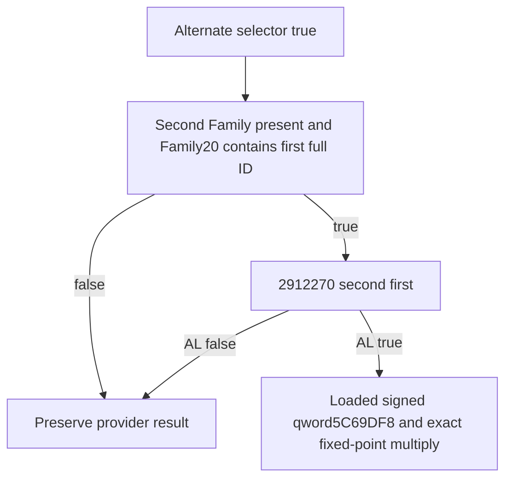

# Native71 reverse close-or-extended conception input (1.20.0.4)

Recorded 2026-10-10 / 2026-W41. This leaf reuses exact CK3 1.20.0.4,
Steam build25734779, held EXE SHA
`98702F88A547CDE2EAF29A85F93B85F68EE4CF8148336A4F7AFAEB75319DD518`.
The existing actual4 Family ABI already qualifies
`kFamilyCloseOrExtendedFamilyRva=2912270` with
`family_break_penalty::FamilyPredicate=bool(*)(void*,void*)`. No body
capture, old family FIRST or whole-family requalification is performed.

The actual full provider source is continuation17's retained
`root-literal-source/pair-value-provider-2B95670.json`. Only after the
alternate relation path is selected, the second Character's Family block
is present and its `Family+20` complete-ID list contains first, the native
provider reaches `2B963C7`. At `2B963C1`, RDX receives R14 first Character;
at `2B963C4`, RCX receives R13 second Character. Its call is therefore
**`2912270(second,first)`**. TEST AL at `2B963CC` / JE at `2B963CE` leaves
the result unchanged for false. True loads the signed qword at `5C69DF8`
and enters the already source-closed scale100000 multiplier path.

The actual predicate direction is independent of the normal-path
`2912210(first,second)` input and of a forward close-or-extended result.
Neither can substitute for this fresh reverse observation. The separate
normal CloseFamily branch still uses `2912080(first,second)`.

`BindConceptionReverseCloseOrExtended12004(base, exact_sha, guarded_copy,
copy_context)` uses the existing qualified type/constant and only this
actual getter. The current household collector passes its already
resolved owned second and first pointers, each with the complete uint32
generation ID, to
`ReadConceptionReverseCloseOrExtended12004(bindings, second, second_id,
first, first_id)`. The leaf checks native Character magic and full32 ID
before and after exactly one getter call. The existing collector's paused
application-thread frame, pointer roundtrip and relationship comparison
continue to join the output to the same current pair.

The independent result contains status, unavailable reason and
`std::optional<bool> alternate_close_or_extended`. False is an available
observed Boolean only after getter return and stable identities. Missing
binding, unread or mismatched identity, getter failure or changed identity
keeps the Boolean absent. The existing `pair.related_pair` is unchanged.
Internal callback failure is guarded using the existing narrow family
native-read boundary pattern; it does not rewrite another input's state.

The actual collector handoff adds the new independent pair member, an
existing-style typed getter seam in `NativeConceptionCandidateBindingsV1`,
the exact reverse leaf call with current pair locals, and maps its optional
Boolean to the full provider's `alternate_close_or_extended`. The full
conditional consumer itself retains the native alternate/membership gates;
observing this input is not a pregnancy action or probability claim.

The source, actual call direction, qualified binder and current collector
baseline were frozen in continuation52b `SOURCE-PLAN.json`, generated
`SOURCE-GRAPH.md` and `SOURCE-FREEZE.json` before implementation. New
validation belongs to the single central10 /17b fullprovider compound,
which must exercise fresh reverse direction, stable full generations,
known false and independent unavailable inputs. No standalone test or old
family qualification is rerun here. Central validation, Root's next-pin
cold adoption and actual live observation remain pending at this source
handoff. No M7/G2 live credit is granted by a leaf or source-record check.
