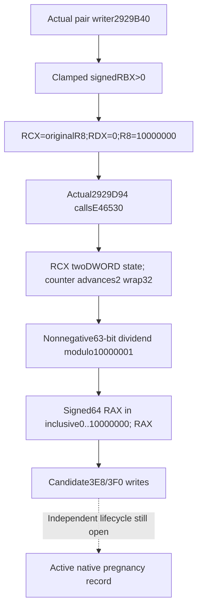

# Reached conception comparison helper, actual4

2026-10-10 source continuation. CK3 **1.20.0.4 / Steam25734779**, held EXE
SHA-256 `98702F88A547CDE2EAF29A85F93B85F68EE4CF8148336A4F7AFAEB75319DD518`.
The [existing pair writer](current-first-heir-pregnancy-entry-12004.md#actual-scalar-consumer-pair-branch-and-candidate-state-writes)
reaches actual helper `E46530` before its candidate-state writes. This topic
isolates the helper's receiver and return/comparison contract; it does not
establish conception scheduling or predict a random outcome.

The retained caller suffix proves `TEST RBX,RBX; JLE` excludes nonpositive
signed thresholds. It then passes the original third incoming argument as
RCX, zero as full RDX, and **10,000,000** as full R8. The latter follows the
actual `MOV R8D,989680` zero extension. At `2929D99`, `CMP RAX,RBX` followed
by `JGE 2929DC9` is a **signed 64-bit comparison**: returned RAX below the
positive clamped threshold passes; RAX at least the threshold rejects.
Only the passing branch writes first Character extended-data byte `3E8=1`
and pointer `3F0=second Character`, then returns true.

The returned range is now proved by the exact helper body rather than
inferred from those numeric arguments. Root supplied the unique241-byte
body at08:48:36UTC; its SHA-256 is
`73f7d36add188727a897301db67dbabc36637e44b9c8668c2b38762a1b6bb5ef`.
The [body and66 decoded instructions](D:/codex-ck3-background-spill/native71-continuation-20261010/continuation-18/root-literal-source/helper-E46530.json)
have no further CALL/JMP and one RET, so no new callee is expanded.

AtE46544/E4654A, RCX supplies DWORD0 and DWORD4. The function preserves
that receiver inRBX, computes DWORD0+2 atE465C9 and stores it atE465CD.
The counter wraps modulo2^32; DWORD4 is only read. This closes a mutable
eight-byte counter/mixer-state ABI. It does not supply a native class name
or establish the incoming third argument as a Character.
The counter changes before the caller's sample comparison, so a rejected
sample still consumes this two-step state advance even though the candidate
state writes do not occur.

The two mixed32-bit values form a full64-bit result after `BTR EAX,31`
clears the high DWORD's sign bit. The combined dividend therefore lies
in0..2^63-1. The helper takes signed64 minimum/maximum of the two numeric
arguments, forms maximum−minimum+1, performs `CQO; IDIV`, and adds the
minimum to the remainder. For this reached call0/10000000, the divisor is
**10,000,001** and the returned RAX is in the inclusive range
**0..10,000,000**. Negative samples cannot arise in this reached call.
The return uses fullRAX and the consumer compares it as signed64.
This interval proof makes no distribution, probability or success-date claim.

The held actual4 runtime row closes the reached helper as
**`[E46530,E46621)`,241bytes**, unwind `5152A74`. The retained PE metadata
maps the range to file offset **14,965,040**. The initial filename-only,
nonrecursive inventory of the one retained shared-span cache found no
overlapping body; Root's later exact acquisition closes that source gap.
This worker read no executable or game process. Exact inputs and the
current source tree are in
[continuation-18](D:/codex-ck3-background-spill/native71-continuation-20261010/continuation-18/SOURCE-TREE.md)
and [the mapped source receipt](D:/codex-ck3-background-spill/native71-continuation-20261010/continuation-18/HELD-HELPER-SOURCE-MAPPED.json).

The independent
[comparison leaf](../../ck3_autonomous_player/src/xar_autoplayer/simulation/conception_sample_comparison_12004.py)
consumes the supplied sample and already-clamped threshold. It distinguishes
the nonpositive caller gate, a missing returned sample, and the available
signed comparison. It neither generates samples nor invokes this mutable
helper. The leaf stops before candidate-state writes; it is not wired to a
live query or gameplay strategy.

Status: **exact-build source closed / independent comparison consumer
qualified offline**. The sole new focused test passed, one method in0.006s.
It replayed only the captured241-byte body against six owned synthetic
twoDWORD states, including counter wrap, and passed the actual returned
samples to the production leaf. It verified the unchanged mixer DWORD,
sample range, equality rejection, one-above pass, endpoint comparisons and
missing-sample distinction. The [actual receipt](D:/codex-ck3-background-spill/native71-continuation-20261010/continuation-18/FOCUSED-VALIDATION.json)
records six machine calls and0.005031s internal elapsed. No existing
fertility/status test, native build or runtime qualification was repeated.
Native class naming and the incoming
monthly/caller edge remain unresolved; candidate-to-active pregnancy is a
separate lifecycle dependency. Current pregnancy, birth, natural succession
and M7/G2 completion remain unchanged.
