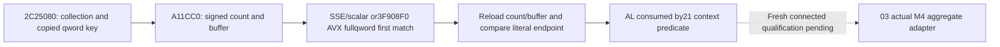

# Actual1.20.0.4 A11CC0 raw collection predicate

The actual2C25080 call passes RCX=selected registry object+8D8 and RDX pointing
to a native stack qword that contains the copied first pointer.2C25085 tests AL;
nonzero takes the2C250D0 AL1 return. The read-only callback receives that key
qword by value. It preserves21's unmodified Inputs/frame_key and06 read access
inside03's existing paused read boundary.

SOURCE-PROOF.json was frozen before candidate implementation. A11CC0's complete
326-byte actual body and reached3F908F0's115 bytes were reused from existing
named caches:441 retained bytes, zero new native reads. The latter has no exact
held pdata row; its two adjacent6+109-byte caches join at an instruction split
and decode completely through both actual RET paths. Source-only metadata and
decode attempts did not execute any candidate or native function.

A11CC0 loads signed count at collection+C and buffer at collection+0, then
compares the full qword key against ordered qwords. Its SSE branch combines both
dword halves before choosing the first matching lane. The reached AVX branch
compares full qwords and returns the first matching pointer, or the original
end pointer. Scalar tails use full qword comparisons. No type, owner, character,
ID or gameplay interpretation is attributed to these values.

The final source reloads signed count and buffer. Its literal predicate is
`found_pointer != reloaded_end && found_pointer != 0`, with the endpoint computed
as native address bits. Header changes can alter AL even if the initial list
had no equal qword; the model preserves this and records header_unchanged rather
than rejecting the frame or replacing the result with an intuitive contains.

ReadConstructionCollectionPredicateA11CC0V1 copies the raw header and a bounded
ordered extent, then rereads the header. Known zero count accepts an observed
null empty buffer, and zero key remains a legal qword operand. Negative initial
count, exceeded copy budget, overflow or unavailable bytes keep value null.
The negative count and any captured prefix stay raw; empty arrays never supply
an unavailable count. The final endpoint comparison preserves a negative
reloaded count or address wrap because that arithmetic does not dereference
the endpoint. The default4096-entry bound controls copier work only.

ReadConstructionCollectionPredicateA11CC0ChildV1 matches21's exact callback
signature. Its return false means unavailable and leaves the bool output alone;
return true can supply known false. A null context uses the default budget;
the optional context stores the raw trace for the caller.03 needs no additional
DTO and can forward a member of its combined child context or call the reader
directly. The key must equal Inputs.first_pointer, and is never an address of
the observer's own stack storage.

The fresh no-main case export is composed once by03/10 with the real parent
adapters. This package performs no independent build/test, native getter,
Game/listener, old Sway/Army/guardian qualification or shared integration.
research-plan.json/check/render verify record structure and file identity only;
central connected qualification and runtime availability remain separate facts.

