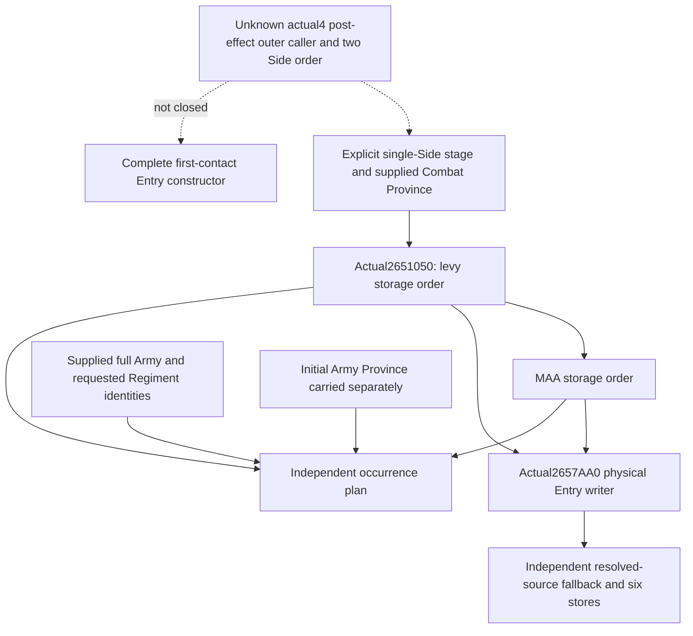

# Native71 final Entry occurrence order, exact 1.20.0.4

The actual4 **single-side** final stat traversal is source-closed. The complete
held 137-byte body at 2651050 first visits levy storage+28/count+34, then MAA
storage+40/count+4C, both in stored order with stride 60. The actual writer CALLs
are 2651088 and 26510B6, both targeting 2657AA0. No quantity or subtype gate occurs
in these 40 instructions. This is a newly qualified actual4 source seam; the
previously GREEN exact3 pure assembly is not rerun or renamed.

CK3 is 1.20.0.4 / Steam 25734779, EXE SHA256
98702F88A547CDE2EAF29A85F93B85F68EE4CF8148336A4F7AFAEB75319DD518.
The build pin and decoded source are reused from held owner receipts. This
packet reads no EXE, game, SDK, saved response, Driver or public wire.

## Actual body and input identities

The source is the retained
`actual4-domain/combat-map/pass06-entry-stats/current_side_final_entry_stats_refresh-DETAIL.json`
under `g2-parallel-20261007/battle-pursuit/migration-steam25734779/`.
Its complete actual instruction list binds capture
`shared-span-cache/new-02651050-026510D9.bin` under
`g2-background-20261007/upstream-build-migration/`.
The [frozen source packet](D:/codex-ck3-background-spill/native71-continuation-20261010/continuation-15/SOURCE-PROOF.json)
was written before the independent implementation.

| Actual instruction | Closed role |
| --- | --- |
|2651064 MOV RBX,[RCX+28];265106B MOVSXD RAX,[RCX+34]| Levy data and signed32 count |
|2651068 MOV RDI,RDX| Preserve the supplied Province argument |
|2651072 LEA RSI,[RAX+RAX*2];2651076 SHL RSI,5| End pointer at data+count*60 |
|2651082 MOV RDX,RDI;2651085 MOV RCX,RBX;2651088 CALL2657AA0| Every levy occurrence receives the same supplied Province |
|265108D ADD RBX,60;2651094 JNE2651082| Increasing stored occurrence index |
|2651096 MOV RBX,[RBP+40];265109A MOVSXD RAX,[RBP+4C]| Begin MAA only after the levy loop |
|26510B0 MOV RDX,RDI;26510B3 MOV RCX,RBX;26510B6 CALL2657AA0| Every MAA occurrence receives that same Province |
|26510BB ADD RBX,60;26510C2 JNE26510B0;26510D8 RET| Increasing MAA index and complete return |

The Side body carries physical Entry addresses; Army identity, requested full
Regiment ID and the initial Army Province are explicit row inputs. They are not
read or reconstructed by this helper. Repeated Regiment IDs in different
physical occurrences stay distinct. The [actual writer proof](battle-physical-entry-cache-writer-12004.md)
separately closes full Regiment lookup, full-ID check and fallback. A fallback
must retain its requested Entry Regiment and actual resolved source separately;
this traversal does not classify fallback or produce source identity.

The Province argument is preserved throughout one invocation. The Side body
does not read Army Province or Combat+6B8. Naming a supplied model operand
`final_combat_province_id` is an explicit caller input, not an observation of
the missing actual4 outer caller. Initial Army Province remains a separate
per-row field and is never substituted for that input.

## Bounded independent leaf

`entry_final_occurrence_12004.hpp/.cpp` produces a **single-side** plan from
explicit ordered levy and MAA row identities. It records side/bucket/index,
single-side traversal ordinal, physical Entry, full Army/Regiment IDs, actual
writer CALLsite and both supplied final and initial Province bindings. It
performs no memory read, native call, getter calculation or cache write.
Current quantity is carried as row material but never filters membership.
It does not supply the unknown two-Side caller order. Its output can feed the
separate continuation 16 six-cache leaf by explicit occurrence association.

## Exact unfinished entrance

The actual4 outer counterpart of old 247AB1F..247AB46 is not held by the supplied
finite map/cache packet. Old 247AB32/41 and 2586ED0 are source-role locators only.
Neither actual4 Side0-before-Side1 nor the two final Combat Province reloads
is claimed. The [39-byte literal caller recipe](D:/codex-ck3-background-spill/native71-continuation-20261010/continuation-15/OUTER-CALLER-CAPTURE-RECIPE.md)
uses retained runtime identity only to locate a candidate, then requires actual
instructions/targets and finite carrier definitions. It has not been executed.

Finite held-source validation passed: build pin, continuous 137-byte decode,
40 instruction boundaries and both literal writer CALLs match the frozen
claims. The leaf and sole new four-occurrence fixture then passed one C++20
`g++ -Wall -Wextra -Werror -fsyntax-only` invocation on 2026-10-10, exit 0,
1.159 seconds. No EXE was produced and no test case was executed. The
[delivery receipt](D:/codex-ck3-background-spill/native71-continuation-20261010/continuation-15/DELIVERY.json)
contains the exact syntax command, source hashes and unexecuted build recipe.
Root owns the sole executable test after shared-volume admission and the exact
project EXE registration. This syntax result does not grant static-test GREEN.

Readiness: single-side source-closed, authored leaf/fixture, syntax GREEN;
executable fixture NOTRUN. The actual4 outer caller is continuation 28's
independent source package. Complete Person/Entry, whole forecast, live and G2
credit remain unchanged. Shared Driver, Service, public serializers, CMake and
reports are owned by Root and are not changed by this packet.
