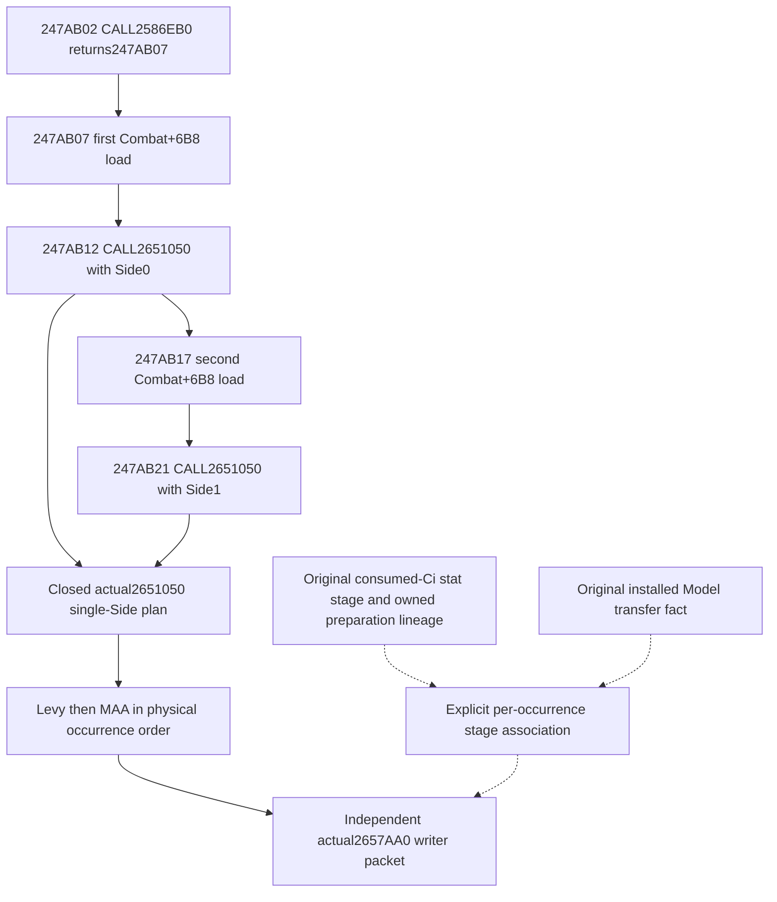

# Final Entry outer refresh and original stage provenance, exact 1.20.0.4

The actual4 immediate outer caller is now source-closed: Side0 is called before
Side1, with an independent Combat+6B8 Province load before each call. The
returned Combat carrier and retained Side1 definition are held through the
finite connecting control path. A historical Character Model refresh remains
an independent original-stage fact.

Build: CK3 1.20.0.4 / Steam 25734779, EXE SHA-256
`98702F88A547CDE2EAF29A85F93B85F68EE4CF8148336A4F7AFAEB75319DD518`.
The pin is reused from the installed-build freeze and the actual4 general
combat source manifest. There is no hash, whole image/section scan or
game/native invocation. Root subsequently authorized this owner to perform the
named finite mapper captures with cache-first exact-range claims and D output.

## Source chain before implementation

The complete 137-byte actual4 Side body `2651050..26510D9` visits levy storage
before MAA storage and preserves its supplied Province argument. Its two
writer calls `2651088/26510B6` target the independently closed `2657AA0`.
These bodies are reused from continuation-15 and continuation-16; neither is
recaptured or requalified here.

The outer window was selected from the retained exact3
source-role locator `[247AB1F,247AB46)`, 39 bytes, in runtime interval old
`247A330`. Old instruction addresses, old `2586ED0` and old `2651070` are
locators only. A finite mapper's runtime ordinal is a candidate rather than
actual4 evidence. No global address delta is used.

The mapper returned actual containing interval `[247A310,247AB6D)`, ordinal
127663. Literal review covers three adjacent named extents, not the complete
constructor: `[247A896,247A8C1)` 43B, `[247A8C1,247AAFF)` 574B, and
`[247AAFF,247AB26)` 39B. All completely decode, with retained concrete member
operands and local branch topology. The connecting path has no direct RBX/R14
assignment or terminal edge, and its local branches stay inside the held path;
the normal Win64 nonvolatile register contract preserves those carriers across
its calls.

| Actual source | Literal role |
| --- | --- |
|247A896 CALL2AD81D0;247A89B MOV RBX,RAX| Retain the constructor's returned object |
|247A8BA LEA R14,[RBX+368]| Retain Side1 of that object |
|247AAFF MOV RCX,RBX;247AB02 CALL2586EB0| Actual preceding stage call; its return is247AB07 |
|247AB07 MOV RDX,[RBX+6B8];247AB0E LEA RCX,[RBX+20]| First final Province argument and Side0 receiver |
|247AB12 CALL2651050| First final Side invocation; return247AB17 |
|247AB17 MOV RDX,[RBX+6B8];247AB1E MOV RCX,R14| Independent second Province load and retained Side1 receiver |
|247AB21 CALL2651050| Second final Side invocation; return247AB26 |

The preceding call's actual target is `2586EB0`; this does not rename old
`2586ED0` or assert the callee's transitive effects on Character Models. The
39B immediate sequence has no direct Model refresh or preparation instruction.
The two runtime Province values and their equality are not observed by this
static source. They remain two independent supplied argument facts.

[SOURCE-PROOF.json](D:/codex-ck3-background-spill/native71-continuation-20261010/continuation-28/SOURCE-PROOF.json)
was frozen before candidate code. Its finite detail receipts retain literal
bytes, returned runtime candidates and cache/claim provenance. New image reads
total1312B, split656B exact3 and656B exact4; no hash, section scan or downstream
callee expansion was performed. All new capture and decision files are on D.

## Conditional adapter boundary

The independent adapter joins two supplied
`PlanFinalSideOccurrences12004` results in the proved outer order. Their local
traversal ordinals remain local; a separate outer ordinal records the join.
Each occurrence carries the corresponding outer callsite and Province-load
instruction. The two supplied final Province bindings remain independent,
even when their values happen to match. Initial Army Province stays in the
single-Side occurrence and is never substituted for either final argument.

An original stat stage is associated by its physical Entry occurrence, full
Army/Regiment identities and per-side bucket/index. The adapter carries the
stage name, sequence, consumed-context association and any existing Model
preparation/transfer facts unchanged. Missing stage or association facts
remain missing. Static caller order does not prove that an actual historical
refresh happened, that one Model supplied every Ci, or that prepared Model
state reached the installed Model before this Entry getter.

Continuation-14's numerical input join uses an owned completed preparation
postimage only for positively matched individual Ci calls; unmatched Ci retain
their originally consumed PCs. Its original source ledger and
`original_entry_invocation_inferred=false` boundary are retained. This packet
does not repeat that join, compute getter values, write caches, change a shared
Driver/Service/serializer/CMake file, or grant full Person/Entry/live credit.

The existing `KnightStatConsumptionEvent12004` has a distinct
`physical_entry_writeback` sidecar. In
`ck3_12004_knight_stat_consumption.cpp`, the actual writer scope changes origin
to `native_physical_entry_writer`, sets its existing Entry association, and
carries the original physical Entry, full Regiment and Province facts. An
explicit bridge getter stays `bridge_query_scratch`. The sidecar proves that
physical writer invocation; it does not alone identify which outer Side call
produced it or establish the preceding Model transfer. This adapter must retain
that original origin and association instead of relabelling a current getter
or matching full Character IDs as a final outer invocation.

`entry_final_outer_refresh_12004.hpp/.cpp` now provides
`PlanFinalOuterRefresh12004`. The two source-bound input slots become Side0
and Side1; the existing single-Side planner performs their row traversal.
The output retains local ordinals and adds independent outer ordinals,
per-call source addresses, conditional Side identities, supplied final
Province arguments and optional original argument observations. Unknown
argument values remain unknown; equality comparisons are optional facts,
not new gameplay gates.

Stat-stage associations use the physical Entry, full Army/Regiment identities,
side/bucket/index. Every matching original stage is retained in its input
order, including repeated consumption records. Unmatched stages are retained
separately. Getter-stage names, original origins, source-ledger references,
sequences and preparation/installed Model facts are copied unchanged. A
different original getter Province is exposed as a false comparison rather
than relabelled. `original_outer_invocation_inferred` always remains false.

Current readiness: outer source closed; conditional adapter and one new
compound fixture authored. Its executable run is NOTRUN and belongs to Root.
No test or build is claimed by the source proof. All new files belong to the external
`continuation-28/candidate/` tree; the Z source tree is read-only.

The candidate received one `g++ -std=c++20 -Wall -Wextra -Werror
-fsyntax-only` check, exit0. It created no EXE and executed no fixture.
`SYNTAX-CHECK.json` retains the actual argv/output; `ROOT-FOCUSED-ARGV.json`
contains one new executable compound command using continuation15's planner
implementation without its previous test. The fixture composes two distinct
Province arguments and original current/historical stat sources while retaining
unobserved original arguments, Model transfer and unmatched stages. Focused
execution, complete Entry/Person, full forecast, live and G2 credit remain
unclaimed.
