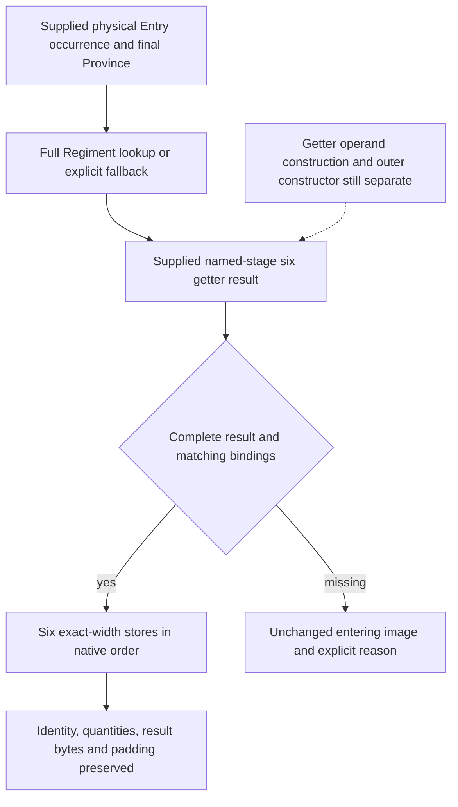

# Native71 final Entry six-cache postimage, exact 1.20.0.4

The bounded pure setter now uses the actual 1.20.0.4 writer source and an
explicitly supplied getter result. It resolves the requested full Regiment
identity or the native fallback, binds the result to one destination occurrence,
and changes exactly six inline cache fields. Missing getter operands or
inconsistent supplied bindings leave the entire entering image unchanged.
Complete Entry construction, changed-stage getter construction and new native
execution remain separate.

The frozen build is CK3 1.20.0.4 / Steam 25734779, EXE SHA-256
`98702F88A547CDE2EAF29A85F93B85F68EE4CF8148336A4F7AFAEB75319DD518`.
This package reuses the existing complete 136-byte / 39-instruction capture
`[2657AA0,2657B28)` and its source review. It reads zero new EXE bytes, performs
zero native calls and does not rerun the earlier physical-writer FIRST.
The proof was frozen before these new implementation files were authored.

Actual source is [2657AA0.asm](Z:/ck3_mod_rewrite_process_assets/g2-background-20261010/person-physical-entry-frontier/actual-entry-writer01/2657AA0.asm)
and [SOURCE-CAPTURE.json](Z:/ck3_mod_rewrite_process_assets/g2-background-20261010/person-physical-entry-frontier/actual-entry-writer01/SOURCE-CAPTURE.json).
The prior [actual4 writer review](battle-physical-entry-cache-writer-12004.md)
and [physical writeback observer](battle-physical-entry-writeback-observer-12004.md)
remain their own source and qualification records. Historical `.3` setter
addresses are not used as actual4 binding evidence.

## Actual resolution and stores

`2657AA6` reads the Regiment manager slot `5D1F340`; `2657AAD` retains the
original Province and `2657AB0` retains the physical Entry in RBX. A present
manager uses Entry DWORD+8 as the full requested Regiment ID. Its low24 is an
unsigned table index, checked against manager DWORD+2C. Manager QWORD+20 points
to 16-byte rows; row QWORD+8 is the candidate pointer, whose DWORD+10 must match
the full requested ID, including generation bits. Missing manager, out-of-range
index, null row pointer or full-ID mismatch select the actual fallback pointer
at `5D1F338` (`2657AE0`). A stale generation sharing the low24 index therefore
cannot select the stale object. Native fallback remains explicit and may have a
different full source ID from the unchanged destination requested ID.

`2657AE7` passes the retained Province, `2657AEA` supplies stack output scratch,
and `2657AEF` calls `26344A0`. RAX then addresses the returned stat record:

| Order | Getter record | Entry destination | Width | Actual store |
| --- | --- | --- | --- | --- |
| 1 | +08 | +30 max size | DWORD, signed32 interpretation | 2657AF7 |
| 2 | +10 | +38 siege | QWORD, signed64 interpretation | 2657AFE |
| 3 | +18 | +40 damage | QWORD, signed64 interpretation | 2657B06 |
| 4 | +20 | +48 toughness | QWORD, signed64 interpretation | 2657B0E |
| 5 | +28 | +50 pursuit | QWORD, signed64 interpretation | 2657B16 |
| 6 | +30 | +58 screen | QWORD, signed64 interpretation | 2657B1E |

There is no current-quantity, main-phase eligibility or positive-value condition
in this body. Zero-current rows still receive the six stores. The DWORD write
leaves +34..37 intact, and identity, starting/current/soft quantities and result
headers outside the six ranges remain entering-stage bytes. The last load puts
the screen QWORD in RAX: the modeled return is its raw 64-bit value, not an Entry
pointer.

## Supplied occurrence and getter contract

[entry_final_cache_postimage_12004.hpp](../../ck3_autonomous_player/native_bridge/include/xar_bridge/entry_final_cache_postimage_12004.hpp)
and its implementation operate on an owned `0x60` Entry image. The caller
supplies side, levy/MAA bucket, bucket index, traversal ordinal, physical Entry,
full native Army/Regiment identity, and final Combat Province ID and identity.
The source result must bind to that exact occurrence and to the actual resolved
Regiment pointer/full ID. The requested Entry Regiment is never replaced with
the fallback Regiment's ID. Initial Army Province remains a distinct upstream
operand; this setter does not substitute it for final Combat Province.

`EntryFinalRegimentEvidence12004` represents missing evidence with `nullopt`
and a known null pointer with present zero. The supplied table row is explicitly
bound to the requested low24 index. An unobserved capacity, row, full identity
or required fallback source stays partial; it is not silently called absent.
These consistency checks validate pure-model inputs. They are not claimed as
additional guards in the native writer.

`EntryFinalGetterResult12004` retains the named source stage, source ledger and
either `explicit_named_stage` or `held_current` mode. Its six values require
`full_getter_construction_ready=true`; a partial cache or missing getter result
produces no writes. Held-current mode remains conditional on the caller's
declared unchanged operands and never becomes an observed post-operation stage.
The primitive constructs no Character, selector, culture, accolade or
environment input and does not use existing Entry cache values as new getter
inputs. It invokes no native callback.

The independent side-occurrence package owns actual `2651050` levy/MAA traversal
and its native call sites. This primitive handles one supplied occurrence and
does not claim source closure of the outer constructor's side0/side1 sequence.
The modeled store trace preserves native field order without inventing a new
side census or interleaving.

## Validation and exact next entry

External packet:
`D:/codex-ck3-background-spill/native71-continuation-20261010/continuation-16/`.
`SOURCE-PROOF-FROZEN.json` pins the held actual4 source files and six stores.
`research-plan.json`, `PLAN-CHECK.json` and the generated `research-graph.md`
bind the declared source chain; their check proves record structure/file
integrity rather than native or live behavior.

The sole new compound fixture is
[entry_final_cache_postimage_12004_test.cpp](../../ck3_autonomous_player/native_bridge/src/entry_final_cache_postimage_12004_test.cpp).
It has an independent literal byte oracle for signed width limits, negative and
zero values; tests a zero-current row, generation-mismatch fallback with a
different source ID, all actual fallback conditions, missing/partial getter,
wrong occurrence/Province and unchanged non-cache bytes. `Require` remains
effective in release builds. The source and fixture passed a syntax-only
`g++ -std=c++20 -Wall -Wextra -Werror -pedantic` check, exit0, once in 2.937631s
(`SYNTAX-CHECK-01.json`). No object or EXE was produced and the fixture was not
executed by this package. Its sole execution is pending Root's composed FIRST;
syntax success is not a test result.

All candidate files were authored externally while Root owns the game lease.
No owner-checkout files, shared core, CMake, progress reports, Git state or game
state were changed. Root can adopt the three independent C++ files and run the
new fixture once without rebuilding or replaying the qualified physical writer.
The caller can then convert each side occurrence into this exact destination
binding and supply its real named-stage getter result. A missing changed-stage
getter remains an unrefreshed row; its next entry is the existing actual4
`BindCombatImage12004` ordinary/MAA getter path at `26344A0`, supplied with the
operation's explicit Character/selector/environment stage and final Province.
The complete body is already held by the general-combat `base06` source packet;
no setter callee or cache offset needs another capture.

Readiness is **source-closed / authored / syntax GREEN / new fixture pending**
for this bounded postimage. FullPerson, FullEntry, complete changed-stage getter
construction, actual constructor execution, future forecast and new live credit
remain incomplete.
