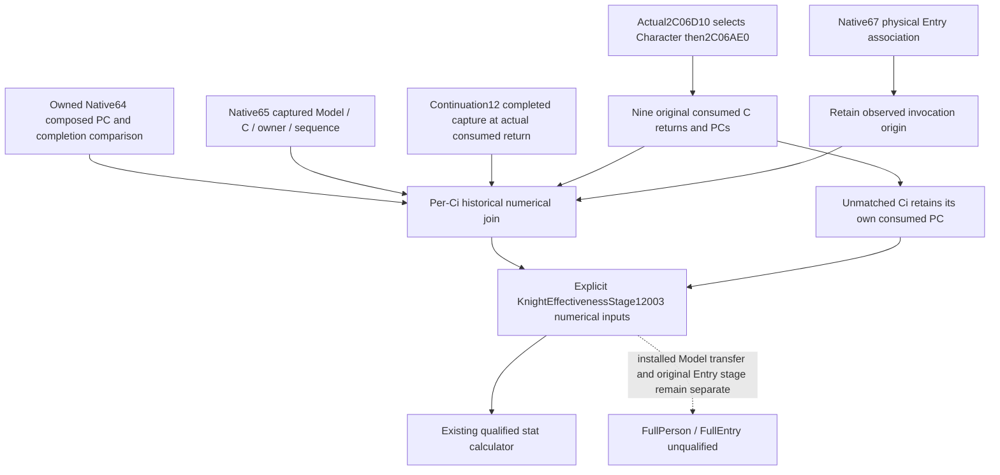

# Owned Person PC to explicit Knight stat-stage input, actual 1.20.0.4

This continuation connects an already composed historical modifier PC to the existing explicit `KnightEffectivenessStage12003` input. It reuses Native64/65 composition and Native66/67 consumed-context/Entry evidence; it does not repeat their arithmetic, producer FIRST or registered MCP qualification.

Exact build is CK3 **1.20.0.4 / Steam25734779**, retained EXE SHA-256 `98702F88A547CDE2EAF29A85F93B85F68EE4CF8148336A4F7AFAEB75319DD518`. Source anchors are [the prior handoff](battle-person-entry-context-handoff-12004.md) and [actual receiver association](knight-effectiveness-receiver-association-12004.md). The held wrapper prefix is `D:/codex-ck3-background-spill/native65-knight-context-association/actual-prefix01/SOURCE-02C06D10.json`; no bytes are recaptured here.

The actual source path is `2634504 -> 2C06D10`, `2C06D26 -> 28BFC50`, returned selected Character at `2C06D2B` transferred from RAX to RDX, then mode0 `2C06D36 -> 2C06AE0`. The selected Character is distinct from the returned modifier context `C` and historical `Model=C-0x10`. Nine `28C3AC0` returns are preserved separately. Their copied `C+0x68` PCs, original operands and observed wrapper output already feed the production numerical projector.

Native64's `compose_captured_six_stage_postimage_12004` supplies ordered `keys_u16` and signed64 `values_q64` with an independent completion-PC comparison. Native65's `emit_captured_person_preparation_model_12004` supplies captured Model, owner Character pointer/id, context, sequence and thread. The existing numerical consumer needs C1..C9 mode0 values, linked prowess and loaded damage/toughness multipliers; it does not demand decomposition of earlier Government/Title contributions or weighted rows.



`simulation/battle_entry_person_stage_join_12004.py:join_owned_person_postimage_to_knight_stage_12004` accepts the already composed PC and already emitted owner association; it does not run the composer. The concrete continuation12 leaf is each normalized consumed row's `preparation_stage_lineage`. Its `completed_preparation_lineage_proven` result belongs to `EntrySelectedReceiverStage12004` / `ObserveEntrySelectedReceiverStage12004`, whose source candidate is `native71-continuation-20261010/continuation-12/candidate/ck3_autonomous_player/native_bridge/{include/xar_bridge/entry_selected_receiver_stage_12004.hpp,src/entry_selected_receiver_stage_12004.cpp}` under the same external root.

That leaf independently preserves capture completion, six-stage mask, exact source return, selected Character pointer/full ID, captured Model owner pointer/full ID, getter C, Model+10, completion/consumption thread and complete post-PC equality. Its positive result identifies the same completed capture at this actual context return. The adapter then selects the exact supplied PC using the existing sequence/Model/context/owner fields; it does not duplicate the leaf's native source proof or upgrade older ID-only/current-context diagnostics.

Only positively joined Ci rows select a historical-PC value through the existing mode0 property reader. Every unmatched Ci keeps its own original consumed PC rather than inheriting the first context. The result's `KnightStatStageInputs12003.effectiveness` contains an explicit `KnightEffectivenessStage12003` with nine numerical values and the original operand tuple; linked prowess and loaded multipliers are unchanged. Zero operands retain their original property-skip behavior. The nine-value carrier does not assert a single common native PC. Current-query origin and physical Entry association remain independent provenance; a positive numerical association does not turn a query invocation into an original Entry invocation.

Continuation11 freezes the retained actual selected-caller proof in [native71-entry-selected-callsite-12004.md](native71-entry-selected-callsite-12004.md). Continuation13 separately establishes serial/paired preparation and state-exchange source, but the particular prepared Model, installed Model, transfer and original Entry still require actual captured identities and stage order. The new input adapter does not infer those facts.

## One new input-path validation

`tests/unit/test_battle_entry_person_stage_join_12004.py` passed its sole new compound method at **2026-10-10 08:52:54.365862–08:52:55.430055 UTC**, process interval **1.0641869 s**, with Python **3.13.2** from `Z:/ck3_mod_rewrite/tools/.venv/Scripts/python.exe`. The canonical numerical dependencies came from the current source; the new adapter and test were loaded from the external candidate directory. The actual command is:

```text
Z:/ck3_mod_rewrite/tools/.venv/Scripts/python.exe -B -X utf8 D:/codex-ck3-background-spill/native71-continuation-20261010/continuation-14/validate_input_join.py
```

The one test uses explicit synthetic lineage and separately supplied already-composed historical data. It preserves the qualified Native66 literal operand vector and its distinct C5 consumed-PC case: eight Ci associations select the historical PC; unmatched C5 still supplies **15000** from its own PC instead of historical **0**. The selected and linked Characters remain distinct. The original inputs are unchanged. Existing packets without the new leaf continue to return their original per-Ci numerical inputs and stage, with no new readiness gate.

This is **static-ready for the conditional Python input adapter**. Composition invocations, stat-arithmetic invocations, old native FIRST, old registered MCP consumers and game/SDK calls are all **0**. It does not qualify continuation12's C++ leaf, serialization, detour installation or a new natural event. Root still needs to connect that source-authored per-Ci leaf through the existing same-MCP normalizer and consume actual matching historical PC/owner inputs. FullPerson/FullEntry remain false and new G2 credit is zero. Candidates remain outside the clean runtime checkout until Root closes the managed game lease.

The compact actual result and stdout are `native71-continuation-20261010/continuation-14/{RESULT.json,VALIDATION-OUTPUT.txt}` below `D:/codex-ck3-background-spill`. No old source body, EXE byte, producer, calculator arithmetic or whole MCP qualification was replayed by this validation.
