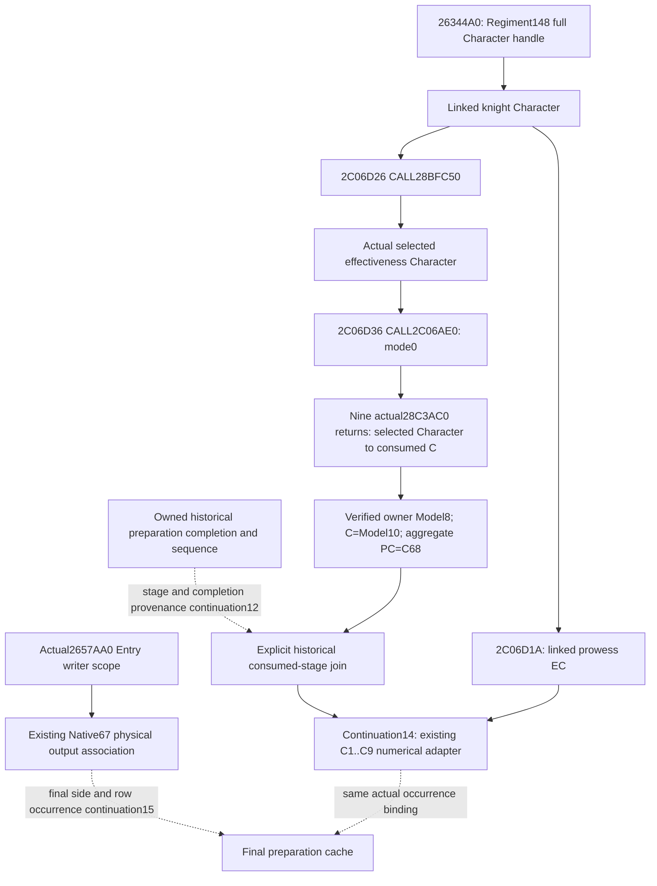

# Native71 Entry selected Character callsites, actual 1.20.0.4

2026-10-10 / ISO2026-W41. The actual4 knight selection handoff is already held: **`2C06D26 CALL 28BFC50`**, return **`2C06D2B`**, followed by **`2C06D36 CALL 2C06AE0`**, return **`2C06D3B`**. This continuation reuses the actual prefix captured for Native65/66; it does not derive these addresses from the old `2C06D46/2C06D56` or recapture their source.

The frozen identity is CK3 **1.20.0.4 / Steam25734779**, EXE SHA-256 `98702F88A547CDE2EAF29A85F93B85F68EE4CF8148336A4F7AFAEB75319DD518`, reused without rehashing. The original [Person-to-Entry handoff note](battle-person-entry-context-handoff-12004.md) recorded this callsite as `NOT_HELD` in its finite packet. The later [receiver-association packet](knight-effectiveness-receiver-association-12004.md) supplies the missing actual source and an existing consumed-context observer. Its original packet boundary remains historically true.

## Literal extents and transfer

| Native role | Actual source extent | Exact retained source |
| --- | --- | --- |
| Regiment stat producer and special-knight caller | `[26344A0,26346FB)`, 603 B | `base06/regiment_stats_at_province-DETAIL.json` |
| Knight wrapper | Prefix `[2C06D10,2C06D90)`, 128 B; full function end not held by this prefix | [SOURCE-02C06D10.json](D:/codex-ck3-background-spill/native65-knight-context-association/actual-prefix01/SOURCE-02C06D10.json) and its `.bin`/`.asm.txt` siblings |
| Selected Character getter | `[28BFC50,28BFCC6)`, 118 B | `faction/leaf01/immediate_liege-DETAIL.json` |
| Effectiveness numeric getter | `[2C06AE0,2C06D0E)`, 558 B | `base06/knight_effectiveness-DETAIL.json` |
| Selected Character modifier-context getter | `[28C3AC0,28C3B9C)`, 220 B | `combat-map/pass01/character_modifier_aggregator-DETAIL.json` |

`base06` is beneath `Z:/ck3_mod_rewrite_process_assets/g2-background-20261007/existing-mcp-factories-12004/general-combat/`. The selected getter is beneath `Z:/ck3_mod_rewrite_process_assets/g2-parallel-20261007/adopted-lifestyle-building-faction-12004/`; `combat-map` is beneath `Z:/ck3_mod_rewrite_process_assets/g2-parallel-20261007/battle-pursuit/migration-steam25734779/actual4-domain/`. These are the named locators from `native_bridge/research/ck3_1_20_0_4_general_combat.json`, with the later prefix added explicitly.

The special branch preserves the producer's original RCX Regiment in RBX and original RDX output buffer in RDI. At `26344CD` it reads the full `Regiment+148` Character handle, uses its unsigned low24 index against the Character storage capacity, and at `26344F4` checks the resolved Character's full `+18` handle. Failure takes the native Character fallback. `2634501` transfers the output buffer to RCX; **`2634504 CALL 2C06D10`** supplies this output and the resolved linked Character in RDX. The independent `base06/FAMILY-MAP.json` target pair at offset100 records the actual `2C06D10` target and matching cached runtime ordinal/interval offset.

| Wrapper instruction | Register meaning established by actual source |
| --- | --- |
| `2C06D1A mov ebx,[rdx+EC]` | Signed prowess comes from the incoming **linked knight Character**. |
| `2C06D20 mov rdi,rcx` | Preserve the original stat output buffer. Its physical Entry origin is supplied by the outer writer, not this wrapper. |
| `2C06D23 mov rcx,rdx` | Linked Character becomes the selected-getter receiver. |
| `2C06D26 call 28BFC50` | Return RAX is the native-selected **effectiveness Character**. |
| `2C06D2B mov rdx,rax` | Forward that actual returned Character, preserving linked/selected distinction. |
| `2C06D2E lea rcx,[rsp+30]` | Numeric output is a local raw effectiveness slot. |
| `2C06D33 xor r8d,r8d` | Select mode zero. |
| `2C06D36 call 2C06AE0` | RCX=local output, RDX=selected Character, R8=0; return site `2C06D3B`. |

The prefix then begins the original six-stat output calculation, including linked prowess floored to1 and loaded damage/toughness operands. The retained prefix ends at `2C06D90`; it does not establish the wrapper's terminal RET. The complete selected transfer above requires no additional tail capture.

## Linked Character, selected Character and preparation context

`28BFC50` returns a Character pointer. Its landed branch is the literal tree `linked Character+1C0 → carrier+1C0 → relation+28`; it checks the selected Character tag and non-sentinel full ID, otherwise returning the linked Character. Its alternate branch reads `linked Character+1B8`, then the employer full handle at `carrier+C8`, resolves through the Character storage/fallback, and checks the full handle. It does not return a Model or PropertyCollection.

The numeric getter forwards the selected Character to nine original `28C3AC0` calls. Their actual return RVAs are **`2C06B03, 2C06B51, 2C06B8D, 2C06BC4, 2C06BFB, 2C06C32, 2C06C69, 2C06CA0, 2C06CD7`**, in C1..C9 order. Each returned context is an independent consumed input. `28C3AC0` follows `selected Character+1B0 → carrier+258 → Model`, requires `QWORD[Model+8] == selected Character`, and returns **C=Model+10**. Its native default context remains a distinct fallback branch. The corresponding aggregate PC is **C+68=Model+78**, using the existing Native65 source convention.

The necessary historical join compares the actual consumed C/Model/owner and capture sequence with the retained preparation completion. Equal Character IDs, equal scalar values or a newly evaluated current context do not supply that historical stage. Every Ci's returned C must remain separate when native returns differ.

## Existing observer and remaining functional work

Native66 already observes the real `2C06D10` wrapper and these nine modifier-context returns in `ck3_12004_knight_stat_consumption.cpp`. It preserves original dispatches, per-Ci PC copies and historical match facts. Its separate query-scratch origin prevents an explicit bridge evaluation from being labelled natural Entry consumption. Native67 adds the actual [physical Entry writer scope](battle-physical-entry-writeback-observer-12004.md) at `2657AA0`; Native68 adds the [current physical row join](battle-current-physical-entry-writeback-12004.md). Their offline qualification remains existing evidence, with no replay or new qualification credit here.

Continuation12 should extend the existing consumed event's missing historical completion/stage provenance rather than duplicate the getters or wrapper observer. Continuation14 can use the existing C1..C9 mode0 calculator with the actual consumed per-Ci source. Continuation15/16 own the final side-row occurrence and setter postimage. A selected Character callsite is now a closed dependency; the complete historical/final Entry result remains unfinished until those real joins are supplied.

The sole finite cross-check is [continuation-11/SOURCE-CHECK.json](D:/codex-ck3-background-spill/native71-continuation-20261010/continuation-11/SOURCE-CHECK.json). It checks the four complete actual instruction extents, the map's actual caller target, retained prefix metadata and both literal rel32 CALL operands, and all nine consumed-context return sites. Coverage is **1,627 B** of retained actual instructions/cache; fresh EXE reads/bytes, hashes, metadata or pdata capture, game/process/SDK, builds, tests and Git operations are all **0**. No new sampling or native span is required by this continuation. This is source reuse and dependency closure, with no new live capability or FullPerson/FullEntry claim.
