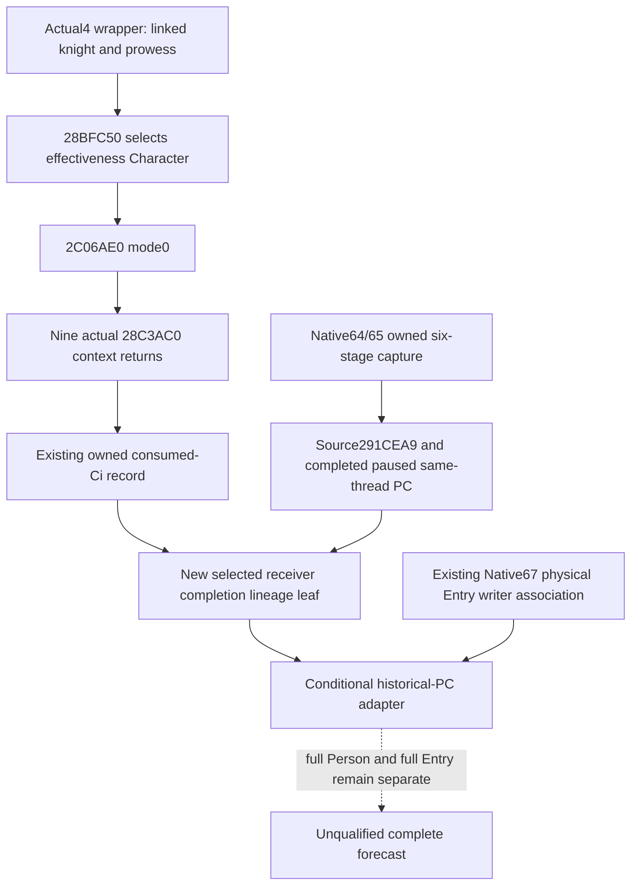

# Selected Entry receiver and completed capture lineage, actual 1.20.0.4

This small Native71 continuation adds one derived observation to the existing
consumed-Ci path. It preserves the historical six-stage capture's completion,
source return, thread, pointer owner and sequence at the actual getter-return
observation. Linked knight and selected effectiveness Character remain separate.
It introduces no getter, detour, model census, arithmetic replay or game call.

Exact build is CK3 1.20.0.4 / Steam25734779, with reused EXE SHA
`98702F88A547CDE2EAF29A85F93B85F68EE4CF8148336A4F7AFAEB75319DD518`.
The held wrapper packet is
`D:/codex-ck3-background-spill/native65-knight-context-association/actual-prefix01/SOURCE-02C06D10.json`.
It proves `2C06D26 -> 28BFC50`, the selected Character transfer `RAX -> RDX`
at `2C06D2B`, mode0 at `2C06D33`, and `2C06D36 -> 2C06AE0`.
The source tree below and its 107-file, 623,890-byte reachable header/source
closure were frozen before this leaf in
`D:/codex-ck3-background-spill/native71-continuation-20261010/continuation-12/SOURCE-FREEZE.json`.
Old `.3` callers are locators only; none supplies a new address here.

The existing `InvokeKnightStatContext12004` already captures selected Character,
returned context, Ci callsite, consumed aggregate and a retained preparation
sequence. The new `ObserveEntrySelectedReceiverStage12004` accepts that exact
record and the `PersonSixStageCapture12004DTO` returned at the same observation,
plus the existing wrapper's linked Character and observation thread. It neither
finishes an open capture nor looks up a newer capture later. Root connects this
single call after the existing consumed record and capture lookup, before the
record is stored. Calling it later on a query's newer capture does not satisfy
this callsite contract.

`completed_preparation_lineage_proven` is positive only for an actual matched
Ci return, exact `.4` capture identity and `291CEA9` source, observed complete
six-stage capture, sequence match, all six observed count callbacks, matching
capture/selected/model-owner pointers and full IDs, captured C and Model+10
equal to the actual returned getter context, completion and capture on the
actual consumption thread, and independently equal copied post-PC values.
Sequence numbers from different observer families are never ordered against
one another. Same full ID, current model census or equal numbers alone cannot
make this fact positive.

The intended optional per-Ci wire name is `preparation_stage_lineage`. Its
comparisons remain nullable when the source field or PC copy is missing;
observed mismatches remain false. `preparation_stage` distinguishes an open
native capture from the observed paused same-thread completion. The completion
PC is exactly the existing paused completion observation, with no claim that
it is an immediate last-append image or that a model exchange occurred. Root
retains existing origin and physical Entry association independently; this leaf
does not assign a physical Entry origin or change scalar/stat availability.

The new focused native test exercises the production leaf with distinct linked
and selected Characters, a positive owned completed capture, same-ID wrong
owner pointer, incomplete capture, wrong observation thread, wrong Ci return,
different sequence and unequal complete PC. The sole new local leaf compile/run
is GREEN under MSVC `/std:c++20 /W4 /WX`:
`D:/codex-ck3-background-spill/native71-continuation-20261010/continuation-12/leaf-proof-retry02/RESULT.json`.
The first compile passed the production leaf but failed a new fixture's
`optional<uint32_t> == 42` signed/unsigned comparison under `/WX`; its receipt
and logs remain at `leaf-proof01`. The correction uses a typed uint32 constant.
Retry02 reused the source-matched production object, compiled only that fixture,
linked the small test DLL and invoked its focused entry once. Twelve cases
passed. No executable, original native observer or old FIRST was run.

This qualifies the derived metadata leaf locally. Root owns shared
DTO/hook/serializer/normalizer/CMake integration and subsequent new connected
qualification; there is no published wire or natural event qualification from
this local proof. There are no old FIRST replays, new EXE reads or hashes, Git
operations, game/SDK operations or G2 credit.

## 2026-10-10 17:57 CST production integration

The existing consumed-Ci return observer now retains this exact owned capture, emits the optional lineage and full capture wire, and the strict Python consumer automatically uses it through the qualified historical adapter. The new connected native fixture and new Python wire case passed. Native receipt: `D:/codex-ck3-background-spill/native71-continuation-20261010/continuation-57/focused-retry02/RESULT.json`; Python receipt: `continuation-58/wire-proof-retry02/FOCUSED-VALIDATION.json`. Installed-model transfer and final Entry remain separate. The active R0088 SDK/DLL is still16da; this source integration is static-ready, with no natural new-capture or live/fullEntry credit.
