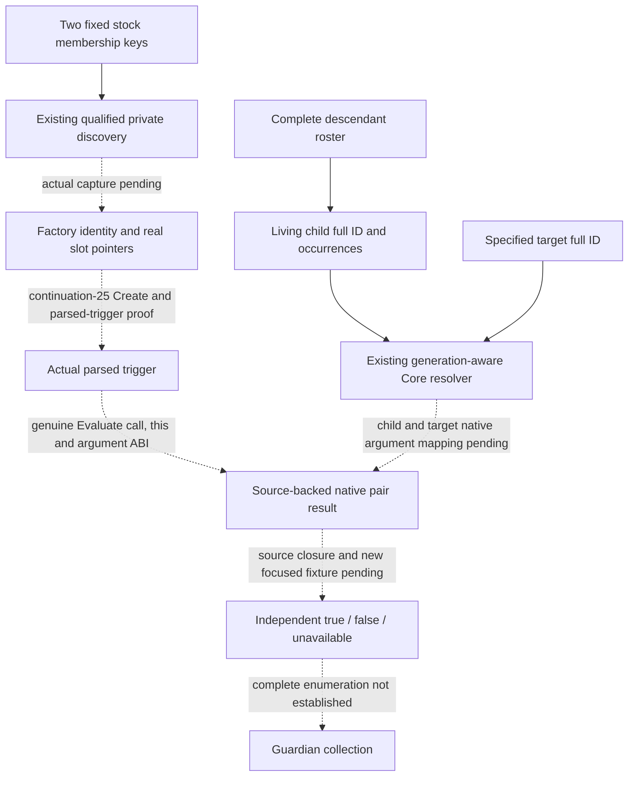

# Guardian pair Evaluate: actual input handoff (1.20.0.4)

2026-10-10. Native71 continuation-26 owns the specified-pair evaluator leaf.
This is a source dependency record; no Evaluate slot or callable ABI has yet
been established. The existing actual4 freeze is CK3 1.20.0.4, Steam build
25734779, executable SHA-256
`98702F88A547CDE2EAF29A85F93B85F68EE4CF8148336A4F7AFAEB75319DD518`.
The factory/parsed-trigger lane belongs to continuation-25 and the finite
existing private discovery handoff to continuation-24. Runtime01 alone owns
Game, SDK and the listener. This worker performs no executable capture or
old name/section scan.

## Reused source and exact current boundary

The [named Character binding ledger](guardian-relation-character-binding-12004.md)
records actual66-72 source and Native61's offline-qualified fixed-key discovery.
The two fixed keys are `has_relation_guardian` and `has_relation_ward`.
[GuardianFactoryTypedMetadata12004V1](../../ck3_autonomous_player/native_bridge/include/xar_bridge/ck3_12004_guardian_factory_metadata.hpp)
retains four virtual slots as unassigned source metadata. The discovery job's
`qualified=true` means before, execution and completion snapshots matched one
paused frame; it does not qualify a slot as Create or Evaluate and does not
observe guardian membership. Each key's stored name, NameID, mapID, recordID,
factory, VT, opaque descriptor, slot RVAs and RTTI association must remain
together even when the two keys share a native body.

The [ScriptedRelation provider ledger](scripted-relation-provider-12004.md)
separately leaves `GetRelation('guardian')`'s native provider and
`ScriptedRelation.HasRelationBetween` callback unclosed. Its tooltip macro
is a consumer of two Characters, not proof of native callback arguments.
Neither that branch nor the actual scripted-trigger branch supplies a
callable evaluator at this point. The opaque actual66 registrar's 152 bytes
do not identify either fixed guardian key or assign a virtual slot.

The stock education tree supplies the semantic direction to be checked:
child/ward owner toward guardian target for `has_relation_guardian`, and
guardian owner toward child/ward target for `has_relation_ward`. This is
authored input evidence; it is not a C++ ABI proof. Character+0x1B0's held
generic peer material is neither a guardian field nor a complete guardian
collection.

## Required finite source join

After an actual qualified factory hit, continuation-25 closes the actual
Create slot, payload/parser inputs, returned parsed-trigger object and its
lifetime. Continuation-26 then requires the real call instruction and body
that establish all of the following together:

| Input | Required actual evidence |
| --- | --- |
| Evaluator owner | Exact parsed-trigger type and VT/slot or direct call target, selected from actual creation/call evidence. A factory slot index by itself is insufficient. |
| `this` | The object or subobject passed at the real call, including any adjustment from the created parsed trigger. |
| Child and target | Actual argument registers/stack or scope resolver path to both generation-valid Character objects; child/target direction must follow the instructions, independently of the stock expression. |
| Result | Native return width, true/false branch and any invalid-scope or unavailable branch. A failure to create/resolve is not native false. |
| Dependencies | Each direct callee or loaded relation definition whose semantics the pair result actually uses, with its exact-build proof and current owner. Shared guardian/ward bodies are captured once by `(build, RVA)` while both key associations remain. |
| Lifetime and context | App-thread/paused owning context, parsed payload ownership and disposal, and whether evaluation reads cached state or invokes production/mutation. |

Only a source-backed read-only call is eligible for this leaf. Actual
creation semantics, unresolved scope lifetime or a mutating evaluator cannot
be replaced with a made-up function typedef. Root may acquire one necessary
finite body selected by the genuine pointer and held actual4 runtime-function
metadata. This record requests no function RVA, byte count or vtable index
before that evidence exists.

The runtime-function extent inventory is already held at
`Z:/ck3_mod_rewrite_process_assets/g2-background-20261007/upstream-build-migration/function-match-core/NEW-RUNTIME-FUNCTIONS.json`
(`ck3.runtime-function-table.v1`, fields `begin_rva`, `end_rva_exclusive`,
`unwind_rva`). Continuation-25 owns the exact containing-row join and shared
factory-body request after real slot RVAs arrive. This evaluator worker reuses
that selected packet; it does not reparse the PE or request the same body.
Parsed-trigger call evidence must still select any later Evaluate-specific
body. A source-compatibility check of the current SDK writer, or a structural
selector test, provides no native argument or membership credit.

## Existing child identity and future pair result

[ReadCurrentFirstHeirChildInputsV1](../../ck3_autonomous_player/native_bridge/include/xar_bridge/ck3_12004_first_heir_child_inputs.hpp)
already derives distinct living actual children from the complete descendant
occurrence roster and retains every `occurrence_indices` association.
[ResolveCoreCharacter](../../ck3_autonomous_player/native_bridge/src/ck3_12004_abi_profile.cpp)
uses the low 24-bit storage index but accepts the object only when its full
generation ID matches. These are reusable child/target identity mechanics;
they do not create guardian evidence. Child age/sex, childhood traits, focus
and education-point inputs remain independent of a future pair result.

Once the native chain is closed, the owned
`guardian_pair_evaluate_inputs_12004.hpp/.cpp` will accept a specified actual
child row and independently resolved target full ID. It must retain the
child full ID and occurrence indices, target full ID, exact key/direction,
availability and a Boolean only when the native evaluator actually returns
one. No alternate child is chosen for an empty roster, and no target is
invented from candidates or a window subject. Per-pair false means only that
the proved relation test returned false for those two objects. It does not
mean no guardian, a complete guardian collection or the education effect's
randomly selected educator.

One new focused fixture is justified after source closure. It must invoke
the production leaf and exercise asymmetric guardian/ward arguments,
generation decoys, unavailable independently from legitimate false,
preserved duplicate occurrence indices and multiple actual child rows.
It will not repeat Native61's lookup fixture, whole build, old FIRST or audit.
Until the call chain exists, no permanent-null observer, guessed callback,
empty source/test scaffold or gameplay field is added.

At this handoff, actual factory capture, Create closure, Evaluate closure,
new focused validation and pair membership are **NOTRUN/unclosed**. Guardian,
educator and education readiness remain false. New production-live, FIRST,
registered-consumer, natural-succession and G2 credit are zero. This record
does not mark the observation capability complete; its next construction
input is the actual two-key discovery followed by the real parsed-trigger
call chain.
