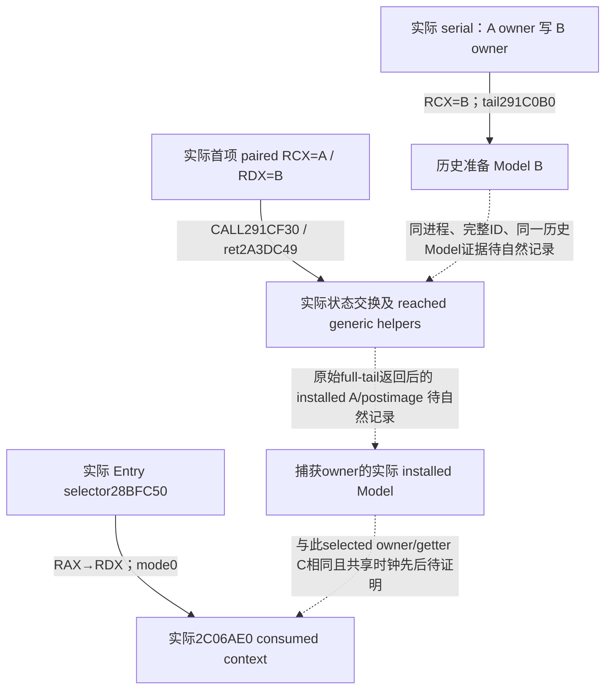

# Native71：prepared Model 到 installed Model 的实际交换关联（1.20.0.4）

本专题闭合 actual4 原生串行绑定、配对交换实参及全交换函数的调用边界，并新增一个只复制身份事实的独占叶子候选。它尚未取得自然事件中的 prepared B、交换 B、installed A 与实际 Entry 消费的同一条完整证据链。当前不计入 FullPerson、Entry-ready、实机或 G2 能力完成。

固定输入是 CK3 1.20.0.4 / Steam build `25734779`，复用 Root 已固定 EXE SHA-256 `98702F88A547CDE2EAF29A85F93B85F68EE4CF8148336A4F7AFAEB75319DD518`。本工作包没有读取 EXE、重新计算全文件 hash、扫描 PE 或调用游戏。Root 初始 literal source 为 805B、3 次有限读取，后补 reached caller suffix 12B；合计 817B、4 次有限读取。metadata 的同 ordinal/extent 只用于定位，结论来自 actual 指令。

## actual source 结论

源码证明先冻结在外置 [SOURCE-PROOF.json](D:/codex-ck3-background-spill/native71-continuation-20261010/continuation-13/SOURCE-PROOF.json)，再编写叶子候选。后补后缀证据见 [SOURCE-PROOF-SUFFIX-ADDENDUM.json](D:/codex-ck3-background-spill/native71-continuation-20261010/continuation-13/SOURCE-PROOF-SUFFIX-ADDENDUM.json)，只消除旧 loop pending，不改已 GREEN 代码。沿用 [Native65 Model 关联](battle-person-preparation-model-association-12004.md) 和 [历史 Model 阶段](battle-person-historical-model-stage-12004.md)：`C=Model+0x10`，owner 是 `[Model+8]`，历史 aggregate PC 是 `Model+0x78`；keys 子块在 `Model+0x78`，signed64 values 子块在 `Model+0xE0`。这些字段用途复用已资格化合同，没有重读 PC 数值 kernel。

| Root actual literal | 指令与结论 | 证明范围 |
|---|---|---|
| `serial-binding-2A43BC0.json`，182B | `2A43BE7 RDI=[pair+8]` 得配对 B；`2A43BF8` 得旧 A；`2A43BFC` 读 A owner，`2A43C00` 写 B owner；`2A43C5E RCX=B`，`2A43C71 JMP291C0B0` | 此 B 是准备函数实际 receiver。owner 相同不证明 A/B 指针相同，也不自行证明后来交换的 B 就是这个历史 B。 |
| `paired-caller-prefix-2A3DB30.json`，281B，加 `paired-caller-suffix-2A3DC49.json`，12B | `2A3DC30` 读 S+90，`2A3DC37 RCX=A[index]`；`2A3DC3B` 读 S+70，`2A3DC3F RDX=[pairbase+pairoffset+8]` 得 B；`2A3DC44 CALL291CF30`，return `2A3DC49`；`2A3DC49 RBX++`、`2A3DC4C R14+=10`、`2A3DC50 CMP RBX,RDI`、`2A3DC53 JL2A3DC30` | 所有实际循环项的 A 索引步长 1、B pair 步长 16B 与同一 callsite 闭合；旧 pending 已消除，没有按 old-build delta 补写。 |
| `state-exchange-291CF30.json`，342B / 79 instructions | `291CF44 RSI=B`，`291CF47 RBP=A`；`291CF4A..56` 交换 owner+8，`291CF5A..7A` 交换 pending byte+2F4，`291D043..58` 交换 allocator+240 | 原函数是状态交换。全体直接 stores 中没有 Character carrier+258 安装写入；不把这一 body 内的缺席外推到 reached generic callees。 |
| 同一 exchange | `291D003 RDX=B+10`，`291D007 RCX=A+10`，`291D00B CALL2439670`，return `291D010` | +10 weighted block 的实际 target/实参，callee postimage 由 continuation-29 独占。 |
| 同一 exchange | `291D010 RDX=B+78`，`291D014 RCX=A+78`，`291D018 CALL2305F30`，return `291D01D` | key-storage block target/实参，postimage 由 continuation-30 独占。 |
| 同一 exchange | `291D01D RDX=B+E0`，`291D024 RCX=A+E0`，`291D02B CALL23060E0`，return `291D030` | values-storage block target/实参，postimage 由 continuation-31 独占。 |
| 同一 exchange | `291D05F RDX=B+248`，`291D066 RCX=A+248`；恢复原 frame 后 `291D081 JMP2922A10` | owned-container tail target/实参，postimage 由 continuation-32 独占。Model+248 与 Character carrier+258 是不同对象，不能按邻近 offset 建关联。 |

实际 Entry prefix 复用 `D:/codex-ck3-background-spill/native65-knight-context-association/actual-prefix01/SOURCE-02C06D10.json`：`2C06D26 CALL28BFC50`，return `2C06D2B`；返回 RAX 在 `2C06D2B` 成为 RDX，`2C06D33 R8D=0`，`2C06D36 CALL2C06AE0`，return `2C06D3B`。这证明真正 selected Character 被交给 mode0 reader。它本身不证明历史准备 B 的状态已进入 installed A，也不证明交换先于这个确切 Entry 调用。

## 独占身份快照叶子

候选文件是 [header](../../ck3_autonomous_player/native_bridge/include/xar_bridge/person_installed_transfer_stage_12004.hpp)、[implementation](../../ck3_autonomous_player/native_bridge/src/person_installed_transfer_stage_12004.cpp) 和 [focused test](../../ck3_autonomous_player/native_bridge/tests/person_installed_transfer_stage_12004_test.cpp)。交付时位于 continuation-13 的 external `candidate/` 镜像，由 Root 审阅、验证并采用；此工作包没有改共享 CMake、driver、service、serializer、报告或 Git。

`InvokePersonInstalledTransferStage12004` 只对实际 caller return `2A3DC49` 做快照。它将原始 A/B 参数原样交给原函数一次，保留原始 RAX bits；其他 caller 仍原样调用一次，不读取身份。没有 getter、preparation、容器 native 重调用或 PC 算术 replay。

before 固定原始 B 的 owner 为 immutable owner；after 仍读取这个 owner，避免 B owner 在交换后变化而偷换观测主体。Root 提供已拥有的 Native65 historical capture reader，叶子复制其 preparation sequence、capture/ completion thread、character、Model、context、owner 指针与完整 CharacterID，并分别记录实际 preparation Model==B、owner/fullID 相等事实。它不把 owner 相同升级为 Model 相同。

安装身份沿用已资格化 getter 关联，只读该 immutable owner 的 Character+1B0 carrier、carrier+258 installed Model 及其 owner+8。只有实际 owner 指针相同才记录候选 inline `installed Model+10`；已知 null 与 unread 分开，null 不形成有效 A/B identity。叶子不声称自己观测到了安装指令，不把 `Model+248` 推断为 carrier。

Root 提供一个共享 natural-event clock 的 identity、sequence 和 thread。叶子仅在 clock 与 thread 都实际相同时声明自己的 original completion 晚于 before；Native65 capture sequence 只保留作历史记录标识，不与这个 clock 的 sequence 比较。Root 独占 hook、journal 及 final Entry join。`original_returned` 只在整个 original 291CF30（含 tail2922A10）返回之后记录；它不代替 generic helper 的 postimage 证明。

## 验证与下一入口

中央验证由 continuation-10 执行，生产 object 首次通过 MSVC `/W4 /WX` 编译；fixture 的 `optional<uint32_t> == int` 曾触发 C4389，初次失败日志原样保留。只将 fixture 比较字面量改为明确的 `uint32_t` / `uintptr_t`，复用生产 object 后，必要的 fixture 重编及唯一一次运行均 exit0，输出 `GREEN: installed-transfer identity compound, synthetic memory only`。实际回执是 [central RESULT](D:/codex-ck3-background-spill/native71-continuation-20261010/continuation-13/root-first/fixture-retry01/RESULT.json)，最终 test SHA-256 为 `25aa3cf49871a1cdd839874f2a45c02c202512786ce5e437406c2cceb26dd909`。

这个 compound case 检查 positive transferred identities、直接 owner 交换后仍固定原始 B owner、同 owner 但错 Model、部分 unread、已知 null carrier、generation/clock mismatch 和非目标 caller，覆盖原函数一次、参数与 raw return bits、不可变 lineage copy。它只使用 synthetic memory，没有游戏调用或 generic PC 交换模拟，不能计作自然 transfer、Entry 写回或实机证据。中央回执另明确 EXE 永久排除登记尚为 admin-required，Root 负责补齐；fixture GREEN 不等于该登记已完成。

当前 `research-plan-source-v3.json` 与生成的 `research-graph-source-v3.md` 加入实际 loop suffix；旧 v2 保存原检查时的状态。计划检查仅校验文件 hash 和记录结构，不证明作者声明的 native semantics，不执行游戏。

最小下一入口已写成 [HOOK-WIRING-RECIPE.md](D:/codex-ck3-background-spill/native71-continuation-20261010/continuation-13/HOOK-WIRING-RECIPE.md)：actual target291CF30，held首15B anchor、29B trampoline回291CF3F、原call return2A3DC49、Native65 owned record adapter 与明确新增的共享 clock/publisher binding。当前 KnightStatConsumption.event.sequence 是 wrapper 返回后的私有域；Root 须将同一新 shared clock 采样接到 transfer completion 和 actual consumed getter original 调用之前，再 join，不能比较这些旧独立 counters。

Root 接线后，在同一进程记录 original RDX B 与已完成 Native65 preparation Model 的实际相等，original 完整返回后 immutable owner 的 installed Model==原始 RCX A，完整 CharacterID/owner 一致，然后把记录与实际 selected Entry Character、getter C=A+10 及共享 clock/thread 的先后 join。29–32 的实际 callee stores/postimages仍由各 owner 源封；未知项保持 unfinished，不能用 current census 或 synthetic fixture 回填历史身份/时序。recipe 不是已安装 producer 或实机完成的事实。

外置记录按统一 storage policy 1.0.0 的 record 类保留并在 2027-04-08 复核；derived helper 在 2026-10-12 复核。继续保留理由是活跃 source/候选采用/未闭合自然事件关联；没有永久保留或重复存储完整 EXE 的声明。
