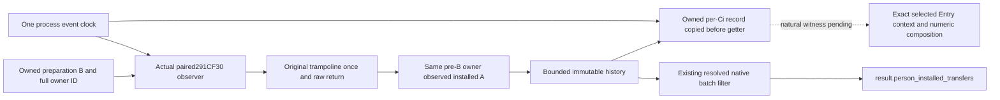

# Native71 actual4 installed transfer capture

This implementation supplies a cold-installed observer for the original paired state exchange. It copies the owned historical preparation record before the original call, preserves the original once and its raw return bits, then retains the immutable pre-transfer B owner's installed Model identity after the complete original return. It also supplies the process clock consumed by the per-Ci Entry getter observer.

The admitted image is CK3 1.20.0.4, Steam build 25734779, executable SHA-256 `98702F88A547CDE2EAF29A85F93B85F68EE4CF8148336A4F7AFAEB75319DD518`. The held 817-byte source and the qualified preparation/Entry source are reused. This continuation performs no executable read, full hash, PE scan, current census or PC kernel reread.

## Source contract

The previous [identity leaf topic](native71-person-installed-transfer-12004.md) and its external `continuation-13/SOURCE-PROOF.json`, `SOURCE-PROOF-SUFFIX-ADDENDUM.json` and checked `research-plan-source-v3.json` remain the native source contract. They were frozen before the identity leaf was authored. The new capture implementation does not alter that contract or repeat its successful fixture.

The literal paired caller loads A[i] into RCX and B[16*i+8] into RDX, executes `2A3DC44 -> 291CF30`, and returns at `2A3DC49`. Its reached 12-byte suffix increments the A index and B stride before the same loop backedge. Only this exact caller return is credited with an observed paired stage; other callers still invoke the original once.

The hook target is `module_base+291CF30`. Its held first 15 bytes are `48895C241048896C24184889742420`, three complete stack-relative MOV instructions with no relative relocation. The allocated 29-byte trampoline contains these 15 bytes followed by a 14-byte absolute jump to `module_base+291CF3F`. The entry patch is a 14-byte absolute jump to the observer plus one NOP.

The full native body exchanges owner+8, pending+2F4 and allocator+240 directly. It reaches the separately owned +10, +78, +E0 and +248 storage helpers; its restored-frame tail returns through the final native helper. Neither the body nor the observer installs a Character carrier pointer. The observer only reads Character+1B0, carrier+258 and the referenced Model owner through the existing identity leaf. Model+258 used by a container allocator is a different object address from carrier+258.

## Production interface and ownership

The new source files are `person_natural_lineage_clock_12004.hpp/.cpp`, `person_installed_transfer_capture_12004.hpp/.cpp`, and `person_installed_transfer_capture_12004_serializer.cpp`. Their sole new connected fixture is `person_installed_transfer_capture_12004_test.cpp`. The old `person_installed_transfer_stage_12004.hpp/.cpp` and the existing Native65 owned six-stage history producer are required dependencies.

`BindPersonInstalledTransferCaptureImage12004(base, sha)` returns a fault-bounded reader, the existing owned preparation-history adapter and the shared clock for the admitted image only. It performs no getter, preparation helper or native container call. `InstallPersonInstalledTransferCapture12004(state, environment, sha)` accepts only a proved suspended primary-thread boundary. Production rejects target overrides and uses the shared clock regardless of caller-supplied event callbacks. Test-only memory-operation overrides are kept in the explicitly marked offline fixture environment.

`UninstallPersonInstalledTransferCapture12004(state, suspended_proven)` requires the same actual quiescent boundary and no in-flight original callback. A live Stop or DllMain does not prove that boundary. The bridge must retain the installed state, trampoline and observer code through process exit when quiescence is absent. Failed flush/protection rollback retains referenced backing; failed free retains its allocation pointer for explicit later quiescent disposal. Immutable history and the shared clock survive successful uninstallation.

Continuation55 alone owns bridge startup/query edits against Root's adopted bridge baseline. The macro is `XAR_BRIDGE_ENABLE_12004_PERSON_INSTALLED_TRANSFER_CAPTURE`, option default ON and runtime PUBLIC definition 1. Continuation57b alone owns the current-adopted per-Ci getter increment, and continuation60/Root own build aggregation. The three provider TUs are registered once unconditionally because the existing knight TU calls the shared clock and capture/serializer APIs even when the installer feature option is OFF. This continuation edits only its external new files. R0088 remains loaded without replacement.

## One clock and owned per-Ci history

`NextPersonNaturalLineageEvent12004()` returns `{clock_identity, sequence, thread_id}`. One process atomic supplies monotonically increasing sequence values, and GetCurrentThreadId supplies the actual caller thread. Installation, uninstallation and retention do not reset it. The Native65 capture sequence identifies an immutable preparation record; the retained record ordinal and the existing Entry writer sequence remain separate domains.

The transfer observer copies the preparation descriptor and pre-B owner before calling the original, reads the same immutable owner after return, then publishes the completed stage into a bounded 128-record ring. Auxiliary retention failure cannot change the original return bits. Its default preparation adapter reads the existing owned capture, preserves `capture_complete`, and never invokes Complete or upgrades an incomplete historical capture.

At each actual Ci getter, continuation57b should copy `ReadPersonInstalledTransferCaptureForOwner12004(actual_character_pointer, full_id)` before the original getter. It then samples this clock immediately before the getter original and after return, retaining the optional record and both events in the same consumed-Ci observation. The later query history cannot substitute for this per-Ci copied record. A consumer can order events only when the nonzero clock and actual thread match, and completed transfer sequence is strictly below getter begin sequence.

## Filtered wire on the existing native query

The paused AppThread's existing BattleTerminalTransition mailbox resolves `request.character_ids` through `CollectPersonSixStageQuery12004`, then rechecks the completion/current/previous snapshot equality. The resulting `PersonSixStageQuery12004DTO` contains the snapshot revision, date, and each already resolved Character pointer/full ID.

`CollectPersonInstalledTransferCaptureForOwners12004(captures)` filters immutable history by those exact already resolved pointer/full-ID pairs. It copies the same query revision/date. Empty or unresolved requested receivers produce no unfiltered fallback. It performs no additional Character resolution or live Model lookup.

Continuation55 embeds `SerializePersonInstalledTransferCapture12004(filtered)` only under `result.person_installed_transfers` inside the validated private `BattleTerminalTransitionWithPersonSixStagesResultFrame` wrapper. The public terminal serializer and mailbox signatures remain unchanged. The standalone schema is `xar.ck3.person-installed-transfer-capture-12004-v1`; addresses are hexadecimal strings, missing values are null, and record ordinals are explicitly separate from event clocks.

## Qualification and validation

The positive level is identity/owner/preparation-descriptor association. A transferred B state observed at installed A+10 does not satisfy the existing direct historical B+10 context seam. No whole post-PC payload is copied by this observer, and no generic postimage or numeric composition is inferred from a reached CALL or owner equality. `generic_postimages_complete`, `transfer_to_entry_association_proven`, `full_person_ready` and `entry_ready` remain false in its wire.

The source mapping and central focused recipe are external under `D:/codex-ck3-background-spill/native71-continuation-20261010/continuation-13b/`. Central continuation10 compiled the new three production TUs and fixture once with MSVC `/W4 /WX`; compile exit0 and the sole new fixture process invocation exit0 are recorded in `focused01/RESULT.json`. The new compound exercises the actual installed patch/trampoline and synthetic CALL at the held RVA, owned pre-B/after-A copy, same clock, filtered wire, bounded retention and quiescent lifecycle. It uses two committed synthetic code pages and a stub only for the existing owned-history lookup; it does not load an executable or call Game. The already GREEN identity leaf production object was reused without recompilation or fixture replay. No qualified source changed after that successful run. Defender's actual readback remained `admin_required_for_verified_readback`; registration is pending with Root and was not upgraded from an ACK.

No actual natural transfer/Entry witness or live G2 credit is asserted here. The next actual entrance is a newly aggregated cold bridge startup followed by a naturally reached paired transfer and the corresponding per-Ci getter observation, owned by Root. Separate storage observers29-32 can provide copied before/post payload facts on this same original boundary; those facts require their own explicit composition contract before numeric readiness changes.
