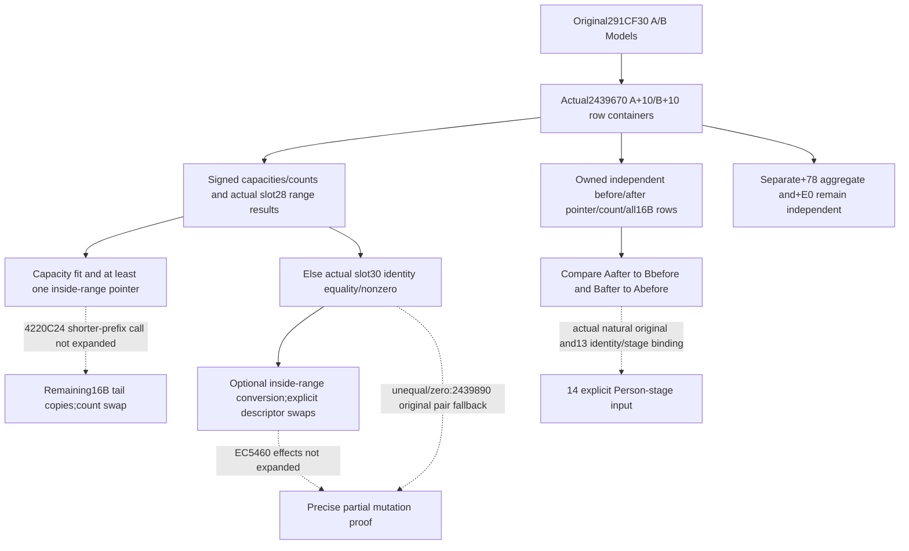

# Person block+10 transfer on actual1.20.0.4

2026-10-10 / ISO2026-W41. The complete actual2439670 source closes the input layout for an independent row-state observer. Its complete mutation implementation remains **precise partial** because reached library, fallback and virtual method bodies are not all expanded. There is no whole-PC or full-Person claim.

Exact build is CK3 **1.20.0.4**, Steam **25734779**, inherited executable SHA-256 `98702F88A547CDE2EAF29A85F93B85F68EE4CF8148336A4F7AFAEB75319DD518`. Root supplied the exact541B [2439670,243988D) cache, span SHA-256 `b3f1f67697f25df359cc1efba0b6bf210d130c8ea23bc63c9742df9133e5e129`, at09:09:07.946701 UTC. Worker verified cached JSON/bin identity only, without reading EXE, sections, game or SDK. Z source remains read-only.

## Actual receiver and element size

The complete342B original291CF30 caller preserves RSI=B and RBP=A, then passes RDX=B+10 and RCX=A+10 at291D003/291D007 to CALL291D00B2439670, returning291D010. In the callee RSI/ RDI preserve these **block** pointers. Pointer0, signed DWORDcapacity8 and signed DWORDcountC are read. Atblock+18 sits the receiver of virtual methods atslot28 andslot30; its concrete class, targets and total object size are not inferred.

Both runtime range bounds and physical row-copy loops use `count<<4` and16B MOVUPS. This is the root classified **row container**, not a U16-key PC. Existing `CopyClassifiedPietyStage(context)` reads this same context pointer0/countC with16B rows, and `CopyClassifiedPietyRow` copies the PC pointer atrow0 and signed Q64 scale atrow8. The observer retains raw16B rows without deduplication, key sorting, PC dereference or interpretation of delegated writes. The completed numerical aggregate is a separate PC atcontext+68=Model+78; caller291D018 separately calls2305F30 on that subobject.

## Source-defined conditional paths

Virtualslot28 is called with RCX=block+18 and output addresses for a pointer and signed size. The caller checks whether the original data pointer lies in the returned half-open range `[range_begin,range_begin+16*size)`. If A's pointer lies inside, it skips the initial B range check. Otherwise B's corresponding range is checked. The resulting predicate is false when at least one lies inside. No unknown method result is fabricated.

The in-place path is selected only when signed A.capacity>=B.count, B.capacity>=A.count and that range predicate is false. It chooses the shorter count (A is shorter on equality), calls4220C24 with shorter_begin/shorter_end/longer_begin, copies each16B excess row from longer's tail to shorter's tail, then swaps count DWORDs at243977B/243977E. The direct body does not swap the pointers or capacities on this path. The4220C24 call's implementation is not held, so the complete prefix swap is not asserted from its operands alone.

Otherwise, slot30 is called on B+18 and A+18. Unequal returned identities, or a zero A identity on the following repeated call, delegate the original A/B pair to2439890 at2439873. With equal nonzero identities, each pointer is checked again against its slot28 range. An inside pointer invokes EC5460 with RCX=that original block and EDX=signed max(capacity,5). After these conditional conversions, explicit stores243984D/2439853 swap pointer0;2439859/243985F swap countC;2439865/2439868 swap capacity8. These descriptor stores are proven; conversion effects and fallback are not guessed.

The true reached edges and metadata bounds are in SOURCE-SCOPE.json. EC5460 has exact26B extent[EC5460,EC547A);2439890 has exact227B extent[2439890,2439973).4220C24 has no row in the retained runtime-function table. Root has been given these source-defined continuation targets; no worker executable read or automatic recursion is performed.

## Minimal leaf and observation meaning

The independent leaf copies actualModel+10's signed count, optional raw pointer/capacity, and exactly count*16B row material through Root's guarded-copy callback. Zero count needs no row pointer or payload. A failed optional capacity copy preserves available rows; a failed demanded positive-count row copy remains partial. Root supplies an explicit row-copy budget, recorded as observer scope rather than a native capacity rule.

The comparison accepts immutable A/B before/after snapshots only when the original block addresses match. It reports two directional raw-row equalities and their conjunction. A separate optional descriptor comparison checks pointer/capacity/count swaps. It does not classify a source branch from descriptor equality, invoke2439670 or any delegate, reconstruct missing rows, prove causal original completion, dereference row PC pointers, or substitute a current Model for a captured historical one. The same13 original wrapper can take these snapshots before and after its one actual original call.13 owns owner/fullID/thread/extent;14 owns numerical-stage admission.

The focused fixture is one new compound of authored memory snapshots. It validates owned copies and equality behavior, not native callee execution or a live transfer. Root owns compilation, shared hook/core/CMake/serializer/Service/driver integration and future actual observation. No old qualification is replayed. Full-PC, full-Person, full-Entry and live credit remain false.

Final research input is research-plan-source-closed.json and its generated render. The initial graph, request and CALLEE-SOURCE-PENDING.json remain truthful records of the earlier missing body. Source identity and declarations are checked separately from semantic conclusions. Storage policy1.0.0 and the Root manual parallel-leaf reservation cover this small packet; no heavy write or separate admission is claimed.
