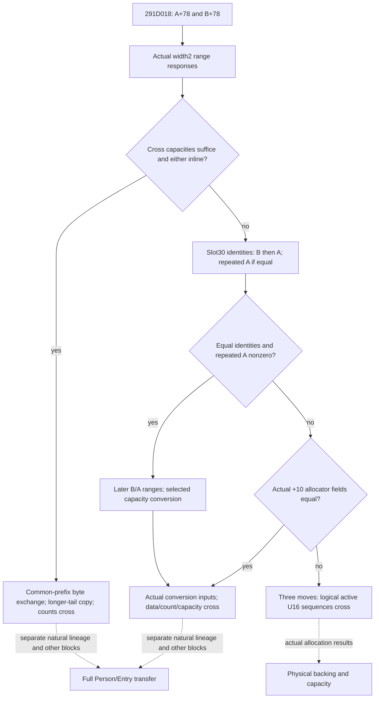

# Native71 Person transfer: actual `+78` key storage

Exact CK3 **1.20.0.4**, Steam build **25734779**, retained image SHA-256 `98702F88A547CDE2EAF29A85F93B85F68EE4CF8148336A4F7AFAEB75319DD518`. This leaf provides conditional source postimages and immutable reads of the actual key storage. Root integrates it into the existing original-call observation boundary; it invokes no native helper or allocator and performs no native memory write.

The actual caller `291CF30` saves Model A in RBP and B in RSI. `291D010 LEA RDX,[RSI+78]`, `291D014 LEA RCX,[RBP+78]`, then `291D018 CALL2305F30` pass the two key storage subobjects; return is `291D01D`. The qualified [Native65 association](battle-person-preparation-model-association-12004.md) establishes preparation C=Model+10 and aggregate PC=C+68=Model+78. PC reads U16 keys through PC+0 and the separately exchanged numerical storage through PC+68=Model+E0. This leaf owns the key block.

Root supplied actual `[2305F30,23060DE)`, **430 bytes**, and its three direct callee extents. Held bytes establish data pointer `+0`, signed capacity `+8`, signed count `+C`, and allocator receiver `+18`. `MOVSXD` and `LEA base+count*2` establish the **2-byte element stride**. Allocator field `+10`, used by the conversion/move callees, is distinct from the virtual receiver at `+18` and from the raw identity returned by slot `+30`.

Slot `+28` receives RCX=storage+18, RDX=out-base and R8=out-signed-count. The literal unsigned range is `base <= data < base + 2*sign_extend(count)`; its endpoint is excluded. Initial A is tested first and initial B's callback is skipped when A is inline. If both cross capacities suffice and either storage is inline, `17140D0` swaps the common active bytes through `4220C24`, copies the longer tail through the retained `4226860` byte-copy contract, then swaps counts. Each side keeps its data pointer and capacity. Actual `4220C24` closes at `RET4220CE6`, after its AVX32, SSE16, QWORD8 and byte cross stores.

Otherwise slot `+30` is called for B and A. Equal results demand a separate third A call, whose result must be nonzero. The compatible path then obtains separate later range responses for B and A, in that order. Every inline storage calls `11E10D0` with requested capacity `signed_max(current_capacity,33)`. Its split source closes at `RET11E1152`: requested<=capacity leaves the storage unchanged; growth calls allocator field `+10` slot `+8` with requested*2 bytes and R8D=2, copies the active bytes, releases old data through slot `+10` with R8D=2, and stores returned data/count/requested capacity. The subsequent direct stores exchange data, count and capacity at `230609E..23060B9`. Physical storage and allocator receivers keep their original owners. A call return does not supply the allocation-selected backing; the conditional evaluator requires its actual completed storage copy.

Different virtual identities, or zero from the repeated A call, select `1714F50`. Equal actual QWORD fields at storage `+10` directly exchange data/count/capacity. Different fields select three moves through `1713F40`: temporary<-shorter, shorter<-longer, longer<-temporary, with A chosen as shorter on equal counts. Move assignment closes at `RET17140C9`, uses retained byte copy, and clears the moved source count. This establishes cross exchange of active U16 sequences; the selected physical backing and capacity depend on the actual allocator results. The leaf returns logical counts and keys while leaving the unknown physical postimages partial.

`EvaluatePersonTransferBlock78Postimage12004` is a pure conditional reconstruction from per-call inputs. It preserves order, duplicates, zero and 65535; unknown key bytes stay unknown. It honors skipped callbacks, separately supplied repeated virtual responses, actual conversion copies, and the independent fallback `+10` fields. Logical payload readiness is separate from complete physical header readiness.

`CopyPersonTransferBlock78Keys12004` uses the supplied memory reader to copy actual pointer/capacity/count fields and exactly count*2 active key bytes into an immutable U16 vector. Known count zero is known empty; unread count, unread payload and negative count retain explicit reasons. `ComparePersonTransferBlock78Copies12004` compares supplied before-A/B and after-A/B copies. Header crossing and ordered key-payload crossing are separate optional results. Payload crossing can be observed when backing stays fixed. This interface fits continuation-13's one original `291CF30` invocation; it requires no new callee hook or replay. Continuation-13 owns owner/installed-pointer/temporal lineage and continuation-14 owns the PC consumer join. **FullPerson transfer, all-delegate physical completion and FullEntry remain false.**

Source records are `continuation-30/SOURCE-PROOF-FINAL.json` and `research-graph-final.md`, with exact packet paths and SHA-256 bindings. Worker acquisition used the shared finite mapper/cache in three bounded batches of **286, 373 and 64 bytes (723 total)**. No old image was read, full-image hash recomputed, PE section scanned, old FIRST replayed or game operated. The complete 195-byte common-prefix primitive was composed from disjoint retained spans in shared cache. The existing [key/value append source](battle-person-title-outer-append-12004.md) supplies the retained `4226860` byte-copy contract.

The independent fixture contains 15 cases for raw copied content, immutable before/after comparison, skipped/missing responses, exclusive range endpoint, direct/element/fallback stores, and actual conversion inputs. Its sole new compilation/invocation receipt is `continuation-30/leaf-proof01/RESULT.json`; qualification is limited to this standalone leaf and supplied inputs. Root owns source integration and any later original-call observation.
