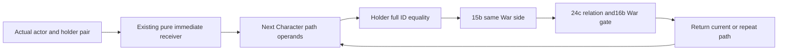

# Actual4 regular-core position actor selection

2026-10-10. The actual `2C092BB CALL 2C0FEC0` transfers the original actor
and a stack pair holding the original holder and actual optional War pointer.
Parent16b supplies literal null for that optional pointer. Return `2C092C0`
puts the selected Character identity into RBX before the parent checks its tag,
full ID, pair relation and active War. This topic covers the actor selector only.

Source was frozen before leaf code in `SOURCE-FREEZE.json`. The current-build
`.pdata` row ordinal152669 names `[2C0FEC0,2C1001B)`: one exact cache-first
347-byte read, complete decode, SHA-256
`b58769fda13d6f864c4a8d13f48468cb1ec212ea1020ce2b5121e46905748922`.
The held build is1.20.0.4/Steam25734779, executable pin
`98702F88A547CDE2EAF29A85F93B85F68EE4CF8148336A4F7AFAEB75319DD518`.
No old executable, full executable/hash, section, broad scan or callee source
was read. All selector stores save or restore ABI stack registers; the body
does not allocate or mutate game state.

| Actual source | Behavior | Candidate owner |
| --- | --- | --- |
| `2C0FEDB CALL28BFC50` | Select the initial immediate receiver; original actor equality goes to the Character fallback. | Existing raw `ReadReceiver`, exposed by11b without Model/Title/PC prerequisites. |
| `2C0FEF0..2C0FF23` | Load both current Character `1C0` and `1B8`; landed chain `1C0→1C0→28` admits next only for `Char` tag and non-sentinel full ID; rejection retains current. |40b guarded next selection. |
| `2C0FF25..2C0FF5E` | Employer full handle at link`C8`; actual Character registry`5C67568`, count`2C`, slots`20`, row16/pointer8, full ID`18`; native rejection chooses fallback`5C67570`. |40b guarded next selection. |
| `2C0FF65..2C0FF82` | Equal holder/current full IDs accept current; otherwise same War side may accept. |40b full IDs,15b pure`2C090D0`. |
| `2C0FF88..2C0FFEE` | Reload current and holder full IDs; reloaded equality skips the pair gate and continues rejection. Otherwise pair relation FullWarID`20`, active War and optional actual pointer identity may accept current. |40b ID reload,24c pure`28BC250`,16b shared War gate. |
| `2C0FFF0..2C10019` | Rejected stable path returns Character fallback; changed path repeats; accepted path returns current. |40b bounded loop. |

`ReadArmyPositionSelectedActor2C0FEC012004` consumes the same guarded
`ArmyRegularCoreReadonlyAccess12004` as34b and reuses its per-frame read budget.
It returns an optional selected identity, path occurrence count and independent
unavailable reason. A demanded read failure or exhausted occurrence bound
returns unknown. A copied null fallback remains a literal null identity;
the parent decides whether its demanded Character fields can be read.
No native getter or current proxy is called to recover missing operands.

The candidate consists of the header, source and one exported new-phase case
`RunArmyPositionSelectedActorNaturalFocus12004`, with no main. Its literal
synthetic memory covers initial original equality with null fallback and no
Model/Title/PC/current-context getter prerequisites; equal holder after next
reads; demanded-next failure; post-call ID reload failure; stable rejection; full-generation registry
advance; bounded traversal; and active pair War with the actual null filter.
33 owns the sole compound main,60 the CMake integration, and10 the new run.
This package is authored, not compiled or executed by40. No old calendar or
FIRST qualification is replayed; no invocation or actual selector return has
been observed.
