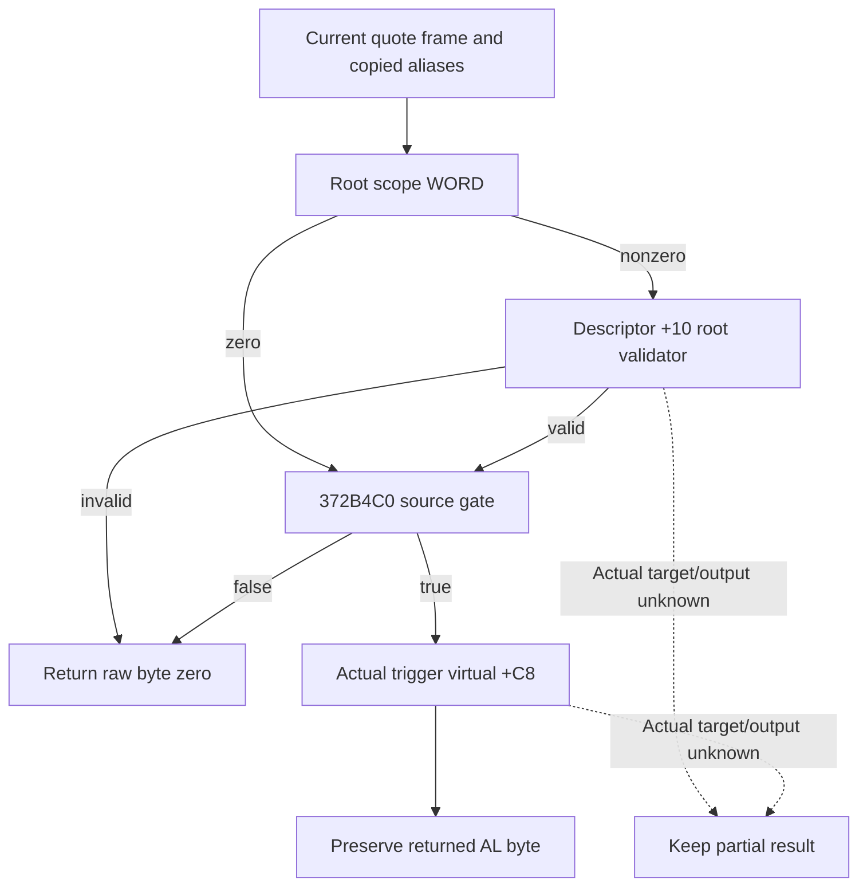

# Actual 1.20.0.4 negotiated auto-accept trigger condition

`372DF10` calls `372E000` at `372DF78` with the actual trigger in RCX,
the parent-owned internal aliases in RDX, and R8=0. The complete actual
`[372E000,372E42E)` body is 1070 bytes; its SHA-256 is
`7a13d2b725525692cc58e016f64fdf0984b278cea53acafc573fe68762e226f6`.
The retained parent packet and the exact source input pins were frozen before
candidate code. Cache-first acquisition needed one bounded actual4 read of
1070 bytes. No old executable, section scan, or active evaluator was used.

The wrapper reads the root scope pointer from aliases+0. The parent alias
shape is QWORD+0=original scope, +8=zero, +10=original scope,
+18=the parent support storage, and BYTE+20=the copied `5D1DADC` mode.
A source-derived alias shape preserves the unknown physical support address
and does not claim to be a captured callee-owned internal object.

For a nonzero root WORD, the wrapper selects a descriptor from the actual
scope table (stride 80, signed count at +C) or the native descriptor fallback
`54F5310`, then calls descriptor+10. The zero root kind bypasses this validator;
it does not itself prove acceptance. The helper at `372B4C0`, owned by 63c,
compares a virtual+58 preferred kind and a virtual+60 two-word mask. These
getter outputs remain unavailable when the actual getter producers are not
qualified. A fixture's copied condition values cannot become current outputs.

The success branch calls `[trigger.vtable+C8](trigger, internal aliases)`.
`372E353` and `372E404` preserve its raw 8-bit return, and the parent also
preserves AL. There is no normalization to 0/1 in these spans. The leaf
therefore keeps a possible returned byte separate from a derived nonzero
boolean, and exposes no input API for an invented virtual result.

The current leaf guard-copies the actual trigger identity, vtable, slots
+58/+60/+C8, and trigger+38 using the common 35c read access and query frame.
A successfully read zero pointer remains a known zero; an unavailable read
remains null. A slot address never supplies its callback's returned value.
The full frame, aliases, field-level gaps, and source-derived shape status are
preserved. No new clock or native-entry observation is introduced.

Conditional results may show the zero-kind bypass and a same-frame helper
condition. Final +C8 source is still unknown, so helper permission does not
produce acceptance. Null trigger selection belongs to 35c's separate scalar
branch and does not fabricate a wrapper return. The native getter, evaluator,
support-report, formatting, and instrumentation callbacks are never invoked.

The no-main focused fragment is intended for 35c's new connected current-cost
and CanSend compound, executed once by central 10. Validation is pending;
this package does not replay the preceding due-stage fixture.

Exact source records are `continuation-42c/SOURCE-FREEZE.json`,
`ACTUAL-372E000-SOURCE.json`, `SOURCE-WRAPPER-CLOSED.json`, and
`SOURCE-INTERFACE-PINS.json` in the external Native71 work package. Current
inputs are protected until 2026-10-17 for the connected adoption; the storage
policy requires review then and does not renew that protection automatically.
