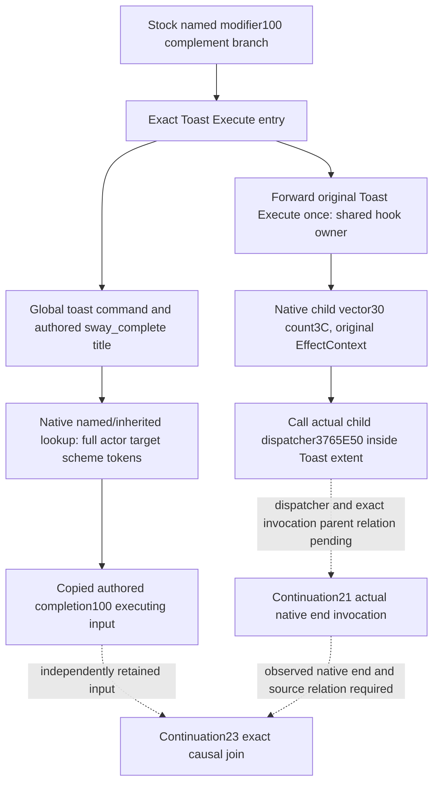

# Native71 Sway completion100 executing input on actual 1.20.0.4

Continuation-22 adds a distinct native source leaf for the authored
`send_interface_toast` / `title = sway_complete` branch. It closes an input
gap in the existing observer: good/bad `send_interface_message` records describe
hidden `.0001/.0002` phase inputs, while the invalidation reader recognizes
`sway_invalidated_title`. Neither identifies this completion toast.
The leaf currently has no installed shared hook, registered query or live
qualification; Root owns those integrations. It adds no Start/Stop or planner
choice and does not observe notification enqueue, material or actual native end.

The source proof was frozen before leaf edits at
[SOURCE-PROOF.json](D:/codex-ck3-background-spill/native71-continuation-20261010/continuation-22/SOURCE-PROOF.json).
The five-file `.2`/`.4` stock equality from the
[source-specific lifecycle research](sway-service-lifecycle-12004.md#2026-10-08-source-specific-endcause-research-not-a-new-qualification)
is reused without another comparison. The small frozen local excerpt records
the named `scheme_sway_opinion >= sway_max_value` complement branch in
`sway_end_effect`, with `sway_max_value`100. It sends the completion toast under
`scope:owner` and contains `scope:scheme = { end_scheme = yes }` within that
toast block. The numerical threshold is authored source meaning; the leaf
does not read total opinion or synthesize a threshold observation.

The actual4 native profile and ABI are reused from the
[existing source closure](sway-hidden-phase-execution-input-native-map-12004.md):
CK3 `1.20.0.4`, Steam build `25734779`, exact executable SHA-256
`98702F88A547CDE2EAF29A85F93B85F68EE4CF8148336A4F7AFAEB75319DD518`.
`BindSwayCompleteBranchImage12004` delegates to the admitted actual4 execution
binder. No native address or installer is added. The leaf selects the actual
Toast primary vptr `4837438`, whose slot22 `48374E8` points to original Execute
`2CC8470`; message/popup vptrs are separate. It resolves global command-domain0
key `send_interface_toast`, then plain scalar title `sway_complete` through
the admitted dynamic-description and single-description shapes. A scalar
delegate at+28 takes renderer precedence, so that shape cannot supply the
plain authored title stored at+30. A toast requires no good/bad message type.

The existing native inherited scope lookup `373B520` and actual4 named
identifier-table callbacks resolve `scheme`, `owner` and `target`. No legacy
identifier global or hand-bound Env32-only fallback is used. The current
played actor must match full root/owner CharacterID; target must carry native
character type4 and scheme type9. Two copied core frames hold the same living
actor and raw date. Natural effect execution may be unpaused.

`SwayCompleteBranchSource12004` copies the raw date, full actor/target/scheme
IDs and all four 16-byte root/owner/target/scheme tokens. It labels the input
`authored_sway_complete_100_source`, independently of hidden phase success or
failure. Only `executing_input_observed` becomes true.
`message_enqueue_observed`, `material_effect_observed` and
`native_terminal_state_observed` remain false. Root's shared recorder must
attach its actual observer session, sequence and query native frame; this leaf
does not invent an end-invocation key or retain engine pointers.

A further bounded cache review found a concrete child edge in the already
captured 4004-byte actual4 Toast body, without any new executable read.
At `2CC93B0` it loads the effect child vector+30; `2CC93B4` loads signed count+3C.
Its loop sets RDX to original EffectContext/R15 and RCX to each child at
`2CC93C1..2CC93C4`, calls `3765E50` at `2CC93C7`, then advances 8 bytes. This
occurs before Toast returns at `2CC93EE`. Thus authored nesting is accompanied
by native child calls within the original Toast Execute extent. That call
does not by itself prove the child dispatcher reaches a particular native end
original or identify the full end invocation. The cached source is
`D:/codex-ck3-background-spill/sway-hidden-phase-current04-mapping/root-capture01/NotificationExecute_legacy02_2CC8490-DETAIL.json`,
`new.instructions`, the complete `2CC8470..2CC9414` span. Continuation-27 owns
the finite dispatcher/child/end source closure; continuation-21 owns the
transparent end wrapper; continuation-23 owns consuming a proved relationship.

The concrete remaining causal gap is the actual current child-dispatch path
to an observed end original plus a copied exact relationship between this
source record and that invocation. Source nesting, a toast, full ID, phase
success, total/named opinion, row absence or nearby date alone supplies no such
relationship. Until the source and actual invocation relationship close,
`cause_relation` is null and retained status1 still means
`terminated_unattributed`.

The one new focused validation is prepared at
[run_focused_validation.py](D:/codex-ck3-background-spill/native71-continuation-20261010/continuation-22/run_focused_validation.py).
It compiles only the new leaf/test and their existing qualified dependencies,
then runs the new completion100 capture case once. Its explicitly synthetic
operands exercise the current profile, inherited lookup and Env32 precedence,
full copied token/generation identity, separate hidden-message input, native
scalar delegate precedence and the independent false end/material flags.
It does not replay an old FIRST or suite. Root controls the execution,
small build reservation and EXE registration. The execution receipt is
`continuation-22/focused01/RESULT.json`; until Root records the actual result,
this is prepared validation and not GREEN, live or gameplay credit.
