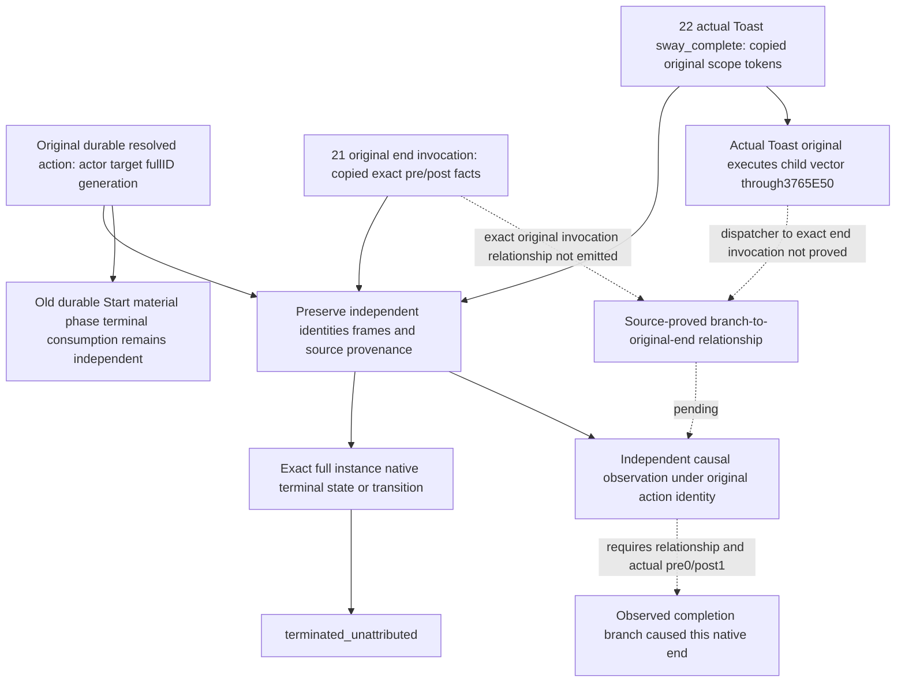

# Native71 Sway executing branch to native end: conditional consumer contract

2026-10-10. This contract is frozen before a consumer implementation. Actual
build is CK3 1.20.0.4 / Steam25734779 / executable SHA
`98702F88A547CDE2EAF29A85F93B85F68EE4CF8148336A4F7AFAEB75319DD518`.
The independent continuation-21 end-invocation and continuation-22 completion
branch leaves are its inputs. Neither currently supplies an admitted causal
relationship between its copied records. Current status is **source dependency
pending**, with no new terminal-cause qualification.

The existing [Service lifecycle](sway-service-lifecycle-12004.md),
[material consumer](sway-material-formal-consumer-12004.md),
[retained terminal reader](sway-terminal-retained-row-12004.md) and
[hidden executing input](sway-hidden-phase-source-input-12004.md) remain
qualified at their recorded layers. They already preserve hidden phase,
dedicated relation material, retained termination and normal/cold consumption.
They do not need another implementation or FIRST. This increment does not
modify their ledger, Driver, Service, public serializer or policy.

## Source facts and the unresolved relationship

Continuation-22's frozen
`D:/codex-ck3-background-spill/native71-continuation-20261010/continuation-22/SOURCE-PROOF.json`
records the actual authored block at local stock lines15540–15548:
`scope:owner` contains `send_interface_toast`, its exact scalar title is
`sway_complete`, and the same authored toast block contains
`scope:scheme { end_scheme=yes }`. Title, icon and child scope are children of
that authored block. The actual native relationship was then inspected in
the existing complete current Toast Execute, without another EXE capture:
its tail reads effect+30's child pointer vector and signed count+3C. At
`2CC93C1`, RDX is the original EffectContext retained in R15; at `2CC93C4`,
RCX is the child object; `2CC93C7` calls `3765E50`. The8B pointer loop
continues through `2CC93D5`, before the original returns at `2CC93EE`.
This proves child dispatch inside the original Toast extent. The reached
dispatcher-to-specific-end relationship and its producer association remain
unproved. The dedicated-modifier threshold is a stock predicate,
not a substitute for capturing its actual executing branch.

The exact4 Toast primary vptr `4837438` / Execute slot22 `48374E8` points to
`2CC8470`. Its entire4004B body and normalized current mapping are already
held in the hidden-phase source packet; they must be reused. The new executing
tuple is the actual Toast class, global command key `send_interface_toast`
and exact scalar title `sway_complete`. No message-type requirement is
invented. Root/owner/target/scheme tokens come from the qualified native
Env32/inherited24 lookup. A copied tuple supplies executing input only.

Continuation-21 copies the complete original end-invocation pre/post identity
and forwards the selected original exactly once. Its invocation ID identifies
that observation, not its cause. A captured `0 -> 1` full-instance transition
can prove an actual native end. A post status1 alone still means
`terminated_unattributed`; an already-terminal row is not a new transition.
Missing/reused storage and original return are separate facts.

## Conditional adapter input and output

The proposed independent Python leaf is
`ck3_autonomous_player/src/xar_autoplayer/sway_end_causal_consumer_12004.py`.
Its only responsibility is a pure copied-fact projection. It must issue no
native read or command and must not change the old durable ledger. Native
producer field names will be bound only after the21/22 interfaces are frozen;
this contract does not claim a serializer or caller exists.

The adapter receives the original resolved action and three independent
inputs:

| Input | Required concrete meaning |
| --- | --- |
| Original action | Verified original Start action ID, actor, target, full SchemeID and its generation; old consumption fields preserved independently |
|21 end invocation| Observer-session identity and original invocation ID, source class, copied pre and independently resolved post full IDs/generations/actor/target, exact-instance predicates, raw status/owner, native read success, original-forward-once fact and each available native frame/source stamp |
|22 branch| Observer-session identity and source sequence, exact current tuple, complete copied root/owner/target/scheme Token16s, actor/target/full SchemeID/generation, executing-input fact and each available native frame/source stamp |
|Native relationship| Reviewed exact4 source-contract identity plus a producer-emitted association between that exact22 branch record and that exact21 original invocation; owner-thread/session and native parent/child execution relationship preserved |

The relationship is **null/unadmitted** until actual native source proves its
mechanism. Equal fullID, equal date, adjacent independent sequences, matching
query revisions, selected notification, caller assertions, phase success,
named material, total opinion, ACK and return are never a replacement. Query
native revisions describe independent reads; the adapter preserves both and
does not advertise them as a native transaction or invent an execution
revision that the producer did not capture.

Only a reviewed relationship matching the current build/SHA, observer session,
exact source sequence and original invocation can permit attribution. Both
copied inputs must join the original actor/target/full ID/generation. The end
invocation must show the same exact instance active at pre-status0 and
terminated at independently observed post-status1, with successful original
forwarding once. A reused/missing post instance, failed post read, already1
pre-state or source execution without an actual terminal transition cannot
grant an end cause. No rule derives completed/failed/cancelled from the
end-effect false/true class.

Output preserves the action identity, all accepted copied input facts and their
individual provenance. It separates `native_terminal_state_observed`,
`native_terminal_transition_observed`, `causal_relationship_observed` and
`terminal_cause_observed`. With no admitted relationship the last two are
false and cause remains `unknown`, even with positive material or status1.
The old resolved Start, hidden-phase, named-material and retained-terminal
records and their following-turn timestamps are returned or referenced
unchanged; no source query rearms those consumers.

## Exact next source dependency and qualification

Reuse the now closed current Toast child-vector dispatch. Close the reached
`3765E50` dispatcher and exact end-effect dispatch to original invocation21,
including nested calls and restoration of the parent identity. If the Toast
Execute only constructs/queues a later effect instead, the actual later
consumer and lifetime association must be researched; an active Toast extent
would be insufficient. Only the needed reached callee/member atoms may be
requested from Root's shared cache. No new whole EXE, sibling implementation,
notification history or repeated qualification is required.

Once those inputs are concrete, author the leaf and one focused compound at
`ck3_autonomous_player/tests/unit/test_sway_end_causal_consumer_12004.py`.
It should consume the21/22 original copied producer outputs, bind a real
source-proved relationship, and verify independent actual pre/post full-ID
end facts. The same compound must retain an unattributed end for an unrelated
or missing relationship and preserve the old durable ledger. Explicit owned
native/backend inputs receive offline qualification only. It must not rerun
hiddenphase, material, retainedterminal or normal/cold GREENs. Until then the
consumer FIRST is NOTRUN and the missing native relationship remains visible.

External plan, storage check and dependency contract are under
`D:/codex-ck3-background-spill/native71-continuation-20261010/continuation-23/`.
The task uses small source/record writes only; the task-start snapshot found
the source volume below the2GiB safety floor, so it performs no heavy build,
source copy or binary output there. No game operation, SDK query, live end,
new gameplay day, SAVE or milestone credit is supplied by this contract.
