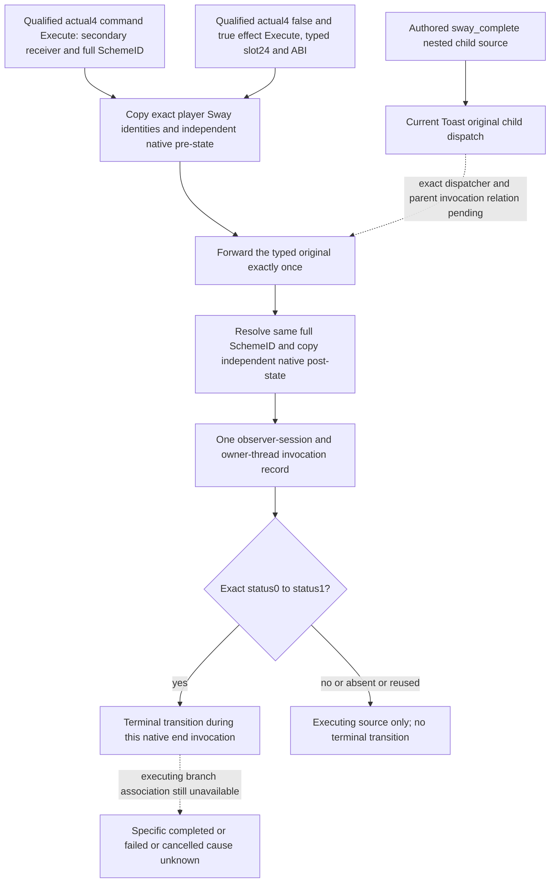

# Native71 Sway exact end invocation on CK3 1.20.0.4

2026-10-10. This new independent source package uses CK3 1.20.0.4,
Steam build25734779 and retained EXE SHA-256
`98702F88A547CDE2EAF29A85F93B85F68EE4CF8148336A4F7AFAEB75319DD518`.
The two effect entries now have **closed actual4 typed source and ABI**. The
new leaf and one focused owned-memory fixture are authored; Root validation
is pending. No installed observer, live specific end cause or G2 milestone is
qualified by this page.

The existing [Service lifecycle](sway-service-lifecycle-12004.md) records the
concrete gap: exact retained status1 is `terminated_unattributed`. The
[hidden phase source](sway-hidden-phase-source-input-12004.md) binder,
inherited lookup and offline connected FIRST are sealed and reused. Hidden
phase success, named opinion gain, current predicates, row absence and nearby
notifications do not identify the source that ended an instance.

## Closed source and the bounded acquisition

The [selected Stop source](sway-selected-stop-12004.md) already closes the
actual4 `CEndSchemeCommand`: primary vptr`476ED40`, secondary vptr`476EB80`,
secondary slot1 at`476EB88`, complete Execute`299C320..299C364`, and full
SchemeID at secondary-this+8/primary+20. Its consumed original ABI is
`void(const void* secondary_this)`. The original source is reused, with no
repeat mapping or old fixture replay. The source class denotes native command
execution; it does not identify the human sender of every command.

The old .2 [transparent source wrappers](ck3-1.20.0.2-sway-termination-source.md)
are locators for the two effect roles, not current-build native addresses.
The held .3/.4 runtime-function tables independently bound their leaf gap:

| Role | Old .3 locator | Actual4 candidate | Declared bytes |
| --- | --- | --- | ---: |
| True effect Execute | `2D11AF0..2D11B45` | `2D11AD0..2D11B25` |85 |
| False effect Execute | `2D11B50..2D11BA5` | `2D11B30..2D11B85` |85 |
| False effect builder | `2D10D90..2D10DF6` | `2D10D70..2D10DD6` |102 |

The effect leaves lie between the old .3 preceding runtime function
`2D11A50..2D11AE6` and next function`2D11BB0..2D11BD5`. The corresponding
actual4 neighbors are`2D11A30..2D11AC6` and`2D11B90..2D11BB5`.
These bounds generated finite candidates; they did not establish either leaf's
ABI, class or target. The false builder has its own held exact runtime row.
No uniform code or vtable delta is admitted as a source profile.

Root executed the prepared request once at 2026-10-10T09:10:15Z, exit0. It
read 816 native bytes across the three .3/.4 spans and two actual4 typed
chains. Both full 85-byte effect bodies decode completely, and the actual
false builder's RIP/store establishes its primary vptr. Each current COL has
signature1, object offset0, cd offset0 and an exact self RVA. NUL-terminated
current RTTI and slot24 establish the two roles independently:

| Role | Actual4 primary vptr | COL | Exact RTTI | Actual slot24 | Original |
| --- | --- | --- | --- | --- | --- |
| False end effect | `48521C0` | `4EC8760` | `.?AV?$CEndSchemeEffect@$0A@@@` | `4852280` | `2D11B30` |
| True end effect | `4852B78` | `4EC8788` | `.?AV?$CEndSchemeEffect@$00@@` | `4852C38` | `2D11AD0` |

The consumed Windows x64 ABI is `void(const void* effect, const void*
effect_context)`. Each actual body first reads `[RDX]`, requires root scope
kind9 and copies the full uint32 SchemeID at root+8. It masks only the storage
index and compares instance+10 with the full ID. Both preserve the same
context input contract, have no additional consumed argument, and tail-call
the current native end at `2A48660`; false passes R8=0 and true passes R8b=1.
The receiver's primary-vptr identity is checked by the observer even though
the leaf itself subsequently uses RCX as the storage index. The boolean is
an effect source class, not an authored reason for this end.

The canonical external inputs are under
`D:/codex-ck3-background-spill/native71-continuation-20261010/continuation-21/`:
`HELD-METADATA-CANDIDATES.json`, `ROOT-FINITE-SOURCE-REQUEST.json`,
`ROOT-CAPTURE-END-SOURCE.py`, `ROOT-ARGV.json` and `RESEARCH-PLAN.json`.
The actual receipt is `root-source01/ROOT-ACTUAL-END-SOURCE.json`, with the
three complete `*-DETAIL.json` body maps beside it. Only Root performed the
executable acquisition; this leaf reuses those captures and the already
qualified current core/state profile.

The new [header](../../ck3_autonomous_player/native_bridge/include/xar_bridge/sway_end_invocation_12004.hpp),
[implementation](../../ck3_autonomous_player/native_bridge/src/sway_end_invocation_12004.cpp)
and [focused fixture](../../ck3_autonomous_player/native_bridge/src/sway_end_invocation_12004_test.cpp)
contain no slot installer or recorder. The actual4 binder rejects a different
SHA. Forwarding preserves the command secondary receiver or effect/context
operands, executes the saved typed original once even if capture is ignored
or unavailable, and preserves an original exception without inventing
post-state. Root owns the saved originals, typed entry stamps and integration.

## Copied invocation contract and causal boundary

Each new invocation record must copy its source class, observer-session
identity, owning-thread identity and invocation ID, plus actor, target, full
SchemeID and generation. Root's typed entry also copies its incoming native
return address as an exact-image RVA before entering the leaf helper; a helper's
own return address would describe the wrapper instead of the native caller.
That callsite coordinate is source evidence and does not itself establish a
parent or terminal cause. The pre-state and post-state carry independent
native Core frames and exact instance facts. Engine receiver, context and
storage pointers are transient inputs and are not retained in the record.

The transparent entry copies eligible pre-state, forwards its original once
even when observation is ignored or unavailable, then independently resolves
the same full ID. A source entry or return alone does not establish a terminal
state. Exact post-status1 establishes terminal state; exact pre-status0 to
post-status1 establishes a transition. Purged/reused storage and mismatched
identities retain an invocation observation with no terminal claim.

The separate executing-branch source package establishes that the current
Toast original calls its authored child-effects dispatcher before returning.
The separate continuation-27 source now closes dispatch slot22 through
`2D67BD0`: the same effect and context reach the slot24 call at `2D67BFE`, whose
return RVA is `2D67C04`. Its proof remains external under
`continuation-27/root-source03/ACTUAL-FINITE-SOURCE.json`. An actual common
parent invocation still requires Root's copied current stack witnesses,
observer session/thread and active parent guard, with every Toast entry
acting as a barrier and outer context restored on return. The leaf itself
does not assign that relation. Independent monotonically assigned IDs,
shared dates, observer sequences or source proximity do not close that relation.
The causal parent is unavailable until that source relationship is proved.
Even a typed true/false end class does not identify a specific authored reason;
the shared callback boolean has several native callers.

Root owns the shared installer, recorder integration, serializer, Driver,
Service, CMake and any game use. This lane owns the new native leaf and its
single focused offline validation. The fixture exercises command/false/true
entries, original forwarding with identical operands, copied IDs surviving
input mutation, independent dates, unchanged/missing/reused/changed-target
post-state, generation0, ignored/unavailable observation and original
exception propagation. Root has been given the exact new test target; its
compile/run result is pending. No old matrix or connected FIRST is replayed.
