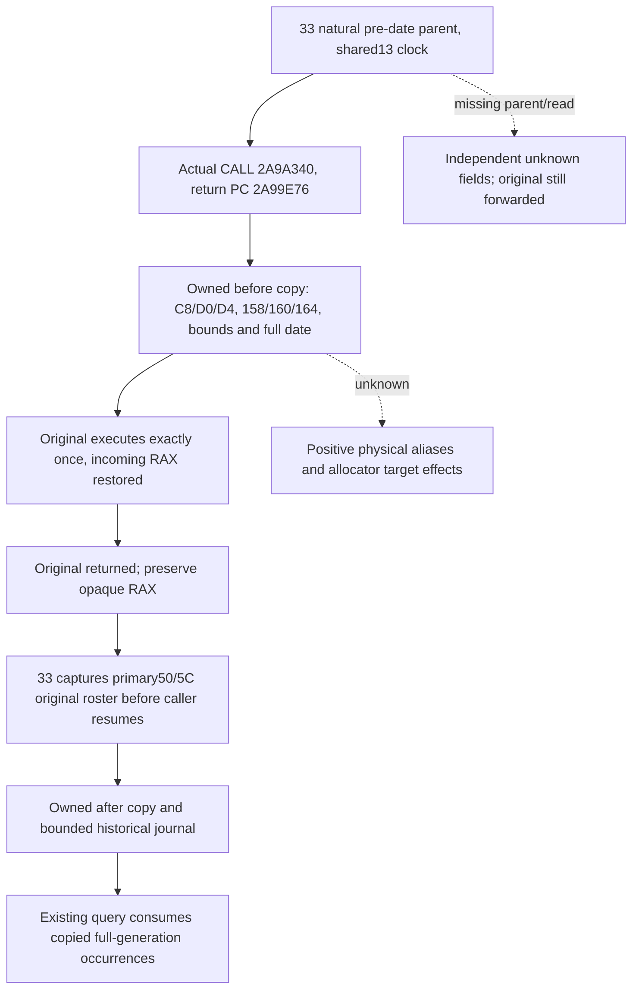

# Native72 actual pre-date prefix observation, CK3 1.20.0.4

The naturally executing call at 2A99E71 invokes 2A9A340 with RCX equal to the primary manager and RDX pointing to the full prospective CDate64. Its return PC is 2A99E76, before the caller loads primary50 and primary5C for the original Army roster. The existing complete557B source closure and four-byte 1.5 growth literal are reused; this package reads no new EXE bytes and repeats no old44 qualification.

Exact executable SHA-256: `98702f88a547cde2eaf29a85f93b85f68ee4cf8148336a4f7afaeb75319dd518`.

The entry anchor contains five whole instructions,17B: `4053 4154 4155 4883ec40 4c63a1d4000000`, ending at2A9A351. They contain no relative operand. An absolute JMP14B replaces these instructions, padding the remaining3B with NOPs. The process-lifetime backing contains the relocated17B, JMP to2A9A351, a `MOV RAX,R8; JMP relocated-original` call thunk, and a `MOV R8,RAX; JMP observer` entry thunk. RCX/RDX retain their source input meanings. The compiler preserves Windows x64 nonvolatile registers and stack alignment. D4<=0 leaves RAX unwritten in native source; restoring the incoming bits before the original is required even though the caller does not consume a formal return value.

Before and after copies are read-only. They never call the game's append, allocator, resolver, or getter. Each raw header field remains optional; a failed read is not zero. Copy admission is separate from raw descriptor bounds, and duplicate ordered DWORD FullIDs retain their original positions and generation bits. Supplied CDate64, current GameState+8, absolute day+9C and C0 are independent facts. The supplied date is passed to33 from the before image rather than reconstructed from a later date.

`ObserveArmyNaturalPhaseOriginalRoster12004(primary,2A99E76,beforeDate64)` runs after the original and before the parent resumes. It requires the active33 pre-date parent with matching primary, clock and thread. Missing parent attribution and read failures do not suppress, catch, retry, or replace the original native call. Actual return is a separate recorded fact from the conditional D4<=0 no-work predicate. A positive physical transition is never marked complete by this producer: aliases and loaded allocator targets remain explicit unresolved inputs.

The existing query may join only the copied roster at this literal boundary using the subject's exact FullID. A current queue or current roster cannot fill any historical before/after field. Journal ordinals identify retained slots; they are not the shared event clock. The bounded64 journal reports overwrites and copy failures.

Root55 installs the owned prefix API during the existing suspended-primary-thread startup. Root59d owns the existing query/serializer integration, Root60 the production CMake addition, and33 the phase parent.44 owns no parent clock or common driver. The new no-main fixture fragment belongs to33's sole connected phase compound. It tests ordered returned roster capture, date/RAX forwarding, independent unknowns and an executable owned-memory RAX restore thunk; it confers no live CK3 evidence.

Source references: external `continuation-44/SOURCE-CLOSURE.json`, `COMPLETE-PREFIX.actual4.asm.txt`, `REQUIRED-INPUT-FRAME.json`, and the pinned actual caller `pre_date_roster_source-DETAIL.json`. The old44 central receipt is `root-first/RESULT.json`: fixture exit0, one build/run; its Defender actual registration remains pending as recorded. The new compound result is delivered separately by central10.
