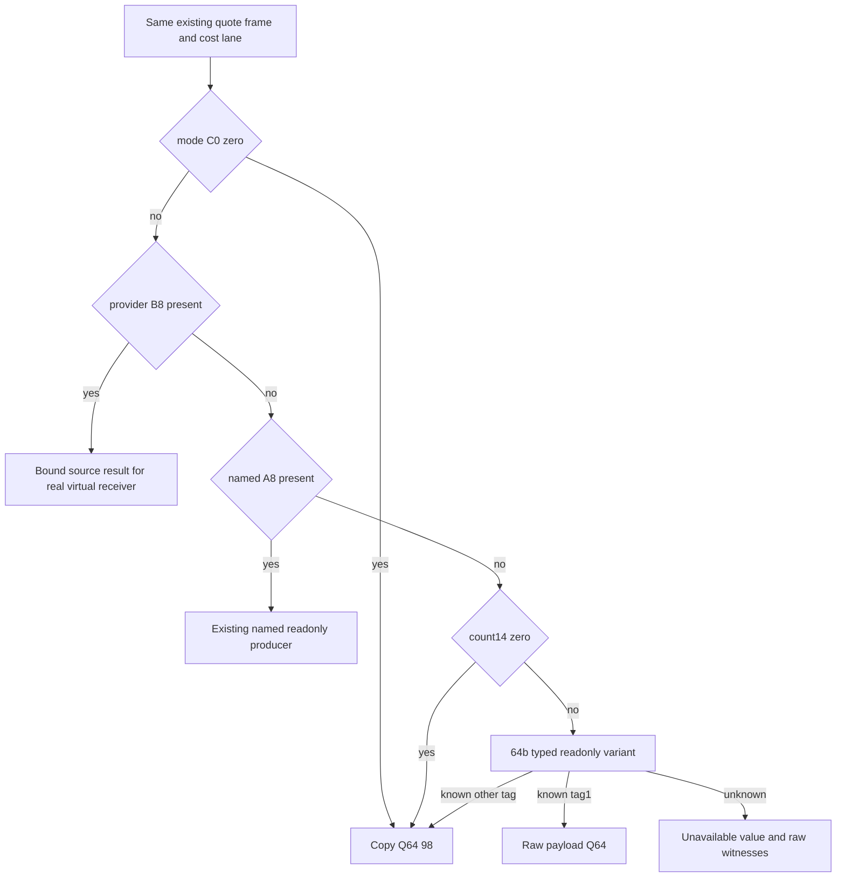

# Actual4 readonly costs lane

2026-10-10. `ReadPrisonerCostLane9D7060Readonly12004` projects the raw Q64
temporary written by the actual `310CF66 →9D7060` costs call, using the existing
same-frame readonly quote identities. Parent35 owns the ten-lane accumulation,
clamping and rounding. The leaf performs guarded copies and conditional
composition of separately closed raw producers.

`SOURCE-FREEZE.json` predates leaf code. The complete actual724B body
`[9D7060,9D7334)` was reused from
`Z:/ck3_mod_rewrite_process_assets/g2-background-20261007/upstream-build-migration/shared-span-cache/new-009D7060-009D7334.bin`.
Its SHA-256 is
`f52e54c725eb0ca88e35b6a9f3c17bf31aba2c4b8efc5488786f9dad30aaacab`.
Build1.20.0.4/Steam25734779 uses the existing executable pin
`98702F88A547CDE2EAF29A85F93B85F68EE4CF8148336A4F7AFAEB75319DD518`.
This package acquired no executable bytes and did not repeat a prior fixture.

The529B actual parent source is the held
`prisoner/current4-context-release/interaction_cost_evaluator-DETAIL.json`.
At `310CF66`, RCX is costblock`+40+lane*F0`, RDX is temporaryQ64,
R8 is the internal alias shape, R9 is literal0, and the fifth stack argument
is descriptor costblock`+9A0`. Actual `310CFF5/310CFFC` add that Q64 into the
stride8 ten-lane output. The mode2 interpolation branch of9D7060 requires
nonnull R9 and is unreachable from this actual parent.

| Source branch | Consumed value source | Readonly composition |
| --- | --- | --- |
| mode`C0==0` | Q64`98` | Direct copied fixed value; later provider/name/list fields are not demanded. |
| mode nonzero, provider`B8` nonnull | Virtual provider`+8`, vtable slot`30`, temporaryQ64 | Preserve the real receiver/slot identities. A source-closed conditional result must match frame, lane, aliases, descriptor, receiver, slot and callsite`9D7141`. |
| provider null, named`A8` nonnull | Actual named37542D0 | Reuse35's complete393B raw contract: expression`70` null plus flag`7B` zero returns0; nonzero flag reads Q64`68`. A dynamic expression requires its matched closed result at cost callsite`9D7228`. |
| provider/name null, count`14` zero | Q64`98` | Copied fixed fallback. |
| provider/name null, count`14` nonzero | Variant3755500 with receiver lane`+8`, R8 aliases, R9 descriptor, stack BYTE0/DWORD0 | Reuse64b's typed pure reader. Known WORDtag1 selects raw Q64 payload`+8`; known other tag selects Q64`98`. Unknown tag remains unknown. |

The API reuses `PrisonerQuoteReadOnlyAccess12004`,
`PrisonerQuoteSourceFrame12004` and `PrisonerQuoteInternalAliases12004`.
It adds no clock or role validation. A derived internal alias shape can lack
a physical internal/support address. The conditional result preserves all
existing frame keys and actual receiver/callback/descriptor arguments.
A copied method address alone never establishes its return value.
Failure to copy demanded fields remains unknown; an unrelated result cannot
replace it. The parent count and64b's copied count must describe the same
current view before their values are composed. This is current-view
consistency, not a fabricated native count predicate.

The source contains profiling, logging, timing and wrong-type cleanup calls.
The leaf executes none of them and claims only the conditional raw value.
All native evaluators and virtual methods remain uninvoked. Neither the
conditional value nor its ready state claims an actual historical call return.

The no-main new fragment
`RunPrisonerCostLane9D7060ReadonlyNewCases12004` contains12 checks for branch
composition: fixed mode and null-R9 mode2, named constant and exact zero,
virtual pointer unknown and matched/mismatched conditional results, known
variant numeric and fallback tags, missing tag inputs, unconfirmed frame,
and parent/child count-view disagreement. The literal synthetic frame reuses
the existing frame contract; it is not fresh calendar or role qualification.
35 owns the sole connected-cost main and10 its first execution. This package
was authored without local build or execution.
