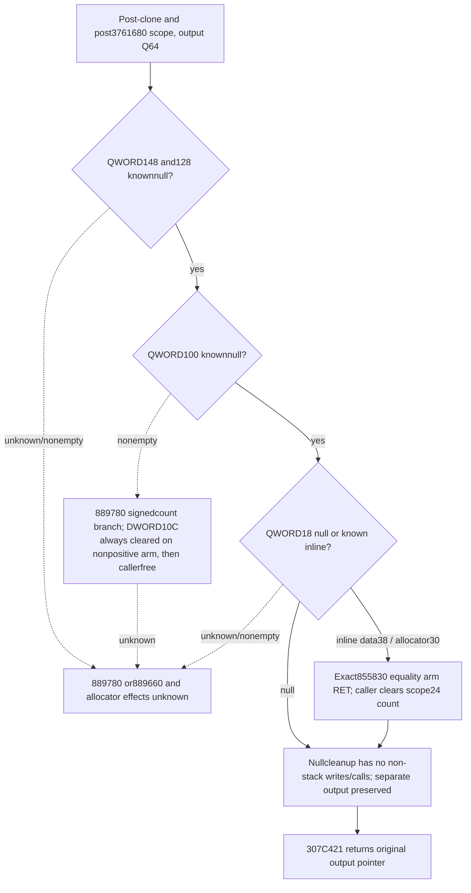

# Ransom mode0 scope cleanup, CK3 1.20.0.4

Actual307C340 preserves the caller's output address in RBX, copies a scope at bodyRSP+20, overwrites scope word0=4 and payload8=zero-extended context2E8, then calls3761680. At307C3A9 the score wrapper has returned. Cleanup starts with889700(scope+118);889780(scope+100) is reached only if the QWORD at scope+100 is nonnull. The caller later returns the original output address in RAX at307C421.

Exact executable SHA-256: `98702f88a547cde2eaf29a85f93b85f68ee4cf8148336a4f7afaeb75319dd518`.

889700 has a complete118B actual body. It first tests argument+30 and, if nonnull, calls889780 at that vector header, frees its backing through allocator slot10, then writes pointer+30 and DWORD count+38 to zero. It next tests argument+10 and, if nonnull, calls889660, frees its backing and zeros pointer+10 and DWORD count+18. Only the two actual-null arms perform no non-stack writes or calls.

889780 is split into actual runtime fragments. The20B entry loads the signed DWORD count at argument+C. Its actual JLE reaches the18B exit at8897CB, which still writes DWORD[RCX+C]=0 at8897D0. A nonpositive count therefore does not prove an unchanged caller output if addresses alias. The positive branch and nonempty889660 path are outside this package's accepted path and remain unknown; no destructor or allocator tree is generalized from their names.

For307C340, the two889700 pointers are scope+148 and scope+128. The direct889780 header is scope+100. Those three QWORDs must be known null in the same post-wrapper frame. Scope+18 may be known null, or the exact inline backing described below. Missing reads, unrelated nonempty buffers and constructor initialization zeros cannot stand in for post-wrapper values.

The actual owned initializer's vector data can be NONNULL scope+38 even when count is zero or negative. Its allocator is scope+30, with exact vtable448D2A0 slot10 pointing to855830. The reused complete58B855830 body computes RCX+8, compares RDX with that address and, on equality, jumps to85585F and returns. With RCX=scope+30 and RDX=scope+38, it never reaches the backing allocator. This is an actual pointer-equality branch proof for the nonnull inline argument; it does not reuse a null-argument free proof. The caller first clears DWORDscope+24, which is separate from the original scalar output. Other free targets, other pointer relationships and nonempty scope100/128/148 paths remain unknown.

The physical input reader requires scope=bodyRSP+20 and the original Q64 output address in the outer frame, at least bodyRSP+1A0. This keeps the output separate from the cleanup's saved-register and temporary-stack stores. A source-equivalent copied shape carries no invented physical scope or output address. Its provider must separately close the cloned shape and all intervening wrapper effects before claiming a same-frame cleanup-entry shape.

The pure guard preserves the supplied pre-cleanup output bits only after those conditions close. A source-equivalent inline shape carries a known nonnull relationship (data38/allocator30), leaving its physical pointer bits unavailable. It never substitutes a raw null pointer for that relationship. The guard never clones, evaluates a score, calls the native cleanup, frees backing, or invokes an allocator. Its returned output is a conditional source projection; actual native output remains independently unknown.06 owns mode0 scalar composition,43 the clone post-shape,35 the selected quote consumer, and10 the sole new connected quote fixture. No old prefix fixture is repeated.

The156B cleanup fragments and the58B inline release body were reused from held evidence; no new EXE bytes were acquired. The source packets, caller/clone and inline release pins are in external `continuation-44c/SOURCE-CLOSURE.json`. The new no-main cleanup cases are delivered separately to the35→10 quote compound; plan checks and offline fixtures do not confer live CK3 credit.
