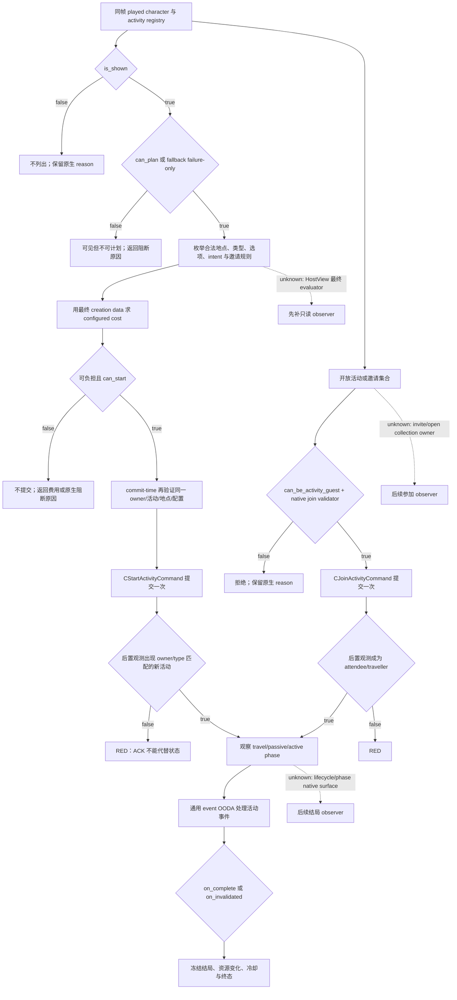
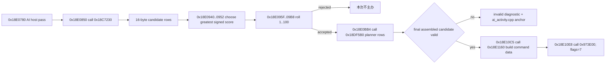

# CK3 1.19.0.6 非宗教活动：发现、主办、参加与结局树

## 状态与范围

- **[research / static-frozen]** 本文冻结 exact build `1.19.0.6` 中宴会、狩猎和巡游的脚本合同、原生 AI 主办选择链，以及主办/参加命令类的静态边界。
- **[not live]** 本工作包没有启动或附加 CK3，没有实现 observer、MCP、planner 或 action，也没有改变公共 readiness。
- `activity_feast`、`activity_hunt`、`activity_tour` 三个定义都存在于 exact game tree。静态存在不等于当前存档中可用：玩家、冷却、政府、资源、战争、DLC 和地点状态仍须由同帧原生查询判定。
- P0 选择**宴会**。它是单地点、非 grand 的基础活动，计划表面比狩猎和巡游小，能最快形成“发现 → 预检 → 主办 → 活动事件 → 结局”可见闭环。
- 宗教活动全部排除。狩猎等普通活动内部若触及信仰规则，只消费原生最终 allow/deny 与粗粒度 reason；不展开 faith、doctrine、tenet、fervor、改宗或 holy order。

机器可读证据与复验入口：

- `ck3_autonomous_player/native_bridge/research/non_religious_activity_native_tree_1_19_0_6.json`
- `ck3_autonomous_player/native_bridge/research/verify_non_religious_activity_native_tree_1_19_0_6.py`

验证器只读明确传入的 game root，不启动游戏，也不依赖固定账号或固定机器路径：

```text
py ck3_autonomous_player/native_bridge/research/verify_non_religious_activity_native_tree_1_19_0_6.py --game-root "<CK3 installation root>"
py -O ck3_autonomous_player/native_bridge/research/verify_non_religious_activity_native_tree_1_19_0_6.py --game-root "<CK3 installation root>"
```

## Exact-build 冻结

| 资产 | SHA-256 / 值 |
|---|---|
| CK3 build | `1.19.0.6` |
| `binaries/ck3.exe` | `2D00FF3101EF70B566F2FCBAE292F09263199C80E9DC8F139B82D7D96F83DB86`；`95,206,008` bytes |
| PE image base | `0x140000000` |
| `_activity_type.info` | `C021CE8A0A72B071CD47B4ACEB4A1A1A7D48E37300918BCE9E0FCDB31EE72156` |
| `feast.txt` | `CE9B72F84B534CE5B8E0764FBFE0552CDBE889ABDEC370747643014B2668FB7C` |
| `hunt.txt` | `E3CA2E899FE45AEB8234EA747AF8D1286D1DECBB054E07BB4DEB2E91C0FF6BDB` |
| `tour.txt` | `28449EECF31E7D76AEBA304F6FE7DC6461CAEFC3CA2172D99FEA453CDC63FE66` |
| `common/defines/ai/00_ai.txt` | `C78F9CD8DF9938CC9F38E817BCB6E32CD13720B5BD9DE077B85E3E1C6F030293` |
| G2 research baseline | `9dea3de4947ad70c4db0da484ee90cfcdf080d38` |

本文的 RVA 都相对上述 EXE image base。升级游戏或任一脚本哈希改变后，必须重跑验证器并重新定位；不得把其他 build 的推测移植为事实。

## 活动系统的通用合同

`game/common/activities/activity_types/_activity_type.info` 已明确分开四层判断：

1. `is_shown`：潜在主办者为 root，决定是否进入玩家可见的活动目录（第 7–11 行）。
2. `can_plan` / `can_start_showing_failures_only`：决定能否进入计划；`can_plan` 未填时回落到 failure-only 检查（第 34–45 行）。
3. `can_start`：使用最终 creation data 做启动检查，不能由目录可见性代替（第 27–32 行）。
4. `is_valid`：活动创建后持续检查，root 已变成 activity，并提供 `activity` / `host` scope（第 53–59 行）。

费用也分两种：`cost` 接收已选 special option、单地点或多地点列表，是计划结果的权威配置费用；`ui_predicted_cost` 只是没有完整选择时的粗略预估（第 481–504 行）。因此公共查询以后必须区分 `predicted_cost` 和 `configured_cost`，action 只能依赖同一 commit-time 配置重新求出的后者。

原生 AI 主办语义由 schema 与 define 共同给出：

- `ai_will_do` 必须**严格超过** `NActivity.ACTIVITY_SCORE_THRESHOLD=20`；
- 所有合格活动类型中先取最高分；
- 该最高分再作为主办概率，`0` 永不主办、`100` 必定主办；
- `ai_check_interval_by_tier` 以月为单位，`0` 表示永不考虑；
- 单/多地点候选再按 `ai_will_select_province` 加权随机，多地点数量由 `ai_select_num_provinces` 决定。

这不是“按权重从所有活动随机抽一个”。自动玩家可以参考这些原生倾向，但玩家行动价值不能等待 AI 的 60 个月调度。

## 主办与参加决策树



### 宴会 `activity_feast`：P0

| 层 | exact 规则 |
|---|---|
| 可见 | landed 或 landless administrative，最高头衔高于 barony（`feast.txt:11-13`） |
| AI 额外可见门 | 开局至少 3 年、不在战争、不专注首都建设，有足够 short-term gold/treasury 或 override；普通 county AI 要 `ai_sociability>=100`；uncrowned AI 被拦截（第 14–49 行） |
| 可计划/启动 | 无宴会冷却；通常必须 `is_available_adult=yes`（第 52–63 行） |
| 继续有效 | host 存活、capable adult、未监禁、政府仍合格、非 incapable；active phase 必须有 attendee（第 65–80 行） |
| 地点 | `is_single_location=yes`；玩家从 `domicile_domain` 选，AI 使用 capital；地点必须有 holding（第 241–250 行） |
| AI 分数 | base `30`，`-0.25*ai_greed`，`+0.5*ai_sociability`，负 energy 与性格/状态继续修正（第 380 行起） |
| 调度 | barony `0`；county 到 hegemony 全部 `60` 个月（第 4479–4486 行） |
| 参加 | 最多 40 人；guest 要成年、健康、与 host 在 diplomatic range；双方 intent 默认 `reduce_stress_intent`（第 796–850 行） |
| 费用 | 根据政府、house、treasury 与 barter 状态在 gold/treasury/piety 等资源路径中求值；revenue minister 对适用基础费用乘 `0.85`（第 971 行起） |
| 过程/结局 | 单一预定义 meal phase；host 在一个月后推进；`on_start` 创建状态，`on_complete` 触发宴会结论和奖励链（第 4163 行起、第 4636 行起、第 4793 行起） |

`guest_join_chance` 从 base `10` 开始，再叠加 shared/feast modifier。它是原版 AI 接受倾向，不等于玩家最终 `can_join`。P0 主办闭环不需要先实现全宾客最优选择：首版可用原生默认邀请规则和默认 intent，但必须在 action 请求中显式冻结这些稳定 key，避免 GUI 默认变化造成不可复现提交。

### 狩猎 `activity_hunt`：P1

- 可见要求高于 barony 且 playable；AI 同样有开局三年、无战争、首都建设、预算/性格、county boldness 与 uncrowned 门（`hunt.txt:1-45`）。
- 启动要求无冷却、available adult 与最终 `can_hunt_trigger`；landless 还要至少 3 个有效廷臣，nomad 必须 landed（第 47–70 行）。
- 普通狩猎是单地点，玩家 `domicile_realm`、AI `domicile_domain`（第 1777 行附近）。
- AI 分数从 `0` 构造，含 base `-10`、county `-20`、`-0.5*greed`、`+1*boldness`、`+0.5*sociability`、负 energy 和类型/性格项（第 1003 行起）；county 以上也是 60 个月一次（第 5447–5454 行）。
- 最多 20 guests；通常需成年、非 incapable、通过 `can_hunt_trigger` 且在 diplomatic range，另有窄 nomad 子女例外（第 5497–5511 行）。
- 正常 hunt phase 六周后推进，并在第 21、28、35 天安排 outcome 事件（第 5138–5164 行）。

狩猎比宴会多出 hunt type、目标、更多 option 与 herd/treasury 等资源分支。涉及信仰的 trigger 只发布 `native_allowed=false` 和原生粗粒度 reason，不展开宗教输入。

### 巡游 `activity_tour`：P2

- 静态定义要求 `tours_and_tournaments` 与 `advanced_activities` 两项 DLC feature；landed、高于 barony、非 administrative，AI 还要求无战争并通过 uncrowned 门（`tour.txt:1-23`）。
- 启动要求 duke+、12 岁以上、至少 3 名 vassals、5 名 courtiers/guests、无 civil war（第 25–39 行）。
- AI base `30`；liege 正在办 grand activity 时 `-1000`，kingdom 首次巡游 `+200`，重复巡游与财政等继续修正（第 120 行起）。duchy 以上每 60 个月检查，county/barony 为 `0`（第 284–291 行）。
- 它是 grand、多地点、holder planner；最多 10 个 pickable phases，每 province 最多 1 个，最多 100 guests（第 543–549、1960、2717–2727 行）。
- 费用按时代和 options 缩放；`ui_predicted_cost` 会使用 option 平均值，不能作为 action 的最终扣费依据（第 553、629 行起）。

巡游只有在运行时 DLC 和当前存档原生 gate 通过时才是“当前可用”。它必须复用已验收的单地点活动 contract，再扩充路线、多阶段和 option policy。

## Exact 原生 AI 主办链

EXE 在 RVA `0x419BC18` 保留源路径 `logic/ai/ai_activity.cpp`，并在 `0x419BBB0` 保留 invalid activity diagnostic。二者的 xref 落在 PDATA `0x18E0780..0x18E115E`；整函数 SHA-256 为 `0C2158D3A475D0E62ADAFE812B2AD9921D60DE28C2517B1E9440110EC08DDF1B`。



候选 row 的已闭合布局只有：stride `0x10`、`+0x00` 是参与 signed 最大值比较的 32-bit score、`+0x08` 是选中后读取的非空 `CActivityType` 指针。其 stable key、所有权和 lifetime 尚未解码，原始指针不得写进公共 schema。

`AIAttemptToHostActivityEffect` execute 位于 `0x2E60180..0x2E603BA`，并在 `0x2E60241` 调用 AI manager `0x2368420`。EXE 还保留“对 non-AI character 强制 host”的错误文本。它只要求 AI 重新评估主办活动，不能用来查询或替玩家主办；P0 明确禁用该捷径。

## 原生命令边界

### 主办命令

RTTI 冻结 `CStartActivityCommand`：

| 项 | exact 值 |
|---|---|
| type descriptor | `0x54CDF38`；`.?AVCStartActivityCommand@@` |
| primary vtable / COL | `0x432E690` / `0x4970B70`，object offset `0` |
| secondary vtable / COL | `0x432E438` / `0x4970B98`，object offset `24` |
| clone | `0x26CA920..0x26CA9AC`；分配 `0x508` bytes |
| payload validator | primary slot 6 `0x26C8070` → `0x219A8B0` |
| secondary dispatch | `0x26C8050` → `0x2700340` |

这证明游戏有完整原生命令和 final validation surface，但还没有闭合 `0x508` payload 的字段语义或安全构造器。后续 action 必须从 stable activity/location/option/invite/intent keys 新建 payload，在提交帧重跑原生 validator，排队一次，再用状态 observer 验证新活动；不得复制 live command 内存或以 ACK 冒充成功。

### 参加命令

`CJoinActivityCommand` RTTI 为 `.?AVCJoinActivityCommand@@`，primary/secondary vtable 为 `0x432E3A0` / `0x432E370`，clone 分配 `0x398` bytes。validator `0x26C8550..0x26C8789` 解析 character identity 并执行最终检查；secondary execute `0x26C8480..0x26C854B` 解析 character/activity，再调用 `0x2193D10` 和 `0x2193F40`。

这一层只证明 join command 的实际存在和 final validator，不证明邀请集合、开放活动集合、拒绝原因或 payload 语义已经可查询。参加动作排在 P0 宴会主办闭环之后。

## 下一最小 observer 与 action seam

### Observer：`activity_host_candidates_v1`

直接定位 `CActivityListDetailHostView` 中 `CanPlanActivity` / `GetCanPlanActivityTooltip` 的 backing evaluator。EXE 字符串 RVA 分别为 `0x4096760` 和 `0x4096778`。选择这条入口的理由是它针对 played character 的正常只读 planner traversal，可以即时返回目录、合法性和失败原因；AI `0x18E0850` 路径只按 AI cadence 自然经过，不适合作玩家 OODA 查询。

第一版只实现 `activity_feast`，并发布：

- 同帧 frame/owner binding 与 stable activity key；
- `shown`、`can_plan`、`can_start`；
- 原生 failure display key/text；
- 合法地点 stable id 与原生地点权重；
- 选中的 option、intent、invite-rule stable keys；
- `configured_cost` 资源向量、`affordable` 与 cooldown；
- 每个字段的 unavailable 原因，不能用长期 `null` 代替尚未闭合的观测。

最小施工顺序是：先用 HostView RTTI/vtable 把上述两个方法映射到最终 evaluator；在正常只读 planner traversal 上做一次 private capture；解码 stable key 和 copied-value lifetime；最后接入 main-thread query。第一版不得公开 AI candidate raw pointer 或复制 GUI 缓存为长期状态。

#### `activity_planning_snapshot_v1` private observer core

P0 宴会现已有独立、默认关闭的 private observer core：
`activity_planning_snapshot_v1_private_observer.hpp/.cpp`。它还没有接入共享
bridge、公共 schema 或 MCP。native binder 必须在 application-main 的暂停帧内提供一次
transient capture session；core 在 session 释放前深拷贝 stable key、地点 ID、地点权重、
selected option/intent/invite-rule key 和配置费用数值，并在释放后重读 frame/owner。
前后 revision、date 或 owner 任一变化都会使整个结果成为 `frame_changed`，不会发布混帧快照。

这个 private 合同明确区分三类来源：

- `can_plan_final` 只有来源为 `host_view_final_can_plan` 时才可标记 known；目录可见性、
  脚本摘要、AI score 或 tooltip 文本都不能替代最终 `CanPlanActivity` 判定；
- 地点候选只有完整的 `native_legal_location_collection` 才会进入
  `candidate_inputs_ready`；每行只保存 stable location ID/key、原生权重与 typed selectable；
- 费用只有 `native_authoritative_configured_cost` 才会进入
  `configured_cost_ready`；`ui_predicted_cost` 输入会被拒绝，避免把粗略 UI 估算当成
  commit-time 配置费用。

尚未闭合的字段不会用默认 `false`、空 key 或长期 `null` 冒充观测结果。每个 bool、
integer、text 或 collection 都携带 `known/unknown` 状态；unknown 必须携带具体 reason，
例如 `native_final_evaluator_unresolved`、`native_candidate_collection_unresolved` 或
`native_configured_cost_unresolved`。输出结构使用固定容量 copied values，类型层面不保存
native pointer；private JSON 也固定声明 `raw_pointer_fields_persisted=false`。

独立 normal/optimized 测试覆盖 exact-build/default-off、完整宴会输入深拷贝、known-false
与 typed-unknown 区分、final evaluator 来源门、`ui_predicted_cost` 拒绝、候选完整性、
帧漂移及 capture session 释放。当前状态仍是 `static-ready private core`：ACTIVITY1 冻结的
HostView 最终 evaluator RVA、stable-key/native collection binder 和 paused live artifact
仍未闭合，所以不能宣称 public query、production-live 或 action-ready。

### Action：`start_activity_v1`

Observer live GREEN 后复用 `CStartActivityCommand`：

1. 请求只接收 stable activity/location/option/invite/intent keys，不接收 raw pointer 或完整原生 blob；
2. action 线程在同一 owner/frame 上重新构造 exact payload；
3. 通过 `0x26C8070 -> 0x219A8B0` 做 commit-time 最终验证；
4. 通过正常 command queue 提交一次，不调用 `AIAttemptToHostActivityEffect` 或强制脚本 effect；
5. 后置查询必须看到 owner/type 匹配的新 `activity_feast`，随后观察 phase 和 terminal；command ACK 只说明接收，不说明游戏状态成功。

首个 live 验收场景只需一个当前原生 gate 已通过的 paused save：查询宴会 → 采用原生默认配置 → 提交一次 → 确认活动创建 → 首个活动事件仍由通用 event OODA 处理。不要为单个活动 bug做长跑；没有命中时按有界 NO-GO 收口并保留 exact reason。

## 结局验证边界

活动创建不是完成。活动 schema 的 `on_start`、phase travel/passive/active、`is_valid`、`on_invalidated` 和 `on_complete` 形成独立生命周期。P0 后置 observer 至少要区分：

- 创建：同 owner/type 的新 activity identity；
- 进行中：当前 phase、host state、player attendance/travel state；
- 失败：invalidated/cancelled 与原生 reason；
- 完成：terminal state、资源变化、cooldown 与关键 outcome flags；
- 交互：活动弹出的事件继续进入已有通用 event OODA，不能自动点掉未识别选项。

原版只保证最后 phase 后执行 `on_complete`，AI-only activity 最多多存活一天；它不保证每种活动在固定天数完成。宴会约一月 phase、狩猎六周及多次 outcome、巡游多站路线必须分别观察。

## 尚未闭合的分支

- `CActivityType` registry owner/enumerator 与 native stable key 字段；
- `CActivityListDetailHostView` 两个 planner 方法的 exact RVA、最终 evaluator 和 reason collector；
- AI 16-byte row 的完整所有权、identity 和 lifetime；
- `CStartActivityCommand` `0x508` payload 的字段语义与可新建构造器；
- treasury、herd、barter、piety、prestige 等配置费用向量槽位；
- pending invite/open activity 集合及 native can-join reason；
- lifecycle/phase/terminal 的只读原生 surface；
- 当前存档的 tour DLC availability；
- 狩猎等活动内部的 faith 分支，仅允许保留 opaque allow/deny；
- feast 之后的 location、options、intent、guest 质量策略。

这些 `unknown` 是下一批可施工入口。P0 的唯一下一步是 HostView planner evaluator 的 exact-build 定位和 private read-only capture；在它 live GREEN 前，活动能力仍是 `research`，不得标成 production query、action-ready 或完整活动 OODA。
