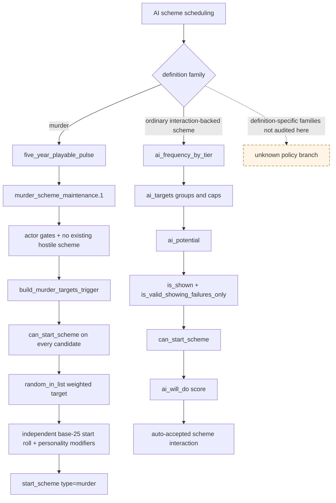
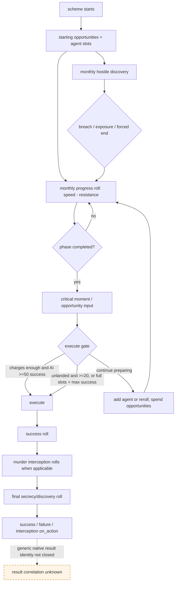

# CK3 1.19.0.6 非宗教谋略原生 AI 树与下一只读切片

## 结论、范围与状态

本专题冻结 CK3 `1.19.0.6` 中非宗教谋略从发现目标到结果分流的原生链路。结论有三点：

1. 原版没有一棵适用于所有谋略的统一目标树。`murder` 由五年 playable pulse 驱动专用隐藏事件；`sway`、
   `start_abduct` 等走人物互动的 `ai_targets → ai_potential → legality → ai_will_do` 通路。
2. 活跃谋略的成功率、保密度、进度、机会与 breaches 是一组相互关联但不能互相代替的状态。尤其是保密度既参与
   月度暴露，也在最终结算再次参与独立暴露判定；成功率不是结果保证。
3. 下一项最小施工应是只读 `active-scheme-state-v1`：先闭合玩家拥有的活跃谋略容器、稳定实例身份与同帧数值，
   再接入 start preview 和动作。当前只达到 **static-ready**，没有启动、attach 或操纵 CK3，也没有 production paused
   snapshot；本文不能被引用为 production-live。

本篇只研究 character/title 等非宗教目标。faith-targeted scheme、改宗、宗教改革、doctrine、tenet、fervor 与 holy order
继续保持 owner-deferred。原版通用结构和 GUI 中出现 `faith` target union 仅作为类型边界记录，不构成宗教域研究或完成。

机器可读证据与聚焦 verifier：

- [`scheme_state_1_19_0_6_abi.json`](../../ck3_autonomous_player/native_bridge/research/scheme_state_1_19_0_6_abi.json)
- [`verify_scheme_state_1_19_0_6_abi.py`](../../ck3_autonomous_player/native_bridge/research/verify_scheme_state_1_19_0_6_abi.py)

## exact-build 证据

| 输入 | 大小 | SHA-256 |
|---|---:|---|
| `binaries/ck3.exe` | 95,206,008 | `2D00FF3101EF70B566F2FCBAE292F09263199C80E9DC8F139B82D7D96F83DB86` |
| `game/common/schemes/scheme_types/_schemes.info` | 11,078 | `3F93B35DC6A63B5A2635C5D11CF091AA52F34CA60CC092FB1D3D6AA8E4404F90` |
| `game/common/schemes/scheme_types/murder_scheme.txt` | 10,128 | `6FAF5FDF5E2C7A7516D3FBA42D199A2B76056EBD58A3346F472E8644A5ADDF8C` |
| `game/common/character_interactions/00_scheme_interactions.txt` | 59,328 | `F2B8D8D21433A28580589FAB77DA2CEFA2F9CEAA33A4EE862D86DF44C69372BB` |
| `game/common/scripted_triggers/00_scheme_triggers.txt` | 26,172 | `7D3D941FC21A6ECBFEF7629325678A8C51EC6F9922F5F911CA74FADE1043E6B5` |
| `game/common/on_action/yearly_on_actions.txt` | 124,324 | `0FC85A284224A68D1CA0A4EF071D4F4A4F49896753AEC463975A12EE4E1116FA` |
| `game/events/scheme_events/murder_scheme/murder_scheme_maintenance_events.txt` | 9,869 | `1EC3F3197AB086680051F0ADC661328259EBC197F960564837AFE5605484C5E4` |
| `game/common/scripted_effects/00_scheme_scripted_effects.txt` | 412,683 | `478F4B1B9D94F28E33B83B8453F6BBCFD239830D821196D68120D5727723F6DF` |
| `game/common/scripted_modifiers/00_scheme_scripted_modifiers.txt` | 97,232 | `C5494E221F8752A82FB5185CB91AD0B64779B5576EFAD390C43E4E17ABCC8CD7` |
| `game/events/scheme_events/scheme_critical_moments_events.txt` | 229,808 | `A51C5D0ED3CE9B475A25B7857829B098A4D5A38B4D89044C68C4813CC32EEA26` |
| `game/gui/window_intrigue.gui` | 55,348 | `4DF7F167ABF78CAA3FF300176F7B79CA6B569C0E14CB7A4137E7BCCE7311212B` |

JSON 另固定 HUD、scheme preparation GUI 的完整文件哈希和所有引用行。verifier 同时检查完整文件与逐行锚点，避免
同名 key 在别的 build 或 DLC 版本里被误当成本 build 的证据。

### EXE 类型与函数锚点

| 语义 | TypeDescriptor / vtable / 函数 RVA | 已闭合内容 |
|---|---|---|
| 活跃实例 | `CActiveScheme` TD `0x54BA590`；primary vtable `0x433A928` | concrete runtime type 存在；COL+七槽 span 已哈希 |
| 管理器 | `CSchemeManager` TD `0x54E07D8`；primary vtable `0x433A840` | concrete manager type 存在；容器字段尚未闭合 |
| 类型定义 | `CSchemeType` TD `0x50D2C00`；primary vtable `0x44081E8` | stable type definition；`+0x18` canonical key 已由既有 start-scheme 专题闭合 |
| 合法性 trigger | `CCanStartSchemeTrigger` TD `0x55038C0`；primary vtable `0x4380FA0` | evaluator body `0x2850BD0..0x2850F30` 已整段哈希 |
| start effect | `CStartSchemeEffect` TD `0x55D4C40`；primary vtable `0x4450D48` | initializer `0x2EB4D10..0x2EB4FF7` 解析并绑定 `CSchemeType*` |
| 创建实例 | `0x276BC40..0x276C1BB` | `.pdata` 完整边界；函数内直接引用 `CreateActiveScheme` literal |
| GUI type registry | `0x27790E0..0x27792FA` | 完整 `.pdata` 边界；注册 `SchemeTarget` scope 名 |
| agent slot 收集 | `0x27700D0..0x2770D49` | 完整 `.pdata` 边界；直接引用 `CollectAgentSlotsInvites` literal |

EXE 还保留 `GetSuccessChance`、`GetAgentCharges`、`GetBreaches`、
`GetPhasesRemainingUntilOpportunity`、`FireSchemeOpportunityChangedOnAction` 等 exact literal；原版
`window_intrigue.gui` / `hud.gui` 实际消费 `Scheme.GetSuccessChance`、`Scheme.GetProgressBar`、
`Scheme.GetTargetCharacter`、`Scheme.IsExposed`、`Scheme.IsFrozen` 和 `Scheme.GetAgentCharges`。这证明产品自身具有这些
显示语义，但 literal 与 GUI 调用**不等于字段偏移**，不能据此猜结构直接读内存。

## 原生 AI：机会发现、目标选择与启动

### 两种调度族



`five_year_playable_pulse` 由代码每五年对 playable/count+ 角色调用，并列入
`murder_scheme_maintenance.1`。该事件先要求 physically-able AI adult、非 pool、高荣誉硬挡、无现存 hostile scheme；部分
无地角色再做 `match=0.25` 下采样。它随后构造 `murder_targets`，在 trigger 和 `random_in_list.limit` 两处都调用
`can_start_scheme(type=murder,target_character=...)`，还排除自身、近三代直系后代与令 actor 畏惧的目标。

`build_murder_targets_trigger` 的候选来源不是全世界盲扫。exact script 明确加入 rivals/nemesis、继承利益、家族或氏族利益、
作弊配偶、tyrant liege、claimant faction 威胁、特定 extolled/strife/feud 等关系。目标权重以 `base=0` 起步，再叠加：

- friend/lover/best friend/soulmate/blood brother 与 obedient 等强负权；
- vengefulness、greed、succession position、claimant threat、opinion、struggle/feud 与 strife；
- sponsored character 负权；
- 若目标是玩家且已经被 AI murder scheme 针对，权重直接乘零，防止围攻玩家。

选中目标后还有另一层 `random`，基础启动概率 25，再由 compassion、honor、vengefulness、rationality、greed、关系、dread
和无宗族异常挡板调整。只有该 roll 命中才执行 `start_scheme`。因此“目标权重最高”与“本轮一定开谋略”是两件事。

普通 interaction 家族以 `sway_interaction` 为代表：候选分三组读取 liege/neighboring rulers、vassals/peer vassals、
councillors；前两组上限各 10，按头衔等级以 6–120 月不等的频率尝试。随后 `ai_potential` 挡住已有冲突 personal scheme，
`is_valid_showing_failures_only` 调用 `can_start_scheme(type=sway,target_character=recipient)`，最后才由 `ai_will_do` 评分。
`start_abduct` 同样声明 `ai_targets`、tier cadence、`ai_potential` 与 `ai_will_do`，证明这一路径并非 sway 特例。

### 合法性与启动语义

`can_start_scheme` 是真正的 native trigger，并由各 interaction 的 validity 和 murder 专用事件复用。它必须保留 actor、scheme type、
target kind/identity 与当帧 scope，不能用“按钮看起来可点”或静态规则副本替代。

玩家界面的 `start_murder_interaction` 还要求四个互斥 starter package 之一：balanced、success、speed、secrecy；`on_accept`
依据该 option 调用对应 `begin_scheme_with_agents_effect`。脚本直接启动 murder 时没有这个 interaction option，murder `on_start`
会在 `agents_added` 不存在时装入 balanced fallback agent slots。因此动作层必须区分“经 interaction 启动”和“脚本直接启动”，
不能假设两者 agent 配置相同。

## 活跃谋略：进度、机会、成功率与保密度

`_schemes.info` 固定以下基础契约：success/secrecy/progress chance 均在 `0..100`，scheme progress 在 `0..10`；`valid`
每日检查；`is_basic=yes` 的谋略不使用 agent、opportunity 或逐 phase 成功率增长。非 basic scheme 则由 speed-resistance 得到
月度 progress chance，并在 phase 完成时运行 definition 的 `on_phase_completed`。

以 murder 为复杂代表：

1. `on_start` 加入起始 opportunities 并确定 agent slots；
2. 每月运行 hostile discovery check 和 ongoing event；
3. phase 完成时抑制重复 follow-up、进入 `murder_scheme_prep_effect`，并执行 opportunity cap/reminder；
4. AI 每半年再次进入 prep，并清理 AI scheme slots；
5. prep event 可以花 opportunity 选择 agent、重掷，或在满足 execute gate 时结算。



标准 critical moment 的 AI execute gate 要求足够 opportunity charges，并满足以下一项：成功率至少 50；无地且至少 20；
agent slots 已满且成功率已达 maximum。通过后 `scheme_prep_ai_should_execute_scheme_modifier` 再处理 impatience、是否达到 max、
patience 和当前成功率；否则 AI 可以花两点 opportunity 增加 agent 或重新生成选择。这是原版的等待/执行权衡，不能简化为
“一有机会就执行”。

### 成功和保密是不同随机变量

hostile 月度 discovery effect 的脚本注释给出通常公式：`10% × (100 - secrecy)`；例如 secrecy 60 时每月约 4%。实际 roll
还要求目标方存在可工作的 spymaster/对应营地职务，并受 grace period 和情境分支影响。命中后可能增加 breach、暴露 agent/
scheme，达到 `maximum_breaches` 时强制结束；murder 的最大 breaches 为 5。

最终 `generic_scheme_process_ending_effect` 先按 `scheme_success_chance` 做成功 roll；可拦截的 murder 随后有 unique/repeatable
interception；secret scheme 再以 `100 - scheme_secrecy` 做最终 discovery roll，并把下限夹到 5。最后分流到 interception、
success 或 failure 事件。murder 的隐藏结果事件 `scheme_critical_moments.1001` 把 success/failure 分别送到
`murder_success_pre_filter_on_action` / `murder_failure_pre_filter_on_action`。

对自动玩家的直接含义：

- success chance 用于是否值得执行；secrecy 同时影响等待期间累计暴露风险和最终身份暴露风险；
- progress、opportunity charges 与 success growth 决定“继续准备”的时间价值；
- breaches 是剩余安全预算，不能拿当前 secrecy 代替；
- basic scheme 对上述不适用字段必须发布 typed `not_applicable`，不能填 `0` 或长期 `null`。

## 结果验证边界

脚本已经证明结果分流 key，但尚未找到跨所有 scheme 通用、稳定的 native result enum 或 transition record。P0 验证必须分层：

| 动作 | 最低后置条件 | 当前边界 |
|---|---|---|
| start | 新 active instance 出现，owner/type/target 与请求一致 | 需要稳定 instance identity；命令 ACK 不算成功 |
| add agent / reroll | 同一 instance 的 opportunity charges 与 agent/choice 状态发生预期变化 | agent/choice ABI 尚未闭合 |
| execute | 原 instance 推进或离开，并观察到与本 instance 相关的结果 transition | 只看到 instance 消失不能判 success/failure |
| cancel / invalidation | 原 stable instance 离开，并另行记录取消/失效原因 | 原因 ABI 尚未闭合 |

murder 下游可以额外观察目标 alive/death、current event identity 与 success/failure/interception on_action 后果，但这些是
scheme-specific postcondition，不能伪装成通用 scheme outcome。

## 下一最小只读 native/MCP 切片

### P0-A：`active-scheme-state-v1`

第一项施工只读玩家拥有的 active schemes，不顺带实现动作或完整 agent utility。字段必须在 application-main 同一帧复制；下列数值仅展示 wire 形状，不是已闭合 ABI：

```json
{
  "active_schemes": {
    "status": "available",
    "played_character_id": 123,
    "items": [
      {
        "scheme_instance_id": "scheme:456@generation",
        "scheme_type_key": "murder",
        "category": "hostile",
        "target": {"kind": "character", "id": 789},
        "is_basic": false,
        "is_secret": true,
        "is_exposed": false,
        "is_frozen": false,
        "progress": 6,
        "progress_goal": 10,
        "success_chance": 63,
        "maximum_success_chance": 95,
        "secrecy": 72,
        "opportunity_charges": 2,
        "breaches": 1,
        "maximum_breaches": 5,
        "phases_remaining_until_opportunity": 1
      }
    ]
  }
}
```

这里的 ID 形状只是 wire 意图，不能在 ABI 未闭合前照抄为实现。readiness 只有在以下条件同时成立时才为 true：

1. `CSchemeManager` root 与 player-owned active container 已从 exact build 闭合；
2. instance/type/target identity 都能 round-trip，且 instance identity 能识别复用/代际；
3. 数值字段有 exact getter/field 证据并完成范围检查；
4. 同一 owning-thread query 内二次观察容器与实例身份稳定；
5. 只返回复制后的 value，任何 engine pointer 都不跨线程、不进入 JSON；
6. complex murder 与 basic sway 各有一条 paused snapshot，basic 的不适用字段为 typed `not_applicable`。

下一次静态逆向只追两条边：`CSchemeManager → player-owned active container`，以及原版 intrigue/HUD data model 的
`SchemeItem.GetScheme → CActiveScheme getter callbacks`。这两条闭合后立即实现只读 bridge/MCP，再做一次复杂+一次 basic 的
paused live；不为单字段反复长跑。

### P0-B：start preview，然后复用既有动作通路

`active-scheme-state-v1` live 后，再闭合 `CInteractionSchemeInfo` 的 target candidates、`GetPreviewSchemeOdds`、success/secrecy
preview 与 validity reason，形成 `scheme-start-preview-v1`。动作不直接调用 `CStartSchemeEffect`，也不写
`CSchemeManager/CActiveScheme`；它复用已经冻结的 character-interaction context validator
`0x2C43F00` 和 send-command constructor `0x26B3220`。

第一动作 allowlist 可用 `start_murder_interaction` 与 `sway_interaction`：同帧固定 actor/target/interaction key，重新求值 shown、
validity 与 `can_start_scheme`；murder 还必须携带四个互斥 starter package 之一。命令返回后以 active instance 的
owner/type/target 后置条件验收。先用 sway 验证 basic start 生命周期，再用 murder 验证复杂字段和 starter package，不把
fixture 成功外推到其它 definition。

## 未闭合项与风险边界

- [unknown] `CSchemeManager` 全局/root、player-owned active container 及 stable instance ID 布局。
- [unknown] `CActiveScheme` 数值字段偏移；GUI literal 和脚本 getter 名只证明语义存在。
- [unknown] `CInteractionSchemeInfo` preview 布局、候选集合与结构化 failure reason callback。
- [unknown] 跨所有 scheme 的结果 transition identity；script on_action key 不能代替 native correlation。
- [unknown] agent invite/join/leave 与 critical-moment choice 的通用 utility；murder 只能代表复杂 hostile scheme。
- [static-only] 本工作包没有 CK3 live、没有 paused artifact、没有动作执行，也没有改变 public schema/bridge/MCP。

上述 unknown 是明确的施工入口。它们不应被填成 `null` 后宣称能力完成，也不应阻塞与谋略无关的 G2 工作。

## 聚焦复现

```text
"tools\.venv\Scripts\python.exe" "ck3_autonomous_player\native_bridge\research\verify_scheme_state_1_19_0_6_abi.py" --game-root "<CK3-root>"
```

通过条件是 exact EXE、12 份原版 script/GUI、逐行锚点、RTTI/literal、完整 native span 与既有 interaction action seam
全部匹配。该 GREEN 只代表 static evidence freeze，不代表 live query 或完整谋略 OODA。
