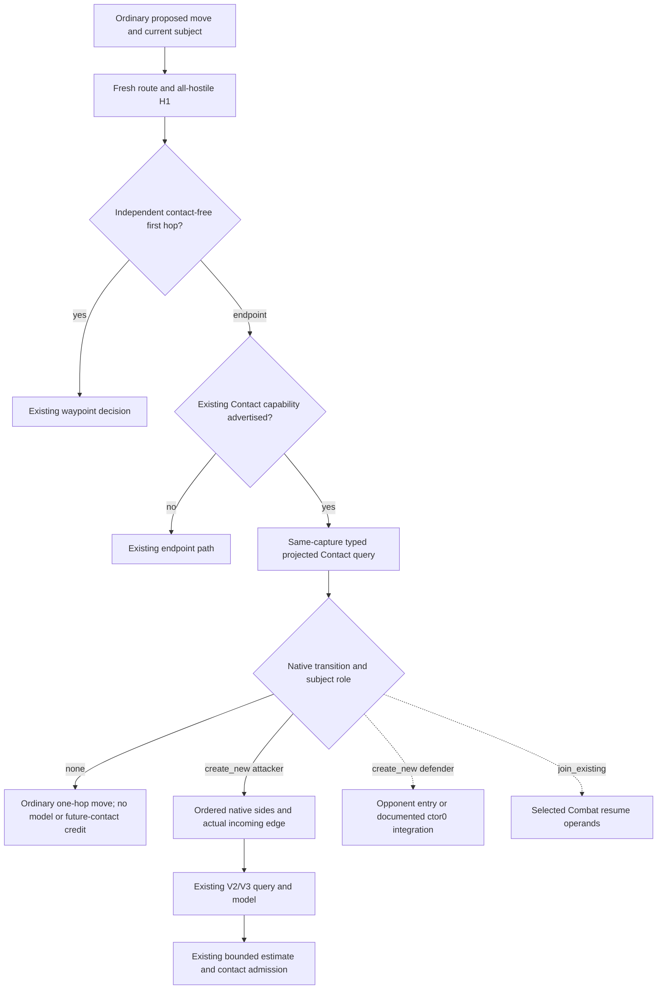

# Normal Army projected Contact consumer — 1.20.0.4

The ordinary battle ingress currently derives an opponent list from snapshot
enemy rows and assumes the incoming Army is the attacker. The existing native
projected Contact query already publishes the transition and ordered sides.
This package connects that query to the ordinary endpoint decision after the
independent contact-free first-hop branch. Source baseline:
`a59b2df4a2b3ab6a951bfdc4f12845faf27439d7`.

The reused exact build is CK3 **1.20.0.4**, Steam build **25734779**, EXE SHA-256
`98702F88A547CDE2EAF29A85F93B85F68EE4CF8148336A4F7AFAEB75319DD518`.
This package reads repository sources and canonical ledgers only: no EXE bytes,
new hash, native invocation, game observation or repeated qualification.

## Native tree and source ledger

- [Existing Contact migration](existing-contact-phase-migration-12004.md)
  provides the current exact-build tree and bindings.
- [Projected Contact scope](projected-contact-scope-v1-12003.md) specifies
  `none`, `create_new`, `join_existing`, the native ordered side arrays, selected
  Combat index/identity and the hypothetical current-target scope. Its original
  .3 evidence is historical; current mappings come from the migration topic.
- [Contact versus first hop](g2-contact-versus-first-hop-12004.md) records the
  missing ordinary projected-partition consumer and the independently qualified
  first-hop branch. That earlier qualification is reused without execution.
- Production `bridge/projected_contact_contract.py` owns the strict schema,
  subject/owner/current-position/request binding and native side constraints;
  `bridge/native_driver.py` supplies the query's capture envelope.
- `strategy.py::_general_battle_forecast_ingress` owns the ordinary route/H1,
  endpoint V2/V3 and current combat admission. Current strength balance already
  uses queried strength for a routing comparison. Conditional replenishment and
  next-stock projections are not actual future troops or combat odds.

The native query evaluates hypothetical arrival against the target's **current**
state. Incoming-attacker entry is usable by the existing new-contact model.
Incoming-defender entry does not identify the opponent's attacker entry. Joining
an existing Combat preserves its selected index and identity; a new fixed-contact
forecast does not resume it. The two dashed branches remain explicit integration
entrances, with no inferred opponent geometry or future membership.

## Implementation and boundary

`normal_army_projected_contact_v1.py` selects a successful typed query from the
effective history after the latest restore and advance. It requires the same
snapshot ID, public/native revision, connection generation and episode, then
uses the existing strict normalizer with the subject's current Province and
owner. Missing current results select the existing readonly query.

The general-only hook preserves the native transition and ordered arrays in its
returned plan. Complete `none` keeps the available ordinary one-hop move.
`create_new` with incoming attacker supplies native participants to the existing
V2/V3 builder, cache binding and model. The first-hop branch, current combat
admission and absence of the Contact capability retain their existing behavior.
No new native capability, Service schema, readiness gate or numerical battle
kernel is introduced. Runtime33 Siege files and replenishment selection hunks
are independently owned and untouched.

The new sole compound source passes whole synthetic query results through the
production strict normalizer and unmocked ordinary ingress. Its six contexts
cover native defender order `[22,21]`, complete none, a stale capture, incoming
defender, selected existing Combat and capability compatibility. Numeric combat
inputs are absent, so the numeric forecast must remain uncalled. This is a
source fixture, not a compiled native wire or actual game result.

**Readiness: SOURCE_NOTRUN.** New import/test/build/native/live counts are zero.
Root owns the unique FIRST of the new compound and subsequent adoption. Current
callbacks, tomorrow, full monthly evolution, real arrival and a production
playing loop remain unqualified by this package.

Frozen plan, source delivery, unique FIRST recipe and Oct8/W41 fields:
`Z:/ck3_mod_rewrite_process_assets/g2-background-20261008/normal-army-plan-qualified-inputs/`.
