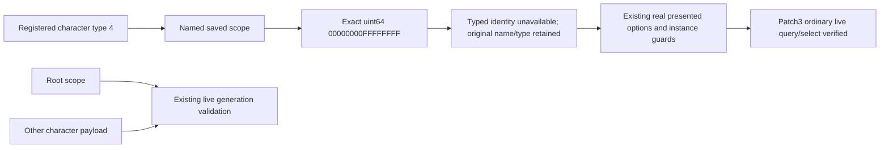

# Nullable saved character scopes on CK3 1.20.0.3

The genuine R4 current-event query stopped with `event_saved_scope_invalid` at paused event instance 3. A normal guarded checkpoint retained the same event and date. Its complete plaintext save identifies `pay_homage.0101`, root/character 7923, and named `puppeteer={ type=char identity=4294967295 }`. The old reader converts that payload to signed character ID -1 and rejects the whole inventory before scanning any GUI window. Consequently its zero window match count does not establish a missing presentation.

The immutable save is in the suite's `C-damengsan-three-R4/held-event-evidence`, 268,873,403 bytes, SHA-256 `c1fb8cf9134ace14f6af6d8fdd115860e0b8d85b565b0b3c8e99b08c0cd5658e`. Root separately checked whole-file brace closure and terminal content. The initial 36,924,155-byte archive also closes completely; the size growth is a separate scheduled-event producer issue, not evidence of checkpoint truncation. The original query RED remains preserved. No new process-memory diagnostic, live input or selection was needed to identify the saved value.

## Exact native and vanilla contracts

This migration is limited to CK3 1.20.0.3, Steam build 25652598, EXE SHA-256 `94b55397abb687a3dcd436805a5d885e6be90fa6c693feb44a9e3bbeeade02a6`.

| Native producer or consumer | Exact observed behavior |
| --- | --- |
| `0xEBE4`, `0xEC15` | Registers the literal `puppeteer` through the script-identifier table, output slot RVA `0x5D4C0D8` |
| `0x9D5738..0x9D576D` | Constructs type 4 and a zero-extended full 64-bit payload `0x00000000FFFFFFFF`; uses that same named identifier and calls saved-scope upsert `0x373A110` |
| `0x373A110..0x373A249` | Copies the 16-byte token into a 24-byte named row, preserving type/subtype/payload |
| `0x43FB20..0x43FBDD` | Registers native character type 4 and its existence callback |
| `0x22565B0..0x225660B` | Resolves the full generation ID; a character object ID of -1 explicitly yields false |

The exact-byte/instruction checks are added to the existing [patch3 event-context ledger](../../ck3_autonomous_player/native_bridge/research/ck3_1_20_0_3_fullscreen_event_context.json) and consumed by its offline verifier. Native callbacks were disassembled, never executed by this investigation.

Installed vanilla `common/decisions/_decisions.info` lines 212/225 describes `scope:puppeteer` as the ruler that might initiate a decision through a puppet. `common/decisions/30_court_decisions.txt` produces the homage context; `events/decisions_events/pay_homage_events.txt` forwards it to the liege through `pay_homage.9999` and `pay_homage.0101`. The event does not require a puppeteer. Searching all seven suite roots found no scripted producer or override of this event or named scope; Tianjia only overrides its localization, outside the current failure criteria.

## Minimal reader change

Ownership remains in the authoritative generic native bridge. The exact patch3 binder sets an internal `allow_null_saved_character_scope` flag. After the existing registry/index/key validation, only a **named saved scope**, registered native character type 4, and the exact full zero-extended sentinel receive this existing typed representation:

```json
{"typed_identity":{"status":"unavailable","reason":"character_scope_is_null"}}
```

The internal C++ identity has `available=false`, an empty optional `character_id`, and `unavailable_reason=character_scope_is_null`. The JSON serializer publishes the existing `status/reason` shape above, with no fabricated character-ID field. The saved name, name identifier, type key, raw type index and subtype remain intact. This is an absent optional identity, not a live character or a decision target. No new DTO shape, MCP method, caller-provided address, selection behavior or Python fallback is added. Consumers requiring that character still receive an explicitly unavailable identity.

The serializer's new internal opt-in defaults to false and is set by the event-query response only from the actual exact patch3 descriptor SHA. Named saved scopes alone receive it; root validation does not. The existing patch3 build-identity renderer supplies the genuine patch3 backend/coverage labels. Python's closed-schema consumer accepts the new precise absence reason only for that exact patch3 provenance and a named character scope, preserving its old representation and strict root behavior.

Root character validation stays nonnull and generation-bound. Invalid nonnull IDs, missing slots, stale generations, zero, unknown/mismatched types, noncanonical high bits and sign-extended -1 still deny the whole query. Pre/post scope inventory equality remains mandatory. Patch2 admission stays false until an independent contract and need justify it; unknown executable hashes remain rejected. Ordinary and fullscreen genuine shown/enabled option checks remain unchanged.



`open_kaishek` is not applicable to this native PE/token reader and C++ byte-layout fixture; no CK3 script is edited. Exact offline evidence and fixture qualification cannot establish that the next live context succeeds or that a hundred-year campaign completes.

## Qualification

The new epoch freezes production and fixtures separately from historical p4. Required scope remains the same nine native tests: registry, adapter, commands, context, events, event-window context, thread runtime, semantic adapter and exact patch3 semantic worker. Added reader fixtures exercise null saved scope alongside another scope in both window forms, genuine disabled/enabled options, serialized null identity, null root rejection, patch2-disabled rejection, corrupt nonnull IDs/high bits/types, and scope drift. Build and final receipt identities are recorded after the actual run below. Historical p4 fixture RED and R4 live RED are retained.

The first frozen prototype `C:/cb123n1` completed production compilation, then retained an **8/9 RED**: the serializer still rejected unavailable character identities, and the prototype fixture expected an ID field absent from the existing wire contract. The separately frozen `n2` epoch includes the necessary reader, serializer, descriptor-bound response and Python consumer repair; no prototype source or failure receipt was overwritten.

`n2` completed all 401 scheduled compile/link steps, **9/9 scoped native tests**, dependency checks and unchanged-source fingerprint verification. The rebased Python event-window suite passed **32/32**. Three actual JSON frames from that same CTest log were consumed by the real Python normalizer: the ordinary patch2 control and two patch3 null-scope frames from ordinary/fullscreen presentations. The two null frames retained the real root, mixed scopes, disabled genuine option and incomplete effect readiness. No fixture was rerun to obtain those frames.

| Frozen production identity | Value |
| --- | --- |
| Source directory / base commit | `C:/cb123n2` / `641d54997877d4125049fb34bde85aeaa7664b93` |
| Complete native tree SHA-256 | `a0567c4ea859c6ceb6d8eb5101c77d01e285294752abc33b98175c4e922aee35` |
| Production source fingerprint | `8ADDA005FF10EB2AEB8304B260A23B3CBA03BF700DFFA75D477D32B712C5D4D7` |
| Seven-file overlay/source receipt | `_runtime/native-12003-nullscope2-source-bindings.json`, SHA-256 `74501be4dd47d74c1d7afb06e1685839dbba972605e52e48ae4d2eb11431d216` |
| Exact ABI/source manifest SHA-256 | `4e40f92ce97e225beacc785ef4973c430f5c1ffef957c3e520ce9ff7b723126b` |
| DLL | `C:/cn123n2/xar_ck3_bridge.dll`, 4,078,592 bytes, SHA-256 `db1791d1fd529a6d82cb0fc5cdbf4323f854c5d0c3a5163b2adf84cad3e08edc` |
| Injector | `C:/cn123n2/xar_ck3_bridge_injector.exe`, 39,936 bytes, SHA-256 `60009a217f22deccacc668058492d6eeecd5929594f4fee13b7b4e202740b8d3` |
| Final qualification receipt | `_runtime/native-12003-nullscope-final-qualification.json`, SHA-256 `4b16982f5355276c75819f95933b43ef0f85a3438ef335d9429513d897cddb66` |

The final receipt binds scoped logs, original prototype RED, exact offline checks, saved-event source evidence, cross-layer consumption and current Python consumer hashes. The consumer package rebased onto `50e353bfa142194cc2a53372c1aec726ddd98da1`; intervening council and feast/family native changes are **absent from this immutable DLL epoch**. All seven event-context overlay files remain byte-equivalent after LF normalization. Root must pin the qualified DLL epoch and current Python commit separately. Existing native profile fields, action APIs, policy and independent pause controller are unchanged.

This qualifies the frozen binary and its scoped contracts. At this qualification stage, live null-scope readback remained pending. The subsequent cold-run observation below closes that specific regression. Whole-target compilation, all CTest, complete effect preview and hundred-year stability remain unclaimed. The old attached DLL was never replaced in a live process.

## Actual cold-run regression

On 2026-10-02 at 00:33:51 UTC, the new `C-damengsan-three-R5` process, PID 16520, returned a genuine ordinary `pay_homage.0101` event query through the authoritative MCP. It used the qualified `n2` DLL above and Python consumer commit `5c05c7dcb90eb8ba66bce4f9a4357f19c0ef4b68`, on the same exact CK3 executable. The native event instance was 4, root character was 7923, and the actual window match count was 1. Named scope `puppeteer` retained type 4, subtype 0 and name identifier 228, with `typed_identity.status=unavailable` and `reason=character_scope_is_null`. The root remained available and generation-validated; no substitute character ID was introduced.

The actual presented option at index 0 was shown and enabled. Selection was followed by a separately verified native postcondition at revision 67 and raw date 77529096: the old instance had cleared. Evidence is preserved in the suite run's `native-campaign-policy-001/000091-mcp-receipt.json`, `000092-event-choice.json` and `000098-action-confirmed.json`; mod source binding is `d51519b438d4389472c197f64640a90c32819ef3`. This proves the previously blocked optional-null context can pass through the production query, Python consumer and selection path. It does not prove fullscreen live coverage, every option effect, or long-term campaign completion. Effect-preview readiness remained false and was not promoted to a complete semantic preview.

The reusable diagnosis is to distinguish an absent optional saved identity from a corrupt required root, verify the exact native producer and serializer together, and preserve the precise unavailable reason across the real wire contract. A query rejected before presentation scanning cannot establish that the GUI window is missing. Fixtures should also retain mixed scopes and genuine disabled options so admitting a null optional identity does not accidentally weaken action eligibility. The shared reader, serializer, fixtures and this version-bound report belong in the system repository; the suite's broadcast repair and campaign-specific results remain in its independent project.
