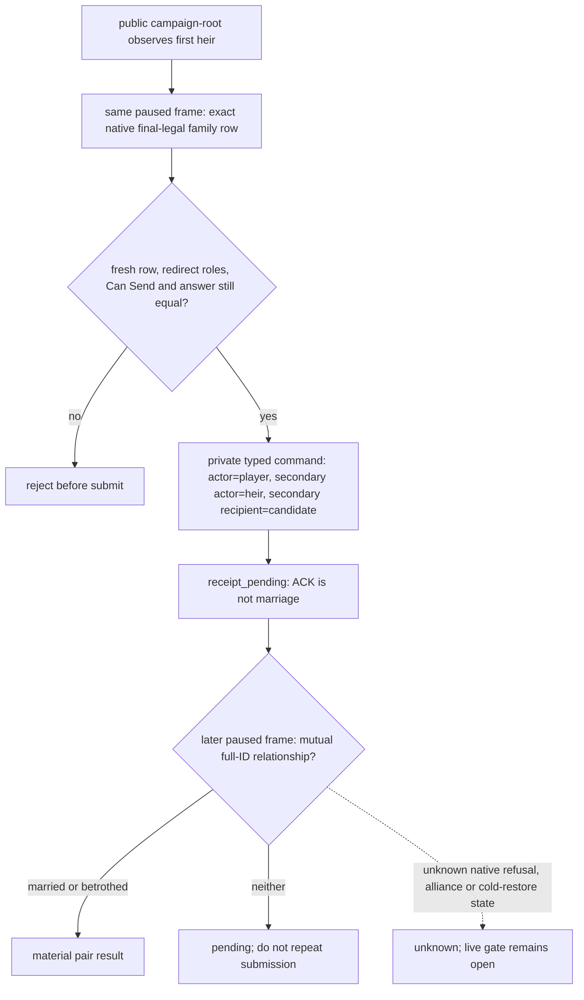

# Observed first-heir marriage final-legality query v1 (M5-OBS-R736)

Status: production-live **read-only candidate**, not an advertised capability.
No public hello capability, MCP tool, action, or strategy consumer is registered.
R0082 closed the new literal's available/same-frame gate; the unavailable/RED
registration gate remains open.

## Exact source and observed boundary

- CK3 1.19.0.6 `ck3.exe` SHA-256 `2D00FF3101EF70B566F2FCBAE292F09263199C80E9DC8F139B82D7D96F83DB86`.
- `00_marriage_interactions.txt` SHA-256 `681A9B669E5A16642A197B6FE16085193DFBB99A398D0E20E86173F5AC6DE219`: redirected marriage pair roles and actor-list family candidates. Exact source/call chain and dashed unknown branches are in [marriage-and-alliance.md](marriage-and-alliance.md), R720–R736.
- R736 read-only live report SHA-256 `83AE48416AD7B7F0CEC1E3DCE7F3C0322B6DAAA6139DF996B0238BFF798C8E94`; private family result SHA-256 `D58FE7C85CFB03655745188E2D820404E3747AA808F9F65620847C5A060F7B7A`. The public campaign-root observed the primary first heir; native complete Can Send plus recipient final answer yielded 657 distinct legal candidates. R736 used the **old private** step, not this new candidate protocol, so it does not close the new live gate.
- Native human-player AI Strategy rank source was unavailable in R720; `native_rank` stays `null`. Storage order, acceptance raw, and candidate count are **not** a rank or shared opportunity-cost score.

## R0082 new-literal paused read (2026-09-22)

The frozen ordinary feudal `dev3b_r639.ck3` source and newly prepared save both had SHA-256 `9104CCB8AE9D5776166FBBAEDA9B43BD08CBAA2CB5C057332EB8B7A1A212CC63`. A fresh isolated driver/profile from integrated master `b7a76e95d69600067e855d345d07c8bc92dfd5e4` used the exact CK3 EXE above and source-equivalent Release native DLL SHA-256 `162AE92B81114C2A608C81783260A16A9DF54150F854D00D151A95DB9CA19688`, with the private read-only CMake switch ON. The old R736 driver had no checkpoint and was **not** reused or called a cold restore.

[R0082 report](<Z:/ck3_mod_rewrite_process_assets/g2-m5-observed-heir-legality-65c84ed-20260922/live-R0082/report.json>) SHA-256 `040319A17FC5AA636A1A84E26BAD74C0D450DD7CD6609FC00FF8E4AFDA4BFD28` and [new typed result](<Z:/ck3_mod_rewrite_process_assets/g2-m5-observed-heir-legality-65c84ed-20260922/live-R0082/observed-first-heir-legality.json>) SHA-256 `D7C3FE9BC820983BE6E747A2415DCDDC69F4FD5A10E88D65DC4543759A8B698A` show the same paused native revision 3: public campaign-root query sequence 1 bound the primary first heir `38822`, followed by new `query-observed-first-heir-marriage-legality-v1` sequence 1. All 657 distinct family rows had complete Can Send, recipient final raw `0` mapped to allowed, and `native_rank=null`. No gameplay/UI action or date advance was submitted; the source/prepared save hashes were unchanged. CK3 PID `165884` was tracked-reclaimed after 173.271 wall seconds; postflight inventory was empty. This closes **only** the exact available read-only branch, not marriage selection, proposal, material outcome, next-turn consumption, or M5.

## Candidate bridge and MCP asset

Controlled exact-build bridge step: `query-observed-first-heir-marriage-legality-v1`, compiled only with `XAR_CK3_ENABLE_G2_M5_RANKED_MARRIAGE_PRIVATE_QUERY_V1`. It reuses the same paused snapshot/revision, connection-local public campaign-root first-heir binding, generation-checked character enumeration, redirected five-role context, complete Can Send, and recipient final native answer as the R736 private read. There is no CharacterID input and no marriage submit path. The former `query-observed-heir-marriage-choices-v1-private` step is unchanged for existing controlled callers.

Python candidate API: `NativeHeadlessGameplayDriver.query_observed_first_heir_marriage_legality_v1(expected_native_revision=...)` and the corresponding `GameplayBridgeService` method. Result schema: [`observed-first-heir-marriage-legality-v1.schema.json`](../../ck3_autonomous_player/schemas/observed-first-heir-marriage-legality-v1.schema.json). It returns `available` with all complete-Can-Send rows, a separately filtered `native_legal_candidates` set (final answer raw 0/1), or typed `unavailable`; transport/frame/shape failures remain RED. `native_rank` is always `null`. Faith inputs are consumed only through the opaque native final judgment. No new faith/doctrine query is exposed.

Future generic MCP name (not registered yet): `ck3_query_observed_first_heir_marriage_legality_v1(expected_native_revision)`. It should call this service method and return the same versioned schema on any authorized host connected to a compatible CK3 bridge. A host without CK3 can inspect the schema and source-bound fixture, but cannot truthfully claim live game capability. Do not add the MCP decorator or hello capability before the exact-build paused live test of the new bridge step, same-frame identity and candidate rows, unavailable/RED behavior, and schema response. Action and strategy promotion are separate gates.

R0082 supplies the available rows and schema, but not a paused native `unavailable` or RED branch for this new literal. Python normal/`-O` fixtures cover simulated unavailable and frame drift only. `create_server()` registers each `@server.tool()` unconditionally, so adding the decorator now would advertise an unclosed query to every backend. The minimal remaining observation is a separate suitable standard-feudal paused scene with no primary first heir or a real native family-query unavailable result, plus a source-bound RED/failure result that remains an error rather than a successful empty list. No new CK3 run or generic registration framework is implied by this documentation update.

Compatibility: this adds an optional unadvertised read-only protocol step and Python method; existing snapshots, hello capabilities, private step, actions, and MCP tool list do not change. `open_kaishek` needs no immediate migration. Before public registration, downstreams can adopt the schema by feature-detecting the future capability; they must not infer support from the presence of this source file or a native DLL with the private CMake switch alone. A versioned candidate DLL is required for the new literal; the frozen R736 DLL does not contain it.

## M5-HEIR-ACTION private static transport (not live)

The exact source/build and four-role decision tree above are unchanged. This
increment adds a separate, default-OFF
`XAR_CK3_ENABLE_G2_M5_HEIR_MARRIAGE_PRIVATE_ACTION_V1` switch, which requires
the private query switch. It does not register a strategy action, hello
capability, public MCP tool or generic religion model. The caller must select
one of the same-frame observed-heir final-legal rows; the bridge re-enumerates
the full native family set, reconstructs the five-role context, and compares
complete Can Send, the full raw recipient acceptance value and final native
answer before queuing the exact send-interaction command. Rank remains absent,
and final answer raw `0` or `1` is accepted only as the existing exact-build
source adapter mapped it; raw `2` is a refusal and unknown is not legal.

Private transport literals are
`submit-observed-first-heir-marriage-v1-private` and
`query-observed-first-heir-marriage-result-v1-private`. The Python driver
method consumes a caller-selected row from the versioned read-only legality
result; the [private action schema](../../ck3_autonomous_player/schemas/observed-first-heir-marriage-private-action-v1.schema.json)
keeps `receipt_pending` distinct from `marriage`/`betrothal`. The latter
require both participants independently to name each other in the later
native spouse/betrothed readback. This does not establish alliance, expense,
acceptance probability, or joint opportunity-cost quality. The native
resolution/refusal path and across-process pending-action recovery remain
unbound; consequently this candidate must not be enabled in ordinary
production or advertised. A paused same-build action/result/cold-recovery
gate is still needed before promotion. No existing `open_kaishek` field or
published ABI changed; a future consumer must explicitly negotiate the
new private schema and exact DLL feature flag, not infer it from M5 query
availability.
