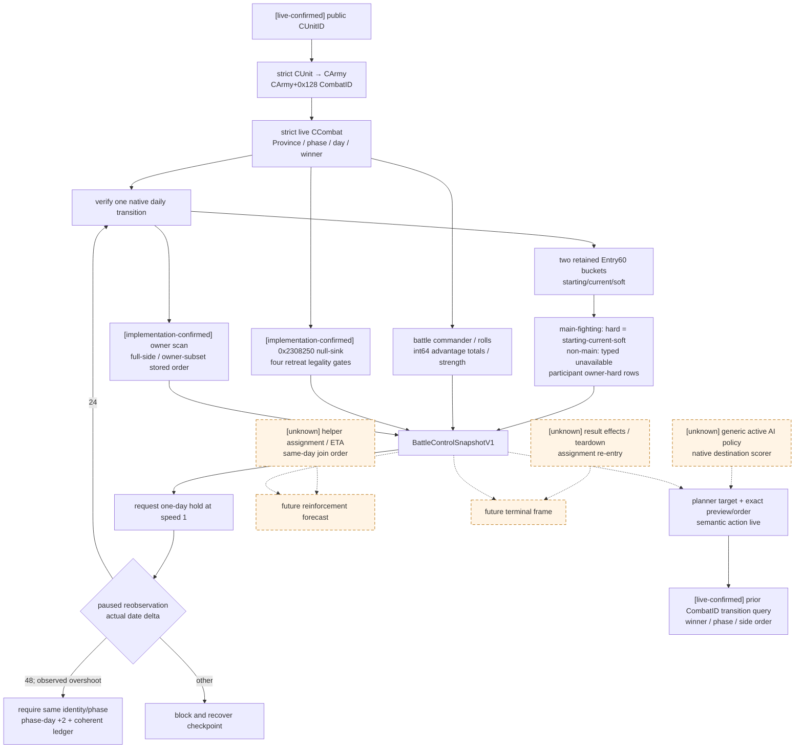

# CK3 1.19.0.6 战中控制帧：`query-battle-control-snapshot-v1`

本文冻结 P1 第一口可施工的战中 typed observation。它回答的不是“谁会赢”，而是同一 paused revision 中：

1. 玩家究竟在打哪一场 `CCombat`，当前 phase/day/winner/finalizer 状态是什么；
2. attacker/defender 两侧按原生顺序还保留哪些 army 与 regiment entry；
3. 每个 retained entry 的 starting/current/soft 与可判定的 hard（或明确 unavailable）是什么；
4. 当前 battle commander、roll、advantage 与原生 `side_strength` 是什么；
5. 所选 CUnit 属于哪一侧、主动撤退影响 full side 还是同 owner subset，以及当前四个原生 legality gate 是什么；
6. bounded hold 推进一天后，控制器应拿什么真实状态做后置验证。

机器契约是
[battle_control_snapshot_v1_abi.json](../../ck3_autonomous_player/native_bridge/research/battle_control_snapshot_v1_abi.json)。
本文不设计 retreat mutation，不猜增援 ETA，也不把原生 prediction ratio 或 side strength 叫作胜率。

## 冻结边界

| 项 | 值 |
|---|---|
| game version | `1.19.0.6` |
| `ck3.exe` | `Crusader Kings III/binaries/ck3.exe` |
| SHA-256 | `2D00FF3101EF70B566F2FCBAE292F09263199C80E9DC8F139B82D7D96F83DB86` |
| preferred image base | `0x140000000` |
| 地址 | 下文全部是 RVA |
| 研究日期 | 2026-08-26 |

本能力先完成 bounded static inspection，再于 2026-08-26 用 production exact bridge 完成 managed cold-restore
实机验收。证据标签沿用本目录约定：

- **[static-confirmed]**：由冻结 EXE 指令、RTTI/serializer 或已有 exact helper 直接证明；
- **[live-confirmed]**：已在真实 paused application-main frame 对拍；
- **[unknown]**：仍需逆向或实机 trace；Mermaid 中以虚线表示。

P0 已 [live-confirmed] 当前持续 checkpoint 的 `CombatID=335544325`、Province `2586`、attacker
`[83886341]`、defender `[357,33554657]`，并完成战中 cold restore。P1 随后从 cold checkpoint
`9104CCB8AE9D5776166FBBAEDA9B43BD08CBAA2CB5C057332EB8B7A1A212CC63` 连续观测 maneuver 1 至 main 2，
闭合 retained entry ledger、owner hard ledger、strength、合法 stale tick-start cache 与真实 casualty delta。因此
`battle_identity_live_ready=true`、`battle_hold_ready=true`，且 production planner 已连续两轮完成 query→advance→requery；
retreat target/order 的军队语义层与 prior-CombatID full-side transition 后来也已 live，但 owner-subset 与 reinforcement
timeline 仍未就绪。

状态必须拆开读：旧 artifact 与两个 live readiness 只覆盖**原 battle frame**；后来追加的 active-retreat
selected identity、owner scope、side flags 与四 gate legality 又在 fresh production paused query 中完成了 day 0→16 的验收，
因此当前 expanded frame 的 `active_combat_retreat_projection_production_live_ready=true`。随后 production composition 已完成
target preview/token/order 并实见 retreating/target/route；独立 full-CombatID lifecycle query 又绕开旧 frame 的 retreating
subject gate，读到 `main/12→pursuit/0`、winner 与双方 stored order。full-side 后置条件已完成，owner-subset 尚未完成。

## 一页结论

- [static-confirmed] `CCombat+0x08/+0x6B8/+0x6B0/+0x6B4/+0x6E0/+0x704` 足以直接发布
  CombatID、Province、phase、phase day、winner 与 finalizer-entered。`phase=done` 和 `finalized=true` 是两个字段，
  不能互推。
- [static-confirmed + P0 live-confirmed] `CCombat+0x20/+0x368` 两个 side 的 `+0x10/+0x1C` 是 full
  `CArmyID` 原生 stored order；每项经 `CArmy+0x124` 映射 public `CUnitID`，不得排序。
- [static-confirmed + live-confirmed] 两个 side entry bucket 是 levy `+0x28/+0x34` 与 men-at-arms `+0x40/+0x4C`，stride
  `0x60`。entry `+0x10/+0x18/+0x20` 分别是 starting/current/soft，均为 signed Q100000。
- [static-confirmed] **不存在独立的 per-entry hard 字段。只有 `fights_in_main_phase=true` 的 retained entry，
  hard 才能确定性派生为 `starting-current-soft`。**非主战单位在构造时就是
  `starting>0,current=0,soft=0`；差额含尚未投入/尚未 route 的 reserve，绝不能冒充 hard。
- [static-confirmed + live-confirmed] side `+0x58/+0x64` 另有 stride `0x18` 的 participant-owner hard ledger，row
  `+0x08` 是 CharacterID、`+0x10` 是累计 hard raw。它保存 owner 历史账；被 partial retreat 移除的 regiment row
  已不能再从当前 entry arrays 恢复 per-regiment hard，所以两类 ledger 必须分开发布。
- [static-confirmed] battle commander 是 `CCombatSide+0x74`，不是 `CArmy+0x120`；roll 是
  `CCombat+0x6D0/+0x6D4`，roll cadence 是 `+0x6E4`。
- [static-confirmed, correcting width] `CCombat+0x6C8` 与 `+0x710` 都由 exact helper 以 **qword** load/store，
  是 int64 Q100000 base/resolved advantage raw。v1 禁止沿用旧 ongoing DTO 的 int32 读取，否则会截断。
- [static-confirmed + live-confirmed] `0x23CC340(CCombatSide*)` 与 `0x23D2D70(entry*)` 是同步只读 strength leaves；
  `side_strength_raw` 不是 soldier count、AI power 或 win probability。
- [static-confirmed + live-confirmed] side `+0x98/+0xA0` 是本 tick 开始时由 `0x23CB840` 刷新的 cache，
  不是 paused frame 中 entry current 的强制一致性字段。main damage 已写 entry 而 cache 尚未二次 refresh 时，
  `stored_*_matches_derived=false` 是合法、稳定且必须发布的观测，不得把它拒成 unavailable。
- [static-confirmed + live-confirmed] expanded frame 已按 selected side 发布 `+0xC0/+0xC1/+0xC2`、
  strict day-14/phase/landless gate、`0x2308250(combat, army, nullptr)` boolean，以及镜像 `0x2308850` owner scan 的
  `full_side | owner_subset` 和 affected/unaffected stored-order public IDs。当前 live 场景确认 full-side；owner-subset 仍只有 unit
  fixture，必须在 mixed-owner 动作矩阵中另做实机验证。

## 原生控制树中的位置



“hold” 本身不是 CK3 mutation；它是 controller 的策略选择。生产动作请求一个游戏日并在 speed 1 运行，但异步 pause
可能在第一个可观测日界之后才生效。ACK 后必须读取动作实际 start/end/elapsed，再重读本帧：通常接受同 CombatID 的
`+24 / phase_day +1`；已实证的 `+48 / phase_day +2` 只有在 identity、phase 与 exact ledger 一致时才接受。其它跨度继续阻断；
显式 join/reopen/terminal/removal 仍走自己的 discriminant。日期前进或命令 ACK 单独都不算验证。

## exact-build 布局

### Combat identity 与阶段

| 字段 | exact layout | typed 语义 |
|---|---|---|
| identity | CCombat storage `module+0x570C758`，object `+0x08` | full-generation `CombatID` |
| sides | `+0x20` / `+0x368` | side0 attacker / side1 defender |
| phase/day | `+0x6B0/+0x6B4` int32 | `0/1/2/3=maneuver/main/pursuit/done` 与当前 phase day |
| Province | `+0x6B8 CProvince*` | strict `CProvince+0x10` full ID |
| width | `+0x6C0/+0x6C4` int32 | current base/final width；不是 precontact initial width |
| advantage | `+0x6C8/+0x710` int64 | base/resolved signed Q100000 |
| rolls | `+0x6D0/+0x6D4` int32 | 当前 side0/side1 commander roll points |
| winner | `+0x6E0` int32 | `-1` none，`0` attacker，`1` defender |
| roll cadence | `+0x6E4` int32 | 下一次原生 roll 调度所消费的 counter |
| forced winner | `+0x700` int32 | `-1/0/1`，与已经记录的 winner 分开 |
| finalized | `+0x704` byte | finalizer entered；不能由 phase 推断 |
| daily update | `+0x705` byte | dispatcher 正在更新；query 只接受 `0` |
| battle result | `+0x708` full ID | `-1` 才输出 null；其它值严格 generation readback |

`0x27FB6BA..0x27FB717` 先增 `+0x6B4`，再按 `+0x6B0` dispatch，并在回到稳定边界前清
`+0x705`。`0x230A5C4` 在 finalizer 入口写 `+0x704=1`。所以 v1 必须直接发布二者，不能把
`phase=3` 改写成 `finalized=true`。

### Side identity、commander 与 totals

| CCombatSide offset | 内容 |
|---|---|
| `+0x10/+0x1C` | full CArmyID data/count，原生 stored order |
| `+0x28/+0x34` | levy Entry60 data/count |
| `+0x40/+0x4C` | men-at-arms Entry60 data/count |
| `+0x58/+0x64` | participant hard-ledger rows，stride `0x18` |
| `+0x70` | primary participant owner CharacterID |
| `+0x74` | selected battle commander CharacterID；`-1` 合法 absent |
| `+0x98` | tick-start cached 两 bucket fighting raw 总和，int64 Q100000；main damage 后可合法落后于 entry rows |
| `+0xA0` | tick-start cached levy fighting raw subtotal，int64 Q100000；main damage 后可合法落后于 entry rows |
| `+0xB8` | parent `CCombat*` back-pointer |
| `+0xC0/+0xC1/+0xC2` | `disallow_retreat` / `allow_early_retreat` / `skip_pursuit`；最后一项不是 legality gate |

`0x23CB840` 先清 `+0xA0`，按 levy stored order 加 entry `+0x18`，复制到 `+0x98`，再按 MAA stored
order 加到 `+0x98`。exact daily caller `0x2309E80` 先在 `0x2309E8F/0x2309EA1` 调它刷新双方 cache，随后才计算
damage；`0x2309FE8` 与 tail `0x230A002` 调 `0x23CE080`，后者经 `0x23CDF70` 在 `0x23CDFC3` 写 entry soft、
在 `0x23CDFCB` 扣 entry current，而本 tick 结束前不再调用 `0x23CB840`。所以 main-phase 稳定 paused frame 中
`+0x98/+0xA0` 可以保留 tick-start 值，entry rows 才是当前伤亡后的权威值。

query **不得调用**这个 mutator，也不得以 cache 与 derived sum 不等拒绝整帧；它只读并保留两个 cache，同时发布
`stored_current_matches_derived` 与 `stored_levy_current_matches_derived`。双采样仍要求 cache、entries 与 equality
booleans 全部稳定且一致，真假都可构成合法帧。

`CCombatSide+0x74` 是 battle-wide canonical commander。原 contact builder 使用 `0x23C8A60` 从 side army order
选出并写它；这与单军 `CArmy+0x120` raised commander 不是同一观测。v1 只发布当前 full CharacterID 与 absent，
角色属性继续复用 combat-v3，不复制另一套 Character schema。

### Entry60 与 hard casualty 恒等式

两个 bucket 的 row 都是：

```text
Entry60 {
  +0x08 full CRegimentID
  +0x10 int64 starting_raw
  +0x18 int64 current_fighting_raw
  +0x20 int64 soft_casualties_raw
  +0x30 int32 effective_max_size
  +0x38/+0x40/+0x48/+0x50/+0x58
        int64 siege/damage/toughness/pursuit/screen raw
}
```

所有数量/四维 raw 的 scale 都是 `100000`。`+0x08` 先 strict-resolve CRegiment，再以
`CRegiment+0x140` 找 owning CArmy；该 ArmyID 必须位于当前 side 的 ordered army array，并经
`CArmy+0x124 → CUnit+0x178` 完成 public ID round trip。

per-entry hard 的 exact 证明链：

1. `0x23D0520` 把 `CRegiment+0x38 * 100000` 写到 starting `+0x10`，soft `+0x20=0`；类型参加 main 时
   current `+0x18=starting`。`0x23D05E4..0x23D05FA` 证明不参加 main 时 current 保持零，因此该类 row
   一出生就不满足 `starting=current+soft+hard`；差额此时是 reserve，不是 hard。
2. `0x23091DB..0x230926B` 对 route/non-main transition 把 starting 或 current 加到 soft，再把 current 清零。
3. `0x23CDF70` 的写点是 `+0x20 += soft_delta`，随后 `+0x18 -= soft_delta + hard_delta`。
4. 对参加 main 的 retained row，pursuit 从 soft pool 转成 permanent loss 时，soft 减少相同 hard 数量；
   current 已不增加。

因此只对**当前仍保留且 `fights_in_main_phase=true` 的 row**：

```text
hard_casualties_raw = starting_raw - current_fighting_raw - soft_casualties_raw
```

这是确定性派生，不是估计。wire 必须同时发送 `hard_casualties_status=available` 与
`hard_casualties_source=derived_starting_minus_current_minus_soft`，避免使用方误认为 `+0x28` 等位置有一个原生 hard
字段。计算用 checked int64 signed subtraction；不 clamp 负数，也不先换算为 whole soldiers。

对 `fights_in_main_phase=false` 的 row，v1 固定返回
`hard_casualties_status=unavailable`、`hard_casualties_raw=null`、
`hard_casualties_unavailable_reason=non_main_reserve_not_distinguishable_from_hard`。即使某些 loser/pursuit 帧中
`starting-soft` 恰好等于 hard，v1 也不先猜 route lifecycle；后续只有闭合独立 per-entry route marker 后才能收紧。

边界是 partial owner retreat 等路径可以从 live side 删除 entry。删除后无法从当前数组恢复该 regiment 的历史 hard；
side `+0x58/+0x64` 的 row `+0x08 CharacterID/+0x10 hard_raw` 是独立、累计的 owner ledger，v1 必须原序发布。
所以：

- `derived_main_fighting_entry_hard_casualties_raw` 只合计仍在数组中且参加 main 的 rows；
- `non_main_start_minus_current_minus_soft_raw` 仅为诊断差额，字段名明确不把它称作 hard；
- `participant_hard_total_raw` 是当前保存的 owner 历史 ledger；
- 两者不能无条件要求相等，也不能拿 owner total 反分摊到已消失的 regiment。

## strength、roll 与 advantage 的闭合/未知边界

| 域 | v1 能发布什么 | 证据状态 | 不能据此声称什么 |
|---|---|---|---|
| battle commander | side `+0x74` full CharacterID / absent | static-confirmed | AI 何时替换 commander、角色未来是否受伤 |
| current roll | combat `+0x6D0/+0x6D4`，cadence `+0x6E4` | static-confirmed | 下一次随机结果；bounds 需复用 combat-v3 |
| base/resolved advantage | `+0x6C8/+0x710` int64 Q100000 | static-confirmed | 完整 ongoing source identity、未来 event/effect 反馈 |
| entry strength | `0x23D2D70(entry)` int32 | static-confirmed | soldier count 或概率 |
| side strength | `0x23CC340(side)` int32、scale `100000` | static-confirmed + live-confirmed | AI power、win probability |
| current fighting | entry-current checked sum；side `+0x98/+0xA0` 另作 tick-start cache 发布 | static-confirmed + live-confirmed | 初始军力、未来增援 |
| exact forecast | 不在 v1 发布 | unknown / incomplete | `continue` 的 calibrated 胜率 |

`0x23CC340` 严格先扫 levy、再扫 MAA，并对每 row 调 `0x23D2D70`。后者读取 current `+0x18` 与
damage/toughness `+0x40/+0x48`。这两个 helper 是允许的只读调用；`0x2308D50` 和 `0x23CB840` 会写真实
combat/side，禁止在 query 中调用。

exact disassembly 同时纠正一个实现陷阱：`0x2308D9A` 对 base advantage 使用 `mov rbx,qword ptr
[combat+0x6C8]`，`0x2308DCE` 以 `mov qword ptr [combat+0x710],rbx` 写 resolved。v1 的 C++ contract、JSON 与
Python normalizer 都使用 int64 `_raw`；legacy ongoing-combat 投影也已同步升级，不能在任一消费层截回 int32。

## 最小 typed wire

顶层只接受 public full CUnitID：

```text
query_battle_control_snapshot_v1(subject_public_cunit_id, expected_revision)
```

核心 DTO：

```text
BattleControlSnapshotV1 {
  snapshot_revision, observed_date_raw,
  subject_public_cunit_id, subject_native_carmy_id,
  combat_id, province_id,
  selected_public_cunit_id, selected_native_carmy_id,
  selected_owner_character_id, combat_province_id,
  side_index, side_scope: full_side | owner_subset,
  affected_public_cunit_ids_in_stored_order,
  unaffected_same_side_public_cunit_ids_in_stored_order,
  side_flags: {
    disallow_retreat, allow_early_retreat, skip_pursuit
  },
  legality: {
    status, native_boolean,
    phase_raw, phase,
    retreat_elapsed_baseline_date_raw,
    elapsed_whole_days,
    minimum_elapsed_whole_days_exclusive,
    landless_gate_allows_retreat, legal_now,
    reason_codes_in_native_order,
    native_reason_keys_in_native_order,
    earliest_day_gate_date_raw
  },
  phase, phase_raw, phase_day,
  winner_side, winner_raw,
  forced_winner_side, forced_winner_raw,
  finalized, battle_result_id?,
  base_combat_width, final_combat_width,
  roll_cadence_counter,
  base_advantage_raw, resolved_advantage_raw,
  attacker: BattleControlSideV1,
  defender: BattleControlSideV1
}

BattleControlSideV1 {
  side_index, role,
  primary_participant_character_id,
  selected_commander_character_id?,
  current_roll_points,
  ordered_armies: [{
    native_carmy_id, public_cunit_id,
    owner_character_id, combat_backlink_id
  }],
  levy_entries: [BattleControlRegimentEntryV1],
  men_at_arms_entries: [BattleControlRegimentEntryV1],
  stored_current_fighting_raw,
  stored_levy_current_fighting_raw,
  stored_current_matches_derived,
  stored_levy_current_matches_derived,
  derived_current_fighting_raw,
  derived_soft_casualties_raw,
  derived_main_fighting_entry_hard_casualties_raw,
  non_main_start_minus_current_minus_soft_raw,
  participant_hard_ledger: [{ participant_character_id, hard_casualties_raw }],
  participant_hard_total_raw,
  side_strength_raw, side_strength_scale
}
```

Entry DTO 的完整字段和 exact type 由 machine ABI 冻结。两个 bucket 分开发，不合并后重排；bucket index 是
原生 row index。这样 phase event knight source、casualty remainder 与 pursuit stored order 后续都能直接复用。

## application-main 与 generation gates

该 query 必须复用 P0 actual-contact 的 identity spine，不在 Python service 层拼接两个独立 native 查询。一次
application-main callback 内执行：

1. outer `game::ReadSnapshot`：要求 paused，并冻结 revision/date/played character；
2. sample A：strict CUnit→CArmy→CCombat→Province→双方 Army/entry/Character 全图；
3. sample B：重新读取完整全图和所有 derived/helper 值；
4. outer snapshot 再读：paused、revision/date/played character 必须不变；
5. 只有 A/B 完全相等才发布。

关键 full-generation 条件：

- subject `CUnit+0x178` 与 `CArmy+0x124` 双向一致；`CArmy+0x128` 严格解析同一 CCombat；
- embedded side `+0xB8` 都指向该 CCombat；subject 只出现于一侧，两侧 nonempty、disjoint；
- 每个 side Army 都以 `CArmy+0x128` 回指同一 CombatID，再映射 public CUnit；
- 每个 entry RegimentID 必须 strict resolve，`CRegiment+0x140` 指向当前 side Army，且该 Army 的 regiment
  container 含同一 full ID；
- primary、commander、owner-hard CharacterID 都按 full generation 回读；
- selected IDs/owner/combat Province 必须与既有 subject/combat identity 同帧相等；selected CArmy 只出现于一侧；
- scope 对 selected side 的每个 Army owner 按原生 stored order 重算；affected 仅含 selected owner，unaffected 含其余 owner；
- `BattleResultID==-1` 才允许读 `module+0x57C0320` fallback；positive stale generation 必须返回 `state_changed`；
- `0x2308250` 只以 null ErrorSink 调用；`0x26165B0` 只读取返回对象 `+0x38` bit 10。四 gate 的 raw inputs
  在调用前后保持稳定，reason 顺序必须是 disallow → day → phase → landless，且 `legal_now==native_boolean`；
- phase 只接受 `0..3`，winner/forced winner 只接受 `-1..1`；
- `+0x705==0`；`+0x98/+0xA0` 与 entry checked sums 都以 checked int64 保留，两个 match boolean 必须如实反映
  比较结果，但 `false` 不会让帧 unavailable；
- 任一 count 为负、越界、算术溢出或两次 sample 漂移，整帧 unavailable，并给稳定 reason。

首版 native traversal bounds：side armies `4096`、每个 entry bucket `16384`、participant-hard rows `4096`、
per-army regiments `4096`。wire 另有 `900 KiB` snapshot payload 上限，为 protocol 的 `1 MiB` frame 留出 envelope；
过大的真实战斗帧在 `WriteFrame` 前转为 bounded command error，不会在 application-main 查询完成后断开 pipe。这个边界直接
服务于大战可用性，不扩展额外安全协议。

## 最小 production live acceptance

起点 lineage 使用已经存在的战中 source save，并由托管会话物化实际 cold checkpoint：

- source save SHA-256 `40D4E73D2B45BEF7F8F94F9FC8007A5A039031840C24D72758E5D6452E1A2C6C`；
- fresh acceptance 实际 cold-restore checkpoint SHA-256
  `9104CCB8AE9D5776166FBBAEDA9B43BD08CBAA2CB5C057332EB8B7A1A212CC63`；
- subject `83886341`；
- expected `CombatID=335544325`、Province `2586`；
- attacker `[83886341]`、defender `[357,33554657]`。

v1 最小实机矩阵：

1. paused application-main 查询 `available`，identity/side order 与 P0 artifact 完全一致；
2. 两 bucket 每 row 完成 Regiment→Army→public CUnit→same Combat 回读；
3. 每个 main-fighting retained row 验证 `hard=starting-current-soft`；每个 non-main row 必须返回 typed
   unavailable 而非伪造 hard；side `+0x98/+0xA0` cache 与 entry sum 分别保留，match boolean 必须真实；
4. 连续两次查询除 request/query sequence 元数据外 byte-identical；
5. managed cold restore 后 identity、phase/day、全 ledger、commander、roll、int64 advantage、strength 全等；
6. 请求一日的 bounded advance 后，按动作实际 start/end/elapsed 验证同 CombatID 的 phase/day 与 ledger：通常为
   `+24 / +1`；只有已实证的 pause overshoot 可为 `+48 / +2`，且必须保持 identity/phase 与 exact ledger coherent；
   否则返回显式 terminal/removal discriminant 或阻断；ACK 或 date 单独不算；
7. managed cleanup 后 CK3 process 为零，并恢复基线 checkpoint/driver state。

这组原始矩阵已完成，并且第 6 项覆盖 main day 1 与 day 2 的真实 soft/hard/current ledger delta，故
`battle_identity_live_ready=true` 仍成立。历史 `+24 / +1` hold primitive 也仍有效；但下述正式长跑反例否定了执行器
“请求一日必然只观察到一个日界”的假设，因此最小修复与 checkpoint 复跑前 `planner_battle_hold_live_ready=false`。
这些 readiness 只允许 controller 观察战斗与选择 bounded hold；retreat command 的后续独立证据和 reinforcement forecast
不能由它们推断。

这里的“已完成”最初只指原 frame 字段；下列旧 artifact 的 canonical hashes 不含后来追加的 active-retreat 字段。随后 fresh
production run 从同一 immutable battle save 查询 17 帧：elapsed day 0–14 均为 native false + `too_early`，day 15/16 在 main
phase 翻转为 native true 且 reasons 为空；identity、full-side stored order、flags、landless 与立即双查询都稳定。因此只读
expanded projection 已 live。之后 full-side 真实动作通过 target/route/retreating 军队语义层，prior-CombatID
winner/phase/side order 也由后述 full-ID query 验收；仅 mixed-owner owner-subset 仍未验收。

新增 progression artifact 位于
`C:\Users\xenoa\AppData\Local\Temp\xar-active-retreat-query-v1-a72f4846fa01477ab26860479927c1b3\logs\active-retreat-query-days-live.json`，
size `3710489`，SHA-256 `FB521B39AD5529434596212DB9ADC1EA27D4C270D28D13575B9A2D80913BCF40`；使用 DLL SHA-256
`490E90B41AF43747E43CAE104D11DEFA20D3E27353577114DB7874E1ED09A190`，managed cleanup 成立。

full-side semantic action artifact 位于
`C:\Users\xenoa\AppData\Local\Temp\xar-active-retreat-query-v1-a72f4846fa01477ab26860479927c1b3\logs\active-retreat-action-full-side-live-v4.json`，
size `627856`，SHA-256 `A57FF20DCAD39DF79DAB6A9418054C36B0F5489C5D8B5E9E880CE899AE89DF9C`。day 15 的
`CombatID=335544325`、main/12、full-side `[83886341]` 经 exact route `[2579]` 与单次 token 提交后，在更新 paused snapshot
成为 `in_combat=true/retreating=true`、target/route `2579`；managed cleanup 成立。旧 subject-bound query 随后按 retreating
拒绝，因此本证据只令 `retreat_semantic_action_live_ready=true`，不令 full-side postcondition ready。

full-side complete transition artifact 位于
`C:\Users\xenoa\AppData\Local\Temp\xar-active-retreat-query-v1-a72f4846fa01477ab26860479927c1b3\logs\active-retreat-action-full-side-transition-live-v6.json`，
size `629571`，SHA-256 `21D58737126CA4ED8B0B49DB7749EA4701F3BA6F94A8B8493698F8737E5784FA`。新增
`query-battle-transition-v1-335544325` 不依赖 selected CUnit eligibility；同一 day15 command 后返回 `available`、
`pursuit/0`、winner=`defender`、forced winner=`none`，attacker `[83886341]`、defender `[357,33554657]`。
同一更新帧的军队 retreating/target/route 仍成立，source save SHA `9104CC...CC63` 未变，managed cleanup 后 CK3 process 为零。
因此 `prior_combat_transition_query_ready=true`、`full_side_live_acceptance_ready=true`。

planner-integrated hold artifact 位于
`C:\Users\xenoa\AppData\Local\Temp\xar-planner-battle-control-live-20260826-0910.json`，size `432082`，SHA-256
`96CE25384517F0060A58623958DE071F43C3C2F7B68AEB6E668473E986C1DD57`。`choose_one_life_turn` 在严格动作白名单下完成两轮
battle query→one-day life advance→battle requery：同一 `CombatID=335544325`，日期
`53178264→53178288→53178312`，maneuver day `1→2→3`，两轮 transition 都是 `same_combat_advanced`；撤退动作执行数为 0。
source autosave SHA 前后不变，managed cleanup 与临时 profile clone 删除均成立。因此
`planner_battle_hold_live_ready=true`，但这不解锁 forecast/retreat strategy。

### 2026-08-27 production longrun：两日 paused overshoot blocker

正式 `native-one-generation` 在 turn `1134` 的 speed-1 `life-advance` 中实际返回
`53195880→53195928`、`elapsed_days=2`、`progress_status=postcondition`。前后 exact frame 都绑定
`CombatID=687865860`、同 CArmy/Province、`phase=main`，phase day 为 `32→34`；双方 current/soft/hard ledger
同时演进：attacker `397120/34722071/14880809 → 0/35000056/14999944`，defender
`16941842/27900826/11957332 → 16818259/27987341/11994400`。这与 exact-build dispatcher 每个 native day
令 phase-day 加一的树一致，不能判成原生非法跳跃。

旧 verifier 把所有 post-advance frame 固定限制为 `before_date+24`，因此在 turn `1136` 返回
`native_war_battle_transition_invalid`。report size `6519552`、SHA-256
`E1710E19DC4039716D3EC7A42BC6729D6245E6D99F2FDDDD0771E8FC7CC36403`；first blocker size `4814`、SHA-256
`DBACD2824CCB8E382CEC1EFB5649A634D305D957BEED3082144C08E1526F1470`。最后 durable checkpoint
`date_raw=53195880/history=1888`、SHA-256 `3F8A3355ADFC00190C4679ED887114A4E70C4FCEDD7DECF5E7FBB935B3EE4355`，
角色 `29829` 存活且 cleanup 全绿。修复边界只覆盖 action 自报 `elapsed_days=2`、`date_delta=48`、同 identity/phase、
`phase_day_delta=2` 与 coherent ledger；不放宽任意多日或任意 phase 跳跃。

### 2026-08-26 production 实机证据

- artifact：`C:\Users\xenoa\AppData\Local\Temp\xar-war-entry-production6b-state\logs\battle-control-v1-cold-main-cache-fix-fresh-live.json`，
  size `1253493`，SHA-256 `A0FC6BB7268E38026CC8EED6D6388BFD675AD5DCFB60A1A65FE1C1B64E816AC6`；
- fresh bridge DLL SHA-256 `2F50F14699B8E6D9DF468DCFBEDD145814E50CAC0204D70A32E8CBFD36C34E8F`，
  injector SHA-256 `B22548AEC9EE2B60EBA14CCDE2290AA1CED47EE5D2D277D5031742D683E0F1A3`；
- managed CK3 PID `80196` 从上述 `9104CC...CC63` checkpoint cold restore；session report、shutdown、
  `tree_gone`、`cleanup_proven` 与 driver close 全为 true；
- 每一帧都连续查询两次，canonical frame 相等且 query sequence 严格增加。

| date raw | phase/day | canonical frame SHA-256 | attacker current/cache 与 casualty | defender current/cache 与 casualty |
|---:|---|---|---|---|
| `53178264` | maneuver/1 | `C110C9F4EE97056E452B02009D86D7A9DAF4C38EA9ED5B415AF5EEE5E15CB992` | stored=derived `140300000`，match true | stored=derived `322100000`，match true |
| `53178288` | maneuver/2 | `6F365F256736DA492A92F51441EF5137DBF5B8273B2180FECC007B606A26AB3D` | stored=derived `140300000`，match true | stored=derived `322100000`，match true |
| `53178312` | maneuver/3 | `F5F00242F6E5466B0044170626EA0116DAE5CFFA58F3D1863F18B8A4A78E6D29` | stored=derived `140300000`，match true | stored=derived `322100000`，match true |
| `53178336` | main/0 | `335FCF0B8BC50A5C899CDA8FB4269FB4F694BF2EB36445DAA267A26D27736D17` | stored=derived `140300000`，match true | stored=derived `322100000`，match true |
| `53178360` | main/1 | `F958D0321EDFE91EEA11A25C4A5A7E1245450497ED6314B00F5B355054C4D6D0` | stored `140300000` / derived `132798475`，match false；soft `4800997`，hard/participant-hard `2700528` | stored `322100000` / derived `314910073`，match false；soft `4709424`，hard/participant-hard `2480503` |
| `53178384` | main/2 | `A6683FE0DEF812E608B3E2A8A87D6191DB3082832EAB5CDD4C14727B91C2CEED` | stored `132798475` / derived `124946803`，match false；soft `9826086`，hard/participant-hard `5527111` | stored `314910073` / derived `309820894`，match false；soft `8042853`，hard/participant-hard `4236253` |

levy cache 也独立闭合：main day 1 attacker `84300000 → 78321731`、defender
`201300000 → 195382026`；main day 2 attacker `78321731 → 72118421`、defender
`195382026 → 191206818`，四个 `stored_levy_current_matches_derived` 都为 false。

## 实现记录

1. **[completed] P1.1 identity/mailbox**：复用 actual-contact C++ resolver 与 application-main mailbox；新 query 不复制第二套
   CombatID/side reader。
2. **[completed] P1.2 retained ledger**：投影 ordered armies、两个 Entry60 buckets、participant-hard rows。
3. **[completed] P1.3 hard derivation**：只对 main-fighting row 以 checked int64 `starting-current-soft` 发布 per-entry hard；
   non-main row 返回明确 unavailable，同时保留独立 owner-history ledger，禁止混账。
4. **[completed] P1.4 current metrics**：直读 commander/roll/width/int64 advantage，并调用只读
   `0x23D2D70/0x23CC340`；不得调用 refresh/finalize mutation helper。
5. **[completed] P1.5 production surface**：C++ typed contract、serializer、严格 Python normalizer、service/MCP facade、synthetic
   generation/order/ledger tests。
6. **[completed] P1.6 live**：paused checkpoint → cold restore → bounded transition through two main casualty days；
   battle identity/hold readiness 已关闭。
7. **[completed] P1.7 active-retreat read-only projection**：同一 C++ 双采样帧追加
   selected identity、owner scope、affected/unaffected stored order、side flags 与 exact 四 gate legality；fixtures 已覆盖严格
   day 14、allow-early、四 reason 顺序、合法 `-1` fallback、mixed owner、native/raw mismatch 与超 int32 earliest date；production
   paused run 又直接证明 full-side 与 day 14 false → day 15 true。
8. **[completed] P1.8 active-retreat command/semantic layer**：Python production composition 将 battle frame、exact
   `PreviewMoveArmy`、target route 与一次性 token 全绑定，复用玩家 move command；full-side 实机看到真实 retreating/target/route，
   ACK 保持 verification pending。
9. **[live RED] P1.9 planner-integrated hold**：历史 planner 连续两轮 exact battle query、`+24` advance 与同 CombatID requery
   仍为有效证据；正式长跑又实见请求一日后 paused envelope 实际为 `+48 / phase_day +2`，旧 verifier 因硬编码单日上限阻断。
   最小 correlated-overshoot 修复与 checkpoint 复跑前不得恢复完成态；全程没有调用 retreat 或视觉 fallback。
10. **[completed] P1.10 full-CombatID transition live**：新增不依赖 retreating subject 的 paused lifecycle query；full-side
    实机闭合 `main/12→pursuit/0`、opposite winner 与双方 stored order。

下一项构造 owner-subset 场景，同时进入 reinforcement assignment/timeline query。generic native-AI destination scorer 继续作为 opponent model unknown，不阻塞
planner-selected exact target 动作。

## 复现命令

```powershell
Get-FileHash -Algorithm SHA256 'Crusader Kings III/binaries/ck3.exe'

& 'tools/.venv/Scripts/python.exe' `
  'ck3_autonomous_player/native_bridge/research/disasm_ck3.py' 0x23D0520 --size 0xE0
& 'tools/.venv/Scripts/python.exe' `
  'ck3_autonomous_player/native_bridge/research/disasm_ck3.py' 0x23CDF70 --size 0x110
& 'tools/.venv/Scripts/python.exe' `
  'ck3_autonomous_player/native_bridge/research/disasm_ck3.py' 0x23CB840 --size 0x90
& 'tools/.venv/Scripts/python.exe' `
  'ck3_autonomous_player/native_bridge/research/disasm_ck3.py' 0x23CC340 --size 0x90
& 'tools/.venv/Scripts/python.exe' `
  'ck3_autonomous_player/native_bridge/research/disasm_ck3.py' 0x2308D50 --size 0xA0
& 'tools/.venv/Scripts/python.exe' `
  'ck3_autonomous_player/native_bridge/research/disasm_ck3.py' 0x2309E80 --size 0x1A0
& 'tools/.venv/Scripts/python.exe' `
  'ck3_autonomous_player/native_bridge/research/disasm_ck3.py' 0x23CE080 --size 0xA0
& 'tools/.venv/Scripts/python.exe' `
  'ck3_autonomous_player/native_bridge/research/disasm_ck3.py' 0x27FB617 --size 0x160
& 'tools/.venv/Scripts/python.exe' `
  'ck3_autonomous_player/native_bridge/research/disasm_ck3.py' 0x230A590 --size 0x80
& 'tools/.venv/Scripts/python.exe' `
  'ck3_autonomous_player/native_bridge/research/disasm_ck3.py' 0x2308250 --size 0x600
& 'tools/.venv/Scripts/python.exe' `
  'ck3_autonomous_player/native_bridge/research/disasm_ck3.py' 0x26165B0 --size 0x80
```

关键复核点：`0x23D0520` 的 entry 初始化；`0x23CDFC3/0x23CDFCB` 的 soft/current 写点；
`0x23CB845..0x23CB8C4` 的 two-bucket tick-start cache；`0x2309E8F/0x2309EA1` 的 refresh-before-damage；
`0x2309FE8/0x230A002 → 0x23CE080 → 0x23CDF70` 的 damage 后 entry 写点；`0x2308D9A/0x2308DCE` 的 qword advantage load/store；
`0x27FB67C/+0x717` 的 in-progress byte；`0x230A5C4` 的 finalized byte。
