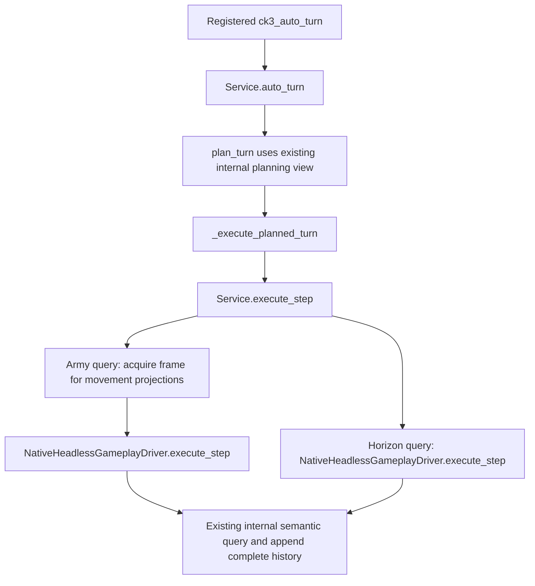

# Ordinary auto-turn Army query avoids a full history export

## Actual entry and source evidence

Root identified the retained R81 HOT05 requests
`007-r81-afterday-normal-turn01.json` and
`008-r81-afterday-normal-turn02.json` as `ck3_auto_turn` with empty arguments.
Their selected ordinary steps were an Army-strength query and a route-contact
horizon query, with recorded durations 116.770466 and 19.068565 seconds.
Earlier Army queries took 25.306334 seconds. No actual Driver, save or large
response was opened for this source investigation.

The Army-only frame acquisition in `GameplayBridgeService.execute_step`
previously called `self.snapshot()` with its public default. That reaches
`NativeHeadlessGameplayDriver.take_snapshot`, then `_history_snapshot`, which
deep-copies the complete command history. Its sole local consumer,
`_unit_next_movement_projection_rows`, reads the queried snapshot identity,
public/native revisions and current `player_armies`; it does not read history.

The relevant downstream native paths already avoid this export:
`_execute_native_war_step` selects an internal semantic snapshot for both Army
and horizon queries; `_execute_army_strength_query` explicitly requests
`include_native_command_history=False`; the horizon primitive explicitly uses
`internal_semantic_snapshot=True`. The existing planner also uses its locked
internal history view. This inspection proves one unnecessary complete-history
copy on the Army auto-turn path. It does not quantify its wall-time contribution
or explain the horizon query's remaining latency.

## Minimal change and boundaries

Only the Army-specific Service frame acquisition now calls
`self.snapshot(include_native_command_history=False)`. The public snapshot
default, registered tool signatures and results are unchanged. Full history is
still appended to the Driver and persisted at the same existing barriers. No
history is trimmed, no pending record or seed changes, and no native code,
policy selection, query timeout or ordinary revision check changes.

The source author based this package on `65c0cc8f` to isolate the changed
Service call. The change is independent of Native49 route-window behavior and
can be cherry-picked onto the coordinator's Native48 SDK branch. It must not
deploy unqualified Native49 SDK strategy with a running Native48 DLL.

## Sole new compound, NOT RUN

`tests/test_army_auto_turn_history_omission_service.py` defines the sole new
compound:
`ArmyAutoTurnHistoryOmissionServiceTests.test_registered_auto_turn_preserves_whole_and_complete_history_without_export_copy`.
It reuses the already qualified Native31 `arrival_distinct_province` whole:

`Z:/ck3_mod_rewrite_process_assets/g2-background-20261008/runtime31-first01/army_source31_arrival/wire/unit-arrival-transition-whole.json`

The adjacent `arrival_distinct_province.native-context.json` supplies the same
qualified current Army context. The prior callback consumer's small GREEN
receipt records those exact paths at
`g2-background-20261009/army-war-normal-turn/first02/consumer/COMPOUND-RECEIPT.json`.

The synthetic boundary is explicit: one selected Army-query plan, hello/paused
transport frame and request correlation. Registered `ck3_auto_turn` dispatch,
the Service enrichment and NativeHeadless Driver are real production code.
The compound checks zero full-history exports during auto-turn, one unchanged
native transport query, every original native value, the current movement and
callback projection lists, queried-frame provenance, the unchanged public
default's detached complete history, and all nine durable history entries after
the ordinary close barrier. Only reusable helpers are imported from the prior
consumer; its test and the native producer are not executed.

Root owns its single FIRST. The author ran no test, benchmark, producer, SDK or
game and makes no measured speedup or new live-readiness claim. Status:
source-ready, qualification pending. The separate
[compact ordinary rebind](ordinary-driver-compact-rebind-12004.md) addresses
the cold rebind's avoidable indentation, not this Army frame copy.
