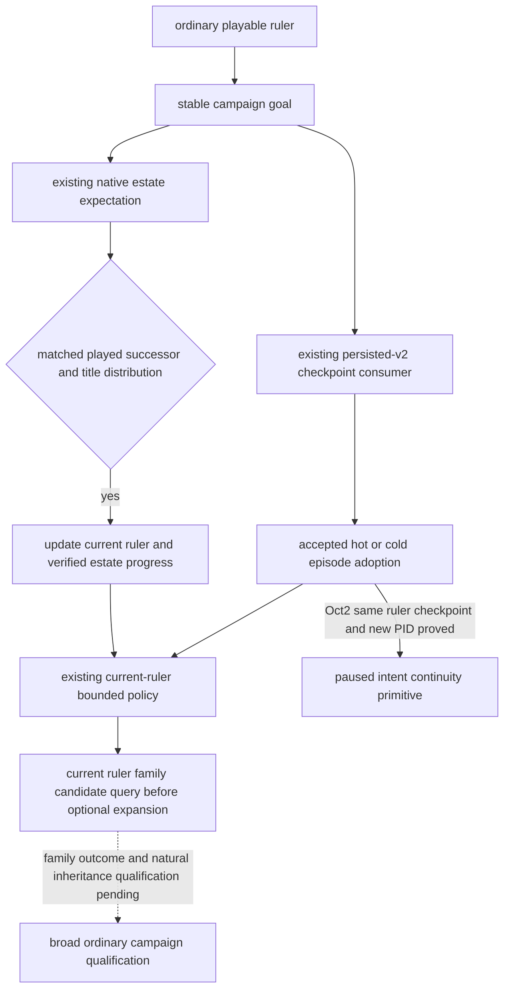

# Ordinary campaign goal continuity

Status: **production-live primitive for paused same-ruler checkpoint/cold
intent; natural inheritance and broad M7 qualification pending**. This
package implements the G2-M7 requirement to retain one high-level intent after
a checkpoint and natural inheritance. It adds no native query, command,
religion model, or alternative driver.

## Source inputs and policy boundary

The native input ledger is the existing
[campaign-root tree](campaign-root-context.md),
[succession and law tree](laws-contracts-and-succession.md), and
[marriage result tree](marriage-and-alliance.md). The current native readers
have historical qualification frozen to CK3 1.20.0.2, EXE SHA-256
`AE1BA6FF060BA603842F6F4A2DED0AF4B7D3666B3DD271F75FB01B0DA8E81B2D`:
[campaign](ck3-1.20.0.2-nonwar-campaign-context.md) and
[family](ck3-1.20.0.2-family.md). The October2 Robert reobservation below is
separately bound to CK3 1.20.0.3; it does not promote every historical reader.

Those sources distinguish the actual played heir, per-title estate outcome,
current marriage/betrothal relationships, native final legality, and material
marriage results. A retained goal is an input to our bounded policy; it is not
an assertion that CK3's AI has the same goal, that inheritance preserved a
dynasty, or that sending a marriage proposal achieved a family outcome.

The minimum ordinary goal is `dynasty_continuity`: keep reviewing the current
ruler's family and succession opportunities throughout the same campaign.
The existing marriage priority precedes optional expansion for an unpaired
current ruler. Forced events, pending interactions, active-war handling,
native legality, existing typed action gates, and the current opportunity
consumer retain their precedence. Existing marriage selection, costs, ranking,
and result models are reused. This package does not enable private trial
actions or claim calibrated long-term family utility.

## Persistence and inheritance

`native_driver.py` adds a semantic `campaign_goal` to the existing persisted-v2
state. Its stable `campaign_id` is the first ordinary episode ID; the origin
character and goal key survive subsequent ruler episode IDs. The first
playable frame of an older ordinary state initializes this goal, so older
states do not acquire a retrospective history of intent.

The existing same-PID state adoption and checkpoint cold rebind carry the
goal together with their accepted episode. A rejected checkpoint starts a
new goal with the new campaign binding. This uses the existing checkpoint
consumer and does not turn a driver file into evidence of game restoration.

`continue-as-reconciled-successor` updates the goal's current ruler only after
the existing M3 matched successor and title-distribution checks. Its progress
counts those verified estate transitions and records the latest matched
inherited titles and expected titles going to other heirs. It does not mark
partition loss as avoided or store stale marriage candidates as successor
instructions. Current action parameters still come from the new ruler's
observations.

`GameplayBridgeService.plan_turn` converts that goal to the existing
priority/focus plan and passes it into `choose_one_life_turn`. The actual next
choice and `campaign_goal_plan_used` appear in the same formal plan. Ordinary
campaigns consume this goal instead of a legacy roguelike next-run plan in
the state directory. Rogue one-life mode continues to use
`one-life-history.json` and its existing death/reload policy.

## Offline proof and remaining qualification

The focused fixture uses the actual `NativeHeadlessGameplayDriver`,
`GameplayBridgeService`, persisted driver consumer, and formal successor
`auto_turn`, with an in-memory fake endpoint. Checkpoint bytes and receipts
are explicitly fixture data. It proves goal retention, verified succession
progress, and the successor's actual next policy choice; it does not connect
to a named pipe or submit CK3 input.

The durable result is
`artifacts/g2-offline-2026-10-01/campaign-goal/result.json`. The four new
goal fixtures and 15 existing succession fixtures pass in normal Python;
the combined 19 also pass under `python -O`. The test-only receipt is
`result-tests.json`, SHA-256
`1cf9874e42cc28d20f6698c257af09a498882cc0f638441f75e4a1143804ab8a`.
Initial fixture assertion mistakes are retained there; the fixes changed
only test expectations, not the production consumer. Real natural
inheritance, actual goal-guided family results and later formal turns remain
qualification work. The fixture itself did not promote multiple
rulers/seeds/governments, century/full-campaign counts or G2-M7 completion.

## October2 CK3 1.20.0.3 paused Robert checkpoint/cold proof

The actual ordinary Robert source was officially prepared/rebound to CK3
**1.20.0.3**, EXE SHA-256
`94b55397abb687a3dcd436805a5d885e6be90fa6c693feb44a9e3bbeeade02a6`,
using frozen Python/native source `19a0e94510e8a41e0a7ee83e709a9dd914c5dc30`
and v4 DLL SHA-256
`94872a6793f4a928c36961966db4be0e7c921e62e255d792eb0b7472d3eeb386`.
The original full4028/saveh4025 archive, legal omitted/null goal, opaque save
and three historical ledgers remain retained. The current ordinary consumer
initialized the goal after actual identity adoption; no history of earlier
intent or inheritance was backfilled.

The root-owned direct first observation and normal checkpoint were GREEN in
game PID **74408**. A normal shutdown and actual new game PID **115688** then
produced a GREEN cold comparison. These are actual game PIDs from
`result.bridge_pid`; a unified-exec session ID is not a game PID. Both remained
paused at raw **53220000**, actor 29829, episode
`native-29829-2bc2d599f7f9`, ordinary lifecycle and `xar_off`. No game date or
selected plan step was advanced.

Both current frames observed `feudal_government`/`core_landed` with the 44
effective-feature rows and an available same-frame native adapter. Both
actual next plans consumed the same `dynasty_continuity` campaign ID, current
actor and progress (`reconciled_successions=0`, `last_succession=null`), with
`ordinary_goal_context_ready=true`. The cold proof also matched the actual
first checkpoint source and all three unchanged ledger byte streams.

| Actual material | First paused PID74408 | Cold paused PID115688 |
| --- | --- | --- |
| Full driver history / save anchor | 4029 /4029 | 4031 /4029 |
| Raw date | 53220000 | 53220000 |
| Government query | 3.52s | 3.84s |
| Normal nonwar plan observation | 12.76s | 13.08s |
| Normal checkpoint | 2.03s | Reused first saved pair |

The new save is 79,280,616 bytes, SHA-256
`e4d4eaad6f253bde013392c6973461e61adaa3c06d92f234ec72f2594ed87529`.
The complete latest cold driver/save pair, first/cold raw observations,
three ledgers, and actual managed supervisor result/stdout with exit0 are
frozen under
`artifacts/g2-maintainer-2026-10-02/resume-12003/m7-robert/paused-intent-19a0e945-v4/paired-proof-20261002-01/`.
Its authority is `M7-PAUSED-COLD-PROOF.json`, SHA-256
`0156ac7cbfee1dc4e5b48a500d5f6d9b8fb78a5ca5f60b9bedd8a5f432c28d6e`.
Root's observed normal-stop times were UTC 21:33:35 and 21:35:13; no separate
stop file was manufactured from those observations.

History counts follow the existing cold consumer: the old h4025 prefix plus
proven physical restore lineage first yielded full4026. A further physical
restore, current-root read and checkpoint yielded full4029/h4029; the new cold
restore and current-root read yielded full4031/h4029. The archived old
full4028 was not truncated or rewritten. Normal consumers may persist the
goal and succession expectation; the direct helper does not fill those
fields or replace the production driver.

Two earlier stdio attempts remain RED: initial native-state loading, then a
90-second first `tools/call` timeout after successful tool listing. One
retained-file measurement observed 52MB of public history JSON, with
deepcopy 0.958s and JSON encoding 0.228s. The direct route uses the existing
internal semantic snapshot and normal service, and avoids exporting that
public history through stdio. Its success does not prove that all 90s were
caused by serialization; the original failures remain frozen and stdio was
not rerun.

This qualifies a **production-live primitive for paused same-ruler ordinary
goal/government/checkpoint/cold continuity**. Natural inheritance under this
intent, multiple rulers/seeds/governments, goal-guided gameplay outcomes and
later formal turns remain unqualified. Robert stays **3153/36524 durable
days**, with **0 new days**; M7 remains `in_progress`. The H3937 source scope
and episode were unchanged by this work.

## October2 next M7 seed file preparation

The next existing seed is Murchad, whose original 1066 bookmark is
`bookmark_rags_to_riches_petty_king_murchad`. The selected file-only route
uses the genuine retained PRV008 ordinary pair, separate from Robert:
`artifacts/g2-maintainer-2026-10-02/resume-12003/m7-murchad/archive-root-review-dcd61a5b-v6-02/ROOT-PACKET.json`
(SHA-256 `769dd90962c7ef18421255926373d2e71cdecd13f9dea3ad14a8474cadd0b2b0`).
Its initial runtime is `dcd61a5b7d6b94536cab3b0272e220d8f211b1b9`, with
native v6 DLL `5aa9a62806c87fbb269550f07838416c75baf94b60e04f411d1cfbb1650e35ae`.
The file generator accepts a later root-selected explicit freeze and a fresh
review directory; it does not assign a future source or binary hash. Planned
state is `Z:/ck3_mod_rewrite_process_assets/g2-m7-murchad-12003-20261002/state`.
The root sequence is official prepare/verify, byte-preserving file stage,
official ordinary rebind, paused current-government and goal plan/checkpoint,
new-game-PID cold comparison, then a bounded 16-turn visible nonwar run. The
six official CLI recipes passed pure parser validation. An initial draft
incorrectly added `--xar-enabled` to `native-auto-run`; the parser RED remains
retained and that command now uses the existing ordinary lifecycle/no-pact
binding. No runtime handler was called during validation.

The actual archive at `.task-tmp/PRV008-FROZEN-EARLY-PAIR/state` is
**full1986/saveh1984, raw53327160**, actor31853, episode
`native-31853-af642d76cb41`. Its complete driver is 12,714,506 bytes, SHA-256
`64267714ae8302dc867f80939bbe7364c6131480a490f9155374eee0fbaf6d19`;
the matching opaque checkpoint is 104,105,293 bytes, SHA-256
`a04a4f98c840917dcb73df64a1364ab37af162f563cbb23115123d89ac665f09`.
The existing episode seed metadata and opaque episode seed are included in
the byte-preserving inventory. The old frozen manifest's raw53298576 is not
this current pair. Official rebind retains the source pipe and replaces only
its three existing lifecycle environment anchors. The normal cold consumer
owns save-prefix and physical restore lineage; its actual live history count
must be recorded rather than asserted to equal the source full1986 archive.
No hand-written goal, history, episode or path transformation is used. The
source legal omitted/null goal is initialized by the existing accepted live
consumer. No target state/profile or save was created by file preparation.

An alternative fresh native bootstrap has a concrete version dependency. In the actual
v6 cache, `XAR_CK3_ENABLE_FEUDAL_1066_BOOKMARK_MODEL_PRIVATE_V1` and
`XAR_CK3_ENABLE_FEUDAL_1066_SELECTED_BOOKMARK_START_PRIVATE_V1` are OFF. The
existing `frontend_bookmark_model_probe_v1.cpp` retains 1.19 interface/setup
vtable and RTTI constants plus the final-government getter at lines 15–36.
The existing `run_frontend_gui_route_v1_live_acceptance.py` pins the 1.19 EXE
at lines 84–85 and rejects a different EXE at line 5260. The next useful native
entry is to migrate this existing readonly bookmark/model path to the exact
1.20.0.3 image, then reuse its typed setter, independent selected-model
requery, stock StartGame, paused public root and genuine save/driver pair.
This alternative remains a retained draft and is not a prerequisite for the
selected genuine archive rebind route; this task changes no frontend source,
candidate flags or DLL. Current government observation already exists.
Runtime adapter family must come from the actual current ruler's query, not
the authored bookmark government or the old PRV008 qualification. The H3937
hold still binds its existing Robert episode `native-29829-2bc2d599f7f9`,
distinct from the retained Murchad episode; its code/scope remain unchanged.
File preparation adds **0 seed days and 0 qualifications**; M7 stays
`in_progress`, and natural inheritance and broader government coverage remain
actual gameplay work.

## Murchad actual restoration and retained first-query harness RED

Root subsequently used frozen runtime
`0b489e680b26d201547803de611d3d368e9bdc75` for the actual ordinary Murchad
prepare/verify/stage/rebind. Those official operations were GREEN and retained
the four paired files and original full1986 history before cold consumption.
Managed GAME PID38316 reached a paused map at raw53327160 with actor31853.
The existing consumer observed `dynasty_continuity` for the original
`native-31853-af642d76cb41` campaign and progress0. This does not qualify a
new natural inheritance or add gameplay days.

The first direct attempt remains RED at
`artifacts/g2-maintainer-2026-10-02/resume-12003/m7-murchad/archive-root-review-0b489e68-v7-01/first-paused-01/result.json`.
Its actual `046-bridge-diagnostics.json` has GAME PID38316, native hello
`expected_ck3_version="1.20.0.3"`, exact EXE SHA
`94B55397ABB687A3DCD436805A5D885E6BE90FA6C693FEB44A9E3BBEEADE02A6`
and `ck3_build_match=true`. The helper instead compared the native semantic
version with packet label `1.20.0.3-steam25652598`, producing
`Actual bridge CK3 version differs` before government/plan/checkpoint. This is
a **harness RED**, not an observed game or ABI failure. The original RED,
packet, Robert helper and runtime remain retained.

The external Murchad template now compares only the version before `-steam`
and retains the separate strict EXE SHA/build-match check. A file-only generated
helper passed AST, both version-label cases and the retained SHA/actor checks.
The root retry recipe is
`artifacts/g2-maintainer-2026-10-02/resume-12003/m7-murchad/version-label-template-fix-01/RETRY-RECIPE.json`,
SHA-256 `3c04c285086778bb78cda4fb21646b0de8569ee2aec06e54988cd5bb218d0474`.
It uses fresh `first-paused-02` and `cold-paused-02` outputs with
`--compare-first first-paused-02/result.json`. Root owns the same-PID retry and
subsequent normal stop/new GAME PID cold; file preparation did not restage,
rebind or edit current state. The retained first RED is not overwritten by the
successful attempts below.

The corrected `first-paused-02` was actually GREEN in GAME PID38316 at the
same raw53327160/actor31853. It observed and consumed the same ordinary
`dynasty_continuity` goal, original campaign and progress0, with current
`feudal_government` / `core_landed` and 44 effective features. Its selected
`life-advance` step was observed only. The normal checkpoint materialized
**full1987/saveh1987**, 104,905,248 bytes, SHA-256
`3fb69354ffa33bc60c193000175ac4569ed625c77f42766a4a3bb446a85c8451`.
Root normally stopped GAME38316 (tool-observed UTC23:01:26, supervisor exit0).
The subsequent actual `cold-paused-02` was GREEN in new GAME PID98452:
**full1989/saveh1987**, same date/actor, goal/progress, consumed next plan,
government family and checkpoint source. Persisted-before PID38316 is source
metadata, not the new game's PID.

The root-produced results and necessary raw first/cold, original harness RED,
official stage/rebind and available supervisor materials are frozen in
`artifacts/g2-maintainer-2026-10-02/resume-12003/m7-murchad/paused-cold-proof-0b489e68-v7-01/M7-MURCHAD-PAUSED-COLD-PROOF.json`,
SHA-256 `59082c3e7f69d807f16eea329b8f0e4a2ff141d40f7cc30a0b789ab71011c103`.
This is a **production-live primitive on a second existing feudal seed** for
paused same-ruler ordinary goal/current-government/checkpoint/new-PID cold.
Robert and Murchad sharing `core_landed` adds **0 new government families**.
The bounded gameplay attempt below did not complete its 16 requested turns.
Material goal-guided outcomes, natural inheritance and broader M7 completion
remain unqualified.

## Murchad bounded gameplay RED and genuine h1997 continuation pair

Root ran the existing nonwar `native-auto-run` in GAME PID101276 from
UTC23:05:08 to 23:06:11. The actual returned report is
`artifacts/g2-maintainer-2026-10-02/resume-12003/m7-murchad/actual-v7-nonwar-16turns-01/native-auto-run-report.json`:
`status=blocked`, `outcome=failed`, `ok=false`. Its `auto_run` records
**16 requested, 5 returned/attempted, 4 successful and 2 visible gameplay
turns**. The raw class counts are query0/gameplay4/checkpoint1/recovery0/
terminal1; the report's `terminal=null` and natural succession list is empty,
so that raw counter is not a natural death or inheritance claim. The returned
steps were lifestyle focus submit, lifestyle receipt, construction submit,
construction receipt, then a blocked fifth planning turn. The actual blocker
message is `one of five exact marriage outcome or lineage reads is unavailable`.
This is an actual reader/planning blocker, distinct from the retained earlier
version-label harness RED. Family owns the reader fix; Construction owns
judgement of its receipt and pending postcondition.

The stopped current pair was read and copied exactly to an external archive
under root's freeze authorization: **full1999/saveh1997**, raw53327160,
actor31853, original campaign `native-31853-af642d76cb41`,
`dynasty_continuity` and progress0. The normal construction submission
`construction-submit-f0ff9299cc8341af93cd62957c60ecbd` and existing pending
sidecar remain retained. The opaque latest checkpoint is 105,030,436 bytes,
SHA-256 `541e17b231a8eb19bf7473550a4cc76eb350e9a88607bef0899d4228dcd78263`.
The archive keeps the complete driver including its post-checkpoint tail;
the normal cold consumer remains responsible for its own saved prefix and
physical restore lineage. No state/goal/history/episode was edited or
truncated by the freezer.

Proof and the stopped save/driver/pending files are at
`artifacts/g2-maintainer-2026-10-02/resume-12003/m7-murchad/nonwar-red-pair-proof-0b489e68-v7-01/M7-MURCHAD-NONWAR-RED-PROOF.json`,
SHA-256 `942fa957128d8b9b3893c759b8ffb7cc784275f502c2d0e8a68087deb95c1343`.
The paired paused/cold GREEN proof remains valid for its narrow scope; this
RED attempt is not promoted to a successful 16-turn bundle or broad M7
qualification. `date_advanced=false` and the last saved raw date equals the
starting date, adding **0 seed/Robert/rogue days**, **0 government families**
and **0 broad qualifications**. After the scoped reader fix, the useful M7
continuation is root cold restore of this actual h1997 pair, ordinary goal
and current-government consumption, existing pending action recovery without
resubmission, then actual next-turn gameplay. M7 remains `in_progress`.
