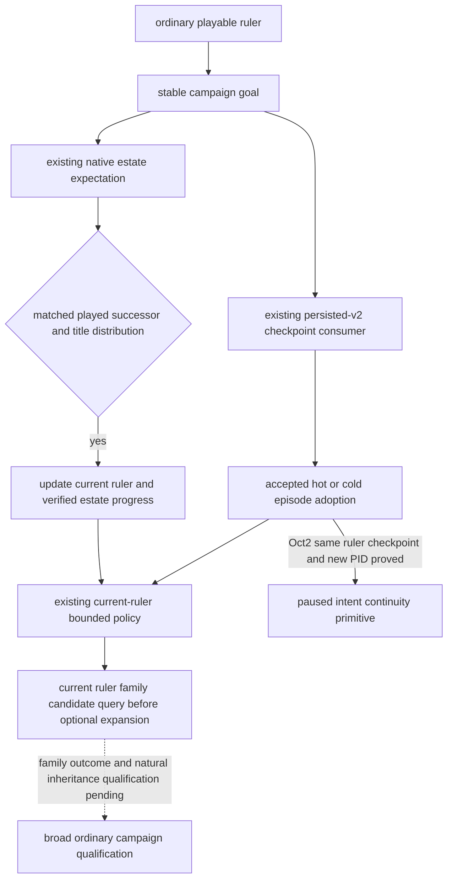

# Ordinary campaign goal continuity

Status: **production-live primitive for paused same-ruler checkpoint/cold
intent; natural inheritance and broad M7 qualification pending**. This
package implements the G2-M7 requirement to retain one high-level intent after
a checkpoint and natural inheritance. It adds no native query, command,
religion model, or alternative driver.

## Source inputs and policy boundary

The native input ledger is the existing
[campaign-root tree](campaign-root-context.md),
[succession and law tree](laws-contracts-and-succession.md), and
[marriage result tree](marriage-and-alliance.md). The current native readers
have historical qualification frozen to CK3 1.20.0.2, EXE SHA-256
`AE1BA6FF060BA603842F6F4A2DED0AF4B7D3666B3DD271F75FB01B0DA8E81B2D`:
[campaign](ck3-1.20.0.2-nonwar-campaign-context.md) and
[family](ck3-1.20.0.2-family.md). The October2 Robert reobservation below is
separately bound to CK3 1.20.0.3; it does not promote every historical reader.

Those sources distinguish the actual played heir, per-title estate outcome,
current marriage/betrothal relationships, native final legality, and material
marriage results. A retained goal is an input to our bounded policy; it is not
an assertion that CK3's AI has the same goal, that inheritance preserved a
dynasty, or that sending a marriage proposal achieved a family outcome.

The minimum ordinary goal is `dynasty_continuity`: keep reviewing the current
ruler's family and succession opportunities throughout the same campaign.
The existing marriage priority precedes optional expansion for an unpaired
current ruler. Forced events, pending interactions, active-war handling,
native legality, existing typed action gates, and the current opportunity
consumer retain their precedence. Existing marriage selection, costs, ranking,
and result models are reused. This package does not enable private trial
actions or claim calibrated long-term family utility.

## Persistence and inheritance

`native_driver.py` adds a semantic `campaign_goal` to the existing persisted-v2
state. Its stable `campaign_id` is the first ordinary episode ID; the origin
character and goal key survive subsequent ruler episode IDs. The first
playable frame of an older ordinary state initializes this goal, so older
states do not acquire a retrospective history of intent.

The existing same-PID state adoption and checkpoint cold rebind carry the
goal together with their accepted episode. A rejected checkpoint starts a
new goal with the new campaign binding. This uses the existing checkpoint
consumer and does not turn a driver file into evidence of game restoration.

`continue-as-reconciled-successor` updates the goal's current ruler only after
the existing M3 matched successor and title-distribution checks. Its progress
counts those verified estate transitions and records the latest matched
inherited titles and expected titles going to other heirs. It does not mark
partition loss as avoided or store stale marriage candidates as successor
instructions. Current action parameters still come from the new ruler's
observations.

`GameplayBridgeService.plan_turn` converts that goal to the existing
priority/focus plan and passes it into `choose_one_life_turn`. The actual next
choice and `campaign_goal_plan_used` appear in the same formal plan. Ordinary
campaigns consume this goal instead of a legacy roguelike next-run plan in
the state directory. Rogue one-life mode continues to use
`one-life-history.json` and its existing death/reload policy.

## Offline proof and remaining qualification

The focused fixture uses the actual `NativeHeadlessGameplayDriver`,
`GameplayBridgeService`, persisted driver consumer, and formal successor
`auto_turn`, with an in-memory fake endpoint. Checkpoint bytes and receipts
are explicitly fixture data. It proves goal retention, verified succession
progress, and the successor's actual next policy choice; it does not connect
to a named pipe or submit CK3 input.

The durable result is
`artifacts/g2-offline-2026-10-01/campaign-goal/result.json`. The four new
goal fixtures and 15 existing succession fixtures pass in normal Python;
the combined 19 also pass under `python -O`. The test-only receipt is
`result-tests.json`, SHA-256
`1cf9874e42cc28d20f6698c257af09a498882cc0f638441f75e4a1143804ab8a`.
Initial fixture assertion mistakes are retained there; the fixes changed
only test expectations, not the production consumer. Real natural
inheritance, actual goal-guided family results and later formal turns remain
qualification work. The fixture itself did not promote multiple
rulers/seeds/governments, century/full-campaign counts or G2-M7 completion.

## October2 CK3 1.20.0.3 paused Robert checkpoint/cold proof

The actual ordinary Robert source was officially prepared/rebound to CK3
**1.20.0.3**, EXE SHA-256
`94b55397abb687a3dcd436805a5d885e6be90fa6c693feb44a9e3bbeeade02a6`,
using frozen Python/native source `19a0e94510e8a41e0a7ee83e709a9dd914c5dc30`
and v4 DLL SHA-256
`94872a6793f4a928c36961966db4be0e7c921e62e255d792eb0b7472d3eeb386`.
The original full4028/saveh4025 archive, legal omitted/null goal, opaque save
and three historical ledgers remain retained. The current ordinary consumer
initialized the goal after actual identity adoption; no history of earlier
intent or inheritance was backfilled.

The root-owned direct first observation and normal checkpoint were GREEN in
game PID **74408**. A normal shutdown and actual new game PID **115688** then
produced a GREEN cold comparison. These are actual game PIDs from
`result.bridge_pid`; a unified-exec session ID is not a game PID. Both remained
paused at raw **53220000**, actor 29829, episode
`native-29829-2bc2d599f7f9`, ordinary lifecycle and `xar_off`. No game date or
selected plan step was advanced.

Both current frames observed `feudal_government`/`core_landed` with the 44
effective-feature rows and an available same-frame native adapter. Both
actual next plans consumed the same `dynasty_continuity` campaign ID, current
actor and progress (`reconciled_successions=0`, `last_succession=null`), with
`ordinary_goal_context_ready=true`. The cold proof also matched the actual
first checkpoint source and all three unchanged ledger byte streams.

| Actual material | First paused PID74408 | Cold paused PID115688 |
| --- | --- | --- |
| Full driver history / save anchor | 4029 /4029 | 4031 /4029 |
| Raw date | 53220000 | 53220000 |
| Government query | 3.52s | 3.84s |
| Normal nonwar plan observation | 12.76s | 13.08s |
| Normal checkpoint | 2.03s | Reused first saved pair |

The new save is 79,280,616 bytes, SHA-256
`e4d4eaad6f253bde013392c6973461e61adaa3c06d92f234ec72f2594ed87529`.
The complete latest cold driver/save pair, first/cold raw observations,
three ledgers, and actual managed supervisor result/stdout with exit0 are
frozen under
`artifacts/g2-maintainer-2026-10-02/resume-12003/m7-robert/paused-intent-19a0e945-v4/paired-proof-20261002-01/`.
Its authority is `M7-PAUSED-COLD-PROOF.json`, SHA-256
`0156ac7cbfee1dc4e5b48a500d5f6d9b8fb78a5ca5f60b9bedd8a5f432c28d6e`.
Root's observed normal-stop times were UTC 21:33:35 and 21:35:13; no separate
stop file was manufactured from those observations.

History counts follow the existing cold consumer: the old h4025 prefix plus
proven physical restore lineage first yielded full4026. A further physical
restore, current-root read and checkpoint yielded full4029/h4029; the new cold
restore and current-root read yielded full4031/h4029. The archived old
full4028 was not truncated or rewritten. Normal consumers may persist the
goal and succession expectation; the direct helper does not fill those
fields or replace the production driver.

Two earlier stdio attempts remain RED: initial native-state loading, then a
90-second first `tools/call` timeout after successful tool listing. One
retained-file measurement observed 52MB of public history JSON, with
deepcopy 0.958s and JSON encoding 0.228s. The direct route uses the existing
internal semantic snapshot and normal service, and avoids exporting that
public history through stdio. Its success does not prove that all 90s were
caused by serialization; the original failures remain frozen and stdio was
not rerun.

This qualifies a **production-live primitive for paused same-ruler ordinary
goal/government/checkpoint/cold continuity**. Natural inheritance under this
intent, multiple rulers/seeds/governments, goal-guided gameplay outcomes and
later formal turns remain unqualified. Robert stays **3153/36524 durable
days**, with **0 new days**; M7 remains `in_progress`. The H3937 source scope
and episode were unchanged by this work.
