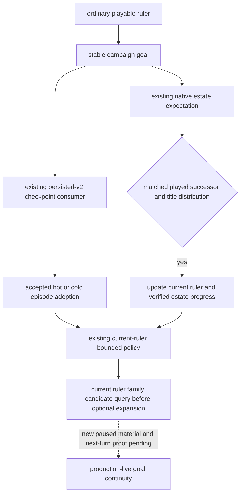

# Ordinary campaign goal continuity

Status: **static-ready consumer; production-live qualification pending**. This
package implements the G2-M7 requirement to retain one high-level intent after
a checkpoint and natural inheritance. It adds no native query, command,
religion model, or alternative driver.

## Source inputs and policy boundary

The native input ledger is the existing
[campaign-root tree](campaign-root-context.md),
[succession and law tree](laws-contracts-and-succession.md), and
[marriage result tree](marriage-and-alliance.md). The current native readers
are separately frozen to CK3 1.20.0.2, EXE SHA-256
`AE1BA6FF060BA603842F6F4A2DED0AF4B7D3666B3DD271F75FB01B0DA8E81B2D`:
[campaign](ck3-1.20.0.2-nonwar-campaign-context.md) and
[family](ck3-1.20.0.2-family.md). Their paused/live qualification is unchanged.

Those sources distinguish the actual played heir, per-title estate outcome,
current marriage/betrothal relationships, native final legality, and material
marriage results. A retained goal is an input to our bounded policy; it is not
an assertion that CK3's AI has the same goal, that inheritance preserved a
dynasty, or that sending a marriage proposal achieved a family outcome.

The minimum ordinary goal is `dynasty_continuity`: keep reviewing the current
ruler's family and succession opportunities throughout the same campaign.
The existing marriage priority precedes optional expansion for an unpaired
current ruler. Forced events, pending interactions, active-war handling,
native legality, existing typed action gates, and the current opportunity
consumer retain their precedence. Existing marriage selection, costs, ranking,
and result models are reused. This package does not enable private trial
actions or claim calibrated long-term family utility.

## Persistence and inheritance

`native_driver.py` adds a semantic `campaign_goal` to the existing persisted-v2
state. Its stable `campaign_id` is the first ordinary episode ID; the origin
character and goal key survive subsequent ruler episode IDs. The first
playable frame of an older ordinary state initializes this goal, so older
states do not acquire a retrospective history of intent.

The existing same-PID state adoption and checkpoint cold rebind carry the
goal together with their accepted episode. A rejected checkpoint starts a
new goal with the new campaign binding. This uses the existing checkpoint
consumer and does not turn a driver file into evidence of game restoration.

`continue-as-reconciled-successor` updates the goal's current ruler only after
the existing M3 matched successor and title-distribution checks. Its progress
counts those verified estate transitions and records the latest matched
inherited titles and expected titles going to other heirs. It does not mark
partition loss as avoided or store stale marriage candidates as successor
instructions. Current action parameters still come from the new ruler's
observations.

`GameplayBridgeService.plan_turn` converts that goal to the existing
priority/focus plan and passes it into `choose_one_life_turn`. The actual next
choice and `campaign_goal_plan_used` appear in the same formal plan. Ordinary
campaigns consume this goal instead of a legacy roguelike next-run plan in
the state directory. Rogue one-life mode continues to use
`one-life-history.json` and its existing death/reload policy.

## Offline proof and remaining qualification

The focused fixture uses the actual `NativeHeadlessGameplayDriver`,
`GameplayBridgeService`, persisted driver consumer, and formal successor
`auto_turn`, with an in-memory fake endpoint. Checkpoint bytes and receipts
are explicitly fixture data. It proves goal retention, verified succession
progress, and the successor's actual next policy choice; it does not connect
to a named pipe or submit CK3 input.

The durable result is
`artifacts/g2-offline-2026-10-01/campaign-goal/result.json`. The four new
goal fixtures and 15 existing succession fixtures pass in normal Python;
the combined 19 also pass under `python -O`. The test-only receipt is
`result-tests.json`, SHA-256
`1cf9874e42cc28d20f6698c257af09a498882cc0f638441f75e4a1143804ab8a`.
Initial fixture assertion mistakes are retained there; the fixes changed
only test expectations, not the production consumer. Real natural
inheritance, current-build paused observations, actual goal-guided family
results, later formal turns, and a new-process checkpoint restore remain
live gates. Multiple rulers/seeds/governments, century/full-campaign counts,
and G2-M7 completion are not promoted by this fixture.
