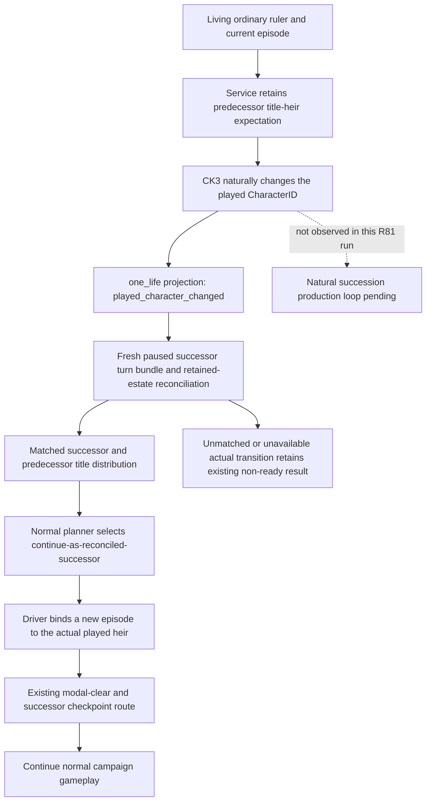

# Ordinary campaign succession: Runtime46 configuration

Recorded **2026-10-09 13:02 CST / 05:02 UTC**. This source-only comparison
uses the actual R81 immutable Runner/SDK source
`Z:/gbs-runtime46-construction-rank-source` at
`088fed39e0ceda7b28c2b0ee2113db4ce61fa58a`. CK3 exact **1.20.0.4 / Steam
25734779**, SHA `98702f88a547cde2eaf29a85f93b85f68ee4cf8148336a4f7afaeb75319dd518`,
is reused from the qualified frozen binding; no executable is opened or hashed.

This records an engine lifecycle transition, not an NPC decision or a new
counter-policy. The existing [succession transition contract](succession-transition-v1.md)
and [exact4 modal source](death-succession-modal-migration-12004.md) are reused.
There is no new native research, command, schema or permission gate.

## Actual retained R81 fields

The single local load of retained `010-r81-postsave-paused01.json` reports
public revision5, date53288568, paused, Robert29829 alive and episode
`native-29829-2bc2d599f7f9`. Its lifecycle is
`ordinary_campaign_succession`, `xar_enabled=xar_off`, with
`pact_contract=absent_by_fresh_campaign_xar_off_contract`, sourced from the
prepared environment manifest. `one_life_terminal=false`, terminal reason
null. The retained succession expectation is already bound to the same date
and episode at public revision4.

The snapshot also reports `continue_as_heir_after_death=false`. This is **not
a disabled configuration switch**. NativeDriver's capabilities response
(`bridge/native_driver.py:2634`) and living one-life projection (`:4397`)
write that field as false. There is no CLI or constructor boolean with that
name. A matched ordinary continuation result (`:21057`) writes true after
the episode has actually changed. The current snapshot has no natural
death or played-character change to continue.

[R81-010-SUCCESSION-THIN-FIELDS.json](Z:/ck3_mod_rewrite_process_assets/g2-parallel-20261009/ordinary-succession-configuration/R81-010-SUCCESSION-THIN-FIELDS.json)
retains only selected fields from that existing response. The source lane
does not make a new snapshot or credit a natural-death/continuation result.

## Existing configuration is sufficient

R81 `operator/BOOTSTRAP-DRAFT.json` already contains the existing SDK options:

```text
--environment-manifest <R81 state/profile/xar-autoplayer-environment.json>
--succession-lifecycle ordinary_campaign_succession
--ordinary-campaign-no-pact
--private-death-succession-modal-continue
```

The actual cold-SDK argv metadata points to
`prepare_r77_cold_sdk_root.py qualify` with immutable source088fed39 and the
R81 packet. That helper's `current_read` (`:110`) copies the draft's
`gameplay_mcp.argv` and appends only the existing normal-feast flag. It does
not remove or override these lifecycle options. The native-session cold
observer also retains the existing `--cold-start-checkpoint --xar-enabled
xar_off` route. These facts come from retained source/metadata, not a live
process command-line read.

Keep those SDK options and the current one-life projection on the next
authorized reuse. **No new CLI argument or source change is needed.**
`one_life` names the currently bound ruler episode; it does not limit this
ordinary campaign to one ruler. Switching to `native_campaign` would bypass
the per-episode projection and its retained inheritance reconciliation; that
switch is not required for this existing ordinary continuation route.

## Existing ordinary transition path



`bridge/service.py:809` retains the expectation on eligible living frames;
on `played_character_changed` it queries a fresh successor turn bundle and
reconciles the retained predecessor estate. `bridge/native_driver.py:2310`
registers `continue-as-reconciled-successor` for a matched ordinary transition
without requiring a rogue settlement. `strategy.py:7865` selects that step
and reports `settlement_required=false`.

`bridge/native_driver.py:20914` then binds a fresh episode identity to CK3's
already-played successor and carries the ordinary campaign goal/family
handoff. Its result reports `continue_as_heir_after_death=true`,
`ck3_command_submitted=false` and `process_restarted=false`. This operation
does not select a fabricated heir, force death or replay an immutable seed.

The existing bounded `native-auto-run` owner verifies this continuation,
consumes the exact timeline blocker/Close route where needed, and saves a
successor checkpoint before subsequent gameplay. Its ordinary completion
mode must remain the existing bounded-run route rather than the separate
strict one-generation scored-terminal owner. A later cold restore uses the
successor checkpoint's actual episode/lifecycle binding and refreshes the
inheritance expectation; it does not retain a stale pre-restore projection.

## Existing deterministic source fixtures and limits

These existing production-path fixtures are source locators, **not rerun here**:

- `tests/unit/test_succession_transition_contract.py::SuccessionTransitionContractTests::test_ordinary_matched_successor_does_not_require_death_terminal`
- `tests/unit/test_succession_transition_contract.py::SuccessionTransitionContractTests::test_native_driver_retains_restores_and_reconciles_expectation`
- `tests/unit/test_native_auto_run.py::NativeAutoRunTests::test_ordinary_natural_successor_clears_timeline_before_checkpoint`
- `tests/unit/test_native_auto_run.py::NativeAutoRunTests::test_ordinary_campaign_uses_matching_cold_profile_binding`

The second fixture follows the real NativeDriver → Service plan/auto path,
including same-PID restored expectation, matched title reconciliation,
new successor episode, true continuation result and zero CK3 command/restart.
No new fixture is justified by the current false living display field.

Result: **NO_NEW_SOURCE / existing configuration sufficient**. This lane
performs game/SDK/process/native/EXE/hash/build/project-import/test/FIRST0,
C-output0 and one retained-response read. The original R81 run still has
**natural death0 / actual natural successor loop0**. Existing source and
fixtures do not turn that pending production milestone into a completed G2
loop. Root owns later normal campaign execution and actual successor evidence.
