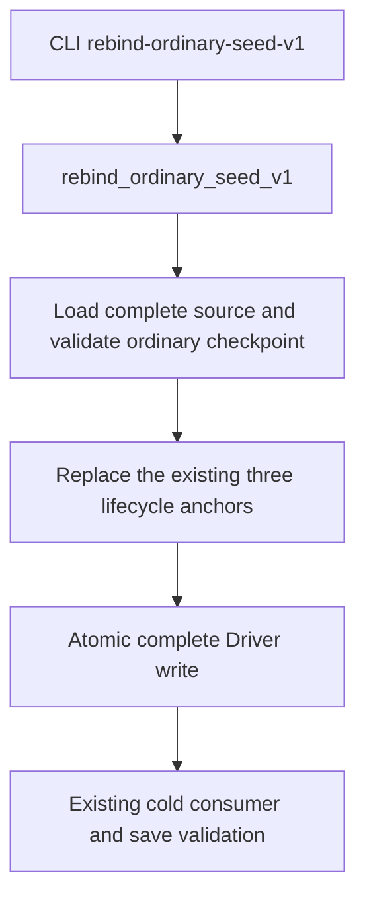

# Ordinary checkpoint rebind keeps Driver JSON compact

## Observed need and evidence boundary

The coordinator observed R81's saved opaque Driver at 666,655,364 bytes and
R82's post-rebind `driver-state.json` at 1,302,226,084 bytes. R82 preparation
and rebind took more than two minutes. These are the coordinator's recorded
file metadata and timings; this work neither opened nor parsed either actual
Driver or save. A source inspection establishes a real formatting difference,
but does not measure how much of the elapsed time it caused.

The ordinary production chain is:

Before this change, `ordinary_seed_rebinder.py` called
`environment.write_json_atomic(driver_path, rebound)`. That general helper
uses `json.dumps(..., ensure_ascii=False, indent=2)`, adding indentation to the
complete history. The ordinary live writer,
`NativeBridgeDriver._encode_driver_state_locked`, already uses
`separators=(",", ":")`. Successful `query-*` history entries also already defer
their durable write to a barrier. The rebind formatting finding therefore
does not establish that all ordinary live-query latency comes from JSON writes.

## Minimal change

Only the ordinary rebind's Driver write now uses compact UTF-8 JSON with one
trailing newline, through the existing `write_bytes_atomic`. Receipt formatting
continues to use the general JSON helper. All object fields, insertion order,
full history, seed data, pending records and existing three-anchor changes are
retained. Existing consumer validation, save comparison and restoration of the
original Driver bytes on failure are unchanged.

No actual Driver is rewritten by delivering this source change. The code does
not trim history, migrate ledgers, add a file format or change native code.
Whole-document parsing, copying, validation and atomic persistence still have
cost proportional to complete state size; this change only removes avoidable
formatting and output bytes.

## Sole qualification entry, not yet executed

`tests/unit/test_ordinary_seed_rebinder.py::OrdinarySeedRebinderTests::test_compact_rebind_roundtrip_preserves_complete_ordered_state`
is the sole new compound. It calls the real production rebind with the existing
synthetic CK3 save/header fixture and cold consumer. Its two input scenes are
compact UTF-8 and pretty UTF-8 with BOM. It checks all fields and nested key
order, nine complete history entries, synthetic seed and unresolved intent,
Unicode and escaped punctuation, unchanged save bytes, existing cold validation
and smaller compact output containing one physical newline.

The author did not run this compound, compile, launch CK3, run an SDK, inspect
actual state or claim a live speedup. The coordinator owns the single execution
and subsequent deployment. Status: source-ready; qualification and live timing
remain pending.
