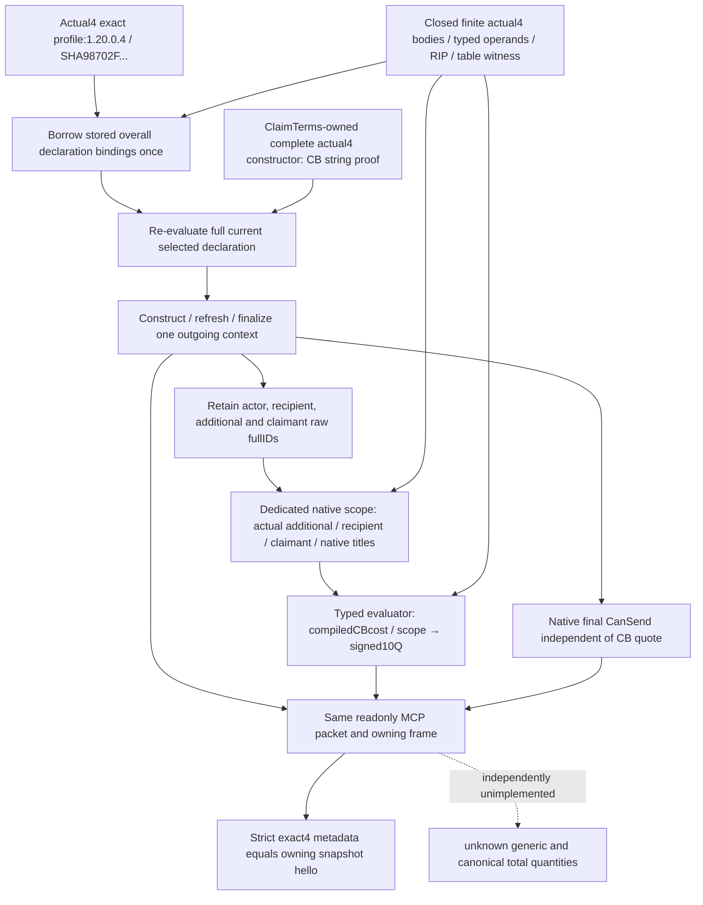

# Ordinary holy-war selected context and CB costs — 1.20.0.4 migration

The current installed build is **1.20.0.4 / Steam25734779**, EXE SHA `98702F88A547CDE2EAF29A85F93B85F68EE4CF8148336A4F7AFAEB75319DD518`. The native version is established by the [installed-build migration](installed-build-25734779-mcp-migration-2026-10-07.md), rather than the null Windows version strings. The adopted scope is the [ordinary holy-war CB-only query](ordinary-holy-war-declaration-costs-12003.md); later generic, owning reason, multiplier and total-getter candidates are not prerequisites of this migration.

This package owns the independent actual4 readonly declaration-context and CB-cost factories and the same-query strict metadata admission. The battle owner composes its overall declaration factory once with these readonly fields and its separately proven command/send fields. The shared adapter owner supplies `game::BorrowOrdinaryHolyWarDeclarations12004(const GameAdapter&)`, returning the actual4 instance's stored declaration bindings. The readonly handler borrows that software DTO and binds its CB cost directly against the new exact SHA. It never passes the new image through the old declarations or CB-cost factory.

## Source evidence and current work

The [source contract](../../ck3_autonomous_player/native_bridge/research/ordinary_holy_war_declaration_context12004_contract.json) records the actual old/new bytes, retained typed operands and exact proof paths. The sole mapper `ally_diagnostics` delegated this adopted CB-only finite family to this owner; its cache-first reader was used throughout. The ClaimTerms owner's actual constructor `31F1A60→31F1A40`,1515B, proves the shared CB string at `+18`, size `+28`, capacity `+30`; this query reuses it without a duplicate capture. The Prisoner owner's completed context/cost family supplies the constructor, refresh, finalize, complete final validator, destructor and typed cost evaluator. All consumed native fields and new addresses are closed; no new-build RVA is admitted through an old-hash alias.

| Consumed entry | Actual4 RVA | Actual evidence |
| --- | --- | --- |
| CB database / evaluator / configuration cleanup | `8FC320 / 31F4520 / 111F190` |87 /1077 /94B complete bodies |
| Scratch array / declaration interaction member | `54E14B8 / DB+F60` | Actual RIP / retained member operands |
| Context construct / refresh / finalize / final validator / cleanup | `3076C70 /3078A40 /3078C70 /307C020 /3077380` | Reused shared complete context proofs; validator368B |
| Titles copy / append | `C858C0 /9E3790` | Retained full normal code across runtime fragments, including copy's final9B epilogue |
| Scope construct / populate / cleanup | `889F60 /2A814E0 /87E0E0` |186 /368 /126B complete bodies |
| Cost evaluator / native character fallback | `310CEC0 /5C67570` | Shared529B evaluator / actual RIP in281B dispatch |
| Declaration type table / CB dispatch selector | `452FFD0 /4530030→277F230` | Unique bounded typed prefix; actual8B selector |

The selected CB wrapper `277F230` reads the outgoing context's recipient `+2DC` and additional role `+2EC`, resolves full CharacterIDs using object `+18`, and retains the war object's claimant `+28` and title array `+10`. Its scope/quote path `31F4E20→31F1520` retains the compiled cost `CB+A80` and calls `310CEC0`. The bridge uses those actual roles and native title array in one finalized context. It publishes the actor `+2D8` independently and never substitutes it for the additional role. `FinalCanSend` remains independent of successful CB quote evaluation.

Fresh finite captures total **9,124B /41calls across both images**, with zero new metadata, unwind, hashes or whole-image reads. Of these, the final type table used exactly136B plus the necessary8B selector under Root's explicit≤144B authorization. The first nine-pointer ordinal-candidate comparison did not match unused word7; its failed attempt is retained. Independently body-proved word0/2 plus the remaining eight prefix operands identify the unique actual table; its actual word7 is retained as data, never bound or expanded. The final actual selector independently targets the full body-proved CB dispatch. Earlier95B destructor,448B method and969B enumeration attempts emitted no table-producing RIP and are retained honestly.

The shared scope algorithm remains the adopted implementation: logical native size `0x168`, explicitly aligned owned storage `0x170`, holder `0x180`, and the same byte-buffer beginning for constructor, populator, evaluator and destructor. The prior actual `C4324`/`C2220` attempt is retained. Its adopted source repair does not supply new ABI proof or native qualification.

## Query and qualification contract

The registered tool remains `ck3_query_player_ordinary_holy_war_declaration_context_v1(expected_revision,declaration_id)`, with mailbox step `query-player-ordinary-holy-war-declaration-context-v1`, domain/schema `player_ordinary_holy_war_declaration_context_v1` and CLI `--private-player-ordinary-holy-war-declaration-context-query`. The actual4 envelope/backend/inner identity comes from the validated actual4 descriptor; archived `.3` remains compatible. Native raw roles, redirects, full selected IDs/title order, claimant fallback and ten signed quantities remain distinct. An evaluated zero remains a valid vector; missing terms are not replaced with zeros. Generic/total quantities remain null and `total_cost_ready=false` for this CB-only source.

The only new qualification authored is one compiled actual4 whole-query sample and one registered Service/MCP consumption compound. The case selects new full generation IDs and redirects the independent additional role during finalization; a raw claimant `-1` passes the native fallback pointer, a false final gate remains visible, and the CB evaluator returns `[-375001,2234567,25000001,0,103,104,105,106,107,108]`. Synthetic callbacks and fixture memory are explicit. The output is the production serializer's complete packet and the consumer ingests it unchanged through the registered tool, real Service method, driver wrapper, transport, state and strict normalizer.

Root owns the new joint build, native FIRST, consumer execution and any actual paused game observation. Configure/build, tests, production imports, SDK and game operations for this package are **NOTRUN**. No old GREEN or old FIRST is replayed. Readiness is **static-ready source candidate**, awaiting the new joint qualification; it makes no production-live claim. Generic and canonical total quantities remain an explicit source backlog; this migration does not promote the unadopted generic/reason/multiplier/total candidates to prerequisites.

Root's shared integration includes the owned CMake leaf `ordinary_holy_war_12004_first_fixture.cmake` once, the adapter borrow getter from `32a2f0d3`, and the battle owner's overall actual4 declaration composition once. Native target: `xar_ck3_12004_ordinary_holy_war_declaration_context_whole_mailbox_test`. CTest: `xar_ck3_12004_ordinary_holy_war_declaration_context_whole_first`, registered when `XAR_ORDINARY_HOLY_WAR_12004_FIRST_OUTPUT_DIR` is supplied. The executable receives exactly one argument: Root's fresh existing native output directory. It emits `native-wire-actual4-redirected-claimant-fallback.json` and `actual4-producer-receipt.json`.

The sole consumer is `tests/test_player_ordinary_holy_war_declaration_context_12004_whole_wire.py --source-root <qualified-source-root> --source-sha <Root-qualified-commit> --native-wire-dir <new-native-dir> --output-dir <fresh-consumer-dir>`, run with Python `-B -X utf8`. Its sole method is `test_actual4_compiled_whole_native_context_registered_service_mcp`; it records the real registered tool count and one completed query. These are qualification recipes, not execution evidence.

## October7 candidate26 source reconciliation

The immutable parent source `e81c9ee137bd9188b9a6446f54528f52b9b148f0` already adopts the original actual4 package `4e4cb6f1`. Two focused inventories restored the held native and consumer progress and found no remaining migration delta in this adopted query: exact4 factories and the stored declaration borrow, actual4 step admission and executor, handler, descriptor rendering, strict envelope/selection/roles/ten-term admission, real Service forwarding, and the same registered MCP/CLI are present. The result is recorded in the [native inventory](Z:/ck3_mod_rewrite_process_assets/g2-parallel-20261006/holy-war/actual4-next26/generic-total/SOURCE-PROGRESS-INVENTORY.json) and [dispatch/strict Service inventory](Z:/ck3_mod_rewrite_process_assets/g2-parallel-20261006/holy-war/actual4-next26/strict-service/MIGRATION-INVENTORY.json). This reconciliation does not change runtime code or add a second fixture.

The next capture manifest remains held with **no selected targets and0B**. No old source capture, GREEN test or FIRST is replayed. The existing sole actual4 whole-native fixture and registered consumer above remain the qualification entry for Root when needed; this source review does not credit a run. Current runtime all-tools enumeration and an actual paused holy-war quote were not inspected or invoked here. A registered-tool count alone does not establish their qualification.

The old `feaf7588` candidate contains three distinct research increments: a generic signed ten-resource quote from the finalized context, final CanSend text/loaded acceptance inputs, and loaded CB AI multiplier/default/effective inputs. Their old exact3 source and interfaces remain held and unadopted; they are not prerequisites of the completed CB migration. The [restored API and roadmap](Z:/ck3_mod_rewrite_process_assets/g2-parallel-20261006/holy-war/actual4-next26/generic-total/RUNNABLE-API-AND-ROADMAP.md) records their actual construction seams. Canonical total quantities still need an actual registered readonly `GetSpecificCost`/`GetCostBreakdown` target and ABI. The closed old `310D5D0` body applies a supplied resource vector; it does not establish such a getter. No generic-plus-CB sum, zero total, payment invocation or new readiness gate is introduced by this reconciliation.
