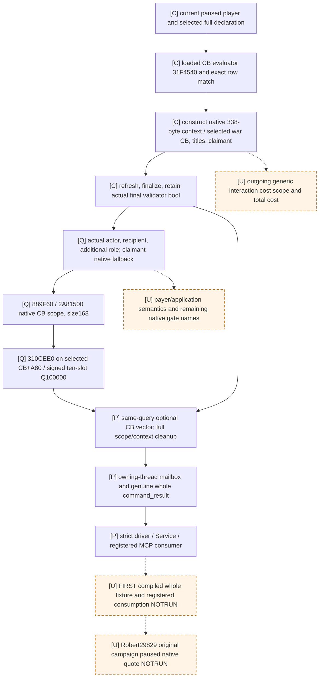

# Ordinary holy-war declaration context and CB costs (1.20.0.3)

This source package supplies the missing native CB resource vector for one selected ordinary holy-war declaration. It reuses the loaded CB candidate evaluator and the existing declaration context construction, then stops before command construction. The source is implemented for first qualification; **FIRST build, native whole fixture, registered consumer and live query are NOTRUN**. Readiness remains `research`, with no new game days or policy action.

The exact input is CK3 **1.20.0.3**, EXE SHA-256 `94B55397ABB687A3DCD436805A5D885E6BE90FA6C693FEB44A9E3BBEEADE02A6`. The hash is reused from Root's frozen input. Earlier `.19` addresses are locator history only. The isolated source base is `71b729f0cc4894331f1dadb89155920fccd42a00`; frozen g104 and Root's current working tree are separate.

## Native input and value

Existing [war declaration research](war-declaration.md), [player war-entry tree](player-war-entry-policy.md), and [war-entry migration](war-entry-1.20.0.2-migration.md) establish native candidate enumeration and target assessment as inputs. The `.3` implementation reuses the reviewed declaration ABI family: `ReadDeclarableWarsForTarget` emits full target/CB/configuration/claimant/title identity, while `SubmitDeclareWar` constructs, refreshes, finalizes and validates its selected native context. This package observes that context without sending it.

Installed stock `00_religious_war.txt` defines `minor_religious_war`, `religious_war` and `major_religious_war`, with authored base piety 100, 200 and 750. The loaded definitions also apply doctrine, innovation, vassal, struggle and accolade branches through the common and holy-war multipliers. These base values cannot replace the evaluated quote. Loaded candidate legality, directional faith hostility and strategic war-entry assessment retain their existing observers; no Python copy of their rules is added.

## Exact source closure

The actual finite captures are permanently recorded under [the holy-war source package](Z:/ck3_mod_rewrite_process_assets/g2-parallel-20261006/holy-war/ROOT-DELIVERY.json). Each selector, metadata lookup and body had separate Root approval. Actual I/O is **35 reads / 1,358 bytes**: one 8-byte selector, thirty-one 12-byte pdata records (372 bytes), and three complete bodies (281 + 382 + 315 = 978 bytes). No unwind, additional callee body or new EXE hash was read. The current implementation adds **zero** EXE reads.

| Actual source | Proven input/output |
|---|---|
| `CWarDeclaration` vtable `0x452FFC0`, slot `+0x60` | Actual word `50f2774201000000` resolves to RVA `0x277F250` |
| `0x277F250..0x277F369`, 281 bytes | Selected CB `war+8`; recipient `context+0x2DC`; actual additional role `context+0x2EC`; claimant `war+0x28`, with native fallback; full title array `war+0x10` |
| `0x31F4E40..0x31F4FBE`, 382 bytes | `889F60` scope constructor, then `2A81500(scope,additional,recipient,claimant,native_titles,0)`; call to `31F1540` |
| `0x31F1540..0x31F167B`, 315 bytes | `310CEE0(CB+0xA80,native_CB_scope,out10)`; five 16-byte copies prove 80-byte output |
| Existing reviewed scope and costs | Scope size `0x168`, full destructor `87E0E0`, signed `int64[10]`, Q100000 ordinals |

The ten resource ordinals are `gold`, `prestige`, `piety`, `renown`, `influence`, `herd`, `treasury`, `treasury_or_gold`, `merit`, `barter_goods`. Signed native values and known zeros are retained. The actor at `context+0x2D8`, recipient and additional redirected role are distinct. The actual additional role supplies the first character argument to the CB scope populator. An absent or unresolved claimant uses the existing native character fallback at `0x5C67570`; it is not replaced by the player or a null pointer.

`[C]` denotes reused reviewed source, `[Q]` the named actual `.3` captures, `[P]` unqualified implementation, `[U]` a remaining seam. The boolean calls `31F10F0`, `310E710`, category branch `31F07F0` and `31F4490` remain ledger-only; their bodies are unnecessary for this numeric leaf. The existing final context validator supplies `final_can_send`. A readable CB vector may coexist with `final_can_send=false`.

## Contract and readiness

The new readonly selector is `query-player-ordinary-holy-war-declaration-context-v1`. It consumes one explicit current declaration identity and expected native/public revision. It re-evaluates that exact loaded row, constructs one selected context, retains full IDs and title order, and observes the optional CB vector within the same owning-thread query. The old `query-declarable-wars` and `declare-war-<id>` endpoints remain compatible.

The registered tool is `ck3_query_player_ordinary_holy_war_declaration_context_v1(expected_revision,declaration_id)`, through the actual Service method and Native driver wrapper. Runtime selection uses `--private-player-ordinary-holy-war-declaration-context-query`; the native source option is `XAR_CK3_ENABLE_ORDINARY_HOLY_WAR_DECLARATION_CONTEXT_PRIVATE_V1`. [Strict observation](../../ck3_autonomous_player/src/xar_autoplayer/bridge/player_ordinary_holy_war_declaration_context_private_observation.py) retains actual native roles independently from the selected row; [transport](../../ck3_autonomous_player/src/xar_autoplayer/bridge/player_ordinary_holy_war_declaration_context_private_transport.py) retains separate public and native revision bindings. A readable raw role is not substituted or rejected merely because it differs from the request's actor/target.

CB vector availability is distinct from context availability. A missing cost binding or unsupported CB cost tag never creates an available default vector. Native all-zero values after an actual evaluation remain available. Generic interaction cost and total cost are explicitly `unknown`, with no manufactured zeros or full-total readiness. Neither `payer`, paid-resource change, affordability nor on-send application is inferred from the vector. This is a CB comparison primitive, not a complete declaration policy or war loop.

Exactly one native FIRST producer exercises the production collector, owning-thread mailbox and serializer, emitting complete packets and a receipt. Exactly one registered consumption compound reads those fresh whole files unchanged through `NativeProtocolState`, the strict driver, a real Service method and the registered MCP tool. Memory, callbacks and frame inputs are explicitly fixture-synthetic; whole packets come from the compiled production serializer. No Python packet repair or old fixture rerun grants qualification.

The five cases cover nonzero signed terms with final validator false, an actually evaluated all-zero vector, a redirected additional role, native claimant fallback, and available context with unavailable CB terms. The sole registered method is [test_five_compiled_whole_native_contexts_registered_service_mcp](../../ck3_autonomous_player/tests/test_player_ordinary_holy_war_declaration_context_12003_whole_wire.py); its UUID source matches the producer's correlation IDs without altering any input packet. The native target is `xar_ck3_12003_ordinary_holy_war_declaration_context_whole_mailbox_test`; the owned CMake leaf also links the new production source to the existing runtime.

Root's next joint batch owns first build, native producer and registered consumer. Until their actual receipts exist, all three are NOTRUN and status is `research / source implemented`. A later live query uses only Robert29829's original ordinary campaign on the exact build, a genuine current holy-war row and a paused owning frame. Capture full raw identity/roles/vector/final validation plus unchanged time, resources and wars; no test-only faith or piety alteration is part of this package. If there is no current ordinary row, record that result and retain the next genuine opportunity.

Canonical machine contract: [ordinary_holy_war_declaration_context12003_contract.json](../../ck3_autonomous_player/native_bridge/research/ordinary_holy_war_declaration_context12003_contract.json). Root-owned daily and W41 merge fields accompany the external delivery; this owner does not edit shared daily/weekly files or push.

## 2026-10-07: observed strict build failure and minimal layout fix

Root's g105 first joint build ran with `CL=/W4 /WX` and returned exit code 1. [BUILD-STDOUT.log](C:/codex-ck3-background/joint-three-source-batch/strict01/BUILD-STDOUT.log:382) records `C4324` for the local `Scope` class in `ordinary_holy_war_cb_cost_v1.cpp`, promoted to `C2220`; [BUILD-RESULT.json](C:/codex-ck3-background/joint-three-source-batch/strict01/BUILD-RESULT.json) preserves the RED attempt. This is an observed source compilation failure, without native fixture, registered consumer or game execution. The earlier FIRST-build NOTRUN description above is superseded by this attempted RED build; it does not qualify the native capability.

The minimal source fix puts the aligned byte storage first, explicitly rounds its owned allocation to `0x170`, then stores the x64 bindings reference, construction flag and seven reserved bytes. A size assertion fixes the C++ holder at `0x180`, avoiding the implicit alignment padding that triggered this warning. The logical native scope size stays `0x168`; constructor, populator, evaluator and destructor still receive the same byte-buffer beginning. No binding address, build hash, flag, public API or serialized field changes.

The layout fix is source-only. Its build is **NOTRUN**, and the native whole fixture and registered consumer remain **NOTRUN**. Root owns the next joint qualification; this correction adds no live readiness credit.
