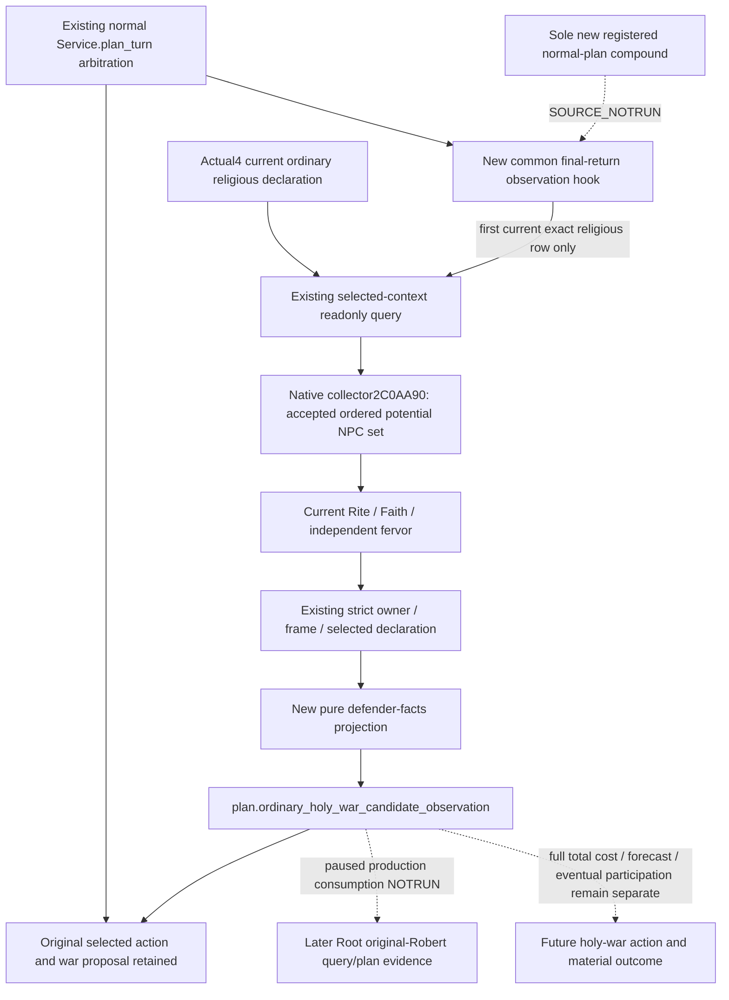

# Ordinary holy-war defender and fervor inputs in the normal plan

2026-10-08 / ISO2026-W41: **SOURCE_NOTRUN**. This Python-only source candidate
uses the existing CK3 **1.20.0.4 / Steam25734779** query, exact EXE SHA
`98702F88A547CDE2EAF29A85F93B85F68EE4CF8148336A4F7AFAEB75319DD518`.
Its source base is Root Runtime32 SDK
`a59b2df4a2b3ab6a951bfdc4f12845faf27439d7`. No game, SDK, build, production
import, test, executable read or hash is performed by this source owner.

## Concrete value gap and reused native tree

The [actual4 potential-defender tree](holy-war-native-defender-set-observation-12004.md)
has already established the native collector `2C0AA90`, caller CB bit15,
actual primary roles, same-Faith exception, candidate predicate and strictly
positive native join-score append. Root captured its two complete instruction
spans once, **1554B /2reads**. Current Faith/fervor comes from the existing
qualified actual4 religion getters. This source consumes those results and
does not recapture the image or invent AI weights.

The [selected-context query](ordinary-holy-war-declaration-context-12004.md)
already returns `player_holy_war_defender_join_inputs` through the existing
registered MCP, Service, NativeDriver, owning-frame transport and strict .4
normalizer. The missing interface was a normal-plan consumer: `plan_turn`
returned its ordinary decision without displaying any of these defender
inputs. The [R77 preparation packet](Z:/ck3_mod_rewrite_process_assets/g2-parallel-20261008/faith-g2-next/r77-policy-preparation/ROOT-DELIVERY.json)
identified that source gap; this candidate supplies its minimum projection
and Service hook. Existing native bindings and normalization are reused.

## Minimal normal-plan source

`ordinary_holy_war_defender_observation_v1.py` owns one pure projection and
one bounded planner. The planner uses the existing private query permission;
no additional flag, MCP, CLI, native command, schema or WAL is introduced.
It only reads a normal paused map frame, preserving existing modal/pending
interaction handling. It uses the current native declaration catalogue and
the exact ordinary keys `minor_religious_war`, `religious_war`, and
`major_religious_war`. The first matching native row is selected to bound this
observation to one query. This source order is not a strategic ranking.

The planner calls the **existing Service query** once with the normal plan's
public revision and that exact declaration identity. It performs no catalogue
discovery, target-wide enumeration or retry. The transport owns the existing
native selection/frame/build validation; the pure projection does not add a
second strict-normalization pass.

The new hook sits in `GameplayBridgeService.plan_turn`'s common final-return
helper, after its ordinary arbitration and deferred-release handling. It
attaches `ordinary_holy_war_candidate_observation` without changing the
original `selected_step`, policy, phase, decision or current-war proposal.
A query failure becomes a candidate observation failure, preserving the
already selected ordinary action. Missing native catalogue and a genuine
catalogue with no ordinary religious candidate remain distinct outcomes.

The projection retains the complete accepted-set child and ordered rows,
current primary roles, defender Faith, branch flag and independent fervor
availability/raw values. It also retains the existing final CanSend and
CB-only resource observation. Its statuses distinguish extra accepted
defenders, an observed empty set, an unavailable native set, and an absent
child. Failed fervor remains unavailable rather than becoming zero; it does
not discard an observed accepted set. An observed zero remains a valid value.

When an active war exists, the displayed decision is `continue_current_war`;
otherwise it is `observation_only`. Both explicitly leave additional automatic
holy-war declaration disabled. Original Robert29829's War100663329 remains
`claim_cb`; neither its opponent31050 nor its active war is substituted for a
religious declaration row. Existing war play keeps its original priority.

The potential set is not guaranteed eventual participation, and fervor is not
a probability, combat bonus or new join-score weight. There is no new rank,
forecast, cost sum or declaration action. The canonical total quote remains
unimplemented, independently of this visible candidate observation.

## Sole new registered consumer qualification

Only Python normal-plan behavior changes, so this increment needs no native
producer rebuild and no replay of the already qualified strict-query compound.
The one new standalone consumer is
`ck3_autonomous_player/tools/ordinary_holy_war_defender_observation_registered_compound.py`,
method `test_registered_normal_plan_consumes_compiled_defender_inputs_preserving_war_action`.

Root supplies the six fresh qualified Runtime32 whole packets: ordered
positive rows, legal zero/same-Faith, empty accepted set, disabled branch,
one failed fervor row, and native role fallback. The new compound consumes
those unchanged packets through the **registered `ck3_plan_turn`**, real
`GameplayBridgeService.plan_turn`, new hook, existing real Service query,
NativeDriver/transport, protocol state and strict normalizer. It checks the
new projection and preserves the original active-war action. A fixed synthetic
base strategy, if used by the harness, is disclosed as such; it does not grant
qualification to the underlying war strategy or a live campaign.

Additional no-candidate and query-failure observations belong to that same
compound. They demonstrate that the changed consumer avoids a declaration
and retains the ordinary selected action. Native result bodies are not
fabricated or repaired; request-ID correlation belongs only to the outer
protocol envelope. No fixture run occurs in this source-only delivery.

The exact Root recipe is Python `-B -X utf8` with `--source-root` set to the
adopted source, `--native-fixtures-dir` set to Root's existing fresh qualified
Runtime32 packets, and `--output-dir` set to a new consumer directory. The
script records `OBSERVED.json` and `RESULT.json`. Root owns the sole execution,
any actual paused Robert plan/query, ordinary action continuation and push.

This candidate adds **0game days /0G2 material credit /0holy-war actions**.
Readiness is source implemented, not static-ready, fixture-live or production
live. Oct8/W41 report fields and exact aggregate commit/recipe are external;
the source owner does not edit Root's shared daily or weekly report files.
