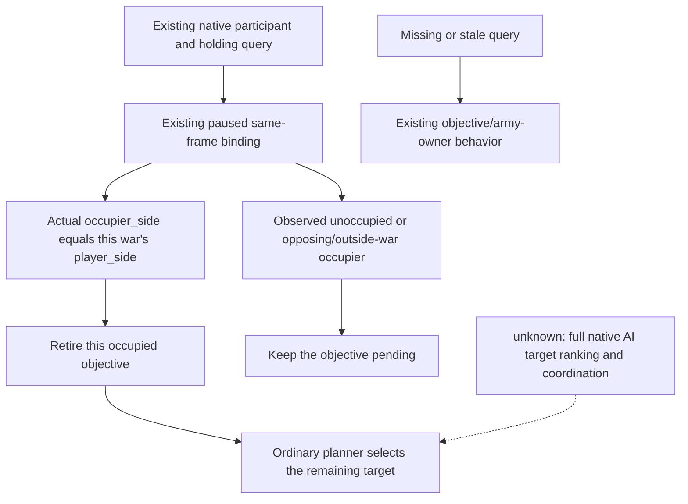

# Ordinary war objectives: consume native occupier side

2026-10-10. The Python consumer implementation
`8bb03c2012532e914dcc11bf2a1d995d5a7303b4`, prepared from private SDK source
`91bf64589d78df866fdf6908841fc9b64e875ec7`, is **static-ready** after Root's
single new ordinary-planner compound passed. The documentation child and later
integrated SDK tip do not replace this tested implementation pin.

## Existing native input and concrete gap

The [native occupation target tree](war-occupation-targets-12003.md) already
joins real war participants, holding/province identity and actual occupying
CharacterID. The [current siege/settlement contract](siege-completion-settlement-normal-contract-12004.md)
records the retained CK3 1.20.0.4 / Steam25734779 build, EXE SHA-256
`98702F88A547CDE2EAF29A85F93B85F68EE4CF8148336A4F7AFAEB75319DD518`,
and the existing typed `occupier_side` result. These identities and previous
native qualifications are reused without executable reads or hashes.

In `strategy.py`, `_player_occupied_objective_ids` previously recognized only
the played CharacterID and owners of current `allied_armies`. An allied
participant with no current field army was absent from that set, even when an
already returned native occupation query explicitly put the occupier on the
player's attacker/defender side. The ordinary planner could keep this completed
province ahead of the remaining objective. The reusable current holding view
already checked the full query/frame binding but discarded its occupation
fields.

The consumer retains occupation values in the existing local holding view and
uses them only for the current war's existing exact objectives. The query's
native side overrides the army-owner inference for observable same-frame rows.
Existing command expansion, auto-turn result extraction and restore scoping
feed the existing freshness reader. No query cadence, capability gate, native
DTO, callback, Runtime archive or public snapshot is changed.

## One necessary Root-only compound

`tests/unit/test_normal_war_occupier_side_consumer_v1.py::test_native_occupier_side_selects_remaining_objective_compound`
uses the real `GameplayBridgeService.plan_turn` and ordinary strategy through
the existing callback-driver fixture. Its five synthetic source-bound scenes
cover the original missing-field-army case, a matching native side, the same
query in an ordinary auto-turn receipt, an opposing native side, and a stale
query. The matching scenes must select `move-army-11-to-2510` instead of the
already allied-occupied2585. The negative/stale scenes retain ordinary prior
behavior, and input snapshots/history are not rewritten. No fixture executes
an action or performs a native query.

Root's sole invocation passed from `2026-10-10T03:21:41.165427Z` to
`03:21:46.099438Z` (outer4.934011s; pytest reports1passed/4.33s). The receipt is
`D:/codex-ck3-background-spill/normal-war-native-occupier-side-consumer-ROOT-FIRST01.json`;
its `.stdout.log` records5ordinary planner scenes and2matching native-side
remaining-target selections,0queries/0actions, unchanged input payloads and
no old native producer replay. The missing-query, opposing-side and stale-query
scenes preserve their prior ordinary behavior. Workers executed no validation.

The result qualifies this source consumer as **static-ready**. No old
Native61?68 producer or consumer was replayed. It does not establish actual-game
target selection, occupation, war victory, a speedup, FullPerson, FullEntry,
full OODA or new G2 credit. Existing current-game/SDK sources remain separate.
