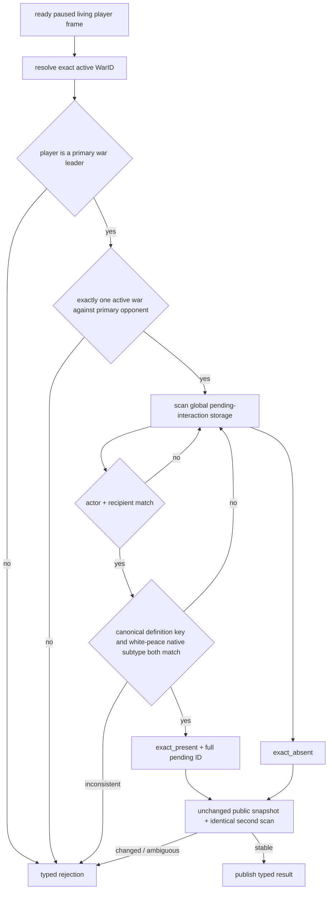

# Outbound white-peace pending status v1

## Scope

This read-only capability is pinned to CK3 `1.19.0.6`, EXE SHA-256
`2D00FF3101EF70B566F2FCBAE292F09263199C80E9DC8F139B82D7D96F83DB86`.
It closes the recovery ambiguity exposed by ordinary-war R796: a command ACK
and a later `submitted_pending` row do not prove whether the player's outbound
white-peace proposal survived a process loss.

Native capability:
`game.command.query-outbound-war-white-peace-status-v1-N`

Concrete step:
`query-outbound-war-white-peace-status-v1-<full-generation WarID>`

Public MCP tool: `ck3_query_outbound_war_white_peace_status`.

## Exact-build decision tree

The responder-facing `pending_character_interaction` snapshot is deliberately
not reused: it filters for interactions addressed to the played character and
therefore cannot observe a proposal sent by that character.

The pending special object does not directly expose a proven WarID. The query
binds actor/recipient to the requested WarID only when the paused public frame
contains exactly one active war against that primary opponent. Multiple common
wars, malformed storage, duplicate exact matches, key/subtype disagreement, or
any frame change return unavailable; none are coerced to absence.

## Recovery contract

- `exact_present`: retain the prior pending action fence and wait; never send a
  second offer.
- `exact_absent`: a recovery controller may mark the unsaved R796 tail as a
  rolled-back branch and submit exactly one fresh offer. The production runner
  must immediately checkpoint the new `submitted_pending` row before advancing
  game time.
- unavailable/rejected: stop with RED; do not infer false and do not retry the
  action.

## Evidence state

As of 2026-09-17 the core reader, adapter capability, bridge frame, Python
driver, service and MCP registration are offline GREEN. Native fixtures cover
exact absence, exact presence, and fail-closed subtype mismatch. This document
does not claim production-live status until a pinned-build paused CK3 query is
sealed.
