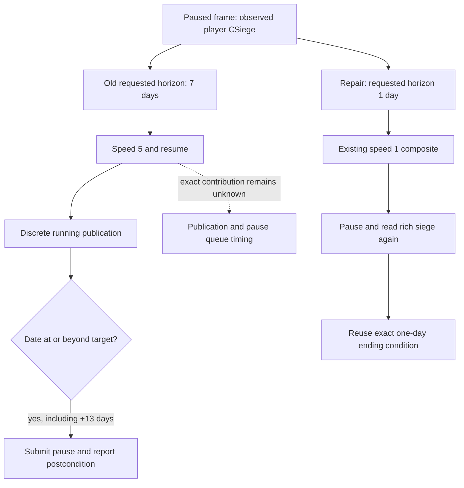

# Paused player-siege timeline cadence (1.20.0.3)

R0047 exposed a real pacing failure on Robert 29829's ordinary campaign:
`life-advance` at the stationary siege in province 3711 requested seven days at
speed five but returned thirteen days, still paused and marked `postcondition`.
The original response and controller failure remain intact. This repair changes
only the observed player-siege cadence; it earns no new game days or live credit.

The exact game is CK3 1.20.0.3, Steam build 25652598, EXE SHA-256
`94b55397abb687a3dcd436805a5d885e6be90fa6c693feb44a9e3bbeeade02a6`.
Runtime source is frozen `Z:/g78` at
`d22e9a1cd3fb1062f6c66282f044daafa016718a`, with the qualified v73 DLL;
candidate source started at `47ecd200e6ef72d46c4d58e1ed7378a76aebae21`.

## Actual evidence and source flow

All receipts are under
`Z:/ck3_mod_rewrite_process_assets/g2-resume-20261006/`.

| Retained evidence | Observed result |
| --- | --- |
| `gameplay-responses/042-arrival-paused-snapshot.json` | native 33/public 34, raw 53265384; three controllable armies at 3711, `sieging`/state 3, empty routes, no combat/retreat; SiegeID 486539314 and WarID 117440524 |
| `gameplay-responses/050-siege-slice-01.json` | 18:24:33.423497–18:24:35.310170 UTC; raw 53265384 → 53265696, requested 7/actual 13 days, speed 5, public 38; siege breach changed 0 → 1 and `can_start_assault` became true |
| `gameplay-responses/052-post-overshoot-paused-snapshot.json` | same PID 69432 and connection generation 1, paused at raw 53265696; zero rejected state snapshots; final observer read 0 ms |
| `timeline-cadence-fix/SOURCE-QUERY-PLAN.json` | frozen before implementation; three evidence hashes, source/query boundaries, actual failure, minimal plan and explicit timing uncertainty |

The failed response SHA-256 is
`5399f8acd189f641a82b5e9d29da898e3a426c40553d8c49d1a650ddd07b70b6`.
The before/after snapshots are SHA-256
`0ca5c3a94b47b082c44a0ef800080245e31c3eadf08304e57311880cde6b74bf`
and the hash recorded by the frozen plan, respectively.

`native_driver.py::_execute_life_advance` compares a discrete running frame
against `starting_date_raw + horizon_days * 24`. Any frame at or beyond the target
satisfies `_life_advance_progressed`; Python subsequently submits `pause-map`.
There is no native date deadline in that path. Thus a frame already thirteen
days ahead can satisfy the old seven-day condition and be reported successful.
The internal primitives do not persist the full driver transcript individually.

The frozen `bridge.cpp` uses `kHeartbeatIntervalMs = 250` and
`PublishSnapshot` on the worker heartbeat. Resume and pause handlers acknowledge
queue submission and then publish observed state. The retained samples do not
identify the exact running publication or pause queue interval that contributed
the six extra days. They do not establish slow native reads, parser rejection or
large-history persistence as the cause.

The v73 hello advertises no tactical daily sentinel arm/status/cancel capability.
The existing Python `stationary_objective_hold` scope also requires regular idle
armies and explicitly rejects a player siege. It cannot be relabeled as this
siege's available native deadline. A future native deadline is a separate
functional implementation; this patch uses the already working one-day path.

## Minimal implementation and qualification

A paused frame with `siege_observable=true` and a player-owned active siege now
requests one day. The shared read-only classifier consumes the starting rich
frame; a running `active_siege=null` remains an observation gap. The stationary
ordinary-siege policy selects speed one and reuses the existing exact one-day
ending condition. Existing assault, active-route, combat/retreat policies keep
their own contracts. A route-free war without an observed player siege keeps
its seven-day requested horizon; peaceful slices keep thirty days and speed five.
No native DLL, protocol/schema, checkpoint or driver-state format changed.

One new production-driver/protocol case reproduces the failed fast arm's sparse
`+13` running publication and the Root's successful slow arm's `+1` publication.
It is a deterministic replay of that exposure, not a reconstruction of all
missing native frames. Two initial fixture construction REDs were preserved:
the first diagnostic lacked the available frame reason, and the second exposed
an incomplete objective-state list. Completing the same fixture then reached
the intended pre-fix production RED (`requested_horizon_days=7`).

The same new case passed after the fix: unittest reports 1 case/0.002 seconds,
process 1.718310 seconds, receipt
`timeline-cadence-fix/final-after-fix-production-replay.json`, log SHA-256
`1811e2c2cd93aa7ed68afd3fb8aa661b8efdee305add979601ba179f9e34d0f0`.
Three existing affected expectations were updated for the changed behavior;
old cases were not rerun. After initial GREEN, narrowing exact-condition reuse
to the stationary ordinary-siege policy justified one final run of this same
new case. No background game/desktop/SDK/pipe/MCP action or native build ran.

Readiness is **static-ready for this finite Python pacing repair**. Root must
reload the Python candidate and retry `life-advance` in the same retained CK3
process before claiming a production-live repair. Its existing successful
`life-advance-one-day` workaround remains distinct evidence; this package does
not claim that this candidate has already run in the game.
