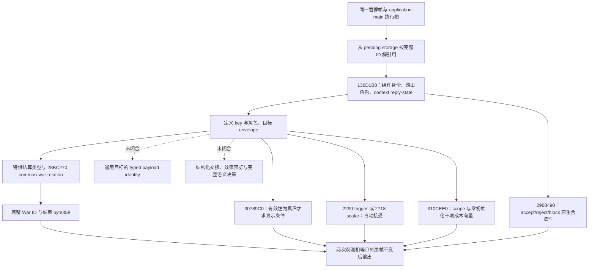
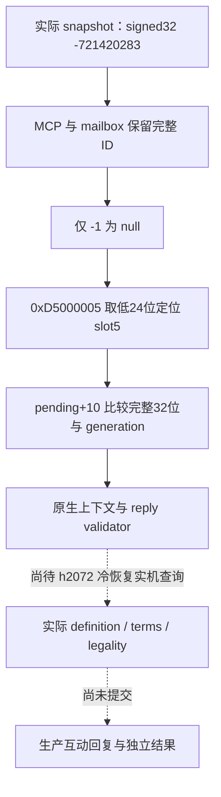

# CK3 1.20.0.2：待回复互动上下文迁移

状态为 **fixture-live**。根执行者已在 attempt14 的一次性外部夹具中完成暂停状态下的 accept、reject、自动接受通知 ACK 和十项成本查询矩阵。此专题的备料与内容核对代理只读冻结 EXE、离线夹具和实机 artifact，没有操作游戏或 profile。原版生产互动、特殊战争条款、非空目标与发送选项及完整策略循环仍不在本次实机认证范围内。

游戏版本为 `1.20.0.2 (Crozier)`，Steam build `25588574`；EXE SHA-256 为 `AE1BA6FF060BA603842F6F4A2DED0AF4B7D3666B3DD271F75FB01B0DA8E81B2D`。磁盘冻结位于 `artifacts/migrations/2026-09-30/post-update-1.20.0.2/installation/binaries/ck3.exe`。

## 已完成的实现

新版本读取器、native binding、JSON 序列化器及离线夹具分别位于：

- `ck3_autonomous_player/native_bridge/include/xar_bridge/ck3_12002_pending_context.hpp`
- `ck3_autonomous_player/native_bridge/src/ck3_12002_pending_context.cpp`
- `ck3_autonomous_player/native_bridge/src/ck3_12002_pending_context_serializer.cpp`
- `ck3_autonomous_player/native_bridge/src/ck3_12002_pending_context_test.cpp`

它们保留现有 DTO 和查询语义，独立绑定 1.20.0.2 的地址与布局。结果包括稳定定义 key、角色、目标类型 key、发送选项、当地回复路由、剩余天数、自动接受、原生 accept/reject/block 合法性、十类资源成本，以及三类普通战争结算互动与当前战争的绑定。通知 ACK 的合法性仍来自通知路由，不能把 reply validator 对枚举 `4` 的提前成功当作完整判定。

`research/ck3_1_20_0_2_pending_context.json` 固定了 17 个唯一字节锚点、5 组虚表前缀、71 条关键指令以及源文件哈希，供统一离线 ABI 校验器复核。旧版研究、源码与生产证据均保留。

## 原生读取链和实际布局差异

| 字段 | 1.19.0.6 | 1.20.0.2 | 新版直接证据 |
| --- | --- | --- | --- |
| Definition compiled cost | `+38` | `+40` | constructor `3144A8E`；旧位置 `+38` 已有新对象类型标记 |
| Definition 发送选项数组 / 数量 | `+2548 / +2554` | `+2258 / +2264` | `30788A7 / 3078888` |
| 发送选项 stride | `7D0` | `730` | `30788A0` |
| 选项有效 trigger | `+E0` | `+D0` | `30789FA` |
| 选项 flag identifier | `+3A8` | `+368` | `30788B5` |
| Definition 自动接受 trigger / scalar | `+2580 / +2A48` | `+2290 / +2718` | `2A2FE45 / 2A2FE51` |
| Definition 发送选项互斥 | `+2A4E` | `+271E` | `3078CEB` |
| Character diplomacy data | `+1A8` | `+1B0` | common-war lookup `28BC274` |

Pending component 仍为 `5C8` bytes，内嵌 context 仍在 `+18`；角色 `+2F0..+300`、目标 `+308`、选项 data/capacity/count `+318/+320/+324`、特殊数据 `+348`、年龄 `+5B8`、路由种类 `+5C0`、通知标记 `+5C6` 均有新构造与消费路径互证。

新 pending storage slot 为 `5D1EC80`，Character storage 为 `5C67568`，互动过期天数 define 为 `5C68CFC`。目标类型 registry getter `3795A80` 返回 `54F2AF0`；脚本 identifier name resolver 为 `3F4F900`。回复命令的 primary/secondary 虚表为 `448BC18/448BBE8`。三类普通战争结算的特殊对象虚表通过 exact RTTI 定位为 victory `46C3AA0`、white peace `46C3B10`、defeat `46C3B80`。

十项成本顺序也通过新版原生路径重新闭合：formatter `310B460` 的 jump table `310C0E8` 将 ordinal `0..9` 映射为 gold、prestige、piety、renown、influence、herd、treasury、treasury_or_gold、merit、barter_goods。`310C1C0` 的显示循环使 compiled row index 与 formatter enum 同时从零递增，`310C250` 按 `F0` 步长访问 compiled rows，`310C74B/310C752` 使用相同 ordinal 调用 formatter，`310CC3E/310CC40/310CC48` 同步递增并在十项后结束。求值器 `310D025` 也以十项终止，向量结束地址为 `out+50`。新版 UI 的 spiritual fulfillment 指标没有成为该成本向量的第十一项。

## 验证与能力边界

MSVC `19.51` x64、C++20 独立构建并运行读取器夹具通过，产物为 `artifacts/migrations/2026-09-30/post-update-1.20.0.2/build-pending-context-msvc/pending-context-test.exe`。夹具覆盖完整 ID 与角色、选项顺序、原生判定调用契约、成本输入作用域、通知路由、特殊战争结算绑定及跨帧变化；另验证 `CWar +358` 必须按单字节读取，`+359/+35F` 非零不能被误判为战争结束。有效 UTF-8 定义 key 也经过夹具验证。

夹具支持 `--emit-json`，把新读取器与序列化器实际生成的完整结果输出供 Python 消费合同回放；产物为同目录的 `pending-context-fixture.json`，SHA-256 `157459BA623BC481357E9727A987EA3A4647AA68BA2C3FC2FCFC44E3DD8B77D6`。它是合成内存结果，不是实机证据。

通用目标 payload 的 typed identity、结构化 outcome/exchange/effect preview、完整互动语义决策仍是旧版已有的未闭合分支。这些字段与 readiness 保持诚实，不把 ACK、静态成功或单个 schema 字段冒充实际策略循环。此次迁移没有展开暂缓的宗教专用域，也没有修改自动玩家策略。

初次 `static-ready` 时的依赖为统一桥接调度集成、主线程 mailbox 与完整 snapshot 的新版本绑定。attempt14 已取得下文四类外部夹具的真实暂停帧查询、回复和结果证据；三类战争结束回复及生产原版互动不因该矩阵通过而获得 `production-live primitive` 认证。

## 外部实机夹具矩阵

外部夹具已物化在 `artifacts/migrations/2026-09-30/post-update-1.20.0.2/live-1.20.0.2/fixtures/events/pending/`。它包含独立 descriptor、scripted effect、三种 interaction、四个隐藏事件及英中定位文件；六个脚本文件均有 BOM，括号与玩家事件闸门静态检查通过。根执行者的 attempt05 已加载第一版并报告五条定义诊断；revision 2 在 attempt09 已加载，随后在 RNG owner 作用域修复后的 attempt14 完成四场真实查询、回复和结果验证。静态检查与实际实机证据分别保留。

根执行者可把该目录当作独立测试 mod，或把 `common/events/localization` 子树并入一次性外部 dev fixture，在下次正式加载时使用。每个种子事件都要求当前 ROOT 为玩家，创建一名专用 NPC 后由明确调用的 `run_interaction` 向玩家发送；无需固定 character ID、province ID 或切换玩家。三条互动均使用 `ai_frequency=0`、保留 `ai_potential={always=no}`，并把显式发送需要的 `ai_will_do` 改为 `base=1`。正常 reply/cost 删除只适用于自动接受通知的 `ignores_pending_interaction_block=yes`；ACK 保留该字段。

此次最小修法有既有实机依据：[通知 ACK 实机夹具](interaction-notification-ack-live-fixture.md) 的 attempt5 已证明 actor-scope `run_interaction` 在其余 validity 通过后仍被 stock `ai_will_do base=0` 阻断，冻结 artifact SHA-256 为 `C8EE5E2C1F354DA38D137260FB28DF2C895D3A872E0F8ADDDF3EEBA46FA39E74`。新版 `_character_interactions.info` 仍把 `ai_will_do` 描述为发送兴趣。这里复用既有实际故障与新版脚本契约，没有声称已经追踪新版原生 gate，也没有把 attempt05 的定义诊断写成已观察到发送失败。

| 触发事件 | 查询和动作 | 主要期望 |
| --- | --- | --- |
| `event xar_m120_pending.100` | 两次同 revision typed query → accept | 正常 recipient 路由；accept/reject 合法；日志 `XAR_M120_PENDING:ACCEPT`；旧 pending 完整 ID 消失或变化 |
| `event xar_m120_pending.101` | 两次同 revision typed query → reject | 同上，日志为 `XAR_M120_PENDING:REJECT` |
| `event xar_m120_pending.102` | 两次同 revision typed query → notification ACK | `auto_accept_notification=true`；只有 ACK 合法；旧 pending 完整 ID 消失或变化；不重复触发自动接受效果 |
| `event xar_m120_pending.103` | 两次同 revision typed cost query | 十资源 raw 值为 `[100000,200000,300000,0,0,0,0,0,0,0]`，即 gold 1、prestige 2、piety 3；其余原生成本行合法为零 |

所有动作均须核对暂停状态、日期与 played character 保持一致。正常请求的 block 被夹具明确禁用；通知通道的 accept/reject/block 均应不合法。成本夹具只验证三个通用货币的正值及十行形状与顺序，没有覆盖其余七类政府相关资源的非零支付。此处 piety 仅作为通用资源成本使用。

完整 MCP 字段期望、作用域、日志标记、源文件哈希和静态结果保存在 revision 2 的 `fixture-plan.json`，SHA-256 `C05FBC45D3EF146D1EEC5C6B4690809E59896B0E075F34CA9E380B2BE4FB31A8`；interaction definition SHA-256 为 `30EDA7A7B291AD87C9F8D5015FB01F96DA20C96AC86734E0003481C4C914FF0A`。第一版定义和 plan 的原始 bytes、精确补丁与本次静态 PASS 保存于同级 `pending-revisions/attempt05-to-next-load/`。attempt05 已加载的 profile 未改写。桌面、游戏进程、一次性 userdir 和加载操作只由根执行者控制；夹具准备代理未进行这些操作。

## Attempt09：原生随机作用域异常

根执行者 attempt09 已加载 revision 2，旧的五条定义诊断消失。三条新的 `ai_frequency` 缺少 `ai_targets` 提示涉及自动调度，不足以证明显式 `run_interaction` 失败。相同原生 inbox 执行器已成功执行 selection 和 window；pending accept 在 `06:37:22` 打印了 `XAR_M120:TRIGGER|case=pending_accept` 后，没有 `SEED`、互动 `on_send` 或正常 `console_success`。冻结 `logs/error.log` 的最后一行直接报告 `Calling global random function without having called ALLOW_RANDOM_IN_SCOPE in this thread`。冻结 mailbox 记录的 failure `512` 是 executor exception；对外的 `fixture inbox executor unavailable` 在此处代表已进入脚本后抛出异常，不能按执行器入口缺失解释。

证据位于 `artifacts/migrations/2026-09-30/post-update-1.20.0.2/live-1.20.0.2/attempt-09/` 的 `pending_accept-trigger.json`、`mcp.json`、`logs/debug.log`、`logs/error.log` 和已有 `bridge-inbox-diagnosis.json`。日志没有 hidden-event-entry、before-create 或 before-run 标记，因此当前能严格定位的区间是 inbox marker 之后、pending 的完整发送后置标记之前；尚不能仅凭该帧区分事件派发、`create_character` 内部随机或 `run_interaction` 内部随机。`random_traits=no` 只关闭随机特质，不能据此假定整个角色创建链不会使用随机函数。

最小诊断候选保存在 `fixtures/events/pending-revisions/attempt09-diagnosis/`：仅为现有 effect/event 增加 entry、before/after create、before/after run 标记，包含可审阅的 `diagnostic-markers.patch`、BOM candidate 文件和冻结证据哈希。候选的 BOM、括号、引号和四条 before/after run 标记检查通过；未应用到外部主副本，也未改 profile。原生随机 owner 作用域的修复由 command-runtime 工作包负责，诊断候选供根执行者按需要使用，不新增实机前置门禁。

window 查询已真实读出 played CharacterID `29829` 和 `xar_m120_scheme_target` 的 CharacterID `30784`。根执行者可在同一一次性状态中刷新并复用该 NPC，绕过创建链；这些 ID 只属于 attempt09 冻结帧，不能跨存档当固定锚点。换成既有 NPC 仍不证明发送链不使用随机函数。pending typed reader 和 accept/reject/ACK/成本矩阵在本 attempt 未取得可验收 pending，保持原有 readiness，不把本次 harness RED 记成读取布局故障。

## Attempt14：四类 pending 夹具实机通过

冻结证据位于 `artifacts/migrations/2026-09-30/post-update-1.20.0.2/live-1.20.0.2/attempt-14/`。`pending-live-assessment.json` 对 MCP 结果、八条原生查询回复、四条原生执行结果、删除后的真实 snapshot 和日志结果标记做了一次内容核对，结果为 **GREEN**，SHA-256 为 `33AF790F4878FFFE7C54ECBC72A51EB664988AF33FCEAFA142CBE2918E5E3234`。外层 attempt 的 RED 来自后续 arrange-marriage query unavailable，不能抹去或冒充这四场 pending 的实机结果。

| 场景 | public / native 查询 revision | pending 完整 ID | actor ID | 实际回复和结果 |
| --- | --- | --- | --- | --- |
| accept | `4 / 3` | `318767107` | `65742` | 原生 submitted；日志 `ACCEPT`；删除后 public/native `5/4`，pending 为 null |
| reject | `6 / 5` | `335544323` | `65743` | 原生 submitted；日志 `REJECT`；删除后 public/native `7/6`，pending 为 null |
| ACK | `8 / 7` | `352321539` | `65744` | 原生 submitted；结果 acknowledged；删除后 public/native `9/8`，pending 为 null |
| cost | `10 / 9` | `369098755` | `65745` | 十项成本真实查询后 reject 清理；日志 `COST_REJECT`；删除后 public/native `11/10`，pending 为 null |

四场 recipient 和 played CharacterID 均为 `29829`，date raw 均为 `53168784`，查询与操作后 snapshot 均保持暂停。每场两次查询的完整 typed payload、完整 pending ID、public/native revision 与 binding 一致，原生 wire 的 typed payload 与 MCP 公共结果相等。公共 revision 与原生 revision 的差值真实保留，未把公共编号当作原生帧编号。

正常 accept/reject/cost 场景的 accept/reject 合法，block/ACK 不合法，`auto_accept=false` 且通知标记为 false。通知场景仅 ACK 合法，`auto_accept=true` 且通知标记为 true；`ACK_NOTIFICATION_SENT`、`AUTO_ACCEPT`、`AUTO_ACCEPT_ON_ACCEPT` 各出现一次，ACK 删除通知时未重新触发这些效果。正常 accept 和 reject 均有独立实际结果日志，不能只根据命令 submitted 或 pending 删除推断结果。

前三场十项成本全为零；cost 场的原始向量为 `[100000,200000,300000,0,0,0,0,0,0,0]`，scale `100000`，资源顺序为 gold、prestige、piety、renown、influence、herd、treasury、treasury_or_gold、merit、barter_goods。返回元数据为 actor/on_send/already_applied；本次核对验证该原生输出及三个正值，不把它写成独立余额会计验收。

本次真实解锁四种外部夹具的 typed pending 观测和回复，readiness 为 **fixture-live**。target absent、发送选项为零、路由为普通 recipient；非空 target/options、中间人路由、block 动作、特殊战争条款及其余七类非零资源未在该矩阵覆盖。`structured_terms_ready` 和 `interaction_semantic_decision_ready` 仍为 false，exchange/effect preview 未闭合；生产原版互动和完整 OODA 未获得认证。attempt09 的失败证据继续保留，当前成功不是对历史失败的重写。

## 2026-10-02：1.20.0.3 自然互动完整 ID 的有符号表示

Murchad 的正式 `formal-v13-next-02` 在正常推进 19 天后读到待回复互动：played CharacterID `31853`、sender `32718`、date raw `53329800`，完整 pending ID 为 `-721420283`。`turn-003/result.json` 与原生回复保留真实 RED：typed query 返回 `invalid_pending_interaction_id`，定义、角色、条款及合法性均为 null。根执行者保存 h2072 后正常关闭游戏；没有提交回复，截图中的宴会视图不能确定互动类型。

本次 exact build 为 `1.20.0.3 (Crozier)` / Steam `25652598`，EXE SHA-256 为 `94B55397ABB687A3DCD436805A5D885E6BE90FA6C693FEB44A9E3BBEEADE02A6`。证据冻结在 `artifacts/g2-maintainer-2026-10-02/resume-12003/m2-events/actual-v13-pending-interaction-signed-id/native-evidence/pending-full-id-exact-12003.json`，SHA-256 `3D4D7415998A6E7A71CE818E6927DF944CAFBDA1328C8EEBC8768A77064314D2`。其中 14 条窄指令确认：原生路由 `136D1BD` 只把 `-1` 当空值；回复 validator `29684B8` 从 command `+20` 读取完整 32 位 ID，`29684BD` 仅为 storage 索引取低 24 位，`29684D9` 仍比较 pending 对象 `+10` 的完整 ID，`29684F2` 保留 `-1` 空值判定。

`-721420283` 的原始位模式为 `0xD5000005`，slot 为 `5`，高八位 generation 为 `0xD5`。它不是需要取绝对值的非法句柄。snapshot 生产者、请求解析、JSON、Python normalizer、MCP 查询和 native reply 均已经保留 signed32 原值；实际拒绝来自 `ck3_12002_pending_context.cpp` 中、首次存储观测之前的 `pending_interaction_id <= 0`。旧版读取器使用的 `== -1` 与本次 exact 原生证据一致，因此最小修复仅恢复该空值条件，保留完整 generation 比较。

独立 scratch 中的现有原生 `ck3_12002_pending_context_test.cpp` 新增 `--actual-negative-id-only` 模式，调用真实读取器及 `.3` identity renderer，验证负完整 ID、六次 validator command 中相同原值、同 slot 错 generation 拒绝及 `-1` 空值。沿用现有合成 definition，不能把它称为本次实际互动类型。Python 的现有 bridge test 增加一个同 ID 的 MCP 查询→service→driver→normalizer→显式 ID 回复回归，首次单项执行 GREEN；没有修改 Python 生产代码。相关检查与补丁均冻结于同一 artifact 目录，不重复旧夹具矩阵，也不展开通用 UI/目标或宗教输入。

原生 focused 首次严格编译和运行 **GREEN**，结果为 `focused-pending-signed-id-01/result.json`，命令为现有 target `xar_ck3_12002_pending_context_test --actual-negative-id-only`，编译采用 `/W4 /WX /UNDEBUG`。它链接只读复制的真实 v13 runtime archive 与两项既有 family 纯依赖，没有 shim、CMake 修改或游戏接触。完整 argv、输入 pin 和实际 `.3` wire 分别保留在 `COMMANDS.json`、`input-pins.json`、`actual-negative-pending-context-wire.json`；没有重跑旧矩阵。

当前修复为 **static-ready**；生产互动定义、回复合法性、正式动作和独立结果必须由根执行者在更新 DLL 后从 h2072 实际查询取得。历史 `.2` fixture-live 结果与本次 `.3` 生产 RED 分别保留；该目录沿用 `m2-events` 命名不代表 M2 事件或材料 credit。

## V14：负完整 ID 的生产查询恢复

根执行者从原存档以新 PID `88444` 冷恢复，`murchad-v14-cold-material-01/016-ck3_query_pending_character_interaction_context_v1.json` 实际返回 **available**，原 signed32 ID `-721420283` 完整保留。前后独立 snapshot `015/017` 同为 `native:1`、public/native revision `2/1`，玩家 `31853`、date raw `53329800`、paused；gold/prestige/piety 没有因查询变化。一次闭合读取核对的 22 项结果全部为真，冻结在 `artifacts/g2-maintainer-2026-10-02/resume-12003/m2-events/actual-v14-pending-interaction-query/closed-packet-assessment.json`；未重复 native fixture 或新操作游戏。

实际定义为 `grant_vassal_interaction`，key hash `1006648858`、runtime ordinal `296`。发起者 `32718`、玩家接收者 `31853`、拟转封臣 secondary actor `31506`；secondary recipient/intermediary 均为 `-1`。target envelope 合法 absent，发送选项数为零，本地普通 recipient 回复通道，剩余 `57/60` 天。原生 accept/reject/block 均合法，ACK 不合法。十项 structured costs 已闭合为 actor/on_send/already_applied，raw 全零；它们不是对拒绝后全部效果的零成本证明。

该查询达到 **production-live primitive**。stable definition、roles、target、options、routing、deadline、reply legality、generic costs 与 same-frame readiness 为 true；结构化 exchange/effect preview 仍 unavailable，`interaction_semantic_decision_ready=false` 如实保留。正常拒绝续行依据已有 [封臣转封原生树](title-vassal-transfer.md) 与当前 stock decline，而不依赖无关 AI 接受评分；这份查询核对没有提交回复或认证完整循环。末 checkpoint h2077 的 save SHA-256 为 `18A78E68385137B7FE35679AA8CA6A60437DA760189F18EA4E084FA92D9D2577`、size `112139803`，同角色/日期。V13 原 `invalid_pending_interaction_id` RED、h2072 与旧 `.2` fixture 历史均继续保留。

随后根执行者在 `murchad-v14-grant-vassal-reply-01` 只提交一次正常 typed reject，参数保留 `-721420283` / expected public revision `2`。`004` 的 submitted 只记原生命令提交；独立 `003→005` snapshot 才证明旧 pending → null、public revision `2→3`，同 PID `88444`、玩家 `31853`、episode `native-31853-af642d76cb41`、date raw `53329800`、paused。gold raw `52818557` 与 prestige raw `115891020` 不变，piety 和 observed war list 也不变。一次闭合核对的 18 项全部 GREEN，保存于 `artifacts/g2-maintainer-2026-10-02/resume-12003/m2-events/actual-v14-grant-vassal-continuation/closed-packet-assessment.json`；末正常 checkpoint h2079，size `112139354`、SHA-256 `F0F296468A12886892FDAC2D828466D2F8527163D36DBC4413F376569D409039`。

这次生产原语覆盖查询 → source-bound 拒绝 → 独立旧 ID 清空；没有读取 `31506` 的 liege/title、opinion 或 clan unity 后置，因此不声明完整转封关系保持、全部副作用或物质收益。下一正常 turn 消费仍由根执行者继续，M2 material credit 为零；没有重复查询/fixture/回复，旧 RED 未改写。

其后同 PID/episode 的 `formal-v14-next-02` 实际 initial pending 为 null，正式正常回合消费了该清空状态；turn3 正常推进 33 天，turn5 再推进 8 天，date raw `53329800→53330784`（41 天），旧 pending 始终 absent。独立 before/after 的角色 `31853`、episode 和暂停 bookend 相同；正常 h2097 checkpoint 留存，随后因新自然 `feast.2001` instance15 未登记而停止。一次离线核对七项 GREEN，保存于上述 continuation 包的 `normal-next-consumption-assessment.json`。本切片闭合 root 选定的 SDK typed 拒绝 → 独立 pending 清空 → 正式下一回合消费；新 ordinal296 自动策略兼容仍只获静态回归，不冒称已经自然再现并由新版自动规则决策。没有新材料/M2 credit，也不是整个正式运行已完成。

## 2026-10-03：typed 消费者的返回值与异步回读合同

本节只复核公共 Python/keeper 实现，不新增实机认证；前述 signed-ID 与生产查询/拒绝证据保持原边界。消费者沿用 `normalize_pending_interaction_id`：保留完整 signed int32 与 generation，`0` 和负数结构合法，只有 `-1` 为无效哨兵，不能取绝对值或先判 `id > 0`。

`reply_pending_character_interaction(accept=False, interaction_instance_id=..., expected_revision=...)` 最终覆盖返回字段为 `accepted=False`；它表示选择了拒绝，不是命令失败。回复完成应核对 `interaction_result.status="rejected"`、原 `instance_id`，以及独立后置 snapshot 的旧完整 ID 消失或变化；异常或 postcondition 缺失不能用这一布尔值代替。通知走现有 typed acknowledge 接口，不把 auto-accept 通知当普通 accept 再执行。

消费者对同一 query/source frame 只提交一次动作，然后在有限 deadline 内读回实际状态，不因 ACK 后第一帧仍旧就重提。`_execute_pending_character_interaction_reply` 已按 command timeout 等待暂停帧的旧 ID 推进；event selection 另显式核对 episode/PID/connection。调用方仍应把 query、选择、后置与同一 played actor、episode、bridge PID/generation、public/native revision 和 date 绑定，不能把 pending helper 的 ID 检查说成它已经完成全部身份检查。

map-control 的 `_verify_idempotent_map_control_postcondition` 只对 `already_running` / `already_paused` 返回分支等待 semantic frame；一般 `submitted` ACK 返回不能证明 paused 已改变。需要恢复自然时钟的消费者应独立限时等待实际 `paused=false`；期间若下一事件/请求出现，应先消费新的有效上下文，再决定恢复，不能越过队列。paused=false 也不能独自证明日期自然推进、资源/关系结果或长期稳定性。

原生 `legality.*.allowed` 只证明当帧可以执行。available v1 合同仍为 `generic_costs_ready=true`、`structured_terms_ready=false`、`interaction_semantic_decision_ready=false`；generic actor/on_send 成本不能证明接收方 accept 的全部后果或可承受性。产品接受策略需要另外明确的条款/效果/成本依据；缺少语义时保全 context 并转交其操作员政策，不把 allowed 或 ACK 写成最优选择/物质结果。这里不统一各产品的拒绝优先级，也不修改主仓 planner。

以下来源均按公共提交 `18dee6291c3e9d2374ac6e8117e208cf1c8319de` 的实际文件 bytes 核对；没有 import SDK、调用 driver/pipe、重复原生夹具或操作游戏。本节是 source-supported 文档增量，消费者实机适配仍须分别验收。

| 公共源码与入口 | SHA-256 |
| --- | --- |
| [pending_character_interaction_context_contract.py](../../ck3_autonomous_player/src/xar_autoplayer/bridge/pending_character_interaction_context_contract.py)：`normalize_pending_interaction_id` / available readiness | `f43876ccfbd32b75005f3954ab9a5877c9274f250d427143e8e31d4904082419` |
| [service.py](../../ck3_autonomous_player/src/xar_autoplayer/bridge/service.py)：`reply_pending_character_interaction` / `acknowledge_pending_character_interaction` | `4cc430636faca6485e9fb986378d3ca7817f3c6b8474b178c3cfed55e2996eff` |
| [native_driver.py](../../ck3_autonomous_player/src/xar_autoplayer/bridge/native_driver.py)：`_execute_pending_character_interaction_reply` / event selection / map-control postcondition | `edcb1f8e4ebbb20703988995a9f584a2cdeef1b6c4e154a84a7560746ec25aed` |
