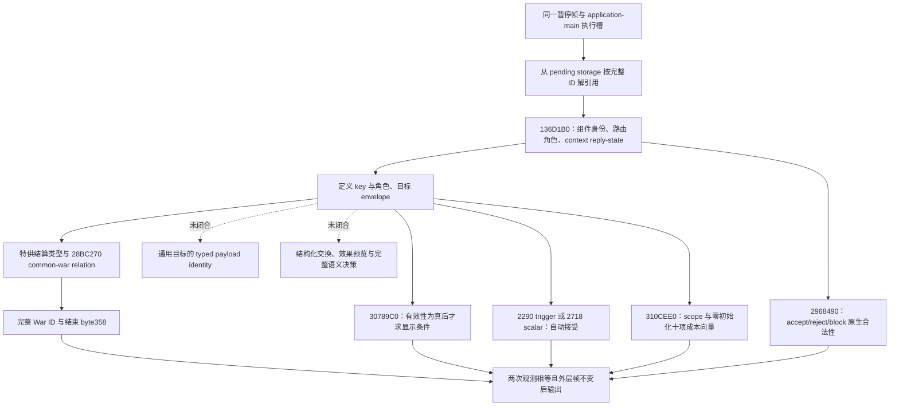

# CK3 1.20.0.2：待回复互动上下文迁移

状态为 **static-ready**。本次只读取冻结的游戏 EXE 并运行自有内存夹具，没有启动、附加、注入、操作、关闭或重启玩家正在运行的游戏。实际暂停帧、主线程执行、回复效果与完整策略循环仍须实机验收。

游戏版本为 `1.20.0.2 (Crozier)`，Steam build `25588574`；EXE SHA-256 为 `AE1BA6FF060BA603842F6F4A2DED0AF4B7D3666B3DD271F75FB01B0DA8E81B2D`。磁盘冻结位于 `artifacts/migrations/2026-09-30/post-update-1.20.0.2/installation/binaries/ck3.exe`。

## 已完成的实现

新版本读取器、native binding、JSON 序列化器及离线夹具分别位于：

- `ck3_autonomous_player/native_bridge/include/xar_bridge/ck3_12002_pending_context.hpp`
- `ck3_autonomous_player/native_bridge/src/ck3_12002_pending_context.cpp`
- `ck3_autonomous_player/native_bridge/src/ck3_12002_pending_context_serializer.cpp`
- `ck3_autonomous_player/native_bridge/src/ck3_12002_pending_context_test.cpp`

它们保留现有 DTO 和查询语义，独立绑定 1.20.0.2 的地址与布局。结果包括稳定定义 key、角色、目标类型 key、发送选项、当地回复路由、剩余天数、自动接受、原生 accept/reject/block 合法性、十类资源成本，以及三类普通战争结算互动与当前战争的绑定。通知 ACK 的合法性仍来自通知路由，不能把 reply validator 对枚举 `4` 的提前成功当作完整判定。

`research/ck3_1_20_0_2_pending_context.json` 固定了 17 个唯一字节锚点、5 组虚表前缀、71 条关键指令以及源文件哈希，供统一离线 ABI 校验器复核。旧版研究、源码与生产证据均保留。

## 原生读取链和实际布局差异

| 字段 | 1.19.0.6 | 1.20.0.2 | 新版直接证据 |
| --- | --- | --- | --- |
| Definition compiled cost | `+38` | `+40` | constructor `3144A8E`；旧位置 `+38` 已有新对象类型标记 |
| Definition 发送选项数组 / 数量 | `+2548 / +2554` | `+2258 / +2264` | `30788A7 / 3078888` |
| 发送选项 stride | `7D0` | `730` | `30788A0` |
| 选项有效 trigger | `+E0` | `+D0` | `30789FA` |
| 选项 flag identifier | `+3A8` | `+368` | `30788B5` |
| Definition 自动接受 trigger / scalar | `+2580 / +2A48` | `+2290 / +2718` | `2A2FE45 / 2A2FE51` |
| Definition 发送选项互斥 | `+2A4E` | `+271E` | `3078CEB` |
| Character diplomacy data | `+1A8` | `+1B0` | common-war lookup `28BC274` |

Pending component 仍为 `5C8` bytes，内嵌 context 仍在 `+18`；角色 `+2F0..+300`、目标 `+308`、选项 data/capacity/count `+318/+320/+324`、特殊数据 `+348`、年龄 `+5B8`、路由种类 `+5C0`、通知标记 `+5C6` 均有新构造与消费路径互证。

新 pending storage slot 为 `5D1EC80`，Character storage 为 `5C67568`，互动过期天数 define 为 `5C68CFC`。目标类型 registry getter `3795A80` 返回 `54F2AF0`；脚本 identifier name resolver 为 `3F4F900`。回复命令的 primary/secondary 虚表为 `448BC18/448BBE8`。三类普通战争结算的特殊对象虚表通过 exact RTTI 定位为 victory `46C3AA0`、white peace `46C3B10`、defeat `46C3B80`。

十项成本顺序也通过新版原生路径重新闭合：formatter `310B460` 的 jump table `310C0E8` 将 ordinal `0..9` 映射为 gold、prestige、piety、renown、influence、herd、treasury、treasury_or_gold、merit、barter_goods。`310C1C0` 的显示循环使 compiled row index 与 formatter enum 同时从零递增，`310C250` 按 `F0` 步长访问 compiled rows，`310C74B/310C752` 使用相同 ordinal 调用 formatter，`310CC3E/310CC40/310CC48` 同步递增并在十项后结束。求值器 `310D025` 也以十项终止，向量结束地址为 `out+50`。新版 UI 的 spiritual fulfillment 指标没有成为该成本向量的第十一项。

## 验证与能力边界

MSVC `19.51` x64、C++20 独立构建并运行读取器夹具通过，产物为 `artifacts/migrations/2026-09-30/post-update-1.20.0.2/build-pending-context-msvc/pending-context-test.exe`。夹具覆盖完整 ID 与角色、选项顺序、原生判定调用契约、成本输入作用域、通知路由、特殊战争结算绑定及跨帧变化；另验证 `CWar +358` 必须按单字节读取，`+359/+35F` 非零不能被误判为战争结束。有效 UTF-8 定义 key 也经过夹具验证。

夹具支持 `--emit-json`，把新读取器与序列化器实际生成的完整结果输出供 Python 消费合同回放；产物为同目录的 `pending-context-fixture.json`，SHA-256 `157459BA623BC481357E9727A987EA3A4647AA68BA2C3FC2FCFC44E3DD8B77D6`。它是合成内存结果，不是实机证据。

通用目标 payload 的 typed identity、结构化 outcome/exchange/effect preview、完整互动语义决策仍是旧版已有的未闭合分支。这些字段与 readiness 保持诚实，不把 ACK、静态成功或单个 schema 字段冒充实际策略循环。此次迁移没有展开暂缓的宗教专用域，也没有修改自动玩家策略。

后续依赖为统一桥接调度集成、主线程 mailbox 与完整 snapshot 的新版本绑定，以及玩家允许后使用暂停实机帧验证真实互动和三类战争结束回复。查询没有实机 artifact 前不得提升为 `production-live primitive`。
