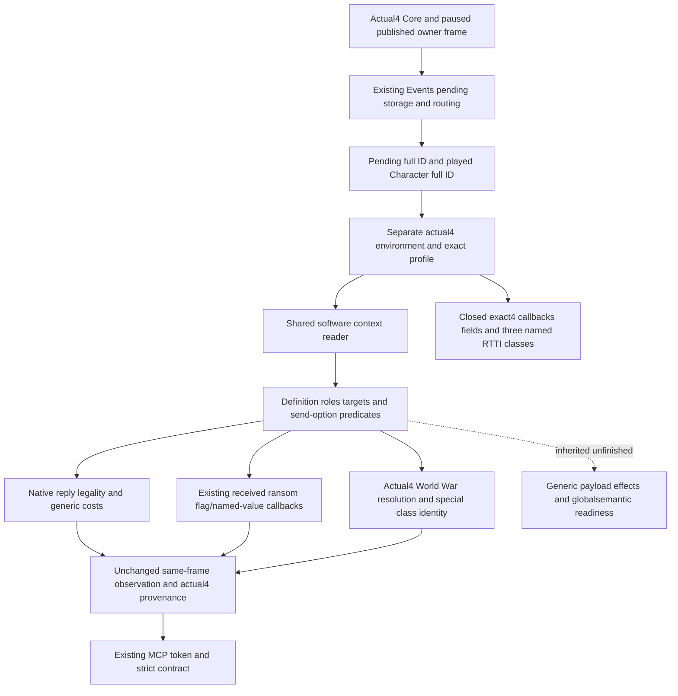

# Pending interaction context: existing provider migration to CK3 1.20.0.4

This source package restores the existing
`game.command.query-pending-character-interaction-context-v1` provider on
actual1.20.0.4 / Steam25734779 /
`98702F88A547CDE2EAF29A85F93B85F68EE4CF8148336A4F7AFAEB75319DD518`.
The source baseline is `c8f19a6a067ef8dd56926b8bc11d14b164045974`.
It adds no tool, field, policy, action or G2 credit. Root owns shared Adapter,
Bridge, CMake, formal validation, SDK and game operation.

The existing typed reader publishes pending definition identity, roles,
target type, ordered send options, routing, deadline, auto-accept, native
reply legality and generic ten-resource costs. Its received pay/self-ransom
quote is already adopted; it remains a separate independent decision input.
Its generic target payload, effect preview, structured exchanges and complete
global semantic decision are inherited unfinished branches.

The current source calls the old environment factory and validates old
native entrance addresses. The shared War resolver also calls the legacy
World binder, and received-ransom fallback helpers use old native addresses.
The strict wire provenance admits only11906/12002/12003. These concrete
version joins must be migrated; an actual4 SHA is not supplied to old binders
and offline fixture overrides are not used as production admission.

Core, World, Events, Prisoner and Family actual4 APIs and source proofs are
reused. Events already closes pending storage`5D1EC80`, routing`136D190`,
reply validator`2968470` and reply vtables`448BC28/448BBF8`; Family already
closes Character-kind trigger`372DF10`. A finite cache lookup ledger for
generic cost, common-war relation, target registry/name, expiration define,
special-war classes and field-source anchors is sealed before any new source
capture. Complete missing spans, if necessary, use the shared FamilyMapper's
cache/claims and stay inside the named direct family.

The named callback proofs reuse the retained Family/Prisoner/Events/World
ledgers: common-war `28BC250` (176B logical span), target registry getter
`3795A60` (171B, actual returned static `54F2AF0`), identifier name
`3F4F8E0` (292B), pending constructor `2A32770` (470B) and context copy
`3076B60` (262B). Full decoder JSON is reused; these bodies are not recaptured.

The minimal missing field manifest closes expiration RIP `2A2FD10` to
`5C68CFC`, definition auto-trigger `+2290`, auto scalar `+2718`, compiled
cost `+40`, and the complete 153B send-option gate `30789A0`. The gate's
native shown/valid trigger evaluator is `372DF10`; option stride, IDs,
definition rows/count and exclusive flag reuse the adopted Prisoner source.
All five declared spans normalize equally with unchanged field operands.
The source reads total318B (old159B/new159B); the three other field points
reuse36B across both builds. The earlier Prisoner gate cache held147B per
build. The shared mapper requires a complete covering cache, so the153B
capture repeated147B per build instead of stitching the6B suffix. This is
294B physical duplicate and24B unique new code, recorded as actual cost.
No additional PE/.pdata bytes are read.

The three named EndWar class identities close through VT[-8], a 24B COL
with signature1/offset0/self, and its exact TD name. Actual4 victory is
`46C3AB0`, white peace `46C3B20`, defeat `46C3B90`. Each actual table is
selected uniquely from its frozen48B local candidate window and only then
identified by the native RTTI chain. No address delta is used as identity.
The three old/new chains cost660B/18capture calls with no physical duplicate.
The first finite plan understated the exact TD-name arithmetic by10B;
the retained correction is660B for the identical three declared names/read
scope. No method slots are invoked or expanded.

The implementation API is frozen in `EXACT-API-AND-SOURCE-CLOSURE.json`
before code. It supplies a separate actual4 factory, inline complete profile
matcher, reader wrapper with actual4 readonly Prisoner callbacks, and explicit
actual4 wire provenance. The target registry's returned static remains the
same source-proved value, so its software identity comparison needs no change.
Incoming ransom keeps prisoner root/actor payer/recipient jailer and the
borrowed pending scope. Its stock current-gold limitation for a distinct
pay-ransom payer remains inherited behavior.

Current status: **source-closed / implementation AUTHORED_NOTRUN**. New
source reads total978B/22capture calls (318B code and660B RTTI data;
684B unique new and294B duplicate), with
no hash/build/tests/SDK/game query or live qualification. The frozen plan
and source-cost ledger are external at
`C:/codex-ck3-background/packets/pending-interaction12004-migration-20261007/`.
