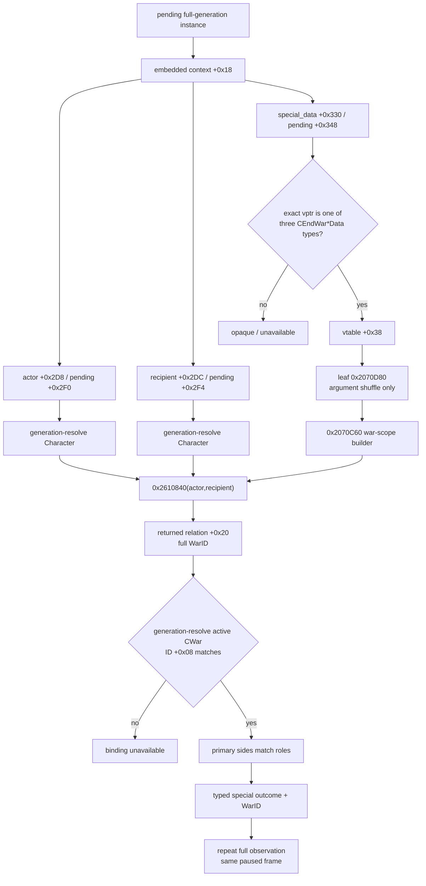

# CK3 1.19.0.6 pending interaction 特殊战争绑定

## 结论与范围

- [static-confirmed] 本文绑定 CK3 `1.19.0.6`，`ck3.exe` SHA-256 为
  `2D00FF3101EF70B566F2FCBAE292F09263199C80E9DC8F139B82D7D96F83DB86`。
- [static-confirmed] 当前 pending `special_data` 对三种普通战争终止互动不是保存 WarID 的
  payload。三个 concrete factory 都只分配 `8` bytes 并写一个 vptr；对象本身只有 exact-build
  subtype identity。
- [static-confirmed] 三个 subtype 共用的 native war-scope 路径是
  `vtable+0x38 -> 0x2070D80 -> 0x2070C60 -> 0x2610840(actor,recipient)`。
  `0x2610840` 返回对象的 `+0x20` 是双方共同 WarID；helper 随后 generation-resolve active
  `CWar`，并把 `CWar+0x08` 的 full WarID 写进 tag `0x10` 的 war scope。
- [static-confirmed] generic `InteractionEffectsDescription` materializer `0x24B1B20` 在完整
  exact span 内不读取 `CCharacterInteractionContext+0x330`，所以四路 generic effect view
  不包含、也不能冒充 hard-coded special war outcome。特殊战争绑定必须是独立 typed term。
- [implementation-confirmed] `pending-character-interaction-special-war-binding-v1` 已作为现有
  `pending-character-interaction-context-v1` 的 additive typed term 接入 production reader、application-main
  mailbox、serializer、Python native driver/service/MCP strict normalizer 与 synthetic fixtures。它只发布三种
  已闭合的普通、非宗教 war-exit subtype、absolute outcome、同一 active WarID 与双方 primary war role；
  其它 subtype 保持 opaque/unavailable。
- [live-confirmed ordinary white peace] fresh production-only cold PID 已对普通
  `end_war_attacker_white_peace_interaction` 完成同 revision 双查询与 active-war 互证；
  `ordinary_white_peace_binding_live_ready=true`。production 阶段没有 effect executor、reply/ACK 或战争 mutator。
- [not-live-evidence] victory 与 defeat 尚无各自 paused fixture；`special_outcome_terms_ready`、
  `structured_terms_ready`、`interaction_semantic_decision_ready` 继续为 false。

本文是 [interaction-structured-terms.md](interaction-structured-terms.md) 的独立 exact-build
侦察记录，并复用 [battle-terminal-and-reentry.md](battle-terminal-and-reentry.md) 已闭合的
`0x2610840 -> relation+0x20 WarID` 交叉证据。战争结果脚本与既有发送路径见
[war-termination.md](war-termination.md)。本文的普通 `claim_cb` fixture 不使用宗教暂缓的两项窄例外：战争域允许的
圣战/大圣战最小语义，以及婚姻域不得不考虑信仰时的最小原生调用。本文不展开 faith、doctrine、tenet、fervor、
改宗、宗教改革或教团；若后续研究圣战，必须在独立战争切片中只取完整 war OODA 所需最小输入。

## 冻结输入

| 输入 | SHA-256 | 用途 |
|---|---|---|
| `Crusader Kings III/binaries/ck3.exe` | `2D00FF3101EF70B566F2FCBAE292F09263199C80E9DC8F139B82D7D96F83DB86` | exact-build code、RTTI、vtable 与 `.pdata` |
| `game/common/character_interactions/00_war.txt` | `5C99B8F14893929A9BC2DBB5B258CDD2D4233D5805091952209413DE876EE09F` | 三个 authored interaction 与 absolute outcome |
| `game/common/character_interactions/_character_interactions.info` | `F360C05B72CD2B0D87885E570FA55E70E41089DEFB4675BE5A82E390940D5D10` | `special_interaction` 是 specialized code/type 的公开 source contract |

`00_war.txt` 的非宗教 source anchors：

- lines `458-459`：`end_war_attacker_victory_interaction` 绑定同名
  `special_interaction`；其 `on_accept` 在 line `644` 执行 `end_war = attacker`；
- lines `1002-1004`：`end_war_attacker_white_peace_interaction` 绑定
  `end_war_white_peace_interaction`；其 `on_accept` 在 line `1187` 执行
  `end_war = white_peace`；
- lines `1913-1918`：white-peace validator 要求 `scope:war` 存在、CB 有效且
  `is_white_peace_possible = yes`；
- lines `1922-1923`：`end_war_attacker_defeat_interaction` 绑定同名
  `special_interaction`；其 `on_accept` 在 line `2108` 执行 `end_war = defender`。

这里的 `attacker_victory` / `attacker_defeat` 是战争的绝对 outcome，不是“当前 actor 获胜/失败”
的相对命名。wire 必须另外发布或由 active CWar 推导 actor/recipient 的 primary side。

## `special_data` 是无 payload 的 concrete type tag

pending 内嵌 `CCharacterInteractionContext` 从 pending `+0x18` 开始；因此：

| 对象 | context offset | pending offset | 已闭合语义 |
|---|---:|---:|---|
| actor full CharacterID | `+0x2D8` | `+0x2F0` | native common-war lookup 的第一角色 |
| recipient full CharacterID | `+0x2DC` | `+0x2F4` | native common-war lookup 的第二角色 |
| special data pointer | `+0x330` | `+0x348` | nullable `CSpecialInteraction*`；本切片只识别三个 exact vptr |

三个 concrete type 的完整 identity 如下：

| absolute outcome | RTTI type descriptor | COL | object vptr | factory | allocation |
|---|---:|---:|---:|---:|---:|
| attacker victory | `CEndWarAttackerVictoryInteractionData` `0x546AB30` | `0x48F78D8` | `0x428EEA8` | `0x2070E90` | `8` bytes |
| white peace | `CEndWarWhitePeaceInteractionData` `0x546AAB8` | `0x48F7888` | `0x428EF88` | `0x2070F00` | `8` bytes |
| attacker defeat | `CEndWarAttackerDefeatInteractionData` `0x546AAF0` | `0x48F78B0` | `0x428EF18` | `0x2070F70` | `8` bytes |

[static-confirmed] 每个 factory 都执行同一形状：调用 allocator 分配 `8` bytes，将相应 vtable
写到新对象 `+0x00`，然后返回。没有构造 WarID、CharacterID、option 或任意尾字段。三个 vtable
的 `0x68`-byte function slot 区甚至逐字节相同，SHA-256 都是
`E29C4F489B0D92384BC94926281F0F67288BDA12C0DA7C7FF7A69D6F74F6B035`；
类型差异来自 vptr 地址及其前置 COL/RTTI，而不是虚函数内容或 payload。

因此 production 只能把 `module_base + vtable RVA` 的精确比较用作这三个 subtype 的 type tag：

```text
special_data == null                    -> none
*special_data == base + 0x428EEA8       -> attacker_victory
*special_data == base + 0x428EF88       -> white_peace
*special_data == base + 0x428EF18       -> attacker_defeat
otherwise                               -> opaque_other
```

不能按相邻 vtable、RTTI 名称子串、definition key 前缀或 source 文件顺序猜测其它 subtype。

## 原生共同战争绑定

### 确定调用链



### `0x2610840` 的只读语义

[static-confirmed] `0x2610840(actor,recipient)`：

1. 读 `actor+0x1A8` 指向的关系容器；
2. 以 `recipient+0x18` 的 full CharacterID 为 key，在 stride `0x10` rows 中二分查找；
3. 命中时返回 row `+0x08` 的 relation pointer，否则返回 engine sentinel；
4. 全函数只写自身 stack，不写 actor、recipient、relation、CWar 或 manager。

[static-confirmed] `0x2070C60` 与独立 combat-terminal caller 对返回值给出相同解释：

1. 读取 returned relation `+0x20` 的 full WarID；
2. 按该 ID generation-resolve war storage；
3. 要求 resolved `CWar` 通过 active vfunc；
4. 在输出 scope `+0x00` 写 tag `0x10`，在 `+0x08` 写 `CWar+0x08` 的 full WarID。

`0x2070D80` 只是把 virtual-call 参数改排成 `0x2070C60(out,context)` 所需顺序；builder
和 lookup 都不读取 concrete special object 的 `this`。这解释了为什么三个 subtype 可以共用完全
相同的 vtable slots，又为什么 WarID 不存在于八字节对象内。

本切片不建议在 bridge 中调用 `vtable+0x38`：它会构造一个带额外生命周期的 engine scope，且
最终只为取得 already-closed WarID。最小 production reader 可直接调用已证明只读的
`0x2610840`，再复用现有 generation-safe `ResolveWar` 与 active-CWar 校验。

## generic effect materializer 的负证据

`0x24B1B20(out,context)` 的完整 `0x5B6` bytes 内，context 侧只读取/使用：

- definition 的四个 compiled roots `+0x1898/+0x1658/+0x18F8/+0x17D8`；
- context primary scope `+0x08`；
- actor `+0x2D8`、intermediary `+0x2E8`、recipient `+0x2DC`；
- definition `+0x18F8` 的额外 description path。

[static-confirmed] 该 exact span 没有 `context+0x330` load，也没有读取或调用 `special_data`。
所以未来即使四个 `0x78` view 的 typed row ABI 全部闭合，以下状态仍必须分开：

```text
generic_effects_ready = true/false
special_war_binding_ready = true/false
special_outcome_terms_ready = true/false
```

`special_war_binding_ready=true` 只证明“这份 pending 指向哪个 active WarID、请求哪一个绝对战争
结果”；它不证明 prestige、gold、claim、truce、prisoner、hostage 或其它 dynamic outcome rows 已完整。
更不能把 generic view 的空 rows 解释成 special outcome 没有代价或效果。

## Exact byte spans

| 名称 | RVA span | bytes | `.pdata` 形状 | SHA-256 |
|---|---:|---:|---|---|
| common-war relation lookup | `0x2610840..0x26108F0` | `0xB0` | 四区：`0x2610840..0x2610869`、`0x2610869..0x26108D4`、`0x26108D4..0x26108E4`、`0x26108E4..0x26108F0` | `F8775B263CF77288E58D1B97AFA4FB900327EC072D0AA4CFB0CB4EA94256A8B9` |
| war-scope builder | `0x2070C60..0x2070D77` | `0x117` | 单一 exact row | `20B4DCC7B2AC8B2C7FDFEC7149168F8610CC81842E8B3779BC6CFE5D1523EFEB` |
| shared vfunc thunk | `0x2070D80..0x2070D8B` | `0x0B` | leaf thunk，无 `.pdata` row | `E2E24085CA765BEC713AE4EE49CFA3013539B1741FACF3D17635CC76E235A681` |
| victory special-data factory | `0x2070E90..0x2070EB9` | `0x29` | 单一 exact row | `B9B6BF59591CEB21C678EB883D8B4C99BE0D2C8DB19B1E04F5487DB7DEBAF282` |
| white-peace special-data factory | `0x2070F00..0x2070F29` | `0x29` | 单一 exact row | `79CE167BE7BBBC0A0270BC40211D3534B24F9362A046FDEA70267C68499EF313` |
| defeat special-data factory | `0x2070F70..0x2070F99` | `0x29` | 单一 exact row | `0C5D1B367AF2F1D4782D60889FB90C5B32D0B8F4D7A79E2EC5DAB48F51082C9C` |
| generic effect materializer | `0x24B1B20..0x24B20D6` | `0x5B6` | 单一 exact row | `BB06B4DF46AE835C1B6FE97874078BB8E00759A92866A2A1C03362ACD03DF52F` |

上述 `0x2610840` 四区是同一优化后函数的完整连续 source span，不得只 hash 第一条 unwind row；
`0x2070D80` 则必须明确记录为无独立 `.pdata` row 的 leaf thunk。

## 已实现的最小 production wire

新字段作为现有 `pending-character-interaction-context-v1` 的 additive typed term 发布，没有另开
一条扫描 pending manager 的竞态路径。ABI 子合同名称是
`pending-character-interaction-special-war-binding-v1`；它的 static/query readiness 与 live readiness
分开记录，并按 outcome 独立升级。当前 ordinary white-peace 为 live-confirmed，victory/defeat 仍不得借用该证据。

示例形状：

```json
{
  "special_war_binding": {
    "status": "available",
    "value": {
      "special_interaction_kind": "end_war_white_peace_interaction",
      "absolute_outcome": "white_peace",
      "war_id": 16777290,
      "actor_war_role": "primary_attacker",
      "recipient_war_role": "primary_defender",
      "binding_source": "native_common_war_relation"
    },
    "reason": null
  }
}
```

稳定 enum 只允许：

| definition canonical key | exact vptr | `special_interaction_kind` | `absolute_outcome` |
|---|---:|---|---|
| `end_war_attacker_victory_interaction` | `module+0x428EEA8` | `end_war_attacker_victory_interaction` | `attacker_victory` |
| `end_war_attacker_white_peace_interaction` | `module+0x428EF88` | `end_war_white_peace_interaction` | `white_peace` |
| `end_war_attacker_defeat_interaction` | `module+0x428EF18` | `end_war_attacker_defeat_interaction` | `attacker_defeat` |

white-peace 的 definition key 比 special type key 多出 `attacker_`；实现必须按上表做 exact pair
allowlist，不能直接要求两个字符串相等。

### 必须同时满足的读取门

1. application-main mailbox，exact build admitted，paused map-ready frame；
2. full generation-bearing pending ID 连续解析为同一 pointer/identity；
3. definition pointer、canonical key、actor/recipient full CharacterID、special pointer 与 vptr 两次相同；
4. vptr 是三个 allowlisted RVA 之一，且 definition canonical key 与 subtype/outcome 一致；
5. actor/recipient Character 都按 full ID generation-resolve，`0x2610840` 两次返回同一 relation；
6. relation `+0x20` 的 full WarID 两次相同且为正；
7. 现有 `ResolveWar` 两次得到同一 active `CWar`，`CWar+0x08` 等于 relation WarID；
8. `CWar+0x288/+0x28C` 的 primary attacker/defender 与 actor/recipient 恰为相反两侧；
9. outer snapshot revision/date/paused/map-ready 前后完全相同，第二份完整 observation 等于第一份。

任何一步失败都不得降级为裸 pointer、runtime ordinal 或猜测 outcome：

| 情况 | typed reason 建议 |
|---|---|
| `special_data == null` 且 definition 不是三种 exact war-exit | `special_war_binding_not_applicable` |
| 三种 exact war-exit definition 之一但 `special_data == null` | `special_interaction_identity_mismatch` |
| 非 allowlisted vptr | `special_interaction_subtype_opaque` |
| definition 与 concrete type 不一致 | `special_interaction_identity_mismatch` |
| relation/WarID/active war 不可解析 | `special_war_binding_unavailable` |
| primary leader 对不上 | `special_war_roles_mismatch` |
| 任一双读或 frame 漂移 | `state_changed` |

`special_war_binding_ready` 可在该 term available 时变为 true；但
`special_outcome_terms_ready`、总 `structured_terms_ready` 与
`interaction_semantic_decision_ready` 必须继续为 false，直到完整 dynamic terms/counter-policy
各自闭合。不得因为 WarID 已绑定就自动发送 accept/reject。

### Production 接线与静态验收

[implementation-confirmed] reader 只在 exact-build environment 与 application-main mailbox 内调用
`0x2610840`；active war 解析复用既有 generation-bearing `ResolveWar`，并再次检查 `CWar+0x08`、
`+0x358` 与 `+0x288/+0x28C`。完整 observation 连续读取两次，保留 actor、recipient、special vptr、
relation 与 active-CWar pointer，最后再通过 outer paused frame gate。serializer 与 Python normalizer
同时约束 exact definition/vptr outcome pair、相反 primary roles、`native_common_war_relation` source、
special presence/reason 组合及 readiness reason 顺序。

synthetic 覆盖包括：无 special 的普通互动仍保持 query available、三种 exact pair、unknown/owner-deferred
subtype 不调用 relation、known definition/vptr 或 null-special mismatch、actor/recipient/WarID generation
失配、ended war、primary role 失配、inner pointer 漂移，以及 serializer 对 outcome/kind/role/source/presence
伪造的拒绝。ABI verifier 对 exact EXE 的 34 个累计 spans 逐字节校验，其中本切片新增的七个 span
与下文 hash 一致。以上是 static/synthetic 证据；普通 white-peace 的独立 paused live 证据见下一节，不能反推其它 outcome。

## Paused live fixture 结果

[live-confirmed ordinary white peace] 独立 runner、冻结二进制、checkpoint 生成接缝、Attempt 1 immutable RED 与
Attempt 2 GREEN 的完整记录见
[pending-special-war-binding-live-fixture.md](pending-special-war-binding-live-fixture.md)。

Attempt 2 artifact SHA-256 为
`3140B47AD855DF50BE182CB41E5957D1041E2221496A7256C7FF903E660810EE`。fresh production-only PID `18244`
在 date `53175816`、public/native revision `4/3` 对 full pending ID `738197506` 执行 query sequence `1 -> 2`；
两份 normalized context 的 SHA-256 均为
`75EBDD9649DC2405E8F72701D97247715BAF6438303E74DF93149F4532A96763`，并严格相等。

两次均实见 vptr 对应的 `end_war_white_peace_interaction`、absolute outcome `white_peace`、WarID `16777290`、
actor `29829=primary_attacker`、recipient `36108=primary_defender`。同 revision native war row 独立返回 recipient
为 primary defender、primary opponent `29829`、target title `2388`，完成 WarID/roles 互证。command list 只有两条
pending query，未提交 accept/reject/block/ACK；source、checkpoint transfer、两个 session cleanup 与 nonce root cleanup
全部通过。

因此只设置：

```text
ordinary_white_peace_binding_live_ready = true
attacker_victory_binding_live_ready = false
attacker_defeat_binding_live_ready = false
special_outcome_terms_ready = false
structured_terms_ready = false
interaction_semantic_decision_ready = false
```

victory 与 defeat 仍各需独立 fixture；white-peace live 不能替代另外两个 outcome 的 vptr/key/side
组合验证。圣战属于允许的战争域窄例外，但不得混入这份普通 `claim_cb` live 矩阵；它需要自己的最小战争切片与证据。

## Unknown 与停止边界

| unknown | 下一静态入口 | 当前行为 |
|---|---|---|
| 四个 compiled roots 的 authored effect 名 | definition parser registration + known nonreligious fixture | `generic_effects` unavailable |
| `0x78` view 的 typed row key/value/polarity | `0x24B11D0` typed consumers/GUI registration | 不发布 row 或文本解析结果 |
| 三 outcome 的完整 dynamic resource/claim/truce/prisoner/hostage rows | 已闭合 WarID join 后逐类 typed reader | `special_outcome_terms_ready=false` |
| 其它普通 special subtype 的 concrete layouts | 各 subtype 自己的 RTTI/factory/accessor | `opaque_other`，不按相邻 vtable 猜 |
| 宗教专用 subtype/语义 | 圣战走独立 war-OODA 最小切片；婚姻走独立最小原生判定；其余等待 owner 解禁 | 本普通切片不读取、不推断 |

本切片已经消除旧账本中“从 `special_data` payload 直接读 white-peace WarID”的错误施工方向，并已完成
type + active-War binding 的最小 production query；普通 white-peace paused live 也已闭合。下一步是分别补 victory/defeat
binding fixture，并研究普通非宗教 dynamic outcome rows；不要把本次 GREEN 扩写成 effect、完整条款或整体互动决策已完成。
