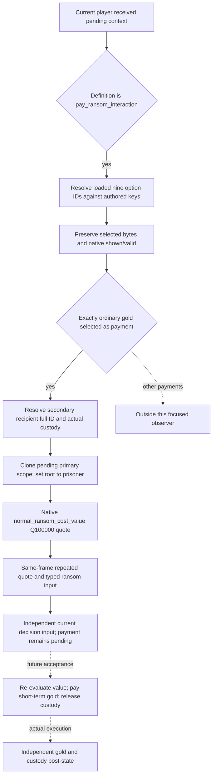

# Received pay-ransom quote — CK3 1.20.0.3

Source-first input ledger, recorded 2026-10-06 Asia/Shanghai. This work addresses the actual R0047 pending offer, not an outgoing jailer-created demand.

## Actual failure and code cause

Frozen response `580-pending-interaction-current-context.json` contains pending ID `1946157063`, definition `pay_ransom_interaction` (hash `2840579925`, runtime ordinal `184`), actor `34180`, recipient/player `29829`, and secondary recipient/prisoner `61540`, at raw date `53275704`, public revision `895` / native revision `894`. Nine send-option rows are present, nonexclusive, and only row 2 is selected, shown and valid. Generic on-send resource costs are all zero. They are not the acceptance-time ransom payment.

The current pending reader always initializes structured exchanges/effect preview as unavailable and keeps overall semantic readiness false. Its generic option reader publishes numeric flags without mapping them to authored keys. The private prisoner quote is a different producer: `ReadPlayerPrisonerRansomQuotePrivateV1` resolves **`ransom_interaction`**, sets the jailer as actor, and invokes outgoing redirect with the prisoner as recipient. Its `role_unavailable` result merges initial character resolution and post-redirect role checks. Response 583 does not identify which guard failed. It is therefore evidence that this outgoing producer did not quote prisoner 61540, not evidence that received `pay_ransom_interaction` has no payment.

## Exact build and reusable bindings

Frozen build is 1.20.0.3 Crozier, Steam build 25652598, EXE SHA-256 `94B55397ABB687A3DCD436805A5D885E6BE90FA6C693FEB44A9E3BBEEADE02A6`. Current `ck3_1_20_0_3_abi_reuse.json` classifies pending-context, prisoner-collection, prisoner-ransom and gift named-value manifests PASS. Old namespace/file names are reused only through that existing current-build adapter. No new EXE bytes, scans or hashes are required.

Reused paths: pending storage `5D1EC80`; character storage `5C67568`; pending definition `+18`, borrowed primary scope `+20`, roles `+2F0/+2F4/+2FC`, selected bytes `+318/+324`; definition option rows/count `+2258/+2264`, stride `730`, numeric flag `+368`. Existing string-table getter `3F8A800` and lookup `3F8A680` verify the nine authored flags against actual loaded IDs. Existing named evaluator uses `A07970 → A07830`, clones borrowed scope through `373AD10`, changes clone root to the prisoner, evaluates Q100000 via `37542F0`, and destroys owned scratch; it does not submit or modify the pending context. Existing prisoner custody is `Character+1B0 → extension+288 → relation+0 jailer full ID`.

Current stock files retain the existing frozen hashes: prison interactions `1bb43b3c2061212af8d41b11314ff4e569af2a3506319f820d05877a7762abc5`; prison effects `ea8bb72426246692bf1f310ae7eb83715ae1b7314d046e3660df66443d486030`; interaction values `52a7cf8ef212c835bfc5bc5ce049af2e33d7586eb9d477343e8eedacf58ebd66`. External `STOCK-PINS.json` records the actual read paths and excerpts.

## Native/authored decision tree

`pay_ransom_interaction` redirect (2569–2577) saves original recipient as secondary recipient and redirects recipient to the prisoner's imprisoner. On accept (2633–2641), custody must still be recipient; the script saves prisoner and imprisoner. It saves `puppet_or_actor` as payer (2654–2655), then performs the actual exchange through `ransom_interaction_effect` (2829–2835). The payer alias remains authored `puppet_or_actor`; published actor ID identifies the pending actor role, not a newly resolved puppet alias.

Options (2929–3115) are exactly `extortionate_gold`, `extortionate_current_gold`, `gold`, `current_gold`, `favor`, `influence_send_option`, `herd_send_option`, `current_herd`, **`hook`**. Outgoing ransom's ninth `invalid` flag must not be substituted. Gold's validity uses actor funds versus prisoner `normal_ransom_cost_value` (2978–2988); row validity is already evaluated by the pending reader in the actual scope. The gold exchange uses the same named prisoner value (prison effects 162–165). Haggler factor (interaction values 293–361) falls back to the prisoner's actual imprisoner and uses original actor/recipient roles, so the borrowed pending scope plus prisoner root preserves both recipient markup and actor reduction without inventing new aliases.

## Focused implementation and verification plan

Add optional `terms.ransom_quote` to the existing pending MCP: typed availability/reason, pending actor/jailer/prisoner IDs, selected ordinary-gold row, current custody, exact quote raw/scale/source, current shown/valid, and independent decision-input readiness. Map the nine option keys only after actual loaded-ID verification. Borrow the existing scope; never redirect/reconstruct/send it. Keep global structured-effect/semantic readiness unchanged because this observer does not cover every acceptance effect. The quoted amount is current acceptance-time input, not a locked payment or observed transfer.

Owned files: this topic; shared DTO; `ck3_12002_pending_context.hpp/.cpp/_serializer.cpp`; Python pending-context normalizer; new `ck3_12002_pending_ransom_quote_test.cpp` auto-discovered target; new registered MCP wire consumer. No shared `bridge.cpp` or CMake edit is planned. Root owns the necessary native build and one new fixture run. A single focused fake-memory case mirrors R0047 roles, nine flags and selected gold, exercises the real pending reader/serializer, and verifies a named quote distinct from zero generic costs. Native fixture amount is synthetic, never R0047 live evidence. Run its new registered Python/MCP consumer once after Root supplies the genuine native wire.

Source cost: three current stock files read/hash once; cached manifests/source reused; **zero new EXE code/metadata bytes**. Readiness before verification is research. Static validation can qualify static-ready only; a fresh real paused pending query and payment/custody post-state remain Root's separate execution work.

## Static qualification — October 6

Implementation `829d4f8c83c226985851d958dcf64dc86ccfccc0` and fixture-only CMake dependency closure `f9818e3750fd8bb11b47171dcd58ca766314b347` were adopted centrally. Exact compiled source is **`282c18236d833b84f6a94b80ce159967a91e2541`**. The necessary central full-DLL/two-new-target retry completed GREEN in `7.7857606 s` under `/WX`, jobs 4, v73115. The two first new CTests passed once at `2026-10-05T21:51:42Z` (`2026-10-06 05:51:42 Asia/Shanghai`): ransom `0.14 s`, the separate government/land test `0.10 s`, total reported CTest `0.33 s` / wall `0.3643354 s`. No prior passed tests were repeated.

Initial native attempt `native-govland-ransom-full-01` is preserved as harness link RED (`234.3566689 s`): the DLL linked, but the new ransom fixture pulled two existing family externals through the shared named-value helper. The one-line CMake change adds only this new target to the existing convention compiling the two real family dependency sources. No stub or production semantic change was introduced; neither CTest was credited before retry GREEN.

Central joint archive: `Z:/ck3_mod_rewrite_process_assets/g2-background-round4-20261005/source282c1823-govland-ransom-native-artifacts/`, with 18 listed artifact members and `HASHES-AND-NATIVE-QUALIFICATION.json`. Ransom owns **one native wire file / one producer sample**. Archived DLL is `10,648,064` bytes, SHA-256 `05338c203ce6c308f84336598ecbed4ae6329275bd977944df34452137a1a2fd`; ransom test EXE is `349,184` bytes, SHA-256 `c7494f2ce6f29596f52f1d00a76c72610391628ad61ee1b8add854ebb86989a9`. Ransom wire is `wire/ransom/ck3_12003_pending_ransom_quote_wire.json`, SHA-256 **`01723039a2222c6278edb7c1dd8c8d744154161c38b565a8ba2925cb30b10ff8`**.

Registered consumer `registered-mcp/attempt-04` passed **one sample / 16 checks**, through the actual native driver, protocol ingestion, service and existing registered pending MCP. Two result artifacts are `observed.json` and `RESULT.json`. It used `Z:/ck3_mod_rewrite/tools/.venv/Scripts/python.exe`, Root source `Z:/gb0`, and the archived wire above. The production normalizer remains the native-282c version; subsequent changes `929411f9` and `93708072` are confined to the new Python fixture harness. The 16 checks preserve the received roles, all nine verified keys including hook, zero generic costs alongside native quoted gold, custody and selected validity, independent input readiness, and honest global effects readiness. Exactly one readonly MCP quote query reached completion; no live queries or game actions occurred.

Failed consumer attempts remain visible: attempt 01 dependency bootstrap RED, zero cases/checks; attempt 02 invalid logical fake-endpoint pipe-name prefix RED, zero cases/checks; attempt 03 initial native protocol ping asserted as an execute-step RED, one harness check and zero MCP queries. The latter two were fixed only in the new test to use the existing injected-endpoint convention; they do not establish capability RED or alter production behavior.

Readiness is now **static-ready** for the focused ordinary-gold received-ransom observation. The native fixture's **`1,250,000 / 100,000 = 12.5 gold` is synthetic**. Historical R0047 had already been rejected by Root before this qualification; no live R0047 amount was obtained and no payment/release is credited. The next useful ordinary deployment is a fresh received pending query, followed by the separate planner consuming `terms.ransom_quote.value.decision_input_ready` and independently verifying any chosen reply's gold/custody outcome. Global all-effects semantic readiness remains false; this topic does not claim the current generic planner already consumes the new input.
