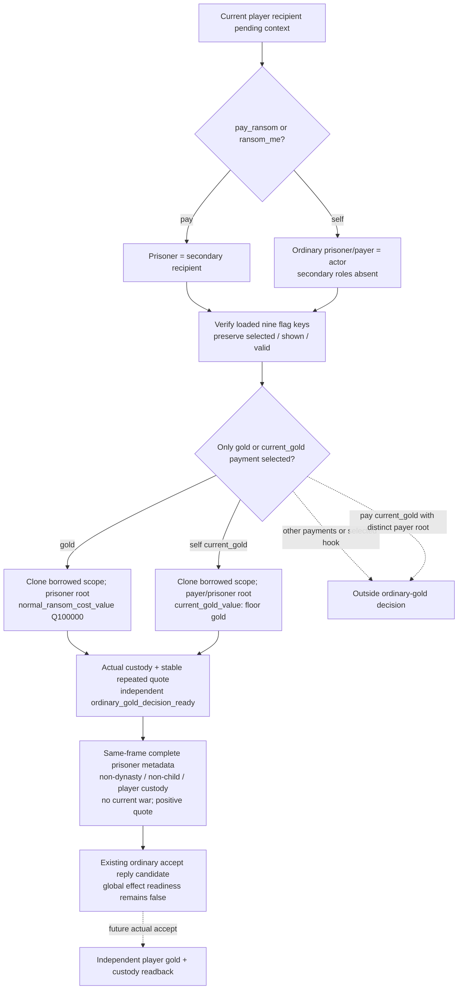
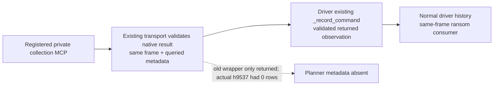

# Received self-ransom quote and ordinary-gold decision — CK3 1.20.0.3

Source-first ledger for the actual paused request in response `720-current-incoming-interaction-query.json`, recorded 2026-10-06 Asia/Shanghai. This extends the [received pay-ransom observer](pending-pay-ransom-received-quote-12003.md), without reusing its secondary-prisoner assumption for self ransom.

## Actual blocker and exact source

Pending full ID `1107296271`, `ransom_me_interaction` / ordinal `185` / hash `3591734960`, actor `70766`, recipient/player `29829`, both secondary roles and intermediary `-1`; raw date `53286360`, public revision `8` / native `1014`. Native option `3` is selected, shown and valid; option `2` is unselected and hidden. Accept/reject are both legal, deadline has `56` of `60` days remaining. Overall effect/semantic readiness is false. The existing quote reader/serializer/normalizer only recognize `pay_ransom_interaction` and its `gold` option; merely allowing another key would still quote the wrong producer.

Freeze CK3 `1.20.0.3` Crozier / Steam `25652598`, EXE SHA-256 `94B55397ABB687A3DCD436805A5D885E6BE90FA6C693FEB44A9E3BBEEADE02A6` through existing `.3` ABI reuse. No new binary bytes/scans/hash. Source/worktree baseline `6a498c0050b0a8649bf6353f22e098bc324a8951`; external packet `Z:/ck3_mod_rewrite_process_assets/g2-background-20261006/pending-self-ransom-720/`. Current stock prison-interactions hash remains `1bb43b3c2061212af8d41b11314ff4e569af2a3506319f820d05877a7762abc5`; excerpt and text pins are in that packet. Reuse prior prison-effects and named-value ABI pins, including scope clone/evaluation/destruction and full-generation character resolution.

## Native/authored input tree

Stock `00_prison_interactions.txt:3654` defines `ransom_me_interaction`. Redirect `3666–3674` changes recipient to the actor's imprisoner when `puppet_or_actor` initially equals recipient. Visibility requires `puppet_or_actor` imprisoned by recipient. On accept `3701–3765`, custody is checked again; `prisoner` and `payer` are saved from `puppet_or_actor`, `imprisoner` from recipient. For this ordinary direct request actor/prisoner is `70766`, jailer/player `29829`; preserve the authored payer alias in the contract rather than claim a new puppet resolver.

The same nine nonexclusive authored flags are `extortionate_gold`, `extortionate_current_gold`, `gold`, `current_gold`, `favor`, `influence_send_option`, `herd_send_option`, `current_herd`, `hook` (`3820–3966`). Actual numeric `34723` at row `3` is `current_gold`, verified through the loaded identifier table before publishing the key. Other-payment rows remain outside the ordinary-gold decision; selected hook cannot gain this decision's readiness.

`current_gold` is shown when actor gold is positive and below `normal_ransom_cost_value`, subject to the recipient dynasty/perk branch (`3860–3878`). On accept `3728–3740` it snapshots `scope:payer.current_gold_value` into `ransom_saved_gold_value` **before** the payer notification event. `00_basic_values.txt:458–461` defines `current_gold_value = { value = gold; floor = yes }`. The reused prison payment effect `00_prison_effects.txt:172–179` transfers that saved value by `pay_short_term_gold` to `imprisoner`; current quote therefore evaluates the named value with root set to the ordinary payer/prisoner, not an unfloored raw balance and not full normal ransom cost. It is an acceptance-time input, not a locked amount or payment receipt.

## AI reference and minimum player policy

Stock self-ransom AI acceptance starts at `0`: full gold adds `50`; current gold adds `25` if at least half the normal ransom and recipient greed is below `medium_positive_ai_value`; otherwise a `WANTS_MORE_GOLD` explanation is emitted. Rival/nemesis/war modifiers are `-55/-300/-300`; favor/hook/influence/herd, intimidation/cowed, feud and celestial-hierarchy inputs remain part of the authored reference tree. AI initiation is self-targeted, frequency by tier (`4151–4163`); `ai_will_do` starts `0` and selected gold, prolonged/impatient positive current payment, herd, favor and hook affect willingness. This package does not materialize the complete AI acceptance score or claim native optimality.

Root's actual response `721` reports complete four-prisoner collection at the same frame: `70766` ordinal `3`, jailer/player `29829`, custody verified, house `12690` / dynasty `12077` distinct from player dynasty `174`, not player's child, primary title tier `3`; current war/army rows are empty. Keep these real inputs separate from the still-unavailable live quote amount.

The existing proactive outgoing policy searches unrelated landless/baron prisoners. Root explicitly keeps that outgoing tier cap unchanged while authorizing this **received-offer** policy: accept a positive ordinary-gold offer from a same-frame unrelated non-child prisoner in player custody while no current war exists and native accept is legal/executable. Known duke tier `3` is retained as a political quality gap; dynasty/hostage value, rivalry, feud, greed and other native quality inputs are not claimed complete. No hardcoded current prisoner ID or inferred kinship is allowed.

Prisoner metadata is a real consumer dependency: the normal turn planner must receive a current normalized private collection receipt (or its existing `player_prisoner_collection` value plus native revision) among its observation rows. A pending quote alone does not contain dynasty/child/title data. If that receipt is absent, the consumer names the existing private collection MCP as required input and submits no reply; no new generic effect-preview gate is added. The consumer emits quote/roles/prisoner metadata and expected independent gold/custody postconditions; reply ACK cannot fulfill them.

### Actual private-query ingestion defect and minimal correction

Root's external `721` return does **not** prove ingestion. A necessary one-time offline read of frozen `runtime-upgrade-plan/source-pair-h9537/native-session/driver-state.json` found `9537` command-history rows and **zero prisoner-collection rows**. The latest relevant history row `9536` was pending-context; row `9537` was a checkpoint. Its full JSON pin is `7130b015e145b9297c2ca8b24a1f1c7a3de30954c76e1c5ad58d6503d863ab61` (`123,686,916` bytes). The comparison snapshot `730-before-native-upgrade-fresh-snapshot.json` is public `8` / native `1014` / raw `53286360`, SHA-256 `f304dc267deafa0ceb1f318ac0a79a1eadcaf9cdce5264bf372432311ac4bd03`; no later save frame is substituted. External `PRODUCTION-INGESTION-EVIDENCE.json` records this actual missing input, with zero new SDK/live calls.

Production private transport sends/waits directly, validates the readonly result and same paused binding, then returns the wrapper with `queried_*`. The driver wrapper previously returned it without `_record_command`, so the normal planner could not see even a successful private collection. Correct only that wrapper to call the existing `_record_command` with the **validated returned result** before returning it. This stores existing semantic observation fields in the existing history; it adds no schema, WAL or permission gate.

## Implementation and new validation plan

Owned changes: pending DTO/access header, existing pending reader/serializer, Python pending contract and `strategy.py`; the private collection driver wrapper's existing observation recording; this topic; **new** `ck3_12003_pending_self_ransom_quote_test.cpp` and **new** registered MCP/ordinary consumer fixture. Keep the existing normal-gold callback compatible and add only a current-gold evaluator seam. Extend typed selection and amount-source fields plus independent `ordinary_gold_decision_ready`, retaining legacy input readiness and honest global semantics. Reuse the existing named-value evaluator with actual borrowed scope; do not reconstruct outgoing roles or send a command while observing. `pay_ransom_interaction` current-gold with a distinct payer root remains explicitly unsupported in this package; the existing full normal-gold pay path remains source closed.

One new native producer fixture mirrors actual `720` self roles, absent secondary recipient and selected current-gold row. It exercises the production reader/serializer; synthetic amount is integer-floor current gold, distinct from zero generic costs and any normal ransom value. Root owns central build/new target linkage and the first new CTest. After the genuine new wire exists, run the first registered MCP compound through the proven custom MCPServer v2 harness: actual pending query plus actual private collection query, then registered `ck3_plan_turn` reading **the driver's real recorded history**. The collection input replays captured `721` schema-v6 four-prisoner native fields, with target ordinal `3`; queried wrapper fields must arise from production transport. The positive path must not hand-assemble history containing returned wrapper fields. Three focused negative inputs reuse that recorded history to verify absent metadata, own dynasty and zero monetary value. This is one new wire, two readonly MCP queries, one registered planner call and four planner cases; no local compilation, gameplay call or future live credit.
