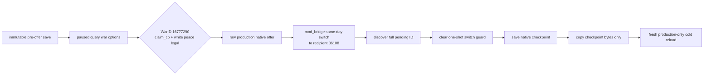

# Pending special-war binding paused-live fixture

## 状态

- [live-confirmed ordinary white peace] Attempt 2 已在 fresh production-only cold PID 中完成 paused 双查询与同 revision
  `war_state` 互证；`ordinary_white_peace_binding_live_ready=true`。
- [live-attempt RED] Attempt 1 仍永久保持 RED：它的 production 业务门都通过，但 shared cross-stage helper 读取了旧字段名。
  Attempt 2 是修复后独立新运行，不重写、不升级 Attempt 1。
- [static-confirmed] 目标合同是 `pending-character-interaction-special-war-binding-v1`，只覆盖普通、非宗教
  `claim_cb` 的 `end_war_attacker_white_peace_interaction`。
- [static-confirmed] runner 位于
  `ck3_autonomous_player/native_bridge/research/run_pending_character_interaction_special_war_binding_live_acceptance.py`；
  focused unit 位于
  `ck3_autonomous_player/tests/unit/test_pending_character_interaction_special_war_binding_live_acceptance.py`。
- 本 fixture 是普通 `claim_cb`，不使用宗教暂缓的两项窄例外（战争中的圣战、婚姻中不得不考虑信仰时的最小调用）。
  十槽成本中的 `piety` 只作为 engine-generic raw resource key 透传，不进入 faith、doctrine、tenet、fervor、改宗、
  宗教改革、圣战或教团语义。

本计划是 [pending-interaction-special-war-binding.md](pending-interaction-special-war-binding.md) 的 paused-live
执行合同，并复用
[run_pending_character_interaction_context_live_acceptance.py](../../ck3_autonomous_player/native_bridge/research/run_pending_character_interaction_context_live_acceptance.py)
已经实测的普通 pending 生成、cold checkpoint 和受管清理接缝。

## 冻结输入

| 输入 | 固定值 | 用途 |
|---|---|---|
| CK3 build | `1.19.0.6` | exact-build admission |
| `ck3.exe` SHA-256 | `2D00FF3101EF70B566F2FCBAE292F09263199C80E9DC8F139B82D7D96F83DB86` | native ABI |
| native source commit | `542228a3c1221c189e4c9e84c35d8728aad4d1a1` | special-war reader implementation |
| production DLL | `.build-pending-special-war-binding-v1d-msvc/xar_ck3_bridge.dll` | fresh MSVC candidate |
| production DLL SHA-256 | `2E60BC15320AA5C82E6C78AC236BC986601AFACB3C579A2F10881F43FD8B6C9F` | exact binary gate |
| injector SHA-256 | `632A6EE3A87CA2658F20B7ECDA9F3B2F25414DFD8BDB77A4F929C8B142290E87` | exact launch helper gate |
| immutable source save | `xar_checkpoint_pre_white_peace_53175816.ck3` | pre-offer ordinary war fixture |
| source save SHA-256 | `5BA2136911EAD0CAF1F7D2F3DE02EAFBD8039861C46F01F35F698B3B5CFFFC5F` | immutable source gate |
| WarID | `16777290` | ordinary active war |
| actor / recipient | `29829 -> 36108` | primary attacker -> primary defender |
| CB / target title | `claim_cb` / `2388` | nonreligious source identity |

runner 在创建任何 disposable root 或受管 session 前逐字节校验 DLL 和 injector。CLI 中即使传入另一个
`--expected-bridge-dll-sha256`，也不能绕过 frozen hash；不允许用当前 dirty build 或增量旧对象替代该候选。

## 为什么现有 checkpoint 接缝足够

immutable source save 位于白和平 offer 之前，不能直接作为 pending evidence。runner 不把某个历史 artifact 中记录的
pending ID 当作可复用状态，而是每轮在 disposable seed clone 中确定性重建：



seed 的唯一游戏状态变更是既有 fixture 已经使用过的 white-peace offer、同日换人和 checkpoint 保存。
它不会 accept、reject、block 或 acknowledge pending。production cold stage 不含 `mod_bridge`，只有正式 production
projection；source save 的 bytes、size、mtime 必须前后完全相同。

不使用 fixture-definition mod，也不伪造 `special_data`、WarID、角色或 pending ID。这样 white-peace concrete subtype
只能由真实发送路径构造，relation WarID 只能由 production reader 的 exact-build 共同战争查询得到。

## Production paused 序列

fresh production-only PID map-ready 且暂停后，序列固定为：

1. `snapshot-before`：记录 public/native revision、date、played CharacterID、full pending ID；
2. `query-pending-character-interaction-context-v1` 第一次；
3. `war_state` 只读 observation；
4. 对同一个 full pending ID、同一个 expected public revision 执行第二次 typed query；
5. `snapshot-after`。

`war_state` 不提交 gameplay command，因此 command boundary 必须仍精确为两条相邻 pending query。两次 query 的
`query_sequence` 必须是严格后继，除 sequence 外的完整 envelope 相等，两个 normalized context frame 逐字段相等；
前后 snapshot 的 ID、public/native revision、date、episode、pending identity、paused/map-ready 全部相同。

### Typed binding 必须实见

```json
{
  "status": "available",
  "value": {
    "special_interaction_kind": "end_war_white_peace_interaction",
    "absolute_outcome": "white_peace",
    "war_id": 16777290,
    "actor_war_role": "primary_attacker",
    "recipient_war_role": "primary_defender",
    "binding_source": "native_common_war_relation"
  },
  "reason": null
}
```

同 revision 的 `war_state` 必须恰有一个 WarID `16777290` row，且从当前 recipient 视角同时满足：

- `player_side=defender`；
- `player_is_primary_war_leader=true`；
- `primary_opponent_character_id=29829`；
- played CharacterID 为 `36108`；
- `targeted_title_ids` 包含 `2388`；
- row `source=native`。

这组独立投影把 typed term 的 actor/recipient roles 互证为 primary attacker/primary defender。seed stage 同时要求
原生 termination-options query 返回 `claim_cb` 且 white peace legal，因此不能用宗教或其它 CB 的同形 pending 替代。

## Readiness 边界

GREEN 只允许关闭普通 white-peace 的 binding live gate，不允许升级整个互动语义：

| gate | 本 fixture 的预期 |
|---|---|
| `generic_costs_ready` | `true`，并要求十个 stable key 的 raw 全为 `0`；这只是一份 zero-cost baseline |
| `special_war_binding_ready` | `true` |
| `special_outcome_terms_ready` | `false` |
| `structured_terms_ready` | `false` |
| `interaction_semantic_decision_ready` | `false` |

`structured_exchanges`、`structured_effect_preview`、`recipient_ai_acceptance_score`、
`recipient_ai_final_decision` 必须继续 typed unavailable。`not_ready_reasons` 必须精确保留
`special_outcome_terms_unavailable`、`structured_exchanges_unavailable`、
`structured_effect_preview_unavailable`。white-peace 全零成本不能替代后续普通非宗教非零成本 fixture；WarID binding
也不能冒充 claim、truce、prisoner、hostage、资源转移或其它 dynamic outcome rows 已完成。

本轮只覆盖 white peace。victory 与 defeat 的 definition/vptr/outcome/side 组合仍各需独立 paused fixture。

当前 readiness 边界因此是：

- `ordinary_white_peace_binding_live_ready=true`；
- `attacker_victory_binding_live_ready=false`；
- `attacker_defeat_binding_live_ready=false`；
- `special_outcome_terms_ready=false`；
- `structured_terms_ready=false`；
- `interaction_semantic_decision_ready=false`。

## 禁止动作与失败条件

production command list 只能是两条
`query-pending-character-interaction-context-v1`。以下任一出现立即 RED：

- `accept-pending-character-interaction`；
- `reject-pending-character-interaction`；
- `block-pending-character-interaction`；
- `acknowledge-pending-character-interaction`；
- `auto-turn` 或任何战争结算/时间推进命令；
- 不同 full pending ID、不同 revision/date、unpaused 或 map-not-ready；
- typed binding unavailable、outcome/WarID/role/source 不符；
- active-war row 缺失、重复或 primary leader 对不上；
- 两次 normalized frame 不同；
- source save 改变、checkpoint bytes 迁移不一致、非 production-only cold playset；
- 任一受管进程、driver 或 nonce disposable root 未完成清理。

## Attempt 1 immutable RED

Attempt 1 artifact：

- 路径：`C:\Users\xenoa\AppData\Local\Temp\xar-pending-special-war-binding-v1-live-20260826.json`；
- SHA-256：`AED8411D6B8F8D5436DE83427AD38D1E03CA5DEC4215103B5C6F134B01F2A8E3`；
- seed / production PID：`71000` / `120912`；总时长 `228.657` 秒；
- pending ID `738197506`，date `53175816`，public/native revision `4/3`；
- normalized context SHA-256：`75EBDD9649DC2405E8F72701D97247715BAF6438303E74DF93149F4532A96763`；
- checkpoint `66,579,686` bytes，SHA-256
  `3ABF8B9750911910D95B6AE2108B71BAA040613B3E4410578F1C4F76F16019DF`；
- 15/15 顶层 production readiness gates 为 true，seed、production query sequence、两次 context、active-war
  corroboration、严格 mutation boundary、source invariant 和所有 cleanup 均为 true。

唯一失败是 `cross_stage_proof.checks.no_default_reply=false`。shared
`pending_live._cross_stage_proof` 固定读取 production mutation key `no_reply_action`，而本 runner 为了同时覆盖普通 reply 与
ACK，发布的是更严格的 `no_reply_or_ack=true`。artifact 的实际 command list 精确为两条
`query-pending-character-interaction-context-v1`，`forbidden_reply_steps_observed=[]`；因此这是验收器 key mismatch，
不是 pending/WarID/role/readiness 或游戏状态失败。

Attempt 1 原报告永久保持 RED。最小修复只在本 runner 增加 cross-stage adapter：seed 继续读取已实测的
`no_reply_action`，production 明确读取 `no_reply_or_ack`，并由二者共同生成兼容的 `no_default_reply` cross-stage check；
不放宽 mutation boundary，不改 production bridge，也不重写 Attempt 1 artifact。

## Attempt 2 production GREEN

Attempt 2 使用修复后的 cross-stage adapter 重新运行，artifact：

- 路径：`C:\Users\xenoa\AppData\Local\Temp\xar-pending-special-war-binding-v1-live-attempt2.json`；
- size：`112,249` bytes；
- SHA-256：`3140B47AD855DF50BE182CB41E5957D1041E2221496A7256C7FF903E660810EE`；
- seed / production PID：`128724` / `18244`；总时长 `151.98` 秒；
- frozen source commit `542228a3c1221c189e4c9e84c35d8728aad4d1a1`；DLL / injector SHA 与本文冻结表完全相同；
- pending ID `738197506`，date `53175816`，public/native revision `4/3`，query sequence `1 -> 2`；
- normalized context SHA-256：`75EBDD9649DC2405E8F72701D97247715BAF6438303E74DF93149F4532A96763`；
- checkpoint `66,579,686` bytes，SHA-256
  `9359BCAA270AE8D3F5CBDF6083147B79F2F132DFE763BDA443329FEA5A823475`；三份迁移位置字节相同；
- source save bytes、size、mtime 前后相同；seed、production 和 nonce root cleanup 都为 true，退出后无 CK3 process；
- 15/15 顶层 readiness gates、11/11 same-revision sequence checks、10/10 cross-stage checks 全部为 true。

production command list 精确为两条
`query-pending-character-interaction-context-v1`，`forbidden_reply_steps_observed=[]`；没有 accept、reject、block、ACK、
auto-turn、战争结算或时间推进。cross-stage adapter 实见 seed `no_reply_action=true`、production
`no_reply_or_ack=true`。

两份 normalized frame 都发布 exact definition `end_war_attacker_white_peace_interaction`、
`special_interaction_kind=end_war_white_peace_interaction`、`absolute_outcome=white_peace`、WarID `16777290`，
actor `29829=primary_attacker`、recipient `36108=primary_defender`。同 revision native war row 独立返回 recipient
`player_side=defender`、`player_is_primary_war_leader=true`、primary opponent `29829`、target title `2388`，完成 role/WarID
互证。

十槽 generic cost 都是 raw `0`，只关闭 white-peace zero-cost baseline；下列字段在真实 frame 中仍明确为 false：
`special_outcome_terms_ready`、`structured_terms_ready`、`interaction_semantic_decision_ready`。exchanges、effect preview、
recipient AI score/final decision 仍 typed unavailable。victory 与 defeat 没有由本 artifact 覆盖。

本次实际使用的命令为：

```powershell
& "tools\.venv\Scripts\python.exe" `
  "ck3_autonomous_player\native_bridge\research\run_pending_character_interaction_special_war_binding_live_acceptance.py" `
  --output "C:\Users\xenoa\AppData\Local\Temp\xar-pending-special-war-binding-v1-live-attempt2.json"
```

该 GREEN 只升级 ordinary white-peace binding live readiness。Attempt 1 继续是 RED；同一路径不得覆盖重跑。
