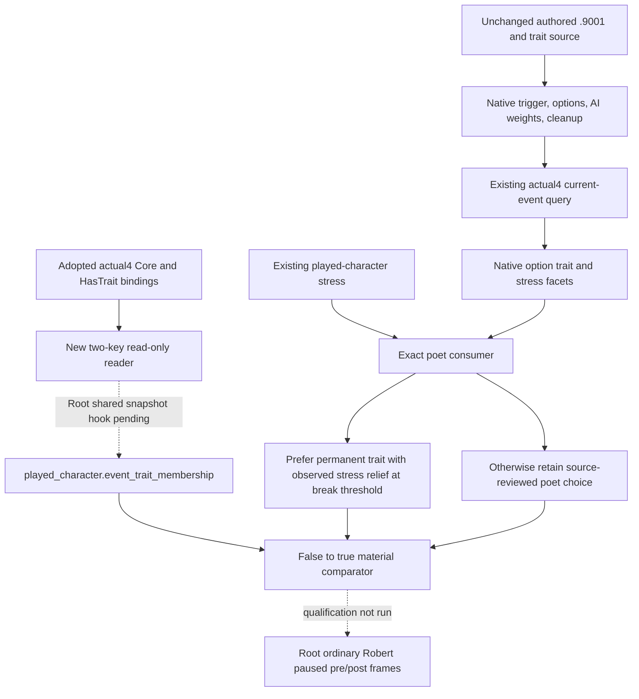

# CK3 1.20.0.4 person/event long-term utility

This package extends the existing `trait_specific.9001` consumer. Root reports
the current-build Event/Pending production readers GREEN; no migration or live
qualification is repeated here. Source baseline is
`23c3c4bc7fdf261f46174d35db12732808523463`, CK3 1.20.0.4, Steam 25734779,
EXE SHA `98702F88A547CDE2EAF29A85F93B85F68EE4CF8148336A4F7AFAEB75319DD518`.
The new consumer and two-trait reader are authored, not run or live-qualified.

## Source tree and necessity

The [poet native tree](trait-specific-poet.md) and
`vanilla_events/records_trait_specific.py:355-524` close the authored trigger,
three choices, native AI weights, immediate one-shot flag and common cleanup.
`migration_1_20_0_4.py:33-62` reuses the unchanged authored data while separating
historical runtime evidence from the new executable.

The actual registered chain is `.4 registry -> .4 migration -> .3 registry ->
.3 migration -> .2 migration -> historical record`. It replaces the old 1.19
script pin `A488...` with current source SHA
`76A50F2B779E085419279801B1396A1C67C8785831E8859FCEC6D0F088853C3A`.
`data/source_compatibility_1_20_0_3.json:13326-13457` publishes the current
selected effect profile and source pin; its current event definition is
`1250-1413`. The preceding .2 review's option-ordinal deltas
(`source_compatibility_1_20_0_2.json:104286-104475`) replace all three options'
conditional stress operation with `stress_and_fulfillment_impact`. The stress
facet is used independently of unobserved secondary fulfillment.

| Input or branch | Existing production source | Consequence |
| --- | --- | --- |
| Fixed choice | `vanilla_events/policy.py:791-861,1515-1548` | Source ordinal utility is copied after the contract's choice is selected. |
| Current stress | `game_contract.hpp:2196-2224`; `strategy.py:8370-8402` | The snapshot already has stress, but the event recommendation receives no player state. |
| Option stress facets | `event_window_context_contract.py:169-199` | Direction and critical are available; magnitude remains unavailable. |
| Permanent trait result | `records_trait_specific.py:459-464,520-524`; `outcome.py:14-68` | Only instance disappearance is credited for poet; the material comparator supports stress/gold/prestige. |
| Actual4 trait reader | `ck3_12004_lifestyle_state.cpp:19-36,290-358,692-697`; `ck3_12004_phase_character.hpp:9-19` | HasTrait and canonical definition lookup already exist. The LIFE 32-key list omits poet/journaller. |

The stock trigger excludes existing poet, and journaller's option is shown only
when the character lacks journaller. A general pre-choice trait census is
therefore unnecessary for this exact projection. The missing persistent-state
input is the **independent post-choice membership** of these two concrete traits.



## Minimal player policy

The counter-policy uses the already published `stress_points >= 100` first-break
threshold (`player_vitals_contract.py:122-145`). It is not an imitation of the
native AI weighted random draw. If poet already has an observed stress-decrease
facet, retain its permanent benefit. Otherwise, at the threshold, prefer a
shown/enabled journaller option with a decrease facet; if that is absent, use the
shown/enabled stress-relief option only when its facet proves decrease. Below the
threshold or without the current stress input, retain the existing poet choice.
No stress magnitude, fulfillment utility or cross-event numeric score is inferred.

The existing source/scope/option projection checks run before this local consumer.
The candidate records an ordinal comparison with current input facts and uses
existing typed event-option submission. It does not set generic semantic readiness.

## Two-trait producer integration

`player_event_trait_membership_12004.hpp/.cpp` resolve only the current local
played character through `ck3_12004::ReadCoreSnapshot/ResolveCoreCharacter` and
the actual4 phase-character binding. Canonical definitions use the adopted
software `FindUniqueTraitDefinition`; presence uses the adopted HasTrait entry.
They read `lifestyle_poet` and `journaller`, never the actor's whole trait set.
No new EXE capture or ABI mapping is required.

Root still owns the shared Snapshot/adapter/Driver/CMake/Service integration.
The smallest producer hook is to publish the helper's detached object as
`played_character.event_trait_membership` in the existing public state snapshot,
available before and after the active event disappears. The helper accepts the
owning frame's native revision/date and supplies only current-player identity and
the two booleans. Add its source to the existing native runtime target. This is
**not** a new player-vitals MCP: vitals is currently a turn-bundle projection.
Do not place the postcondition input solely in an event window, which is gone
after selection; do not expand the LIFE 32-key array or its unrelated perk flow.

Root's event-selection evidence should retain the helper's actual objects as
`starting_played_character_event_traits` and
`ending_played_character_event_traits`. The comparator requires a false-to-true
trait transition for the same player, a newer paused frame, and the existing old
event-instance disappearance postcondition. Reader failure is unavailable,
separate from a successfully observed false membership. Existing continuation is
not blocked solely because this new material input has not been published yet.

The actual owned interfaces are `person_events::BindImage`,
`ReadPlayerEventTraitMembershipV1` and `SerializePlayerEventTraitMembershipV1`.
The detached JSON uses schema `xar.ck3.player-event-trait-membership/v1`,
`snapshot_revision` (native), `date_raw`, `played_character_id`, status and the
two booleans under `traits`. The Python normalizer takes the expected native
revision explicitly; public revision stays independent in material expectations.
The source hooks are confined to the exact poet branch in `policy.py`,
`outcome.py` and `strategy.py`. No shared native TU or service has been modified.

## Pending gap kept separate

`strategy.py:269-331,2713-2853,2990-3045,8832-8920` consumes typed Pending context
and uses exact-definition reply policies. `invite_to_activity_interaction` is
unclassified: [interaction-structured-terms.md](interaction-structured-terms.md)
lines 502-504 and [events-and-interactions.md](events-and-interactions.md) lines
689-698 explain that one key can represent a wedding and no pending activity
subtype is published. The existing `ActivityHostedIdentityV1` already contains
activity full ID, host and type key, and `ReadActivityHostedTargetV1` accepts a
concrete full ID. The remaining seam is binding **this pending invitation** to
that activity. No such binding is inferred from the sender or current hosted feast.

The minimum next recipe is cache-first source review of only the stock invitation
definition and its referenced saved-activity/accept helper; then expose activity
full ID, host and type key in this existing Pending query and reuse the adopted
activity identity reader. A finite source request goes to Root before new native
capture. Generic exchanges/effects remain separate: the native DTO uses
`PendingCharacterInteractionUnavailableTermV1`, the serializer enforces that
type, and actual4 delegates to it. The old 1.19 `+0x350` description-layout
inference is not an actual4 typed preview proof. Prisoner on-accept work belongs
to the M6 lead and is not changed here.

## First qualification recipe

Root builds the new helper with the existing runtime, exercises the registered
ordinary owning-frame consumer, and records raw producer plus registered output.
Use Robert 29829's existing ordinary campaign; no manufactured event, repeat
query, new day, saved-game rewrite or enact action is needed for source readiness.
At the next natural .9001 frame, bind actual same-frame stress/options, submit one
typed choice, then independently capture old-instance absence and the two-trait
object. A new source fixture should cover high-stress journaller/stress-relief
ranking, below-threshold poet preference, and an observed false-to-true result.
Root alone performs that FIRST and production loop. This package runs zero
imports, tests, builds, SDK/game/Steam operations or EXE reads.

New focused test source is `tests/unit/test_poet_long_term_12004.py`. Root's sole
first command, from `ck3_autonomous_player`, is:

```text
Z:/ck3_mod_rewrite/tools/.venv/Scripts/python.exe -B -X utf8 -m unittest discover -s tests/unit -p test_poet_long_term_12004.py
```

This command is recorded, not executed by this lane. It exercises the actual
registered registry consumer and material comparator, not an SDK/game frame.

## Root first qualification and correction

Root retained two attempts in
`g2-background-20261007/g2-candidate-first-consumers/`: `poet-RESULT.json` is an
import harness RED because the sparse candidate lacked `tools/build_release`.
Root supplied only its tools path for the second harness. That attempt's
`poet-harness02-RESULT.json` and `.log` ran the four new tests and found two
semantic failures: high-stress choices stayed native0 instead of native1/2.

The consumer's guard incorrectly compared current registry sources to the old
1.19 SHA, so it returned no comparison and retained the original choice. The
successor binds the current source SHA above and carries the actual current
stress/fulfillment operation metadata. The four tests and expected indices are
unchanged. This lane only read that finite log and source-cache rows; Root owns
the successor focused execution. No production failure or live qualification is
inferred from either attempt.
